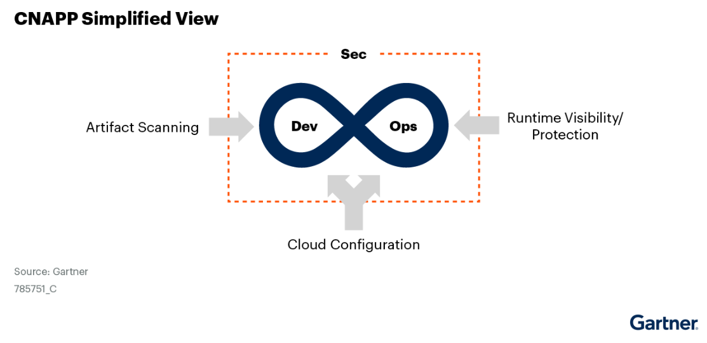

# CNAPP

{: .no_toc}

## 目录

{: .no_toc .text-delta }

1. TOC
{:toc}

## CNAPP 市场预测

到 2025 年时，60% 的企业会使用单一厂商提供的 CSPM 和 CWPP 解决方案，而在 2022 年此比例为 22%。

2025 年时，75% 的 CSPM 新订单将属于 CNAPP 的一部分。

2025 年时，80% 的企业将会使用多云基础架构，其中包括多个 k8s 环境。

2026 年时，80% 的企业将会使用整合的安全工具来管理云原生应用的安全，提供安全的厂家将会为 3 家或者更少，而在 2022 年，提供安全产品的厂家有 10 家之多。

## 市场描述

CNAPP 提供类似于 Devops 的，可以跨越开发和运维的整体性安全平台。CNAPP 包含多个方案：运行时的可视化和控制、CSPM、SCA、镜像扫描、Web 应用安全及 API 保护、SAST 及 DAST。

通常 CNAPP 的购买者是安全团队，但是使用者是负责云原生应用的开发团队或者产品团队。

云原生应用包含下列特征：

- 应用使用松耦合的微服务架构，模块间使用 API 相互调用
- 使用 DevOps 形式的 CI/CD 流水线方式支撑频繁的功能更新
- 大量使用开源的代码和库
- 通常基于 Linux 容器构建，使用 Kubernetes 进行编排，也会使用云厂商提供的 Serverless 以及 PaaS 能力
- 部署在可编程的云基础设施上
- 更新更为频繁，使得工作负载的生命周期很短
- 倾向于使用“不变的基础设施”方式进行管理，极少允许或者不允许对工作负载直接进行配置变更，所有的变更都通过流水线自动完成

在此之前，保护云原生应用程序需要使用来自多个供应商的多种工具，这些工具缺乏集成，而且通常只是为安全专业人员设计的，与开发人员的协作较弱。这种集成的缺失使得安全风险碎片化，管理员很难确定实际风险的优先级。碎片化的工具创建了过多的警报，浪费了开发人员的时间，并使修复工作对目标角色感到困惑。

CNAPP产品允许组织使用单一的集成产品来识别跨整个生命周期和云原生应用程序的不同元素的风险，并使得开发人员成为负责应用程序安全的核心。

CNAPP 的核心价值是，能够识别、进行优先级排序、使用协作工具加速风险的消除。

