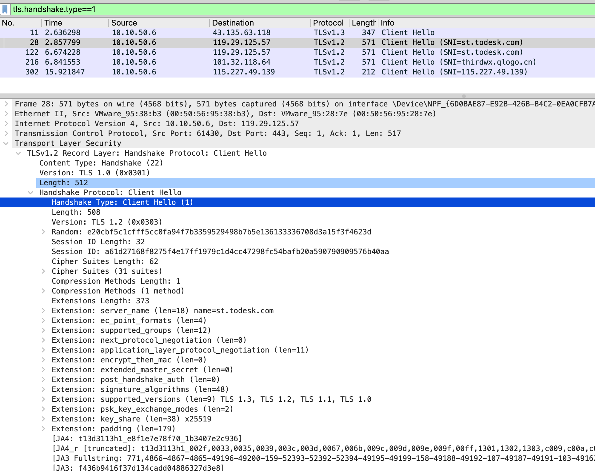

# Wireshark 常用命令


{: .no_toc}

## 目录

{: .no_toc .text-delta }


1. TOC
{:toc}

## 查看 Client Hello 包

```shell
tls.handshake.type==1
```



## 查看 Server Hello 包

```shell
tls.handshake.type==2
```


## 查看包含证书的包

```shell
tls.handshake.type==11
# 或者
tls.handshake.certificate
```


## 查看 FIN 包

```shell
tcp.flags.fin==1
```


## 模糊匹配 DNS 查询字段

过滤请求中包含 auth 的包：

```shell
dns.qry.name matches "auth"
```

