# 如何通过防火墙封禁 Todesk


{: .no_toc}

## 目录

{: .no_toc .text-delta }


1. TOC
{:toc}

## 结论

测试下来，有两种方法可以有效阻止 Todesk 应用。


### 通过 IP 列表阻止

此 IP 列表来自国内一家威胁情报网站，通过 *.todesk.com 的证书查找与其相关的 IP，然后封禁所有 IP。

具体查询方法为：精确匹配域名为 “todesk.com”，然后导出独立 IP 清单，封禁所有 IP：

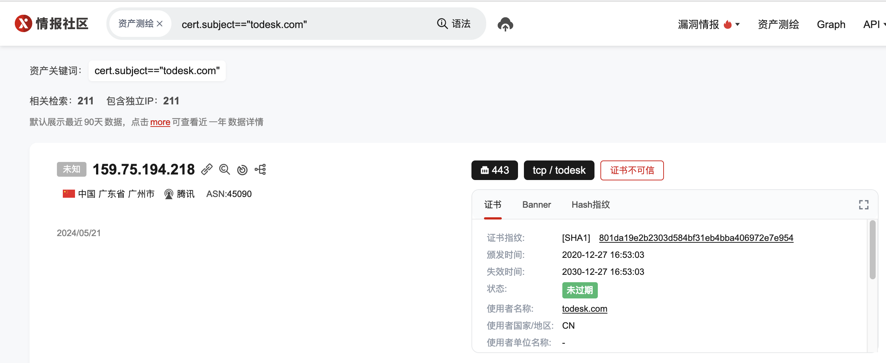


已经整理好的 IP 清单下载链接如下： [todesk.txt](../../output/todesk.txt) 

#### 具体配置 - Paloalto 防火墙

如果是 IP 清单，可以直接使用 EDL 功能来配置防火墙规则，规则示例如下：

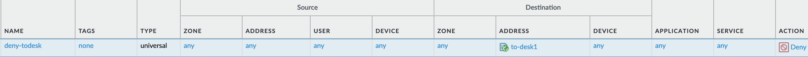


### 通过 IP + 域名的形式阻止

这种方法比上种配置复杂一些，具体来说需要配置三条规则：

- 封禁所有到 todesk.com 域名的 DNS 请求
- 封禁所有到 authds.kylinlot.com 域名的 DNS 请求
- 封禁下列两个 IP：43.135.63.118 （针对 Mac）及 134.175.254.188（针对 Windows）

#### 具体配置 - Paloalto 防火墙

在 Object>Application 中添加一个自定义应用，定义其名称以及类别：

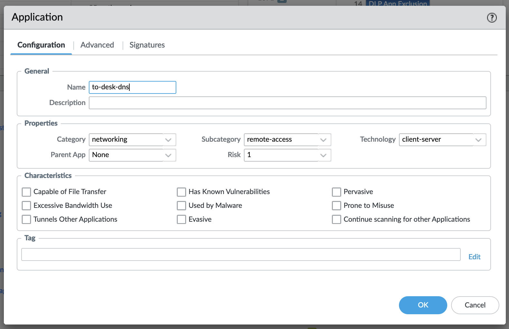

Advanced 中默认端口设置为 None：

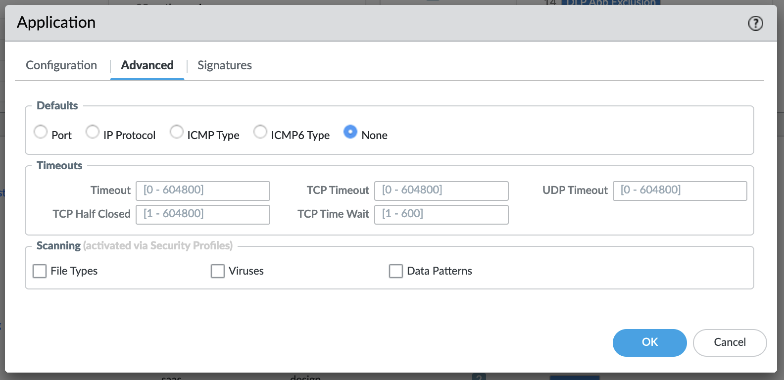

在 Signatures 中，添加两条规则，匹配条件为：

- Context：dns-req-section （匹配 DNS 请求中的字段）
- Pattern：在十六进制的域名前后分别加上 \x 

其中十六进制的值可以从抓包中取用。（抓包中 . 的十六进制和 ASCII 的 . 不一样，用转换工具可以看到）

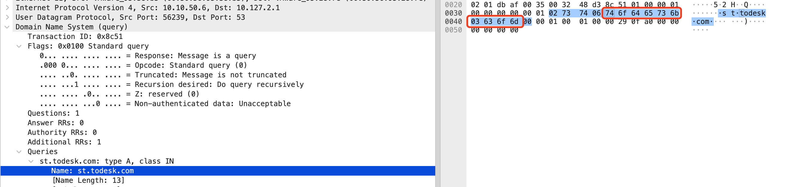

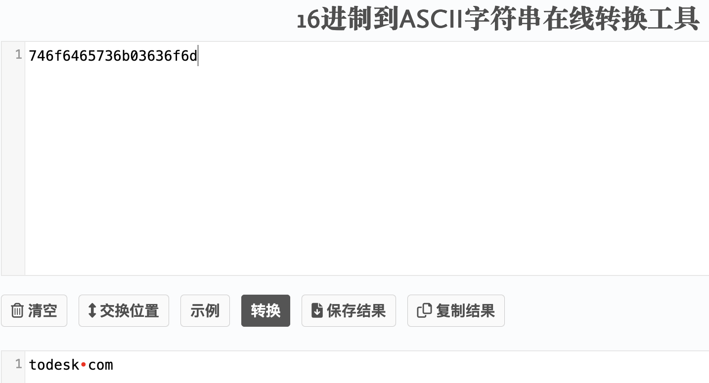

针对两个域名，分别添加两个 Signature：

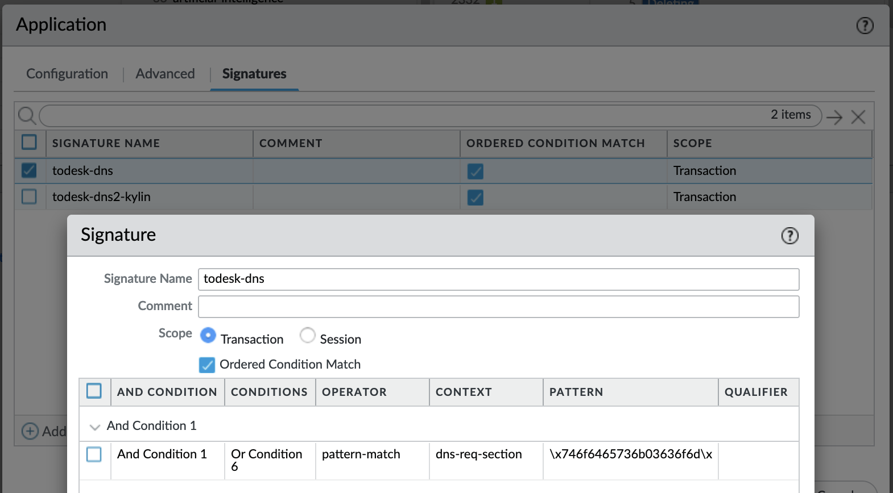

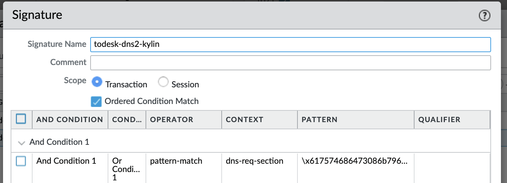

之后配置下列规则：

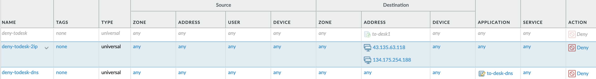

#### 测试结果 - Windows

配置完成后在 Windows 上抓包，结果如下：

- 尝试解析 authds.todesk.com，未得到结果后（1）；
- 直接访问 134.175.254.188，未成功连接（2~3、7）；
- 尝试解析 authds.kylinlot.com，未得到结果后（5~6、8~17）

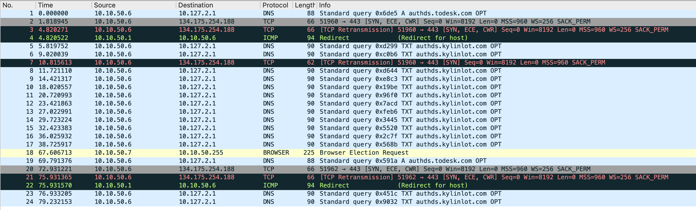

相关抓包文件： [windows-blockall.pcapng](../../output/windows-blockall.pcapng) 

#### 测试结果 - Mac

配置完成后在 mac 上抓包，结果如下：

- 尝试直连 43.135.63.118
- 通过 DNS 解析 authds.kylinlot.com（TXT 记录）

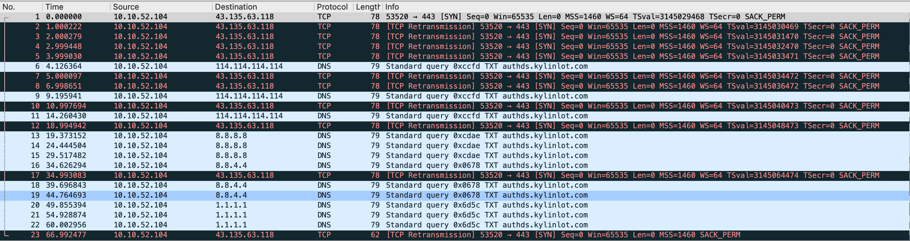

相关抓包文件： [mac-blockall.pcapng](../../output/mac-blockall.pcapng) 


#### 防火墙上的访问日志

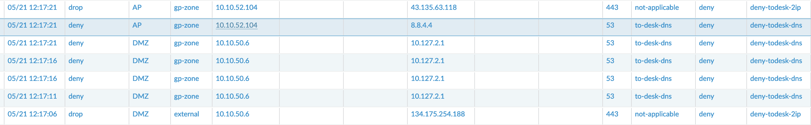

## Todesk 背后的访问关系

经过大量的测试，Todesk 会有三种机制去尝试互联，我们通过一个抓包来查看分别进行了哪些尝试（成功 block 之后的抓包，这样可以看到所有 Todesk 做的尝试）：

- 通过 DNS 解析 authds.todesk.com（A 记录），与解析后的 IP 互联
- 尝试直连 134.175.254.188（Windows 下，Mac 下使用了不同的 IP）
- 通过 DNS 解析 authds.kylinlot.com（TXT 记录）

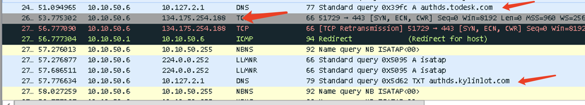


为了证明上述的猜想，做了很多测试，把测试结果在这里记录一下。

### 测试1：通过 IP block 的方式封堵 Todesk

Todesk 会进行下列尝试：

- 尝试直连 134.175.254.188 ，此 IP 不是通过 DNS 解析获得（看过 DNS 日志，抓包中同样没有 DNS 解析）

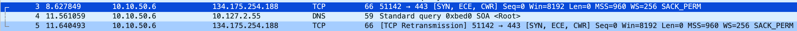

- 进行 authds.todesk.com 的域名解析，然后去连接解析后的 IP：

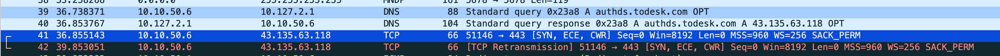

- 进行 authds.kylinlot.com 的 TXT 解析，之后访问 101.42.127.254 这个地址（怀疑是从 TXT Response 中拿到的 IP）

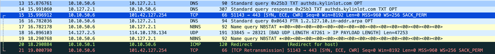


相关抓包文件： [windows-block-todesk-viaip.pcapng](../../output/windows-block-todesk-viaip.pcapng) 


### 测试2：仅 Block todesk.com

Todesk 会进行下列尝试：

- 尝试解析 authds.todesk.com，未得到结果后；
- 直接访问 134.175.254.188，访问成功

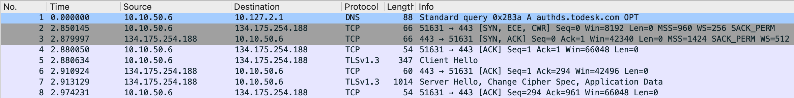

相关抓包文件： [windows-onlyblock-todeskdomain.pcapng](../../output/windows-onlyblock-todeskdomain.pcapng) 


### 测试3：Block 静态 IP 以及 todesk.com

Todesk 会进行下列尝试：

- 尝试解析 authds.todesk.com，未得到结果后（3）；
- 直接访问 134.175.254.188，未成功连接（5~6）；
- 尝试解析 authds.kylinlot.com，获得地址 119.45.2.35 并进行连接（8~15）

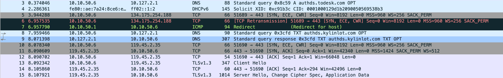

相关抓包文件： [windows-block-todeskdomain-and-ip.pcapng](../../output/windows-block-todeskdomain-and-ip.pcapng) 


### 测试4：Block 静态 IP 以及 Block kylinlot.com

Todesk 会进行下列尝试：

- 直接访问 134.175.254.188，未成功连接（2~5）；
- 尝试解析 authds.kylinlot.com，未得到结果后多次尝试（7~8、12、13、18~24）；
- 尝试解析 authds.todesk.com，获得地址 43.135.63.118 并进行连接（28~37）

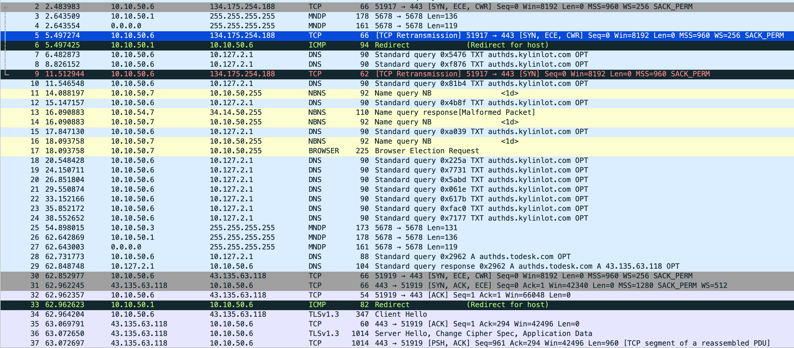

相关抓包文件： [windows-block-kylindomain-and-ip.pcapng](../../output/windows-block-kylindomain-and-ip.pcapng) 


### 测试5：Mac 上两个域名，不 block IP

测试时发现，Mac 上使用的静态 IP 和 Windows 的不一样，于是抓包看了下，抓到下列 IP 的 TLS 1.3 包：

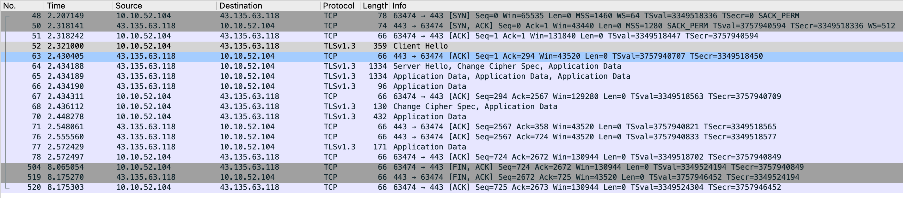

相关抓包文件：

 [mac-block-alldomain.pcapng](../../output/mac-block-alldomain.pcapng) 

将此 IP Block 之后，mac 上的 Todesk 也无法正常使用：

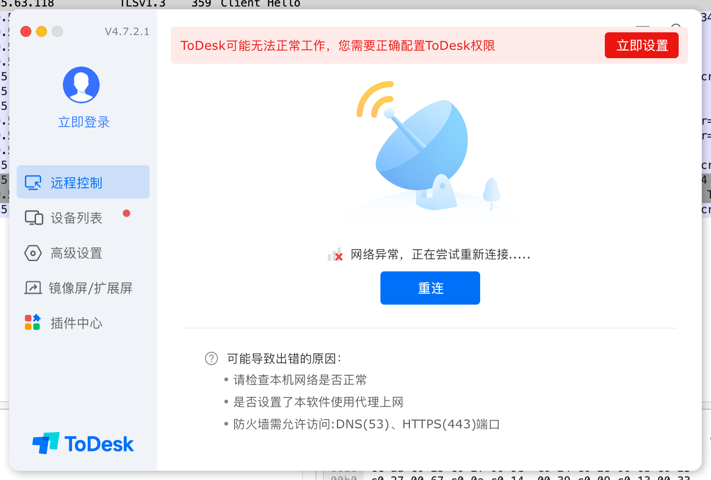

## 总结及回顾

测试中，会发现 Todesk 有三种方式（Windows 下）去连接服务器，不管哪种，**最终访问的 IP 都是使用 todesk.com 的证书**，所以一开始我们基于此证书检索到的 IP 其实涵盖了后来所有其他方式获得的 IP。

比如针对直连的 IP，在线查询到其使用的是 todesk.com 证书（私信证书）

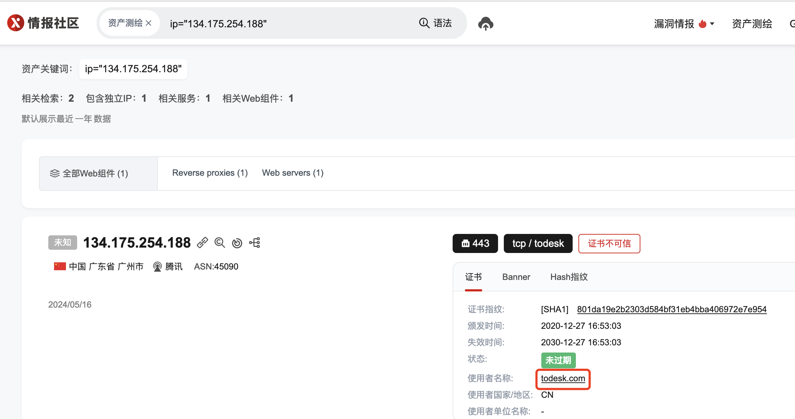

直接访问 IP 会得到同样的结果：

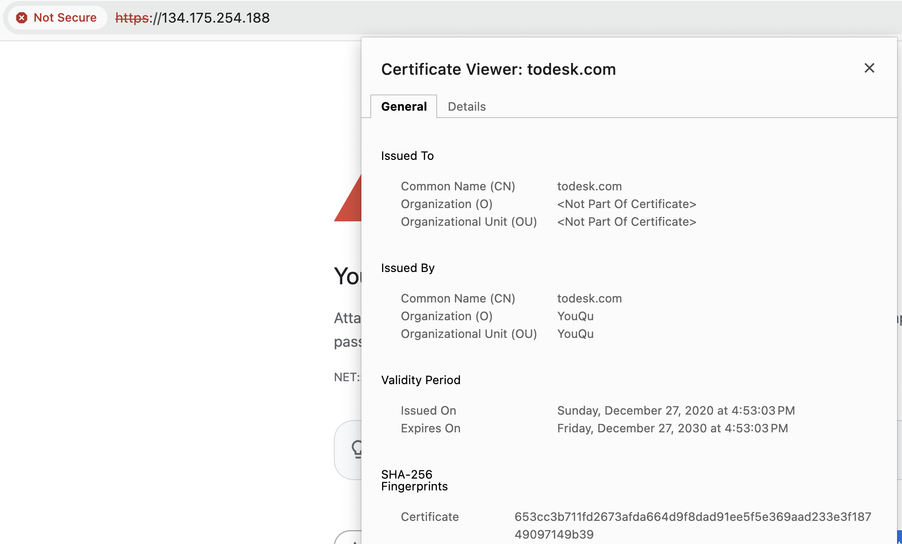

基于浏览器的 SHA-256 查找，确定和威胁情报的证书相同（211 个 IP）：

```shell
cert.hash="653cc3b711fd2673afda664d9f8dad91ee5f5e369aad233e3f18749097149b39"
```

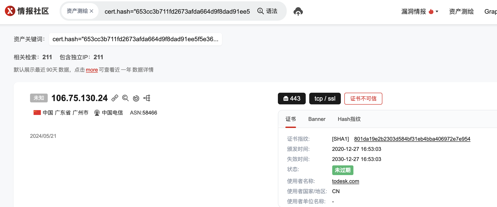

随便再从之前的抓包拿出几个地址，可以看到使用的都是这个证书

- 119.45.2.35（解析 authds.kylinlot.com 得到的 IP，详见测试3）
- 43.135.63.118（解析 authds.todesk.com 得到的 IP，详见测试4）


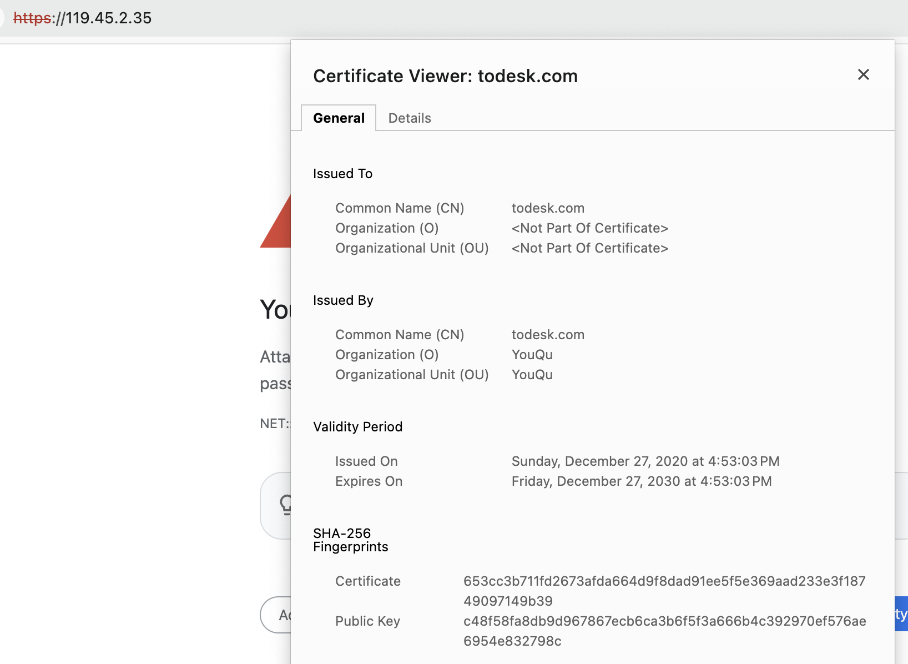

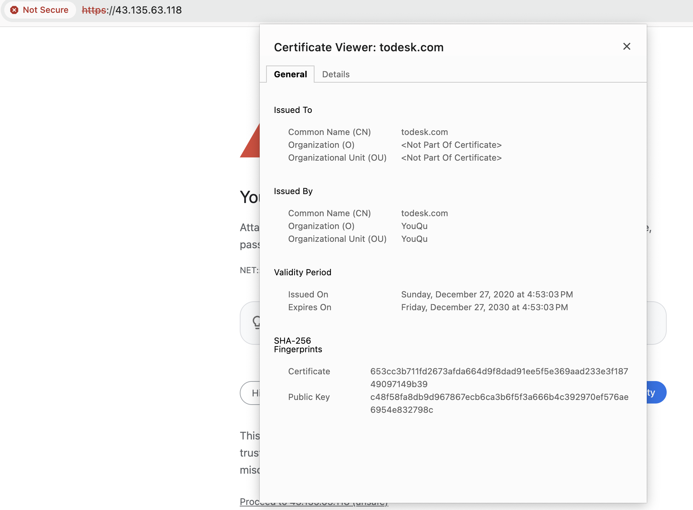

