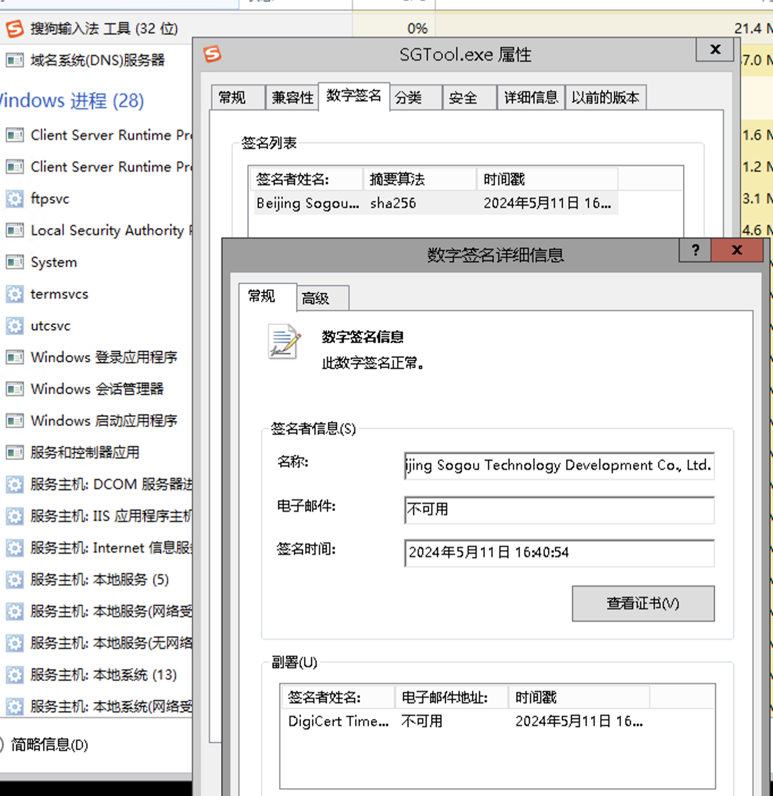
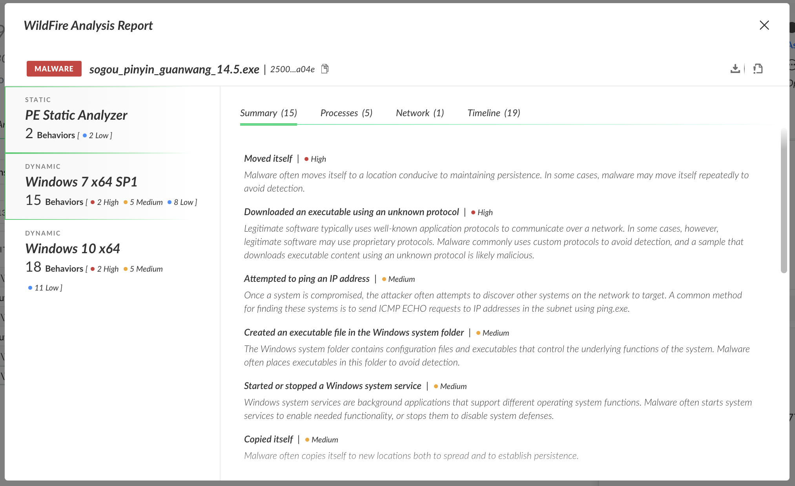
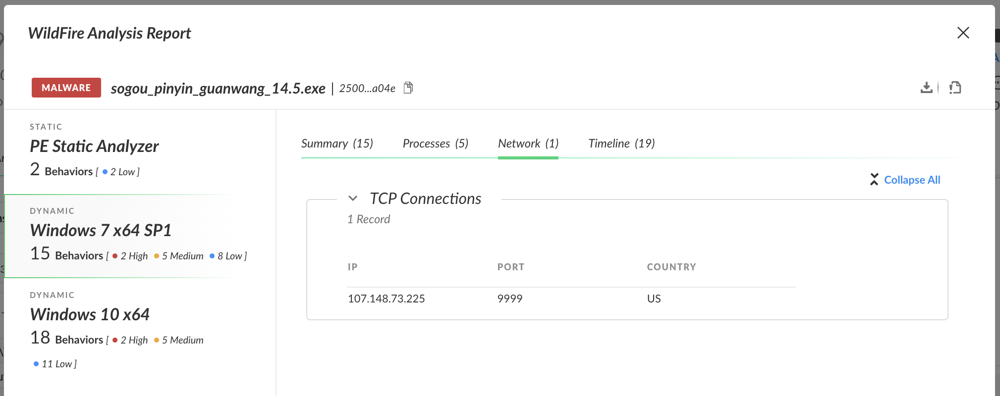

# 真假 Sogou 猜猜猜

{: .no_toc}

## 目录

{: .no_toc .text-delta }

1. TOC
{:toc}

## 装机中招

新电脑来了，装下我喜欢的常用软件吧，于是打开搜索引擎，用系统自带的输入法蹩脚的输入”搜狗输入法这个字“，看到下列结果：

本着第一个链接都是”广告“的原则，点开了第二个网站，看着没问题，浏览器也标记为安全，于是点了右上角的”立即下载“。

安装界面很熟悉，安装一切顺利，安装完成后输入法真的能用：

然而在后台，两个未知的进程在偷偷运行。

没错，你的电脑已经中招了。

可幸的是，这只是在受控环境中的一个测试。

## 据说有个假搜狗输入法

让时间倒退两个小时，饭桌上，听到同事提到现在有种新的攻击，有人做了个高仿搜狗网站，高价买了搜索引擎排行（那个比 Baidu 好用一些，又可以在境内合法访问的良好搜索引擎），于是，就有一些吃瓜群众中了招。

刚好，最近参加完 Palo Alto Cortex XDR （一个端点保护及响应产品）的培训，在搭建一个 XDR 测试环境，于是想了下，直接付诸实践，测下 XDR 看看好不好用。

饭后到家，开整，在我的受控机（Windows 2012 R2）上下载并安装了这个搜狗，看下 XDR 的防护能力咋样。

整个运行过程和上面的步骤一模一样，**搜狗输入法竟然可以正常用**，难道Cortex  XDR 没有防住？

紧张的我立马打开任务管理器查看，还好，任务管理器中并没有什么异常的进程，一切显得好安静，看来 XDR 防住了？

这时候我的疑问来了，既然下载的搜狗输入法有问题，那应该被 XDR 拦截吧，为什么却可以正常运行？

我又打开任务管理器，查看了下输入法的属性，没想到竟然就是官方的证书，这表示实际上最终安装的输入法未受影响，只是攻击者借助输入法的安装包，夹带私活安装了恶意软件，**XDR 只是拦截了恶意的部分，正常的部分保留了下来**，不得不惊叹：**高，实在是高！**

## 后端发生了什么？

那么，后端的 XDR 默默做了哪些事？

打开 XDR 本地 Console，看到下列事件：”检测到可疑可执行文件“，看来，XDR 确实检测到这是个恶意软件了。

再回到 XDR 管理界面中，看到已经有 Incident 出现，提示本地分析出了恶意文件。

不死心的我，想看看这个恶意软件到底在做什么，于是根据日志提示，在下列位置找到了创建的恶意文件：

手动执行，exe文件跳了下，好像文件名变了，但大小没变，依旧没有任何事情发生：

在 XDR 本地 Console 中，再次看到文件被识别为可疑可执行文件。

几次执行之后，期间又重新装了下”搜狗输入法“，日志稍微发生了变化，检测模块由 Local Analysis 变成了 WildFire：

再回到云控制台，看到 Incidents 中似乎没有任何新的事件，但是仔细看，Incidents 下面的 Alert 数量变多了，也就是说，发生在同一个终端类似的事件，**系统已经自动做了归类**。

打开 XDR 的 Timeline，验证了我的想法，相关的事件都按照事件顺序倒序列了出来，在本地分析检测到问题后，后续的多次执行日志被合并在了一起，其中相关文件的哈希也会记录在事件中：

## 恶意软件会干什么？

接着，是时候研究下，这个恶意软件到底做了什么，我们可以直接使用 XDR 的 Executions 查看关系树：

在下列关系树中，可以看到用户通过 firefox 下载了文件“C:\Users\Administrator\Downloads\sogou_pinyin_guanwang_14.5.exe”，此文件看似正常：

一旦当软件执行后，生成了两个文件：

- 李鬼大哥：“C:\Windows\TEMP\2\sogou_pinyin_guanwang_14.5.exe”，李鬼大哥复制出了 JGOHAoW.exe 恶意进程，也被 XDR 检测到
- 李逵本体：“C:\Windows\TEMP\2\sogou_pinyin_guanwang_14.5a.exe”，正常的搜狗输入法，正常运行

点击红色的 XDR 图标后，可以看到是本地的 Local Analysis 检测出问题，然后将其进行了汇报

下面的一个分支中，是再次运行安装包后的结果，此时检测机制已经变成了云端沙盒，是因为首次本地发现问题之后，系统自动在云端执行了沙盒扫描，然后将其行为及特征记录下来，并下发到了终端中：

具体这个恶意软件会做什么？点击软件包上的 WildFire Report 即可查看：

Report 的 Summary 中是一些软件会进行的高危行为：

在 Timeline中，可以看到更详细的执行日志：

我注意到，在 Network 中会去访问一个海外 IP 的 9999 端口，这估计就是获取后续更高危的恶意软件，执行更进一步的危害吧：

后来实际在一个未安装 XDR 的机器执行了下，确实去连接这个端口了，等了好半天，系统也没什么其他恶意进程出来，估计开发者是想先埋后门，具体传播什么未来再定吧。

只可惜，在 Cortex XDR 下，这个恶意软件已经没有未来了。
