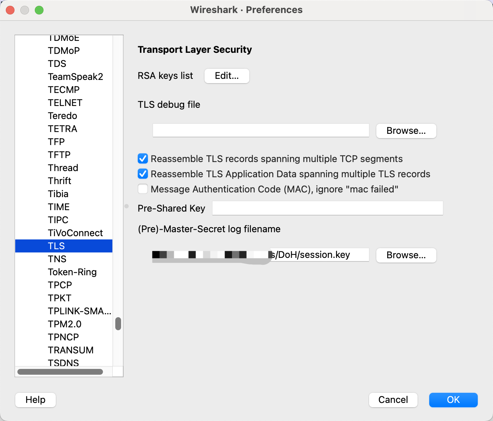
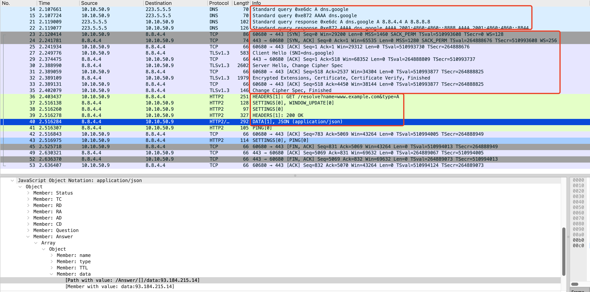
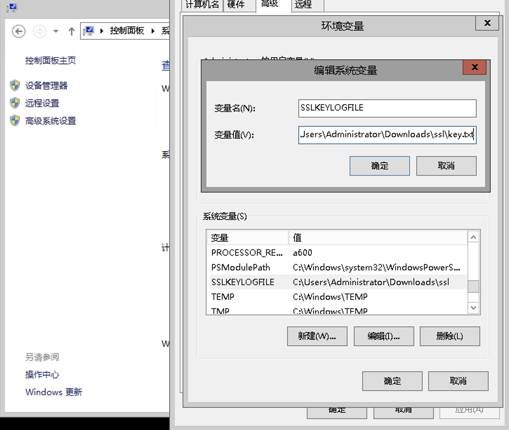
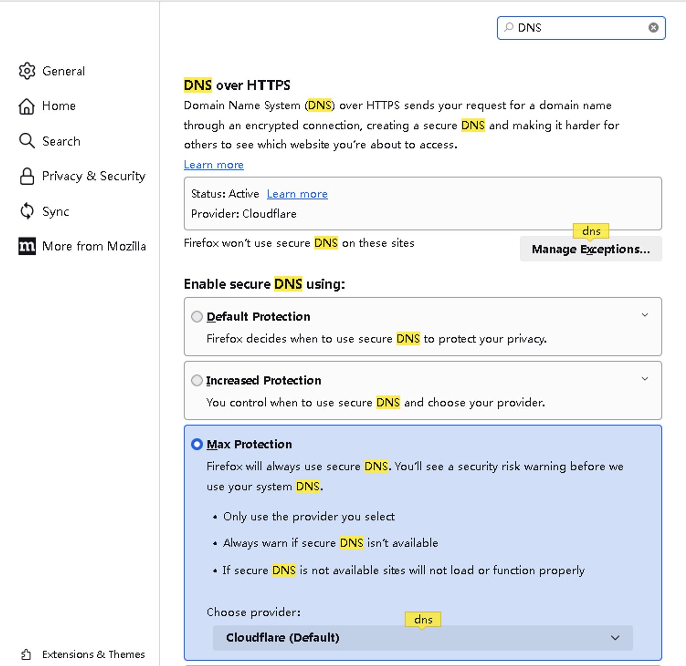
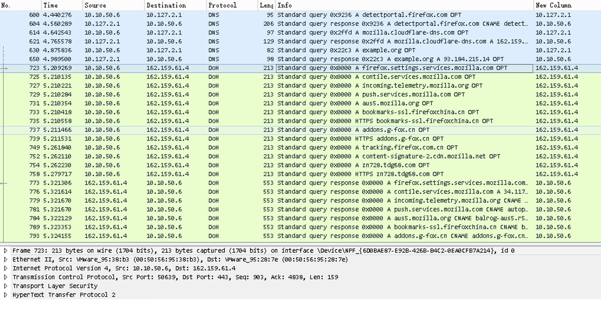

# 如何抓取和分析 DoH 包（以及样例分享）


{: .no_toc}

## 目录

{: .no_toc .text-delta }


1. TOC
{:toc}

## 通过 Curl 发送 DoH 请求，并记录 session key


```shell
# 通过 tcpdump 抓包
tcpdump -i ens160 -w doh.pcap
```


```shell
# 设置环境变量，让 Curl 记录 session key
export SSLKEYLOGFILE=/root/session.key

# 通过 curl 进行 DoH 解析
curl -H 'accept: application/dns-message' 'https://dns.google/resolve?name=www.example.com&type=A'
```

返回结果如下：

```
{"Status":0,"TC":false,"RD":true,"RA":true,"AD":true,"CD":false,"Question":[{"name":"www.example.com.","type":1}],"Answer":[{"name":"www.example.com.","type":1,"TTL":179,"data":"93.184.215.14"}]}
```


停止抓包，拷贝 doh.pcap 进行分析，同时拷贝 /root/session.key 文件用于解密 TLS 流量。

## 通过 Wireshark 查看包内容

通过 Wireshark 打开 doh.pcap，在”Preference>Protocols>TLS“的下列位置设置 session key：



整个过程分三部分：

- Client 解析 Google DNS 的 IP
- Client 和 Google DNS IP 建立 TCP 连接，协商 TLS
- 在 TLS 上通过 HTTP GET 获得结果



可以看到上述结果中的值和实际执行 Curl 时的值一致。

## 示例下载

共三个文件：

[DoH.pcap](../../output/doh/DoH.pcap) 

[session.key](../../output/doh/session.key) 

[readme.txt](../../output/doh/readme.txt)  


## Mac 下如何获取 Chrome 的 session key

在 Terminal 中运行下列命令，则会将 key 保存在 /tmp/google/ssl-key.log 文件中：

```shell
SSLKEYLOGFILE=/tmp/google/ssl-key.log /Applications/Google\ Chrome.app/Contents/MacOS/Google\ Chrome --user-data-dir=/tmp/google
```

## Windows 下如何获取 Chrome 的 session key

定义一个环境变量 SSLKEYLOGFILE ，设置 key 的目录：




参考文档：

[https://tianxiaohui.com/index.php/default/Windows-%E4%B8%8A%E8%A7%A3%E5%AF%86-chrome-%E7%9A%84-https-%E6%B5%81%E9%87%8F.html](https://tianxiaohui.com/index.php/default/Windows-%E4%B8%8A%E8%A7%A3%E5%AF%86-chrome-%E7%9A%84-https-%E6%B5%81%E9%87%8F.html)


## Firefox 如何开启并使用 DoH

在首选项中搜索 DNS 即可搜到配置项，默认由 Firefox 自行决定，可以手动修改为强制使用：



启用后，配合 session key 对 HTTPS 流量解密，即可在 Wireshark 中看到 DOH 流量，访问逻辑与上面的 Curl 类似，Firefox 会先去查找 mozilla.cloudflare-dns.com 的 IP，然后再与此 IP 建立 TLS 并进行其他访问的查询。


