* content
{:toc}
> 一直想抽空写写 vSAN 这个产品，在 15 年的时候笔者第一次听说 vSAN 这个产品，当时 VMware 还以 VDI 最佳拍档的方式去推广 vSAN，短短两年的时间， vSAN 经过多个版本的更新迭代，无论从功能还是稳定性上均有很大提升，最广泛的应用也由 VDI 变为了承载核心业务。
>
> 这篇文章总结一下笔者对 vSAN 的一些学习和使用经验，简单介绍下 vSAN，希望可以用最少的文字介绍清楚 vSAN 的架构、优势以及需要注意的地方。

**以下内容仅代表个人观点，如果错误欢迎指正。**

------

01

—

虚拟化的存储

在 NSX 系列文章 [NSX从入门到精通(2)：NSX介绍-网络工程师篇](http://mp.weixin.qq.com/s?__biz=MzUxODgwOTkyMQ==&mid=2247483712&idx=1&sn=65b665c274fbcf16fb389c4b198b6410&chksm=f982716ecef5f878492752148fba45c5e68cd60d90c8185999494449f6a2be9c5bfc66a0d71e&scene=21#wechat_redirect) 中，简单介绍了虚拟化及 vSphere，本文以这个背景开始介绍存储。

对于企业来说重要的是数据，而承载数据的设备就是存储设备（Storage）。

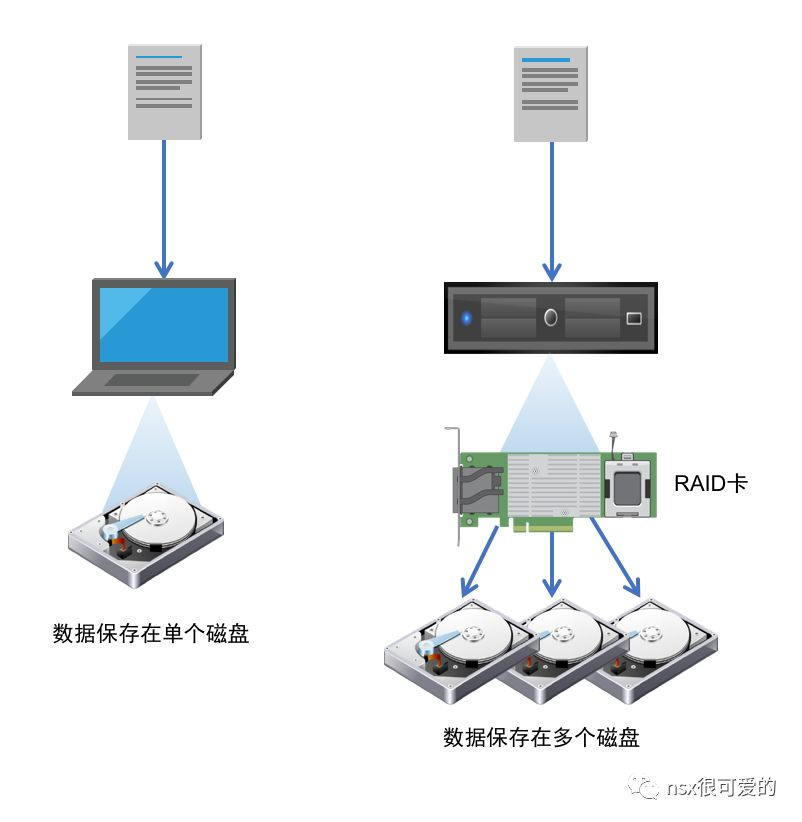

与个人电脑类似，企业级存储设备一般由多块硬盘与RAID卡组成。通过 RAID 卡可以将多个磁盘组成逻辑的阵列，使得数据分散保存在多个磁盘中，实现高效的读写，实现冗余，避免单个磁盘故障引起的数据丢失。

通常会使用 RAID 1 和 RAID 5 两种配置模式，两种模式使用的算法不一样，最终读写效率、资源利用率也不同，但最终目标都是一致的：**可以避免一块磁盘的故障**。

RAID 卡及磁盘组成的阵列是**纯硬件层面的**，对于操作系统来说，最终的使用方式是将其格式化为 XX 文件系统去使用，拿 Windows 系统来说，会格式化成 NTFS 去使用。

在虚拟化出现之后，这样的硬件架构依然可以被使用。

vSphere 有个很重要的功能是进行了**虚拟机的封装，一个虚拟机以文件的形式存在，可以任意拷贝到其他其他。**为了更精确定义这一个虚拟机需要的资源，会有很多个文件来表示这个虚拟机，例如 .vmx 后缀的虚拟机配置文件、.vmdk 后缀的数据文件等等。

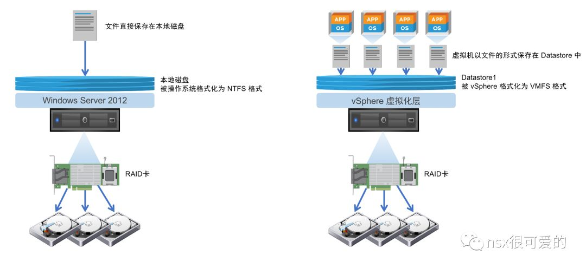

单台服务器做了虚拟化，跑很多的业务，这样没什么问题，但在企业环境下，**还必须考虑服务器硬件的故障**。因此，vSphere 下有了集群的概念，一个集群视为一个资源池，搭配很多 vSphere 的高级特性后，**业务可以运行在集群中任意主机上，不必担心单一主机故障**。

下图演示的就是单台服务器故障后 vSphere 的故障恢复机制 **HA**，**可以将故障主机上的虚拟机“迁移”到其他主机运行**。

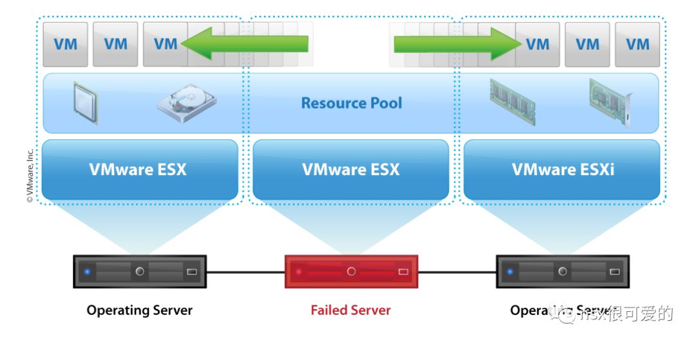

而在这个功能的背后，有一个前提，便是**共享式集中存储**。这里面的关键词是**共享**，一个存储可以被多个服务器同时连接，同时读取数据，任意一台服务器故障后，数据不受影响，进而其他服务器可以使用这些数据快速恢复业务。

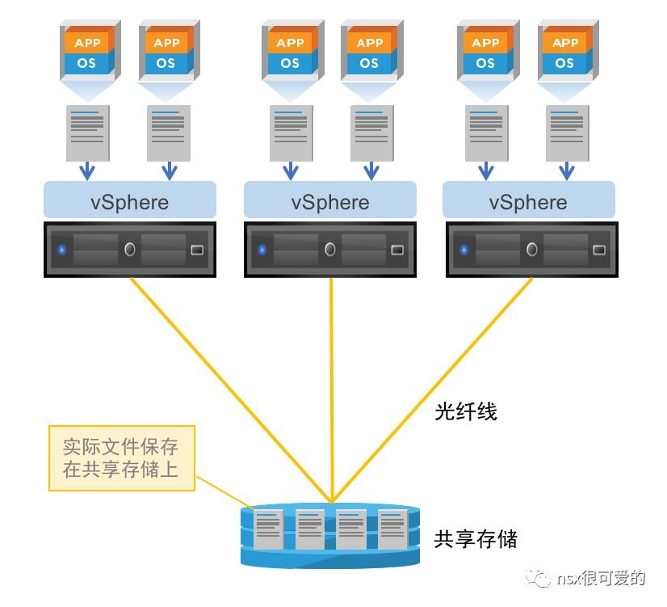

一般存储会有两个机头（相当于存储的大脑）保证冗余，每个机头会有多个接口保证接口冗余，每个接口都可以对外提供数据访问服务，但这个数量是固定的，在服务器很多的情况下，需要存储交换机的介入，为保证冗余，需要至少两台。

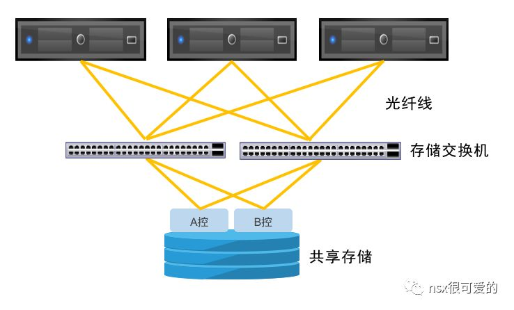

------

02

—

大数据的到来

章节 1 的架构一直很稳定，直到各种新概念的出现。

几年前和现在比，对个人而言最大的变化是“人手一机”，对于企业最大的变化是“数据剧增”。

短短几年内，用户产生的数据在剧增，对数据的存储、分析等需求也在剧增。

再回到章节 1 看看传统的集中式存储，一下子暴露出很多缺陷：

- 容量有上限
- 所有配件均为专用硬件，一旦设备停产，无法进行硬件升级
- 不能平滑地按照业务需求升级容量和性能
- 严重依赖于存储厂商提供服务
- 上线周期长
- 配置较为复杂，与业务无强关联性，容易出现误操作
- 无法针对业务提供区分式服务

为了解决以上问题，需要做到三件事：**即抛弃单点的设计，避免单点性能瓶颈(无集中式主控)；抛弃专有硬件，使用标准硬件搭建存储系统；使用一种灵活的存储管理程序提供存储服务。**

而实现的最终效果，便是**软件定义的****基于服务器集群搭建的分布式存储**。

虽然上面的话比较绕口，但我觉得一句话可以完整表达出它的三个特点：

1. 软件定义：存储的管理程序必须是基于软件实现的，唯有软件才能做到开放、灵活、快速，适应企业对于存储的种种需求。

2. 基于集群：集群代表搭建这样的存储系统，必须有**多台服务器的参与**，这些服务器需要有**相似的配置**，**提供统一和标准的功能**；

3. 分布式：分布式可以将数据、IO访问分散到多个节点，让整个存储系统随着节点的增多容量和性能线性增加。

   

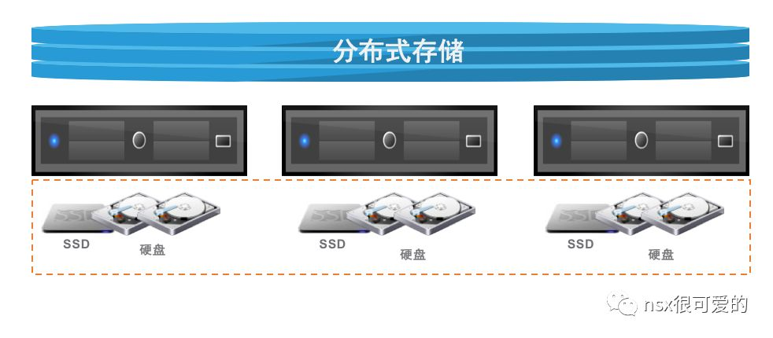

基于上面的概念图，再来看看具体如何去实现。

**1、谁提供容量？**

如图所示，每台服务器都需要本地安装硬盘来**贡献一部分容量**。为了让存储性能更佳，需要配置 SSD 硬盘来做读写缓存，HDD 用来提供大容量的存储。

**2、如何将每台服务器的提供的硬盘连接起来？**

通过网络，为了保证性能，一般需要使用专用的万兆以太网。为了保证网络冗余，也需要两台交换机，双线连接。

这里有个重点是，万兆交换机之间必须互联！

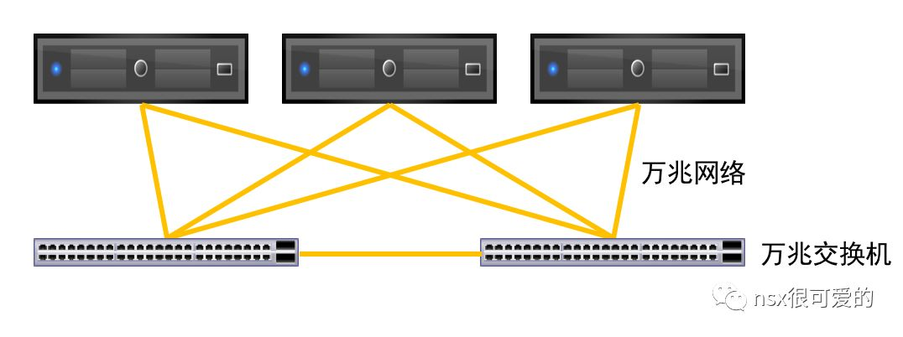

**3、向谁提供服务？**

如果在虚拟化环境中，则最终使用存储的是虚拟机，前面提到虚拟机以文件的形式保存，所以只需要让虚拟化层可以把文件保存在上面即可。

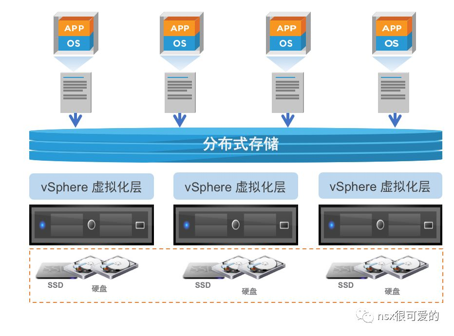

**4、如何提供存储？**

传统存储架构下，所有的服务都是要通过存储的大脑--机头来实现。

如果改成了分布式，**每个节点都需要提供存储资源，也需要访问存储**，因此每个节点都会有相关的组件存在。

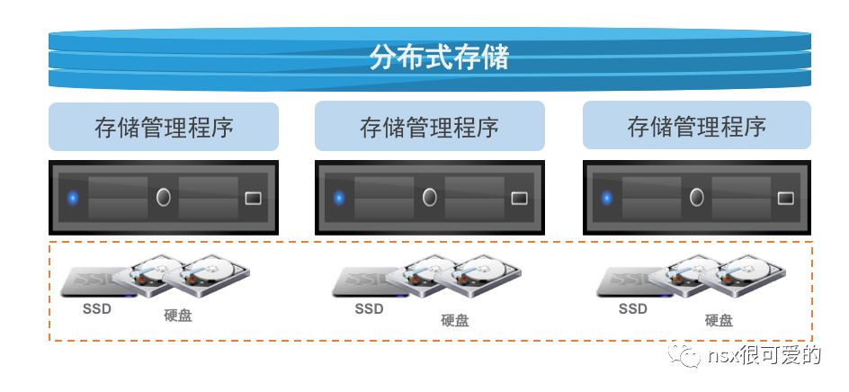

------

03

—

VMware vSAN

VMware 于 2013 年正式推出 vSAN，全名 VMware Virtual SAN，其架构很类似于章节 2 提到的分布式存储架构，在某些设计上更加“完美”，也做到了企业级的安全+消费级的简单。

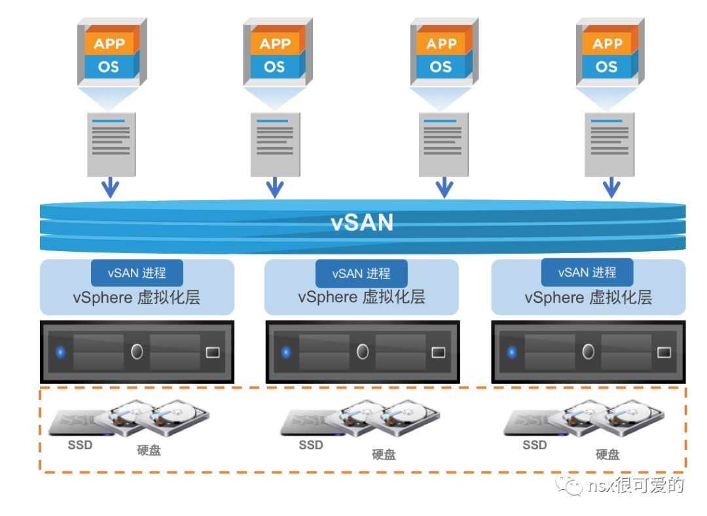

下面就三个关键词讲解 vSAN ：

**池化：**

vSAN 做的第一步，是将集群内多个服务器上的多个磁盘进行池化。

1、服务器内部的连接

X86 服务器的架构决定了每个服务器必须有 RAID 卡才能使用硬盘，多块硬盘使用 RAID 卡汇聚到一起再和主板连接。

在每个 vSAN 服务器内，至少需要配置一块 SSD + 一块 HDD，HDD 用于存储容量，SSD 只用于读写缓存。

在 RAID 卡选择上，建议使用支持**直通模式**（Pass Through）的 RAID 卡。在这种模式下更换硬盘、新增硬盘会非常方便（而如果配置 RAID 来供 vSAN 使用，则很多时候需要重启主机进入 BIOS 来配置）。

可能有人会问不配置 RAID，硬盘坏了数据丢失怎么办？不用担心，**vSAN 有自己的冗余机制**，下面会讲到。

SSD 70%的容量用于读缓存，30%的容量用于写缓存。默认所有写的数据会被先行放在 SSD 中以减少写延迟，通过一些机制将这些数据逐渐写入到 HDD 中（这个过程叫 Destage）。在从 vSAN 读数据的时候，vSAN 有一套算法来决定哪些数据为热点数据，然后预先缓存到 SSD 加快读取速度。

所以，通常也**不建议使用 RAID 卡自带的读写缓存**，因为 vSAN 已经有很优化的读写缓存加速了。

在这里需要格外注意的是 vSAN 要求 SSD、HDD、IO Controller **必须**在 vSAN 兼容列表内，否则会出现不稳定等情况。

2、服务器之间的连接

一个服务器内部，通过 RAID 卡将硬盘汇聚在了一起，服务器之间，则需要网络保证数据能够互通。

当然，仅依靠以太网，是不能将多个硬盘连接起来，需要有个中介，这个中介就是**嵌在 vSphere 中的 vSAN 进程。**两个网络节点之间通信，双方必须有 IP 地址才可以，于是有了** vSAN VMkernel**，每台主机都需要一个 vSAN VMkernel 和独立的网络，保证节点之间数据高速、稳定的传输。

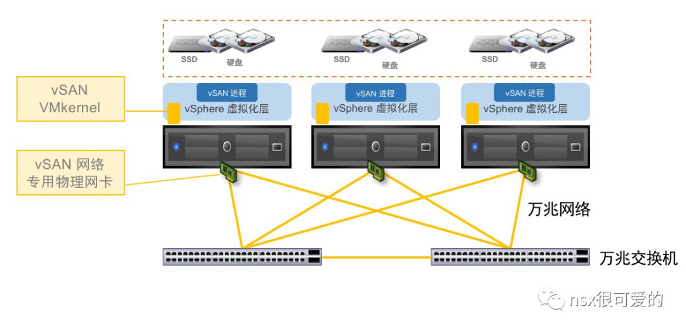

有了以上元素，只需在 vSphere 集群中开启 vSAN 功能，所有主机的磁盘会组成一个逻辑的存储池。

**故障域：**

1、

前面提到了传统存储使用 RAID1 或者 RAID5 来防止单硬盘故障，在分布式存储中，也需要避免单点故障。

vSphere 提供了 HA 功能，保证单台主机故障后业务可以在其他主机上运行，这里故障的单位是“**主机**”，vSAN 也继承了这一设定（也很合理，因为主机也需要硬件维护，在维护的时候，一台主机能提供的所有存储资源都会下线）。

在这样的设定下，为了保证数据不丢失，数据的存放位置就有讲究了。

同一个虚拟机的同一份数据，必须保存在不同主机上。

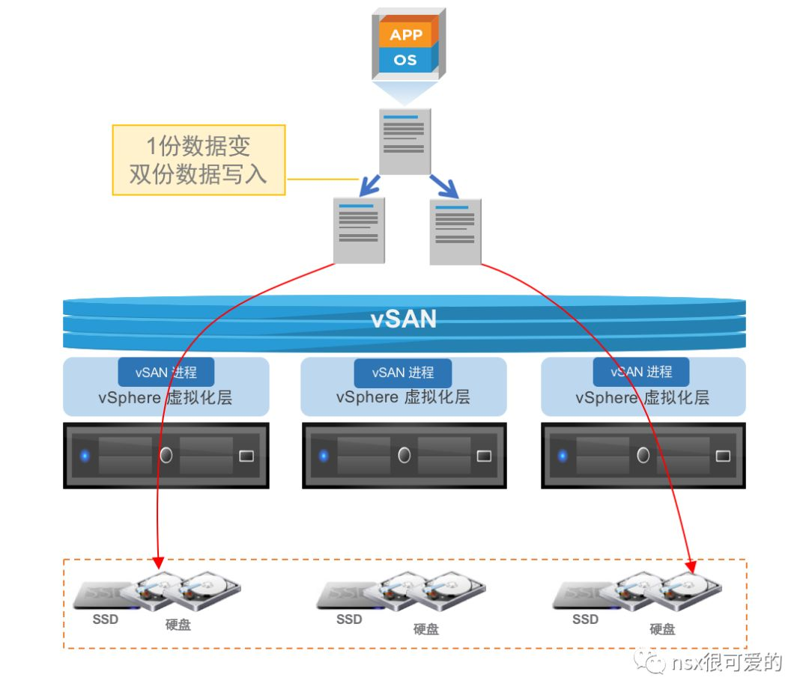

结合上面的架构和 vSAN 的网络架构，假如一台主机网络有问题怎么办？（此时主机并不能确定是自己的网络中断还是其他主机中断，只知道无法和其他节点通信。）

这时候需要有个仲裁机制保证**同时只有一份数据是活动且是最新的**，否则会造成冲突。

于是在上图的架构中，为每份数据再创建一个仲裁文件，保存在第三台主机中。

这便是 vSAN 最简单的架构，此架构允许一台主机故障，当然一台主机上的任意硬件坏掉也是允许的，**只要故障发生在一台主机内**。

下图便是 vSAN 故障域的一个简单示意。vSAN 中有个词叫 FTT （Fault to Tolerance），意为**最大允许同时故障多少台主机**。FTT 决定的是虚拟机数据保护级别，也决定了一个集群所需的最小数量，**一个集群中主机数量>=2N+1**，N=FTT的值。

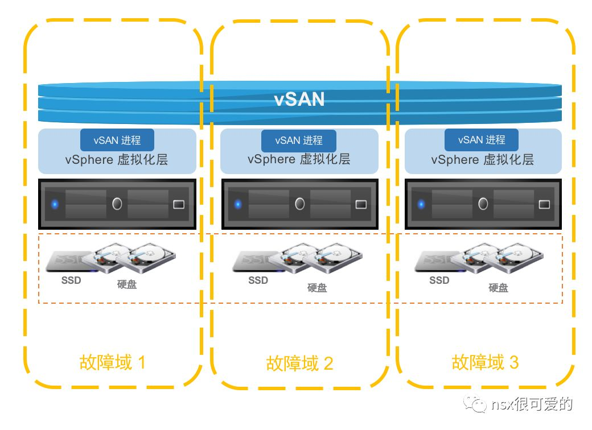

2、上面提到每台主机需要 RAID 卡将多个硬盘连接起来，也需要至少一个 SSD 和一个 HDD。SSD 只做读写缓存，从经济的角度看，不可能每个 HDD 都配置一块 SSD，需要**多个 HDD 共享一块 SSD的资源**。

在 vSAN 中，有了磁盘组这一概念，**磁盘组是个逻辑的****组，用于让多块 HDD 共享一个 SSD**。

所以 vSAN 磁盘组和 RAID 组完全不是一个概念，数据是按照故障域为单位自动存储的，不能手动选择保存在哪台主机，更不能选择保存在哪个磁盘组。

vSAN 规定每个磁盘组**最少需要一块SSD+一块HDD，最多一块+7块HDD**。每台主机不能多于 5 个磁盘组。

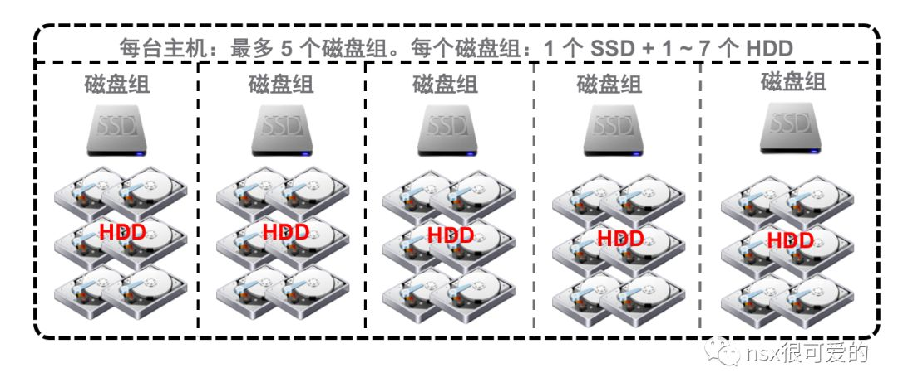

让多块 HDD 共享一个 SSD 虽然节约成本，但也有一定风险，比如万一 SSD 故障，整个磁盘组的数据均会处于无法访问的情况，因此一般建议使用多个磁盘组分散数据，减少此种故障带来的影响。

举例： 

集群1：每主机一个磁盘组，由1块400G SSD + 4块800G HDD 组成

集群2：每主机两个磁盘组，每磁盘组由1块200G SSD + 2块 800G HDD 组成

一旦集群1的一个 SSD 故障，vSAN 存储池会失去 3.2T 裸容量。

一旦集群2的一个 SSD 故障，vSAN 存储池会失去 1.6T 裸容量。

**区分服务：**

只要存在不同类型的业务，必然存在区分服务。

对于传统存储而言，服务的区分是存储卷级别的。一个存储卷的底层使用 RAID 10，上层业务获得的存储资源便是 RAID 10的保护级别和性能；一个存储卷的底层使用 RAID 5，上层业务获得的存储资源便是 RAID 5 的保护级别和性能。

 

1、

如前面在故障域中提到的，使用 vSAN 来保证数据在单节点故障时不丢失，至少需要三个节点。

如果要让数据在双节点故障时依然可以访问（即 FTT=2），数据应该怎么保存？

此时或许有人抢答，数据一分三，加一个仲裁，保存在四个节点上，如下图所示：

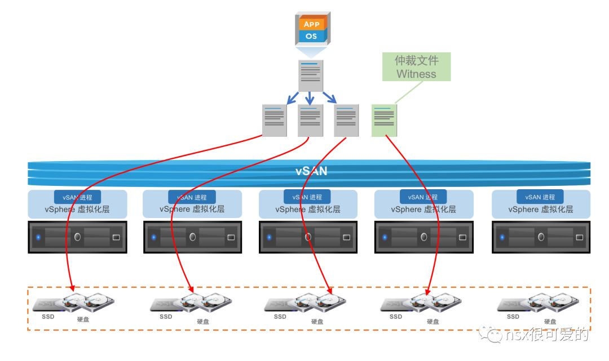

然而很可惜，这样的架构存在**脑裂**的风险，假如主机刚好两两隔离，那无法判断哪两个主机上的数据才是活动的，哪两台主机的存储资源需要被暂停。

因此可以通过加入一个见证节点来避免脑裂的发生（在实际情况中数据存储并不一定完全按照下图执行）。

实现下图的冗余级别，只需要修改虚拟机的**存储策略**，将 FTT=1 改为 FTT=2 即可。

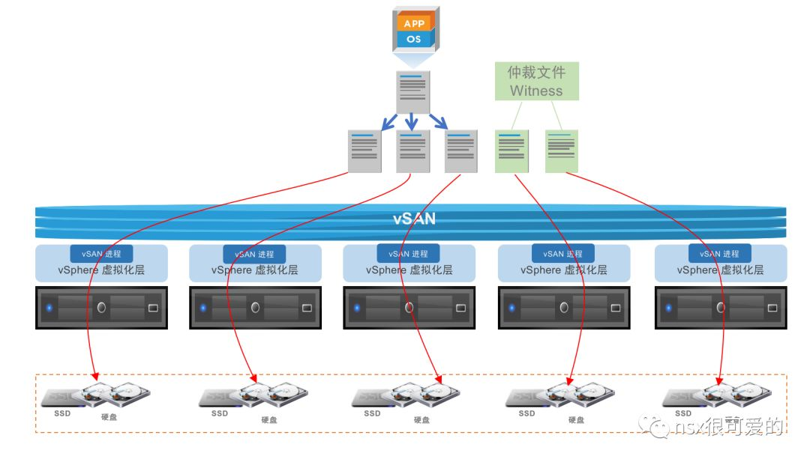

2、

vSAN 通过**存储策略**来给不同的**对象**区分不同的服务。

例如：

给虚拟机 1 设置存储策略 A（ FTT=1，不预留缓存，限制 IOPS 为100）

给虚拟机 2 设置存储策略 B（FTT=2，预留 10% 的 SSD 缓存，不限制 IOPS）

Wait！上面提到一个词，**对象（Object）**，什么是对象呢？

一个文件，例如 vmdk ，在 vSAN 中便是一个对象；

一个快照文件是一个对象；

虚拟机 swap 文件是一个对象；

虚拟机一般都会有一个文件夹存放与其相关的 vmx 文件、日志文件等，这个文件夹(VM home)在 vSAN 下也是一个对象。

可以理解为，在 vSAN 的世界中，**一个虚拟机由多个对象组成**。

对象并不是最小单位，**对象由多个组件（Component）组成**。一个对象如何变成多个组件便是由存储策略去决定的。

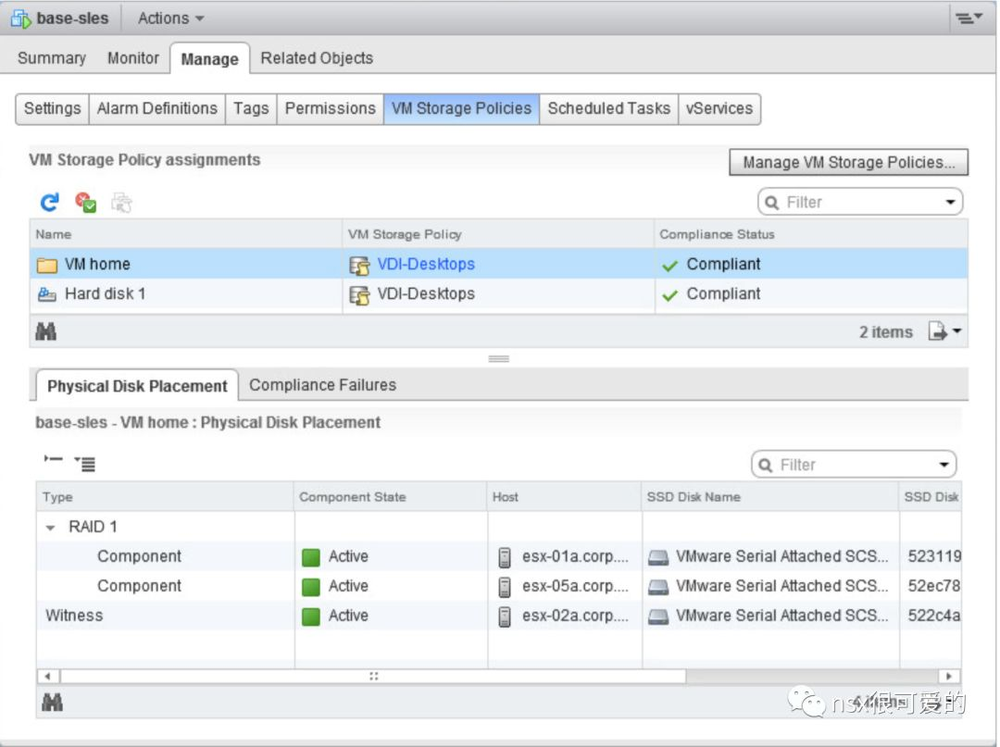

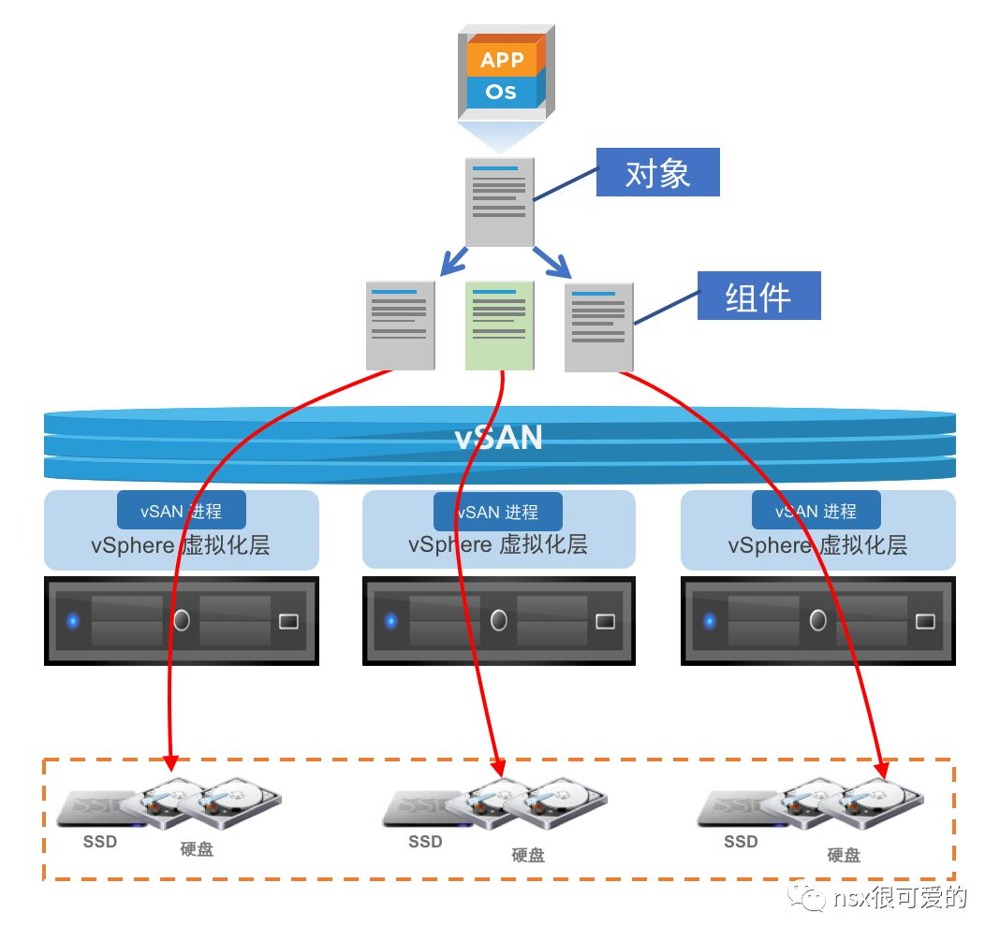

每个 Component 有大小限制，最大为 255G，因此大于 255G 的 Object 会被强制拆分成多个 Component。

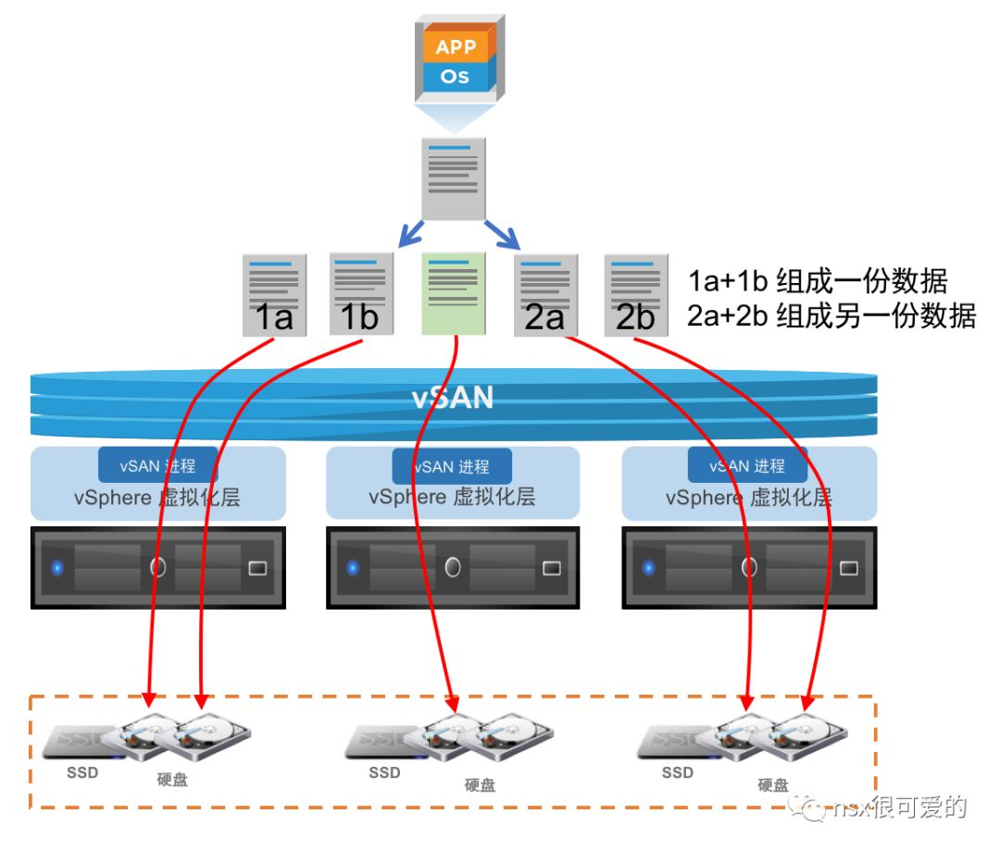

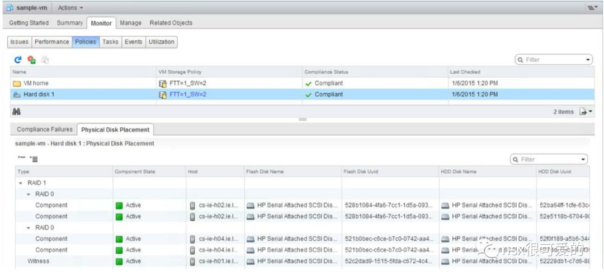

至此，vSAN 主要的实现原理基本讲完了。

更多关于 vSAN 的知识，建议看看[vSAN 相关的资料，也全放在了这里](http://mp.weixin.qq.com/s?__biz=MzUxODgwOTkyMQ==&mid=2247483925&idx=1&sn=eb6105764de7f3d8a003dd07f5458832&chksm=f982723bcef5fb2d92edd01cee0adb3c7407be974309f7007f1dfb9b1bd3dfaeb857ae5ab93a&scene=21#wechat_redirect)，尤其是里面的 vSAN Design Guide。

vSAN 具体如何配置？可以使用电脑打开下面的 Demo，按照指引一步步去创建 vSAN。

http://www.halfcoffee.com/demo/vsan-demo.html

------

04

—

vSAN FAQ

下面记录一些 vSAN 常见的问题：

**1、一个 vSAN 集群允许创建多个Datastore吗？**

不能，每个 vSAN 集群只能有一个 Datastore，通过存储策略来为不同业务分发不同的保护策略。

**2、不同速度、接口的 HDD 和 SSD 可以混用吗？**

不能，最佳实践要求一个集群所有主机的硬件配置相同，如果是不同批次的硬件采购，尽量做到硬件性能差异很小。

以及，vSAN 好歹是个企业级的存储，这样配真的好吗？

**3、可以指定将数据存放在哪个主机或磁盘组吗？**

不能，vSAN 分布式存储的数据保存在哪里由 vSAN 来控制，请忘记传统的存储管理方式。

**4、vSAN 支持全闪模式和混合模式，一个集群可以同时使用这两种模式吗？**

不能，一个集群只能使用一种配置模式，且只能有一个 Datastore。

**5、vSAN 环境中，本地的虚拟机会优先保存在本地的磁盘中吗？**

不会。

**6、vSAN 一定要使用单独的万兆交换机吗？**

最佳实践推荐使用单独的万兆交换机，将存储流量和业务流量做一区分。

**7、可以查看 vSAN 每个磁盘中保存的数据吗？**

可以通过 vCenter 查看每个虚拟机的每个文件保存到了哪些磁盘，但是不能查看每个磁盘上具体有什么数据。

**8、vSAN 的配置在 vCenter 中进行，vCenter 坏了会影响 vSAN 吗？**

同 vSphere 管理一样，vCenter 只是一个管理角色，一旦 vSAN 创建好，vCenter 故障不会影响 vSAN 的使用。

**9、vSAN 需要配置组播吗？**

早期的 vSAN 版本中，所有主机之间通信会用到组播这种网络技术，一般如果vSAN VMkernel 网络在同一个网段，这时候只需要给交换机开启 IGMP Snooping 即可（[NSX从入门到精通(20)：一篇文章让你读懂网络-上篇](http://mp.weixin.qq.com/s?__biz=MzUxODgwOTkyMQ==&mid=2247484046&idx=1&sn=d452c724245ffd12a5530c06d3eba6d7&chksm=f98272a0cef5fbb69c59ff935802eaf494e83de807f16043ed5212dcbb6bd0e20987a471dd54&scene=21#wechat_redirect)一文中有提到这项技术）。

如果是 vSAN 双活场景，会有两组 vSAN 机器分别在不同数据中心，vSAN VMKernel 网络是两个网段，这时候通信需要给沿途交换机配置组播路由（PIM协议）。

vSphere 6.5 以后版本搭配的 vSAN 只需要保证 IP 可达即可，不再需要配置 IGMP Snooping 或者 PIM。

------

05

—

总结

如果按照本文的讲述顺序，你会发现 vSAN 似乎很简单，然而稍微深入一下会有很多小知识。

前面提到一句话，企业级的安全+消费级的简单。

vSAN 在使用和操作层面，确实做到了极简，正常情况下在 vSphere 上开启 vSAN 功能只需要几分钟时间。

为了让 vSAN 更稳定可靠，vSAN 后端考虑了很多故障场景，通过技术手段避免发生故障时数据丢失。

vSAN 区别于其他分布式存储的重点是：vSAN 是基于存储策略的管理，策略可以下发给每个虚拟机的 vmdk 文件，非常之灵活，变更策略也非常简便。

也正是因为这个特点，使得 vSAN 特别适合于云计算，管理员不再需要管理多个存储池，设定非常复杂的关联关系，只需要根据业务类型配置不同的存储策略即可。

在扩展方面，vSAN 存储容量和性能可以随着节点数的增加而增加，vSAN 最大支持 64 台 ESXi 作为一个存储集群（64 也是 vSphere 集群支持的最大主机数）。

笔者曾经接触一个项目，6台双路服务器，每台服务器配置 24 块 2T HDD盘，4块 nvme SSD，加起来裸容量达 260+ T，而这仅仅占用了一个机柜的空间。

在应用场景方面，vSAN 能够满足任何虚拟化的存储需求。

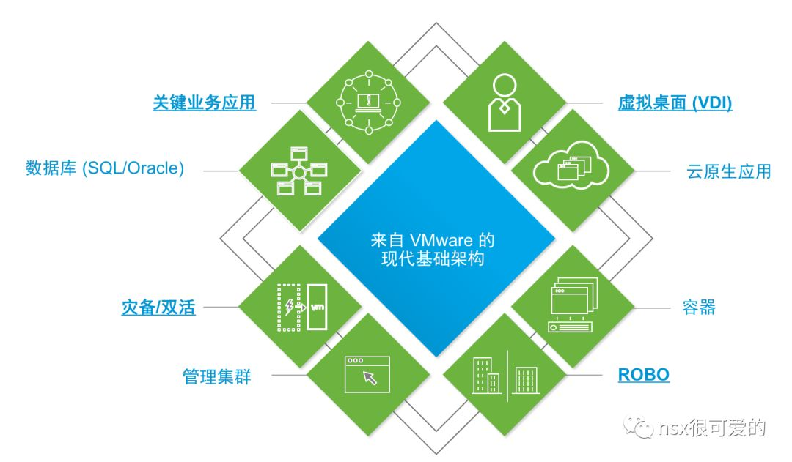

vSAN 有一个很好用的场景，存储双活。相信基于前面的讲解，下图很容易理解吧？

