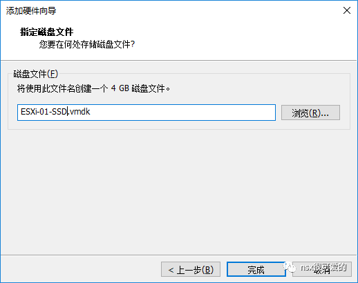
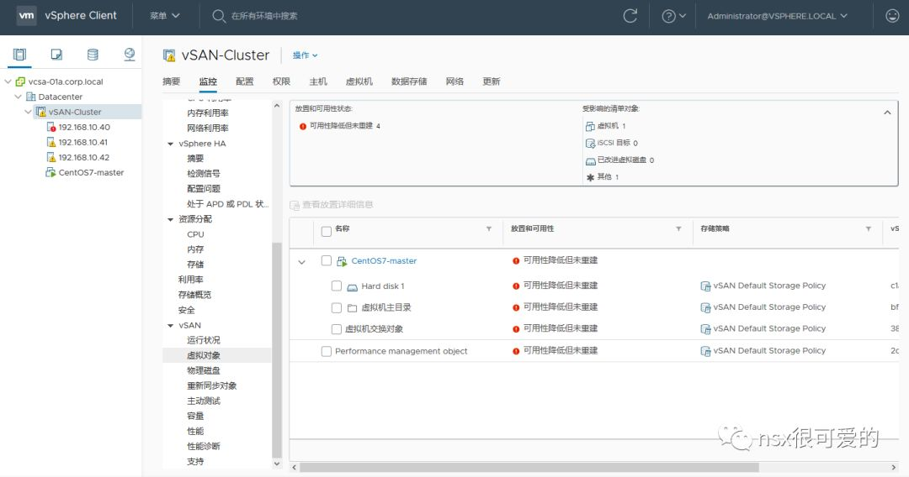
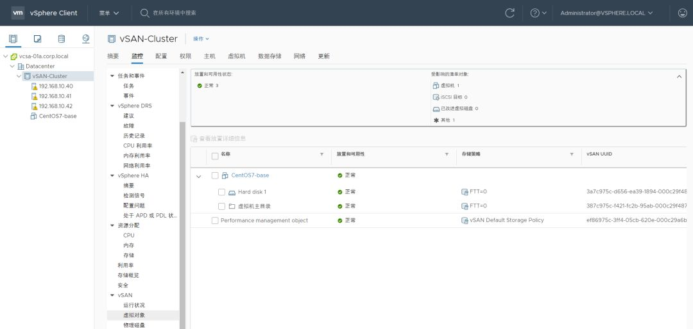
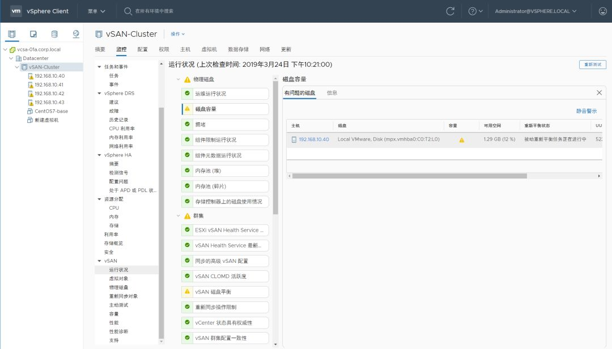
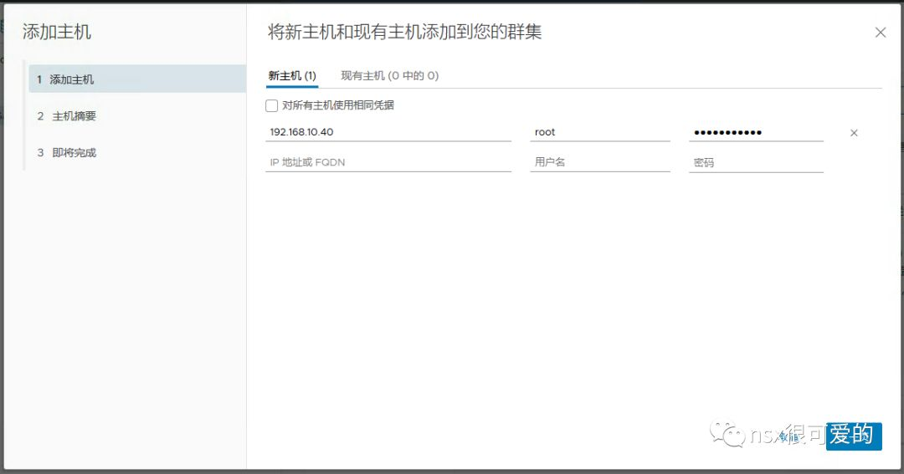
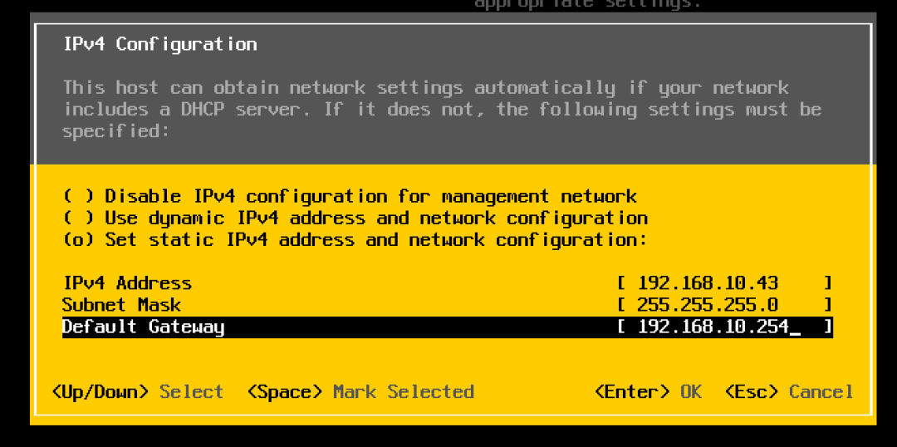
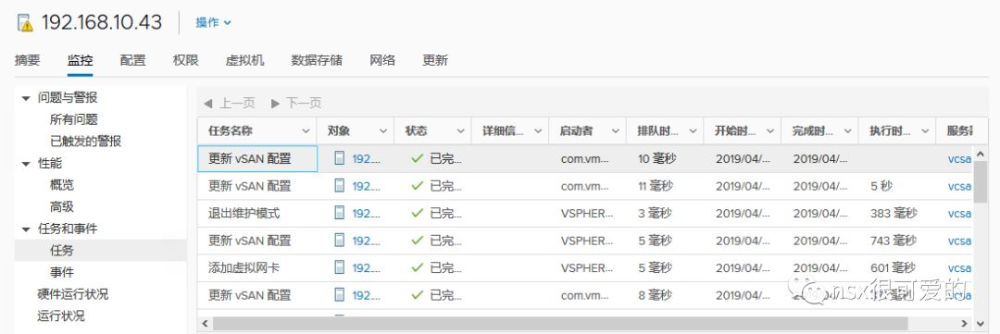

**本文是公众号里一系列文章的合集，所以会很长，为了获取良好的阅读体验建议直接去公众号查看**

------
## 目录
{: .no_toc .text-delta }

1. TOC
{:toc}

---

## 一、大纲

vSAN 完整系列共包含下列文章，此处只收藏测试部分:

- [vSAN 相关的资料，也全放在了这里](http://mp.weixin.qq.com/s?__biz=MzUxODgwOTkyMQ==&mid=2247483925&idx=1&sn=eb6105764de7f3d8a003dd07f5458832&chksm=f982723bcef5fb2d92edd01cee0adb3c7407be974309f7007f1dfb9b1bd3dfaeb857ae5ab93a&scene=21#wechat_redirect)

收集了一些常用的 vSAN 资料，其中很大一部分是官方网站的资料，可以在 https://storagehub.vmware.com/ 获取到。

- [一篇 vSAN 入门，送给大家](http://mp.weixin.qq.com/s?__biz=MzUxODgwOTkyMQ==&mid=2247484078&idx=1&sn=2d793bf44a822315a647f001c7b9e628&chksm=f9827280cef5fb96a6be6a48dc83337187a20ac78678067c08bfd8fc3d5aa1376642adf27a21&scene=21#wechat_redirect)

鉴于很多人对 vSAN 理解不够（受传统存储架构的影响），尝试从架构层面去讲解 vSAN ，希望大家能有所收获。

- [如何在家搭建一套自己的实验平台(4)-开启vSAN](http://mp.weixin.qq.com/s?__biz=MzUxODgwOTkyMQ==&mid=2247484899&idx=1&sn=f7112d93fafeaedbd7a1614df76fe838&chksm=f98275cdcef5fcdb900704a5a7ab1e1afbd09ef92f26ddb3d78e2296248ca5a18ae74ddda857&scene=21#wechat_redirect)

这篇算是对上一篇的补充，理论的落地版本。当然，有很多 vSAN 的原理知识并未提到，例如存储策略等，个人觉得，只有用到存储策略时，讲解这些内容才有意义。

- [如何在家搭建一套自己的实验平台(5)-如何把 vSAN 玩坏](http://mp.weixin.qq.com/s?__biz=MzUxODgwOTkyMQ==&mid=2247484970&idx=1&sn=254730aa39662f67e52fb469a34d5bfc&chksm=f9827604cef5ff121c6d047a3c68f527d1c582b7e6d79793c554fcfa6f2013b89e72a30736ff&scene=21#wechat_redirect)

例如这篇，需要进行一些基础的 vSAN 测试，就不得不提存储策略中的 FTT~

除此之外，文章中也讲解了很多 vSAN 常见操作。

- [如何在家搭建一套自己的实验平台(6)-如何把 vSAN 塞满](http://mp.weixin.qq.com/s?__biz=MzUxODgwOTkyMQ==&mid=2247485051&idx=1&sn=f7a979f188201403eab583ca7d678dd2&chksm=f9827655cef5ff43e5bba4d4e54fbaf1e80bdfc280a1ae0f62d83fc96a24b5b86ec378d4d031&scene=21#wechat_redirect)

基于对象的存储是 vSAN 很重要的属性，明白了对象就理解了 vSAN（同理，理解了对象就能家庭圆满）。

- [如何在家搭建一套自己的实验平台(8)-vSAN 换脑大法](https://mp.weixin.qq.com/s/G0K-mGp_2iiX3OwvUEWJ4Q)

在项目中不可避免地会遇到 vCenter 重装、主机迁移到其他 vSAN 的情况，本文详细介绍常见的迁移场景和方法。

- [如何在家搭建一套自己的实验平台(9)-vSAN 环境重装了 ESXi 会怎样？](https://mp.weixin.qq.com/s/NnBDIWkuRLshZ1mj1L3iBQ)

做 vSAN 时如果运气不好，配置了质量不好的 U 盘，ESXi 启动盘很容易挂掉，这时候只能换 U 盘重装，不过放心，vSAN 的数据并不会丢失，在正确配置下，业务不会有任何影响。

---

下面是所有文章的大纲([PDF 链接](/pics/vSAN.pdf))：

好了，以上便是所有文章的汇总，此公众号或许不会再写 vSAN 的文章（不过欢迎私信提问题），如果想了解 vSAN 的最新动向或者实践（坑），欢迎关注下列公众号：

坠落的私人空间站  （id：vChang1919）

VMware 中国  （id：vmwarechina)

---

## 二、vSAN 搭建

0x00. 在做 vSAN 之前不得不说的

很久前写过一篇 vSAN 的介绍”[一篇vSAN入门，送给大家](http://mp.weixin.qq.com/s?__biz=MzUxODgwOTkyMQ==&mid=2247484078&idx=1&sn=2d793bf44a822315a647f001c7b9e628&chksm=f9827280cef5fb96a6be6a48dc83337187a20ac78678067c08bfd8fc3d5aa1376642adf27a21&scene=21#wechat_redirect)“，文中简述了 vSAN 区别于传统存储的不同，以及基础架构，这篇着重讲点实践。

如果要用一个词来描述 vSAN 的最佳实践，那就是**兼容性**。如果能**严格**按照 vSAN 兼容列表配置缓存层 SSD、容量层HDD/SSD、RAID 卡，保证固件、驱动等全部兼容，距离一个”稳定“ 的vSAN只差一步，这一步就是使用和运维，而为了正确操作vSAN，vSAN 团队写了一系列手册（详见[vSAN相关的资料，也全放在了这里](http://mp.weixin.qq.com/s?__biz=MzUxODgwOTkyMQ==&mid=2247483925&idx=1&sn=eb6105764de7f3d8a003dd07f5458832&chksm=f982723bcef5fb2d92edd01cee0adb3c7407be974309f7007f1dfb9b1bd3dfaeb857ae5ab93a&scene=21#wechat_redirect)>vSAN GSS最佳实践）。 

编写这一系列手册的作者是 Chang Wang，他个人也有一个公众号，最近发了很多 vSAN 最佳实践、操作规范、非合规操作、常见问题，欢迎大家收藏关注！

0x01. vSAN 基础环境准备

构成一个 vSAN 需要以下环境：

- ESXi：一个集群需要使用同样的 ESXi 版本号，vSAN 要求 **ESXi 内存不低于 6GB**；
- vCenter：版本不低于 ESXi 的 vCenter，曾经就遇到过 vCenter 版本稍低于 vSphere结果导致 vSAN 集群建立不起来；
- 在vSAN兼容列表内的**缓存层** SSD：在vSAN兼容列表内的SSD分两种，一定要注意区别缓存层 SSD 和容量层SSD，两者性能、寿命、价格差异都很大；另外SSD固件和驱动也要相匹配；SSD 的容量不能低于容量层容量的 10%；
- 在vSAN兼容列表内的**容量层**HDD/SSD：在混合模式下，容量层全部使用 HDD；在全闪模式下，容量层全部使用 SSD，一个集群只能使用其中一种模式；另外HDD/SSD固件和驱动也要相匹配；
- 在vSAN兼容列表内的RAID卡：不仅RAID卡要在兼容列表内，固件、驱动和**部署模式**（直通 or RAID0）也要符合兼容列表的描述**。**
- 有带宽保障的专用万兆网络**：**vSAN 支持和其他流量共用物理链路，但前提是能够保障带宽，最合理的方案是使用独立的网络，为 vSAN 配置独立的 VMKernel 和 IP 地址。

为了更好交付 vSAN，个人**强烈建议**阅读以下两个 VMware 官方的手册：

**VMware vSAN 网络设计.pdf**

**VMware 虚拟 SAN 设计与规模设定指南.pdf**

回到我们的 mini 实验环境。

在前面的文章中已经部署好了 vCenter 及 ESXi，按照 vSAN 的需求，还缺 SSD、HDD 和网络，在第一篇中介绍过我的实验环境中既有 SSD 也有 HDD，刚好可以用于搭建混合配置的 vSAN。而在上一篇，也为 vSAN 规划了独立的网络，只需要配置通即可。

接下来以 ESXi-01 为例演示如何配置 ESXi：

在 workstation 中为 ESXi 新增一块网卡，使用 192.168.11.0 的网段。

新增两块硬盘，一块保存在宿主机 SSD 硬盘中，空间为4G（为了演示设置的稍微小一些）。

新增第二块硬盘，大小选择10G，保存在宿主机 HDD 硬盘中。

确认配置无误后，点击确定。

返回 vCenter，选中主机，点击**重新扫描存储**。

扫描完成后检查能够正确识别刚添加的两块硬盘。

扫描**网络>物理适配器**，确保新增的网卡也能正确识别到。

点击虚拟交换机>**添加网络**。

选择添加 **VMKernel 网络适配器**。

选择新建标准交换机（vSAN 同时支持标准交换机和分布式虚拟机交换机，此处为了配置简单选用标准交换机）。

为新标准交换机分配适配器，选择新加的 vmnic1。

设置 vSAN VMKernel，，需要填写 **VLAN ID**、勾选**可用服务**中的 **vSAN**。（此处环境限制，并未填写 VLAN ID）

根据规划配置 vSAN VMKernel IP 地址（**切记此地址不能和 ESXi 管理网络同网段）**。

ESXi01 的配置到此便完成了，按照同样的方式配置 ESXi02和 ESXi03，之后便可以去开启 vSAN 功能了。

0x02. 为集群开启 vSAN 功能

选中集群，点击**配置>vSAN>配置**。

根据需求选择 vSAN 种类。

设置高级存储功能。

声明磁盘，系统会自动检测到三台主机上可用的 SSD 和 HDD，将 HDD 声明为容量层，SSD 声明为缓存层。

声明完成后，右上角会分别提示缓存层和容量层的容量和。

配置故障域，故障域用于将一组可能同时发生故障的机器放在一组（例如共用一个PDU、在同一个机架），vSAN 不会将一个对象的两个副本放在同一个故障域的主机内。

默认每台主机都是一个故障域。

检查配置无误后点击完成。

等待所有主机配置完成，哗啦，vSAN 存储建成了，其容量等于所有容量层磁盘容量之和。

现在我们导入一个虚拟机测试下存储能不能正常使用。

开机，设置 IP 地址，访问其 Web 服务，一切均正常。

---

## 三、vSAN故障测试（如何把 vSAN 玩坏）

0x00. vSAN 基础知识

众所周知，vSAN 的最小节点数是3，建议生产环境下最小节点数为4。

3 是由 vSAN 工作原理决定的，而 4 是考虑到可操作性的最佳实践。

很早以前写过“[一篇 vSAN 入门，送给大家](http://mp.weixin.qq.com/s?__biz=MzUxODgwOTkyMQ==&mid=2247484078&idx=1&sn=2d793bf44a822315a647f001c7b9e628&chksm=f9827280cef5fb96a6be6a48dc83337187a20ac78678067c08bfd8fc3d5aa1376642adf27a21&scene=21#wechat_redirect)”，文中画了这样一个图：

上图中展示的是一台虚拟机的一个 vmdk 文件在 vSAN 中的结构，包含两个真实的文件副本和一个仲裁文件，三个文件分别保存在不同主机中。

通过这样的存储方式，任意一台主机故障，数据至少在其他一台主机上存在，因此可以认为：“虚拟机数据没有丢失”。

而这正是 vSAN 中 FTT（Fault to tolerance）=1 的含义：允许一个**故障域**故障，这个故障域默认是以主机为单位，也就是 FTT=1 其实代表允许一台主机故障，既然主机都能直接故障了，那主机上的单个 SSD、HDD 坏掉 vSAN 也是可以正常的，数据还在。

vSAN 自带一个默认存储策略，在这个策略中规定 FTT=1，默认不做任何设置，在 vSAN 上运行的虚拟机都会使用这个存储策略。

在上个实验中我们创建的虚拟机便在使用这个策略。

如果在集群>监控中查看 vSAN 虚拟对象的存储位置，可以观察到类似于第一张图的结构。

好了，切入正题，如何玩坏 vSAN？

首先我们需要一个 vSAN，上篇文章中我们已经准备好了一个超简单的 vSAN 环境，由三台 ESXi 组成，每台 ESXi 仅包含一个 SSD + 一个 HDD，下面我们做一系列测试，看看在三节点的配置下，怎么才能玩坏 vSAN。

0x01. vSAN SSD 故障测试

下面做第一个测试，模拟 ESXi 主机 SSD 坏掉。

SSH 登录主机 40，通过 vSAN 内置的命令模拟 SSD 故障（使用方法见文末链接，请勿用于生产环境）。

回到 vCenter，可以看到主机有磁盘的报错：

而虚拟机的虚拟对象组件也处于**已降级**的状态，虽然虚拟机运行状态正常，但实际上数据无任何额外的副本，不能忍受其他任何故障。

从集群层面看到，虚拟机的对象处于“可用性降低但未重建”。**如果不修复刚才 SSD 的问题，虚拟机的状态永远会是这一个样子**。

为了避免以上风险，在 vSAN 设计时可以考虑以下两个方案：

- 主机数量由3变为4，这样在单个节点故障（无论是服务器故障还是SSD故障）后，数据能够在剩下的三个节点上重建，很类似于传统存储里的 Hot spare。
- 鸡蛋不要放在同一个篮子里，每个主机使用多个 SSD，建立多个磁盘组，这样单个 SSD 故障只会影响本磁盘组的数据，其他磁盘组不受影响。

假定这个 SSD 确实坏了，需要更换，正确的步骤如下：

在 **vCenter>集群>配置>vSAN>磁盘管理**中移除坏掉的 SSD 所在的磁盘组（此处在做测试的时候还发现 HTML5 界面的一个 BUG，磁盘已经损坏，但还是能显示到一个 4GB 的 SSD，等待一会儿会自动消失）。

返回 Workstation，从主机中移除坏掉的 SSD。

新增一块 SSD 硬盘（为了区别原来故障的 SSD，容量设为5G）。

返回 vCenter，找到主机，刷新存储器。

在**”****集群>配置>vSAN>磁盘管理“**下新建磁盘组。

等待片刻，原来受影响的的虚拟机会自动进行对象修复，观察数据重建任务。

完成数据重建，vSAN 恢复正常。所以，单个 SSD 的故障并不能玩坏 vSAN ，人工干预修复 SSD 故障后，集群又能达到健康状态。

0x02. vSAN HDD 故障测试

如果一台主机中 HDD 故障会怎样？我们同样使用主机自带的命令模拟故障。

SSH 登录主机 40，通过 vSAN 内置的命令模拟 HDD 故障（使用方法见文末链接，请勿用于生产环境）。

回到 vCenter，可以看到主机立即有磁盘的报错：

同样的，虚拟机的部分组件会显示为“**已降级**”，虽然虚拟机运行状态正常，但实际上数据无任何额外的副本，不能忍受其他任何故障。

当然以上只是 Demo，很少有人会为一台主机仅配置一块 HDD， 无论从成本还是性能上来说都不划算，vSAN 推荐的设计是一个磁盘组有多个性能和容量均等的 HDD，且 SSD 容量高于 HDD 总容量的 10%。

同样地，更换 HDD 也有一定讲究：

定位故障硬盘，在**vCenter>集群>配置>vSAN>磁盘管理**中移除坏掉的 HDD。

在选择移除时，推荐使用“**迁移全部数据**”选项，保证此 HDD 上原来的数据能够在其他主机上重建。

在此 Demo 中，因为一个磁盘组只有一个 HDD，所以删除 HDD 后磁盘组也跟着消失了，正常情况下磁盘组应该还在的。

返回 workstation，从主机中移除坏掉的 HDD。

新增一个 11 GB 的 HDD。

返回 vCenter，找到主机，刷新存储器。

在**集群>配置>vSAN>磁盘管理**下新建磁盘组(如果原来 HDD 所在磁盘组依然存在，则只需在磁盘组中添加 HDD)。

磁盘组创建完成，接下来等待虚拟机的数据重建完成即可。

PS. 在以上测试中还发现，即使我们已经人工替换了坏掉的 SSD 和 HDD，**但虚拟机已降级的组件并不会立马进行修复**，为了加快恢复过程，可以找到**vCenter>监控>vSAN>运行状况>vSAN 对象运行状况**，点击“**立即修复对象**” 。

坏一个 HDD 和坏 SSD 一样，目测也不能玩坏 vSAN...

0x03. vSAN 主机进行维护或升级

在真实的生产环境中，vSphere 可能会需要不断更新，打安全补丁，或者进行硬件的维护，而此操作对 vSAN 也稍微有点影响。

在 vSAN 主机进行维护之前，先检查虚拟机的所有组件均为**活动**状态。

将主机置于维护模式。

会提示 vSAN 数据迁移，有三种方式：

- **迁移全部数据**：将此主机上所有数据迁移到其他主机上去，此选项要求集群中剩余的主机有足够的存储空间，且能满足 FTT=1 的要求（最少三个节点）。

- **确保可访问性**：前面提到，默认存储策略下，虚拟机的数据至少有两份保存在不同的主机上，因此一份离线并不会影响数据完整性，虚拟机可以继续正常工作，**在三节点 vSAN 中，仅能使用此选项来进行主机维护**。

- **不进行数据迁移**：如果 vSAN 集群中所有虚拟机均处于关机状态，则可以使用此选项来进行批量主机维护。

  

我们选择“确保可访问性”，将主机放置在维护模式。

此时再看虚拟机组件的状态，会发现每个对象都有一个组件处于缺失状态。

在**集群>vSAN>运行状况**中可以看到有部分对象**"****可用性降低但未重建-延迟计时器”**。

vSAN 在一开始就考虑到了后期的维护，因此有个小的设定，当对象缺失（比如主机维护导致的，或者设备暂时离线导致的）时，不会立即修复这部分数据，而是等待60分钟，如果60分钟内主机/设备能够上线，则只需同步差异数据，如果超过60分钟，则重建数据。

此选项在 vSphere 6.7 的 UI 中可以看到。

为了模拟真实环境，我们假定虚拟机在进行频繁的 IO 操作，在主机维护期间有 500M 的数据增量。

然后将主机退出维护模式。

虚拟机的组件会变为“缺失-重新同步”，代表后台在进行数据差异同步。

在**"集群>监控>vSAN>重新同步对象"**中可以查看数据同步的进度。

等待片刻，数据同步完成。

此时再查看虚拟机的组件，均为”**活动**“状态。

单纯的主机维护好像 vSAN 也没被玩坏。

OK，上面通过三个实验展示了三节点 vSAN 情况下，ESXi 故障和维护对 vSAN 的影响，结论是：**vSAN 不会坏**，但是在任意一个问题发生时，虚拟机数据无任何额外保护，无法容忍其他故障。所以生产环境下我们还是建议至少配置 4 台主机的集群。

0x04. 如果三个节点有两个都离线会怎样？

一个节点的任意组件坏掉都没事，那两个节点有问题呢？

情况1：两台主机离线

在三个节点下，理论上只能有一台主机进入维护模式，如果我将两台主机都放在维护模式会怎样？

我们任意挑两台主机，将其进入维护模式，选择保证数据可访问性，结果。。。

**真的能将两台主机放到维护模式去**！而虚拟机竟然还在正常工作，可以读写。此时可是只有一个节点在提供存储资源。似乎有点违背 vSAN 的工作原理。

仔细看了看虚拟机的组件分布，发现在两台主机进入维护模式后，虚拟机 vmdk 的见证会消失，只剩两个组件（都为数据组件），一个组件为缺失状态，一个为活动。

主机恢复后，虚拟机的组件又变为原来的两份数据加一个见证，以满足 FTT=1。

好吧，这种情况 vSAN 还没事，还能恢复....

情况2：两台主机的 SSD 故障

我们再试试用命令将两台主机上的 SSD 都置为故障。

在 vCenter 中，两台主机均报警，虚拟机的组件有一个降级，一个缺失，一个活动。 

此时虚拟机虽然为开机状态，但是一旦有 IO 操作，就。。。。

哈哈，vSAN 终于坏了。。

好了，玩够了，得恢复原状了，，，怎么虚拟机删不掉了。。好吧，删掉所有磁盘组，重搭吧。。

*本文参考资料：*

VMware vSAN 售后最佳实践 第三部:常用操作汇总

https://storagehub.vmware.com/t/vmware-vsan/vsan-6-6-proof-of-concept-guide/disk-failures-4/

---

## 四、如何将 vSAN 塞满

文章写的比预期长，大约4500字，读完需要15分钟以上。先列出大纲：

0x00. 一些很"不合理"的 vSAN 设定

不知道有没有人注意过，vSAN Datastore 的容量总是以其裸容量去设定的，例如我搭建的测试环境由三台主机组成，容量层磁盘容量为：10G+10G+10G，总容量约为 30G，实际 vSAN 显示的容量是 29.98G。

而实际，如果按照默认 FTT=1，实际可用容量至少减半，15G 多，但是在创建虚拟机时，你仍然可以创建 30G 的虚拟机，等于是**超额分配**了。

另一个在测试中发现的问题是，在从 OVF 导入虚拟机时，假如 ova 文件中 vmdk 大于vSAN 容量，也能正常导入虚拟机。。。

如下图所示，vSAN 总容量 29.98，而竟然有个 40G 精简置备的虚拟机在正常运行：

以上的不合理，导致的结果就是在设计不规范的情况下很容易超分，如果对存储容量监控不频繁，很容易爆掉 vSAN，进而造成虚拟机宕机。

0x01. 忽略以上的不合理，真实的可用容量是多少？

我们来忽略上面 vSAN 在初期置备虚拟机(vmdk)的不合理，来试试，一个容量 29.98G 的 vSAN 能存储多少数据。

目前，测试虚拟机已经使用了 4.84G 的空间，理论上按 FTT=1 算，vSAN 至少能存(30.98-4.84)/2=13.07G 数据。

接下来我们在虚拟机中运行 dd 命令来创建一个 10G 的文件。

dd if=/dev/zero of=testfile bs=1M count=10000

结果，运行到一半虚拟机就显示警告了！显示空间不足。

点击回答问题，只有两个选项：关闭虚拟机的电源或者重试。重试也是同样的失败，所以**最终****只能是点击“取消”，将虚拟机关机**。

查看虚拟机的控制台，也可以看到虚拟机无响应。

此时你可能觉得，一定是上述命令将 vSAN 空间用完了，然而实际上 vSAN 仍有 9.92 GB 的剩余空间。

0x02. 既然这个虚拟机无法再使用更多空间了，新建一个虚拟机会如何？

为了保证我们新建的虚拟机立即占用 vSAN 的空间，我们需要先新增一个 vSAN 存储策略，设置其“对象空间预留”为“厚置备”。

打开 vCenter > 虚拟机存储策略

设置存储策略名称

勾选为 vSAN 存储启用规则

**点击”对象空间预留“，选择”厚置备“**

vSAN 会自行检查是否有兼容的存储（兼容代表此存储策略在当前环境下可用）

点击完成

新建虚拟机，使用刚才新建的存储策略。

编辑虚拟机虚拟硬件，设定磁盘大小为 8G。（小于 vSAN 剩余空间的 9.92G）

操作失败，毫不意外，在 FTT=1，厚置备的情况下，8G 的 vmdk 会占用至少 16G 空间，而 vSAN 剩余只有 9.92G

我们再将虚拟硬盘设置为 4G、1G ，结果操作同样失败！这就有点奇怪了。

0x03. 问题的根源在于 vSAN 的运作方式

偷个懒，摘录一段《大话存储》中关于 RAID 原理的描述，文中提到两个词，条带宽度和条带大小。在 vSAN 中，也有类似的概念：**条带宽度和组件大小**。

对于 RAID，可以调整的只有条带大小，一般在 2k~512K 之间；而 vSAN 默认组件大小上限为 255G。这就意味着，在文件存储位置上存在很大不同（下图不考虑任何冗余）。

在 RAID 中，一个 48K 的文件会被分为 12 个 4K 的小 Chuck 分布式存储；而 vSAN 中，48K 尚未达到单个组件 255G 的限制，所以作为一个组件保存在一个 HDD 上。

而如果文件大于 255G，则会被切成两份，另一份丢在另一个磁盘上。

再回到我们的环境，为何最后剩余 9.92 G的空间就不难理解了。

此虚拟机使用了 FTT=1，实际一个 VMDK 会分两份保存（两个组件），而每个组件都小于 255G，所以只会保存在一个 HDD 上，造成其中两块 HDD 塞满，而剩余一块 HDD 空闲。

回到 vCenter，在 vSAN 监控>物理磁盘中，可以看到实际结果和我们的理论猜测相近。

在上述情况下，vSAN 真实可用的 HDD 只有一块，所以无法满足 FTT=1 的需求（需要在至少三台主机上都有可用空间），也就无法再创建任何其他文件。所以我们新建的虚拟机会提示无法创建。

0x04. vSAN 组件大小搞这么大，原因何在？

前面摘录的 RAID 原理说了，修改条带宽度和条带大小有助于让 IO 分布在多个磁盘上以提高性能，而 vSAN 反其道行之，用了超大的”条带大小“，让文件尽量保存在单个 HDD 上，这岂不是有性能问题？

vSAN 产品经理思维是怎样我不得而知，以下是**个人的一些猜想**：

1、vSAN 不可能只跑一个虚拟机，存储一份数据，当虚拟机数量或者组件数量足够多，从大的角度看，数据也是均匀分布在每个 HDD。因此 **vSAN 这样的设计并不会存在瓶颈问题。**

基于上面的猜想，可以得到另一个猜测，RAID 组在跑单个虚拟机的性能会很好，而 vSAN 则可能性能不好；而在跑多个虚拟机时，同等配置下，RAID 组整体性能和 vSAN 整体性能无异。

实际做过 vSAN 和传统存储性能 PK 的朋友应该会注意到实际测试结果和上面有些相似，所以 vSAN 建议的测试方案是使用很多虚拟机，创建很多 VMDK 来进行测试，最简便的方法便是用 HCIBench 来测。

2、条带大了方便进行缓存加速。

场景1：一个 vmdk 的数据放在一个 HDD，这个 HDD 属于磁盘组 A，磁盘组 A 有且仅有一个 SSD，此 SSD 来负责给这个 vmdk 加速。

场景2（编的）：一个 vmdk 保存在 N 个 HDD，有 M 个 SSD，所有读写先通过算法将 vmdk 的数据分配给某些 SSD 来加速，SSD 再来将冷数据放在 N 个 HDD 中。

很明显，场景1 更好实现。

3、条带大了可以减少组件相关开销。

1000个小于 255G 的虚拟机，FTT=1 时其所有组件差不多为 1000*2*3=6000个，

而如果将条带设为很小，所有组件可能成数百倍增长（例如调整为1G），光是保存这些组件的metadata估计就得有很大开销。

4、条带大了有助于顺序读写。

HDD 的 IO 瓶颈在于寻道时间，而如果条带很大，在顺序读写时可以减少寻道时间。

5、条带大了方便数据恢复。

条带大，很容易就知道某虚拟机的数据保存在哪些 SSD 和 HDD 上，应该会比较容易进行数据恢复。

 

0x05. vSAN 组件这么大很明显有 BUG 么... 明明没满却说满了

组件大了确实有坏处，例如前面的问题，然而事实上...

- vSAN 假定在正常使用时，所有 vmdk 都能平均分布在所有 HDD 中，而不会出现有些 HDD 容量快满了，而有些 HDD 容量空着。

- vSAN 有自己的监控手段来保证 HDD 容量利用率的均衡，当 HDD 容量利用率不均衡时，会自动进行重平衡。

- 重平衡的原理是将某些组件从利用率高的 HDD 移到利用率低的 HDD，在移动的时候，会占用双倍空间（将源文件复制到目标，再删除源文件）。

  

机智的你可能想到了前面的例子，三节点 vSAN 总共就 3 个 10G 盘，不管怎么移动，在 FTT=1 时永远是两个磁盘被放满。

vSAN 从 6.6 开始增加了以下设定：

- 当磁盘利用率高于 80% ，vSAN 发现没有新的盘可以容纳大尺寸的组件，会将此组件拆分为两份，如果空间还是不够，会再次拆分，最多会拆分 8 次。

在上面的设定下，在我们的环境中，虚拟机占用了 8G*2 空间时，理论上 vSAN 就应该开始进行以上操作了。

然而实际：

好吧，估计是我们执行的命令快速填满了 vSAN，vSAN 未来得及进行重平衡。

如果将我们的环境放大，假设是个生产环境中的三节点 vSAN，每个节点1块 900G HDD，从 900G 的 80% 到 900G 的100%，大约需要写入 180G 数据，**一般很少有系统能在几分钟内有这么大数据，所以生产环境并不一定发生我们实验环境中的情况。**

0x06. 理论都懂，真的遇到还有救吗？

vSAN 自身已经无法面对上述极端情况了，环境还有救吗？

我们继续实验。

既然问题在于没有空间让 vSAN 重平衡，那解决方法就是让 vSAN 有足够空间。以下两种形式任选其一：

- 新增 HDD 或者主机到集群中
- 缩减当前虚拟机占的空间

我们先尝试一下方案2

**
**

**把 FTT=1 改为 FTT=0，理论上虚拟机占用空间就少一倍，至少能腾出 10G空间**。

新增一个存储策略，命名为 FTT=0

在存储策略的可用性上，选择无数据冗余。

打开虚拟机>配置>策略，将其默认策略改为我们创建的 FTT=0，会提示此虚拟机占用空间会下降 9.71G。

打开集群>监控>vSAN>重新同步对象，可以看到有一个同步任务正在进行。

等待同步完成，查看虚拟机虚拟对象为正常状态。

在监控>vSAN>物理磁盘下，能看到其中两块 HDD 剩余空间已经足够多，分别剩余10G、4.26G 。

根据前面很多理论，我们知道当前真实可以使用的空间为 4.26G*2，还可以创建一个 4G 的 VMDK。

创建成果！在物理磁盘中，现象如我们的预测，一个磁盘被放满，另一个用了4.9G。

好吧，vSAN 又满了，再放不下任何文件，和前面一样，此时 vSAN 的重平衡已失效。

接下来再尝试一下方案1 ：扩容。

新增一台主机，配置同样大小的 SSD 和 HDD。

创建磁盘组

创建完成后，vSAN 剩余容量多了10G，共计 15G。

如果稍等片刻，可以看到 vSAN 的重平衡这下生效了。

最终新建的虚拟机虽然只有一个 VMDK，但被拆成了数份放在不同位置。

物理磁盘利用率相对之下都很均衡。

我们可以继续开始塞东西进去了。。。

---

## 五、为 vSAN 更换 vCenter

0x00. vSAN 更换 vCenter 需要考虑的

在 VMware 官方的 KB 库中，有一篇文章（KB 2151610 ）专门讲解如何正确为 vSAN 更换 vCenter。本文将以此 KB 为基础演示现实中可能遇到的场景以及如何迁移 vSAN，验证 vSAN 健康情况。

本文只考虑以下变量，不涉及其他例如压缩去重、延伸集群、加密等功能。

根据以上的变量，本文分三个小实验。

实验环境中我们部署了两个 vcsa：

vcsa-01a.corp.local （192.168.10.88）

vcsa-01b.corp.local（192.168.20.10）

三个实验分别完成 a-->b，b-->a，a-->b 三次迁移。

0x01. 场景1：最简单 vSAN 环境的迁移

场景 1 中，我们使用的环境最为简单，ESXi VMKernel、vSAN VMKernel、业务端口组都运行在标准虚拟交换机下。

在环境中，有两台测试虚拟机 Photon1 和 Photon2，两台虚拟机均运行一个脚本，定期写入一个文件，可以用于迁移后业务验证:

在原 vCenter 中检查 vSAN 数据健康。

在原 vCenter 中查看主机仅使用了标准虚拟交换机。

现将原 vCenter 关机，模拟原 vCenter 永久故障。

打开新 vCenter，新建集群：

为集群设置名称，并开启 vSAN 功能：

添加第一台主机：

信任证书：

添加完成后，可以通过 esxcli vsan cluster get 来确认主机所在的 vSAN 集群是否正常。下图中，可以看到集群有四个 member。

在新的 vCenter 中查看 vSAN 存储容量正常：

依次再添加其他主机，添加完成后检查虚拟机状态正常：

此时如果查看集群的 vSAN 运行状况，可以看到如下报警，点击更新 ESXi 配置即可：

修复完成后，查看 vSAN 的虚拟对象，所有对象均为绿色，代表虚拟机数据正常。

我们也可以登录虚拟机，使用 more test.txt 查看刚才运行的脚本，能看到期间虚拟机一直在正常读写：

但问题还未结束，如果查看虚拟机的存储策略，会发现是空的：

修复办法就是重新为其分配一模一样的一个策略：**点击编辑虚拟机存储策略，为其分配 Default vSAN Storage Policy**

编辑完成后，虚拟机的存储策略和合规性状态均会正常。

同时，VMware 也建议查看集群的“重新同步对象”，以确保修改存储策略后虚拟机不会有数据同步（**如果有同步，则代表原虚拟机的存储策略和新设置的存储策略不一致**）

对其他虚拟机进行同样的操作，确保所有虚拟机都使用了正确的存储策略。

至此，一个 vSAN 集群已经成功被迁移到另外一个 vCenter 下。

0x02. 场景2：有 vDS 备份及自定义存储策略的 vSAN 迁移

场景 2 中，我们先对环境做一些改变，将 vSAN VMKernel 迁移到 vDS 中，将虚拟机放在自定义的存储策略中。

本章节目录：

1、新建 vDS 并将 vSAN VMKernel 迁移到 vDS

2、备份 vDS 配置

3、新建 vSAN 存储策略并应用到虚拟机

4、关闭原 vcsa，打开新 vcsa，导入 vDS

5、将主机添加至另一个 vCenter

6、修复 vDS

7、修复虚拟机存储策略

1、新建 vDS

同时创建一个 vSAN-VMKernel 的端口组：

创建完成后选择添加主机：

选择运行 vSAN 的几台主机：

为其分配物理适配器（此处是将原 vss 的物理适配器分配给 vDS）：

系统检测到 vSAN VMKernel 可能受影响，需要重新为其分配端口组。

选择 vDS 中新建的 vSAN VMKernel 端口组。 

检查配置无误，点击完成。

检查所有主机的 vSAN VMKernel 已经移到 vDS 中。

2、备份 vDS 配置

选择 vDS，右键找到**"设置>导出配置“**

**
**

 3、新建存储策略，规定 FTT=1，条带宽度为2，其他默认

将两台虚拟机的存储策略调整为刚才新建的，会显示不合规，这是因为调整策略后需要重新同步一些数据，修改虚拟机的对象文件。

耐心等待同步完毕。

虚拟机存储策略变为合规。

4、关闭 vcsa，模拟 vcsa 永久故障。打开新的 vcsa，恢复 vDS，新建集群并添加主机：

打开新的 vCenter，导入刚才备份的 vcsa-01b 的 vDS。

注意此处不能勾选”保留原始 Distributed Switch 标识符和端口组标识符“。

导入完成

5、新建 Cluster，开启 vSAN 功能，将主机依次添加到新的集群

**篇幅原因详细步骤略（可参照0x01****）**

**
**

添加完成后可以看到 vSAN 容量正常**
**

**
**

同样，需要修复一下 vCenter 权威性。

6、修复 vDS

将主机添加完成后，原 vDS 可以正常工作，但处于无法管理的状态，需要将原 vDS 迁移到导入的 vDS 中。

选择导入的 vDS，点击添加和管理主机：

选择添加主机：

为 vDS 分配上行链路

将 vSAN VMKernel 迁移到新的端口组。

添加完成后，可以看到主机已经新增了一个 vDS，检查网络无问题后可以移除不可管理的 vDS。

7、修复虚拟机存储策略

因为源虚拟机使用了自定义存储策略，所以在新的 vCenter 中必须新建一个策略完全一致的存储策略。

编辑虚拟机存储策略，为其分配我们新建的存储策略。

分配完毕后应该立即可以看到虚拟机状态变为合规。

而且在重新同步对象中无任务。

对所有虚拟机执行同样的操作，执行完毕后检查 vSAN 运行状态无红色警报。

0x03. 场景3： 无 vDS 备份的 vSAN 环境的迁移

场景 3 或许是很多人使用的场景，在初期建设时未考虑 vCenter 的备份，意外发生后导致 vcsa 故障，必须重新搭建 vCenter。

其实场景 3 的迁移和场景 2 的步骤几乎一致，唯一的不同是：

**场景3 需要根据原来 vDS 配置重新建一个 vDS，再将 vSAN VMKernel 迁移到此 vDS。
**

这里就不重复上面的 vDS 创建和 VMKernel 迁移步骤了，有需要的可以自行测试。

0x04. 后续操作

至此，还未完，我们已经完成了 vSAN 的迁移，但是集群的其他功能尚未开启，一定要记得按照原集群配置 HA、DRS、EVC等功能：

*参考资料：*

*https://kb.vmware.com/s/article/2151610*

---

## 六、vSAN 更换 ESXi 启动盘

0x00. vSAN 主机重新安装 ESXi 后会影响数据吗？

简单的答案是：不影响！

一般 ESXi 会安装在独立的 HDD 或者 SD 卡中，在重装 ESXi 时 ESXi 可以检测到磁盘已有的 vSAN 分区并将其标记出来，只要安装的时候不将 ESXi 安装在这些硬盘上，vSAN 的数据不会丢失的。

另外，一般从 ESXi 故障到重装完成很可能得数小时，而 vSAN 在节点丢失后 1 小时便会启动自动修复机制，数据会在其他主机上得以重建，即使此主机无法恢复，虚拟机也不会受影响。

0x01. vSAN 主机 ESXi 故障后的重装

在重装前，一定要注意，vSAN 对版本要求比较敏感，务必使用完全一致的版本号来重装 ESXi。

在我们的 vSAN 环境中共有四台主机，我们此次试验使用 43 ，可以看到此主机上是有部分数据的。

我们直接将主机 43 关机模拟故障，vCenter 中显示主机未响应。

假设主机 43 的 ESXi 安装盘故障，打开 43 的配置，移除 2GB 的硬盘。

新增一个 2GB 的硬盘

为其挂载 ESXi 安装镜像，然后开机。

在安装界面，可以看到 vSAN 的磁盘前面被标记了 #

我们选择刚才更换的 2GB 磁盘安装 ESXi

按照安装向导完成其他部分的配置，等待安装完成。

0x02. vSAN 主机 ESXi 重装后的配置

安装完成并重启完毕后，需要修改 ESXi 的基本网络配置：

开启 SSH，未来会用到命令行。

修改完成后登录主机，将主机置于维护模式（推荐）。

打开原 vCenter，选择连接 192.168.10.43（也可以将原主机从 vCenter 中移除，然后再次添加主机）。

系统可能会要求重新输入用户名密码等信息。

主机添加完毕后，打开原来主机关联的 vDS，选择添加和管理主机（如果之前已经将故障主机从 vCenter 中移除，又加了进来，则此处需要做添加主机的操作）。

选择管理主机网络。

选择 192.168.10.43。

重新为 vDS 分配上行链路（vmnic 为传输 vSAN 流量的端口）。

点击完成。

点击 vDS，会提示 192.168.10.43 的配置与此 vDS 不同步，可以点击纠正。

返回主机，可以看到主机已经正确识别到 vDS。

新增 vSAN VMKernel，配置合规的地址。

网络配置完成后可以将主机退出维护模式。

此时 vSAN 准备工作已经完成，点击主机的事件，可以看到系统提示主机在 vSAN 的集群（vCenter集群）中，但是未启用 vSAN 服务。**这时候需要通过命令来将主机加入 vSAN集群 。**

打开集群中**其他主机**的 SSH，使用 **esxcli vsan cluster get** 命令查看 vSAN 集群（此集群是指启用 vSAN 功能的集群，不同于 vCenter 集群，不过正常情况下两个集群是对等的）的状态。此处需要记下 **Sub-Cluster UUID**。

登录修复后主机的 SSH，使用命令 **esxcli vsan cluster join -u Sub-Cluster-UUID** 将主机加入 vSAN 集群。

命令敲下去后输入 **esxcli vsan cluster get** 查看主机 vSAN 集群状态。

节点数变为4，表示主机加入集群成功。

返回 vCenter，可以看到相关的配置任务。

主机的磁盘组已被自动加入集群中。

虚拟机对象健康状态均正常。

主机成功的重装并加回 vSAN。

*参考资料：*

*https://www.virtuallyghetto.com/2014/07/does-reinstalling-esxi-with-an-existing-vsan-datastore-wipe-your-data.html*

*https://kb.vmware.com/s/article/2146694*