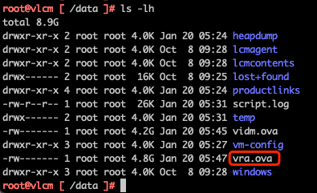
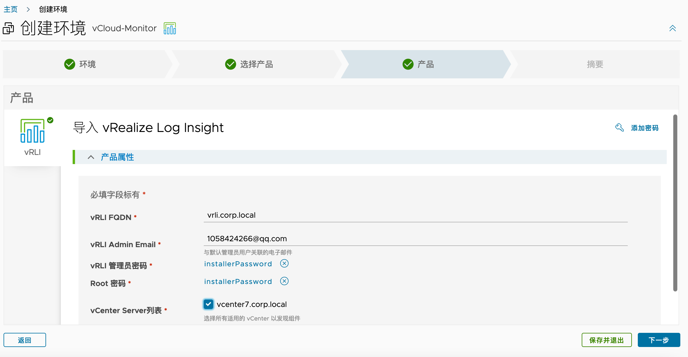
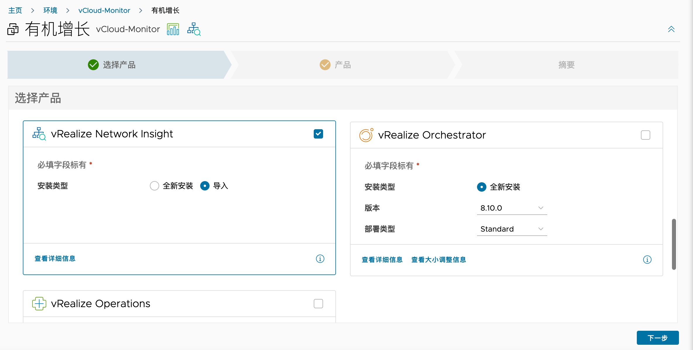
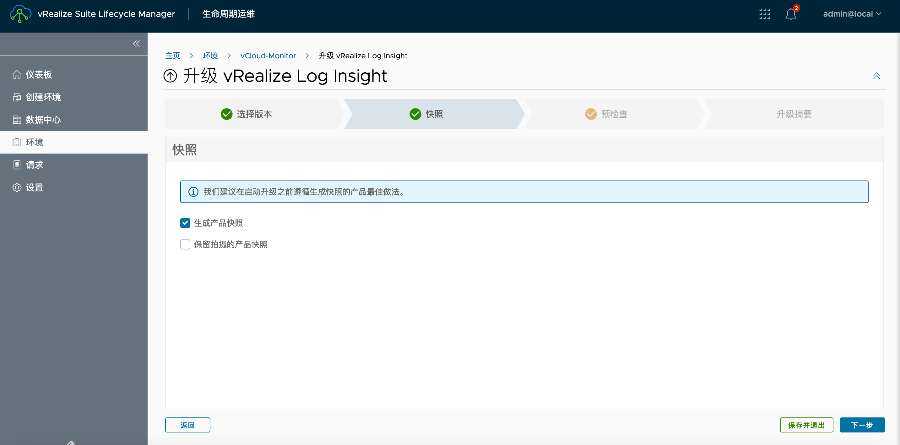
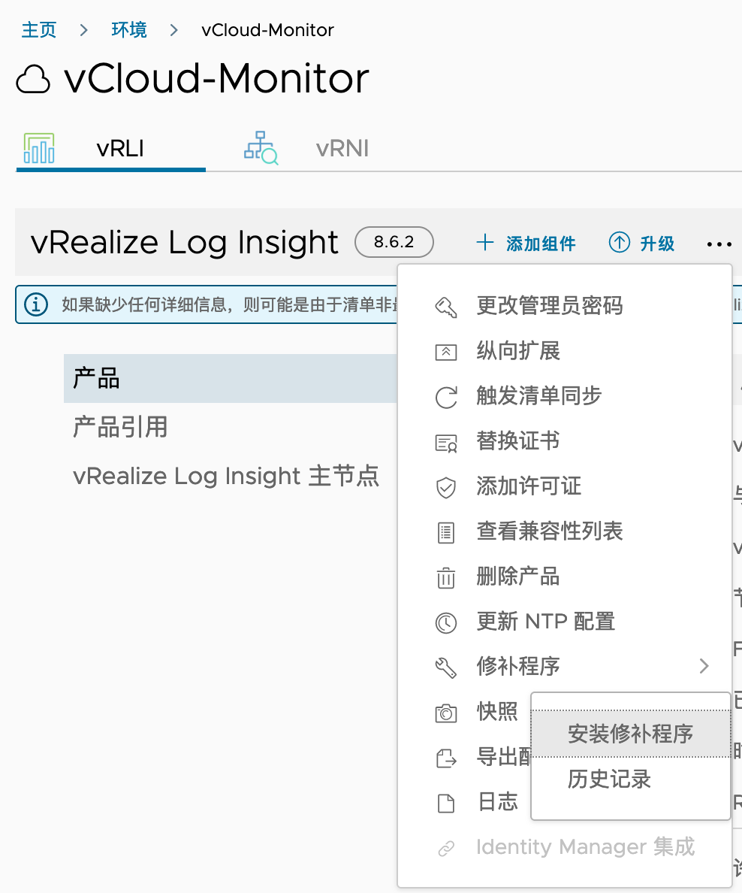

# VMware vLCM 安装及使用

## 目录

{: .no_toc .text-delta }

1. TOC
{:toc}

# 1.  通过 vRealize Easy Installer 快速部署 vLCM

vRealize Life Cycle Management 是用于快速部署、管理其他vRealize产品的生命周期管理工具，比如vRealize Operations、vRealize Automation等。vLCM也支持将已经部署好的vRealize产品导入到其中进行管理。

在下载页面，vLCM有两个Installer，一个是包含vRA和vIDM（Workspace ONE Access）的完整installer，另一个是仅安装vLCM的installer，本文使用前者。

## 1.1. 兼容性

不同的vLCM支持的其他vRealize产品版本不一样，详细可查看兼容性列表：

https://interopmatrix.vmware.com/Interoperability?col=337,&row=35,%26114,%2688,

## 1.2. 部署资源需求

| **资源需求** | **vLCM** | **vIDM** | **vRA-中型**    | **vRA-超大型**  |
| ------------ | -------- | -------- | --------------- | --------------- |
| **数量**     | 1        | 1        | 1或者3          | 1或者3          |
| **磁盘大小** | 78G      | 100G     | 246G            | 246G            |
| **CPU**      | 2        | 8        | 12              | 24              |
| **内存**     | 6        | 16       | 42              | 96              |
| **网络延迟** |          |          | 5ms(集群部署下) | 5ms(集群部署下) |
| **存储延迟** |          |          | 20ms            | 20ms            |

## 1.3. DNS配置

 

 

在安装过程中遇到Failed to send http data错误，这个是ovftools的bug，在本地添加hosts记录后解决：

https://kb.vmware.com/s/article/78541

## 1.4. 部署配置

Installer使用方式和vCenter vcsa appliance一致，将下载好的ISO挂载到Windows机器中，运行Installer：

 

 

Hostname不能使用.corp.local结尾的域名:

 

## 1.5. 安装过程

在第三步时过程比较耗时，原因是Installer在讲vRA的介质传输到vLCM：

日志中可以看到下列项目：

通过ssh登录vlcm，查看/data下介质的大小在不断增加。

等待第三步完成后，会自动部署vIDM虚拟机和vRA虚拟机：

之后系统会提示vLCM已经就绪，可以登录访问。

我们通过admin@local用户访问vLCM，在环境中可以看到正在自动部署vRA：

点开后可以查看到部署详情：

## 1.6. 安装完后检查

部署完成后，会显示下列界面：

在vLCM安装完成后，会自动创建Default-DC，并自动完成vCenter对接：

vIDM和VRA的二进制安装镜像会放在下列位置：

vIDM会被自动部署并完成对接：

在环境中可以查看vIDM的节点情况：

查看vRA的部署情况：

# 2.  导入已有的方案

## 2.1.     导入vRLI

环境中已经手动部署好vRLI和vRNI，我们可以通过vLCM的导入功能将VRLI和VRNI加入到vLCM统一管理。

导入前，需要在Locker>密码中添加vRLI的密码信息：

点击首页的Lifecycle Operations：

创建新的环境，设置名称、默认密码、数据中心：

勾选vRealize Log Insight，选择类型为导入：

接着等待导入完成即可：

 

 

## 2.2.     导入vRNI

设置VRNI Platform IP、管理员账户、密码等信息：

等待任务完成后，可以在环境中看到vRNI：

## 2.3.     升级测试

通过SSH将vRLI升级介质放置在vLCM的/data目录下

 

在vLCM的设置中点击“二进制文件映射”

 

升级完成：

## 2.4.     Patch

在下列位置联机查看更新：

之后在清单中找到需要下载的Patch，点击下载按钮：

等待系统下载结束

 

# 3.  安装 vRops

通过SSH将vRops安装介质放置在vLCM的/data目录下（需要注意每个vLCM支持的版本有限，需要在二进制文件映射中查看支持的版本）

在vLCM的设置中点击“二进制文件映射”：

稍等片刻即可在清单中看到二进制文件：

 

 

 

 

 

