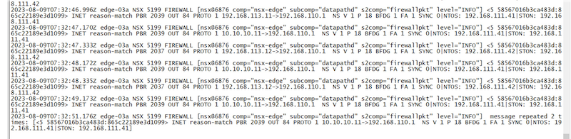

# NSX-T 策略路由

## 目录
{: .no_toc .text-delta }

1. TOC
{:toc}

> NSX 官方文档中提到策略路由功能不受支持，但在 VMC on AWS 环境下似乎此功能是可用的，于是尝试了下使用 API 来实现策略路由的功能，最终测下来，可以借助南北向服务注入来实现，配置灵感来源于 Avi 和 NSX 的集成。
>
> 此文章只是测试记录，如果使用此功能后售后是不支持的。


测试拓扑如下：


## 基础环境准备

此环境准备了一个 T1，关联 Edge 集群，启用 SR，然后创建两个服务接口（连接 VLAN 网络），创建一个 Segment（连接 Overlay 网络）：


## 创建 Service Definition

此步骤创建一个名为 policyroute 的 Service，定义其使用位置、模式及功能等：

```json
# API 路径：
POST https://192.168.110.12/policy/api/v1/enforcement-points/default/service-definitions

# API BODY：
{
     "resource_type":"ServiceDefinition",
     "description":"NS-Service",
     "display_name":"policyroute",
     "tags":[
        {
           "scope":""
        }
     ],
     "attachment_point":[
        "TIER1_LR"
     ],
     "transports":[
        "L3_ROUTED"
     ],
     "functionalities":[
        "NG_FW",
        "TLB",
        "BYOD"
     ],
     "on_failure_policy":"ALLOW",
     "vendor_id": "PolicyRoute",
     "implementations":[
        "NORTH_SOUTH"
     ]
}
```

创建完成后在 UI 可以看到此 Service：


## 创建 Virtual Endpoint

Virtual Endpoint 在此处指 PBR 的下一跳，即路由器的 IP 地址。

此处需要创建两个 Virtual Endpoint，分别为 41 和 42：

```json
# API 路径：
PUT https:// 192.168.110.12/policy/api/v1/infra/tier-1s/T1/locale-services/default/endpoints/virtual-endpoints/router1


# API BODY：
{
  "resource_type": "VirtualEndpoint",
  "display_name": "router1",
  "target_ips": [
    {
     "ip_addresses": [
        "192.168.111.41"
      ],
      "prefix_length": 32
    }
  ],
  "service_names": [
    ”policyroute"
  ]
}
```

```json
# API 路径：
PUT https:// 192.168.110.12/policy/api/v1/infra/tier-1s/T1/locale-services/default/endpoints/virtual-endpoints/router2


# API BODY：
{
  "resource_type": "VirtualEndpoint",
  "display_name": "router2",
  "target_ips": [
    {
     "ip_addresses": [
        "192.168.111.42"
      ],
      "prefix_length": 32
    }
  ],
  "service_names": [
    ”policyroute"
  ]
}
```

## 创建重定向 Policy

此处创建两个重定向策略，通过 NSX 组来匹配源和目标（源、目标、服务后期可以在 UI 进行更改），然后将其发送给 Virtual Endpoint：

```json
# API 路径：
PUT https://192.168.110.12/policy/api/v1/infra/domains/default/redirection-policies/policy1


# API BODY：
{
  "rules": [
    {
        "action": "REDIRECT",
        "resource_type": "RedirectionRule",
        "id": "rule-1",
        "display_name": "rule-1",
        "description": "to router1",
        "sequence_number": 1,
        "sources_excluded": false,
        "destinations_excluded": false,
        "source_groups": [
            "/infra/domains/default/groups/source1"
        ],
        "destination_groups": [
            "/infra/domains/default/groups/destination1"
        ],
        "services": [
            "ANY"
        ],
        "profiles": [
            "ANY"
        ],
        "logged": true,
        "scope": [
            "ANY"
        ],
        "disabled": false,
        "direction": "IN_OUT",
        "ip_protocol": "IPV4_IPV6"
    }
  ],
  "redirect_to": [
    "/infra/tier-1s/T1/locale-services/default/endpoints/virtual-endpoints/router1"
  ],
  "resource_type": "RedirectionPolicy",
  "display_name": "policy1",
  "description": "Test Redirection Policy",
  "parent_path": "/infra/domains/default",
  "marked_for_delete": false,
  "sequence_number": 1,
  "category": "Application",
  "stateful": true,
  "locked": false
}
```

```json
# API 路径：
PUT https://192.168.110.12/policy/api/v1/infra/domains/default/redirection-policies/policy2


# API BODY：
{
  "rules": [
    {
        "action": "REDIRECT",
        "resource_type": "RedirectionRule",
        "id": "rule-2",
        "display_name": "rule-2",
        "description": "to router2",
        "sequence_number": 1,
        "sources_excluded": false,
        "destinations_excluded": false,
        "source_groups": [
            "/infra/domains/default/groups/source2"
        ],
        "destination_groups": [
            "/infra/domains/default/groups/destination2"
        ],
        "services": [
            "ANY"
        ],
        "profiles": [
            "ANY"
        ],
        "logged": true,
        "scope": [
            "ANY"
        ],
        "disabled": false,
        "direction": "IN_OUT",
        "ip_protocol": "IPV4_IPV6"
    }
  ],
  "redirect_to": [
    "/infra/tier-1s/T1/locale-services/default/endpoints/virtual-endpoints/router2"
  ],
  "resource_type": "RedirectionPolicy",
  "display_name": "policy1",
  "description": "Test Redirection Policy",
  "parent_path": "/infra/domains/default",
  "marked_for_delete": false,
  "sequence_number": 1,
  "category": "Application",
  "stateful": true,
  "locked": false
}
```

创建完成后，在 UI 可以看到下列策略（其中 target 看不到，其他基本都可以查看并编辑）：


## 访问测试

预期的访问路径如下：


实测结果如下：

### PC1 到 target 经过 Router1 转发


Router1 上的抓包：


### PC3 到 target 经过 Router1 转发


Router1 上的抓包：


### PC2 到 target 经过 Router2 转发


Router2 上的抓包：


### 在相应 Edge 上的日志

登陆相关 T1 SR 所在的 Edge，查看日志文件` tail -f /var/log/firewallpkt.log`，看到相关的匹配日志：


