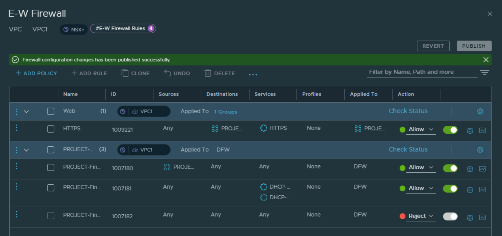

# NSX+

## 目录
{: .no_toc .text-delta }

1. TOC
{:toc}

> 最近 NSX+ 正式发布，这是 NSX SaaS 化的第一个产品，本文记录下 NSX+ 当前的功能

## NSX+ 架构

NSX+ 管理逻辑：在 CSP 中启动 NSX+ 服务，创建 Instance，将 Local DC 注册到其中一个 Instance 中。

## NSX+ 注册工作流

- 在 CSP 中添加 vSphere+ 及 NSX+ 服务并激活
- 在 On-prem 部署 Cloud Gateway，将其注册到 Org
- 注册 vCenter 到 Org（不经过 Cloud Gateway）
- 在 SaaS 端创建 NSX+ Instance
- 在 SaaS 端开启 NSX+ 服务，目前有三种服务：NSX+ Policy Management、NSX+ ATP 和 NSX+ Intelligence
- 经由 Cloud Gateway 将 LM 注册到 SaaS 端（Cloud Gateway 与 LM VIP 通信，推送认证凭据给 LM），LM 版本需要为 4.1.1 及以上，不能开启 Federation 和 NAPP 功能
- Local Manager 主动发起 HTTPS 连接到云端，通过 gRPC 通信

## NSX+ 提供的服务

### NSX+ Policy Management：

通过统一的策略管理体系加快应用在私有云和共有云的部署。

一致性的策略可以保证应用跨云的安全。

统一监控多个站点的 Local Manager、Edge 等组件，查看其可用性、性能，执行软件更新。

### NSX+ Intelligence

现代化的零信任安全体系依赖于跨多云的可视性和威胁分析，NSX+ Intelligence 可以直接深入分析应用的流量，无需对基础架构做变更（借助于 NSX 和 vDS 的数据接口）。

查看应用间的实时互访流量。

推荐安全组和安全策略，加快安全策略的上线。

### NSX+ Network Detection and Response（NDR）：

提供可扩展的 NDR 架构，统一纳管私有云和公有云，查看跨云的访问是否有安全风险。

NDR 可以从众多的数据源收集数据，比如 NSX 分布式 IDPS、DFW，进行数据整合和分析。这样可以避免告警风暴，减少安全运维复杂度。

### NSX+ ALB：

VMware NSX+ Advanced Load Balancer Cloud Service

统一展示应用及其基础架构间的关联关系，云管理员可以在统一的界面中查看应用的健康指数、端到端延迟、流量曲线等指标。

NSX+ ALB 可以免去 Avi Controller 部署、升级、可用性设计、扩展性等诸多问题，让管理员将重心放在应用的部署上，

## NSX+ 价值

### 集中管理

在 SaaS 端集中查看所有站点的网络和安全对象

在 SaaS 端创建 Global 对象，推送到子站点。

### 简化部署

无需在 On-prem 部署 NAPP，这些服务均会运行在 SaaS 端

### 多租户和 VPC

从 NSX 4.0 开始支持多租户和 VPC 功能（4.1.1），可以很好满足不同业务部门之间的隔离以及管理，同时 VPC 架构也可以简化网络和安全的管理。

## 管理界面

### *站点管理*

### *订阅管理（服务管理）*

## Local 对象管理

### *T0 管理（类似于 NSX Federation 的管理）*

### *防火墙策略管理*

## 全局对象管理

### *全局对象的创建*

### *创建全局项目*

给 Project 关联 External IP Block：

### Project 用户创建 VPC

接上一步，在完成 Project 的创建和授权后，授权用户可以接着创建 VPC 网络：

VPC 授权：

VPC 用户为 VPC 添加 Public 网络（自动从 VPC 的 External Network 中分配）：

VPC 东西向防火墙：

### 跨 Project 的组共享

创建 Shared Group，共享给其他所有项目来调用（基础架构资源）：

## 参考资料

[https://www.vmware.com/content/dam/digitalmarketing/vmware/en/pdf/docs/vmw-nsx-plus-solution-overview.pdf](https://www.vmware.com/content/dam/digitalmarketing/vmware/en/pdf/docs/vmw-nsx-plus-solution-overview.pdf)

