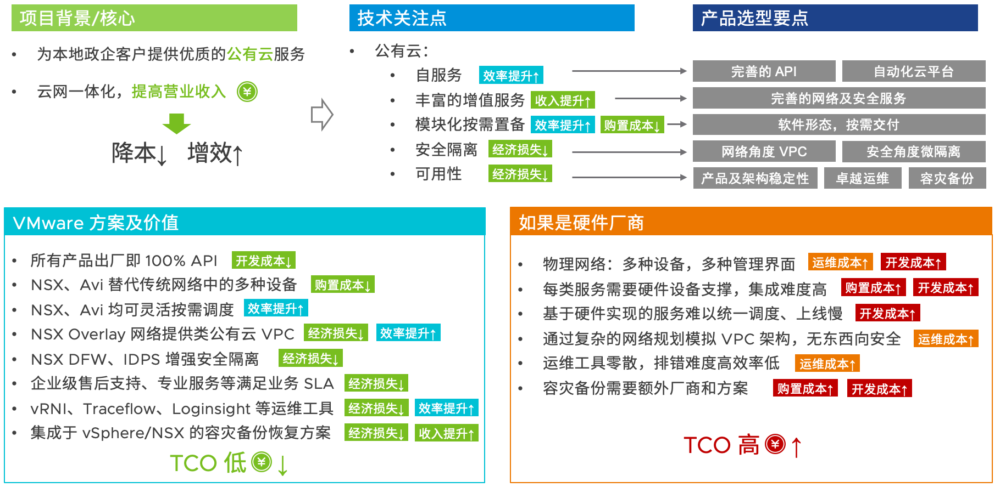

# 为什么公有云要使用 NSX-T？

## 目录
{: .no_toc .text-delta }

1. TOC
{:toc}

> 最近整理一个 NSX 案例的一些思考

## TL;DR

## 项目背景

XX 用户是某地区的网络供应商，随着近年来云计算的发展，云网融合已经成为很多网络供应商的重要战略，这样可以为其用户提供更丰富的服务，提升整体收入。

云网融合中云指的是云计算，而网指的是通讯网。按照传统，云计算通常由 BAT 等大厂来提供，网则由三大运营商提供。

云网融合中第一个核心是将传统的通讯网络做改造，进行云化部署：传统网络由很多专有硬件设备和方案组成，云化后则可以以虚拟机或者容器等形式运行在标准的 X86 架构下，摆脱了硬件的限制，提升整体硬件资源使用率，降低硬件成本。云化还有个好处就是灵活，可以比较容易的通过自动化平台按需置备，后期的升级也会相对容易一些。

云网融合中第二个核心是提供配套的云计算服务：现在几乎所有企业都会有自己的 IT 平台，小的可能有自己的主页，大的会有自己开发的各类系统，这类系统最终都需要服务器来承载，对于这些企业来说只有两种选择，自建或者使用公有云，而无论哪种都需要网络。所以对于运营商来说，如果能为客户一体化提供网络及运算服务，不但可以更好服务于客户，同时也能提升自己的营业收入，两全其美。

但现实是，各类大小厂都在做公有云，在这片红海市场中不见得能杀出一片天地，做云最重要的是服务，而服务就需要大量的开发来实现，这无疑会增大平台建设成本，如果销售不佳则可能反倒亏钱。

如果要在这片红海市场中生存，就得从成本和销售两方面综合考虑，最终会发现有了下列组合：

- 尽可能采用商业化的产品来”拼凑“成平台，有少量的定制化开发；
- 做更细分的云，比如行业云、专有云、边缘云，这类云相比公有云更加”专注“，能更好地服务于客户，可能单个云的规模不如任何一个公有云大，但服务可以好于公有云。

XX 用户基本走的就是以上路线，该项目做的是分布式政企云，分布式是指将云建在省内的各个地市，为企业就近提供服务，政企则是指服务对象主要为政企用户。

## 项目核心

如上面的背景介绍，对于 XX 来说，平台建设最关键的点就是能挣钱，再细化一下就是提升收入，降低成本。

**如何提升收入？**

- 提升服务质量：前面提到的做更加”专注“的云就属于这一类方式，通过边缘云提供就近服务也是一种方式；
- 丰富服务功能：基本的运算服务对于公有云来说利润并不高，一种提升利润的方式就是提供附加的增值服务，增值服务除了可能提升利润外，也可以有别于别家的产品，产生差异化优势；
- 降低损失：为企业提供服务通常会签署 SLA，不满足 SLA 则可能会有经济赔偿，所以平台建设时要考虑这部分的风险，构建稳固的平台。

**如何降低成本？**

- 前面提到的尽可能采用商业化产品就是其中一种，减少平台的研发不仅可以极大降低人力成本，也可以避免未来因技术路线错误带来的巨大损失；
- 减少固定资产投入：比如同等功能下，减少硬件设备的采购，使用更为灵活的软件来替代。硬件资产无论是采购还是部署时间成本均比较高，如果能采用标准的硬件+软件来实现，则可以轻量化平台建设，减少投入；
- 提升资源使用率：如果在同等的硬件环境下，减少管理组件的开销，同时提升工作负载密度，则可以节省一定的硬件成本；
- 使用标准的硬件架构：标准的硬件成本始终低于专有硬件，所以在硬件设备的选项上应当使用通用的技术和方案，避免单一厂商绑定；

- 降低人力成本：对于很多企业来说，减少人员是最简单直接的降本方式，但减少人员可能造成运维质量下降，进而影响 SLA。针对这一问题，企业唯一能做的就是用有限的人做更多的事，在产品选项上选用更加易使用、易运维的产品，尽量简化和标准化工作流，通过自动化等工具来提升效率，节省宝贵的人力；

- 提升平台的交付效率和运维效率（也就是现在很多企业提的**增效**），这类似于之前流水线之于工业化，效率的提升可以降低成本。

有了以上目标之后，接着我们去看如何实现。

## 技术选项

公有云自身的属性已经决定了它在技术选型时的偏好性：

- 需要完善的 API 来实现自动化，如果采用的商业化产品原生就提供所有功能的 API，那无疑可以降低开发成本；
- 功能足够丰富：围绕计算资源，提供更多的增值功能，例如微隔离、IDS、IPS、WAF、容灾备份等；
- 模块化：按需启用，只有客户购买后才进行置备，减少资源浪费；
- 隔离：隔离特性是公有云的基本要求，毕竟一个平台会为多个租户同时提供服务。隔离有两个层面，一个是网络层面的隔离，不同租户有自己的 VPC，在 VPC 中又有 Private 和 Public 等网络类型。隔离的另一个层面是防火墙微隔离，在网络隔离的基础上进一步限制访问，避免横向扫描和渗透；
- 可用性：也是公有云的基本要求，底层架构要足够稳定，有多种高可用机制；要有成熟和标准的运维规范，避免运维带来的服务降级；要有数据备份机制，应对逻辑故障、人为操作、自然灾害等多类风险。

## 方案

谈完上面的内容后，会发现 VMware 纯软的方案是建设这类平台的不二之选：

- 产品具备完善的 API，可以快速构建出可用的平台，开发对接也比较容易；
- 功能足够丰富：提供从 IaaS 到 PaaS 的多类产品，其中 NSX+Avi 可以替代传统网络中的各种硬件设备（这里仅指面向 VM 的服务，整个云底座还是会有硬件交换机的支撑）；
- 模块化：NSX 及 Avi 的很多功能都是按需快速开启，开启对已有服务也不会有影响；
- 类公有云隔离：NSX 在很早前就具备完善的东西向安全功能，包括分布式防火墙、分布式 IDS/IPS、无代理防病毒、NDR 等。网络层面则非常灵活，可以按照平台设计实现任意架构的网络，包括类似公有云的 VPC 架构；
- 产品稳定性有保障，商业支持完善；
- 资源使用率比较高：vSphere 虚拟化本身相比其他虚拟化就可以有较高的超分比，也就意味着可以在同等数量的硬件设备上运行更多的虚拟机，减少硬件成本投入。NSX 内核防火墙及 IDPS 与传统基于 VM 的安全保护方案相比，也可以减少宿主机的 CPU 和内存开销，进一步提升虚拟机部署密度，当前最新的 NSX DPU 方案甚至可以做到 0 占用 CPU 和内存，最大化提升虚拟机部署密度；
- 丰富的运维工具集：NSX 自身提供很多运维工具（例如 vRNI），可以用于监控和问题定位，也可以使用已有的协议和企业已有监控工具集成。除了运维之外，一些监控特性还可以包装成增值服务，比如资源使用情况报告等，这部分相比传统公有云会有很大的定制空间，可展示的数据指标也更丰富；
- 完善的容灾方案：SRM+vSphere Replication+NSX 组合可以轻松实现跨中心的容灾，满足各类应用的容灾需求（我们站在 VM 层面，并不关心业务逻辑），在容灾这一基本功能之上，也支持部分业务容灾，业务灾备恢复模拟等功能。

## What if？

同样的需求，如果使用硬件的方案来实现，会发现将是一场灾难，而且随着产品更新迭代未来建设时很难继承。

- 开发成本高：各类设备有自己的对接方式，对接成本会增高，而且随着设备更替，有可能原来的对接方式无法使用；
- 运维成本高：各类设备有自己的运维界面，也可能由不同的专业人士来运维，整体运维成本比较高。在设备到一定年限后更新成本也比较高；
- 固定资产投入高：为了满足潜在的客户需求（规模），可能需要在平台建设初期就购买大量硬件，投资风险较大；
- 灵活性差：和开发成本类似，硬件的上线通常以天为单位，而且很可能在上线过程中影响现有环境，造成事故（别问我为什么知道）；
- 服务少，抑或资源浪费：平台的功能需要依赖相应的设备来实现，如果初期为了节省成本采购比较基础的硬件，则只能提供较少的增值服务；如果初期采购了各种功能的硬件，采购成本会上升，而且上架后也会消耗电力等，存在空置成本。

所以，最终看下来，还是找个纯软件的方案来实现公有云更加合适。
