# NSX+

## 目录
{: .no_toc .text-delta }

1. TOC
{:toc}

> 随着 NSX 4.1.1 版本的发布，NSX 的多租户功能趋于完善，在 4.1.1 版本中新增 VPC 功能，此功能的工作逻辑类似于公有云的 VPC，可以将网络资源自助化，用户在使用网络时按照标准的网络模型来使用，而无需关心底层的实现。
>
> 本文记录下 VPC 底层的工作原理

## Before VPC

在 NSX 4.1.0 之前，NSX 更像是一个通过软件定义的网络设备，提供非常丰富的网络功能，但和传统设备一样，二层、三层网络的配置都需要用户来定义，用户可以按照自己的需求来构建任意的组网。

但随着云网络发展逐渐成熟，多租户、自服务这两个关键词成为云网络必须具备的两项功能，在此之前，NSX 可以实现多租户，但更多需要管理员来定义多组 T1/T0/T0-VRF 来实现，需要搭配云管平台来实现自服务。NSX 4.1.0 及 4.1.1 提供的“项目”及“VPC”功能就是为了简化多租户管理，实现网络资源的自服务。

## NSX 的 VPC 如何工作？

在 NSX 中，VPC 最终的表现对象为 T1。

每个 VPC 可以关联一个 Public IP Block，如果 VPC 内的业务需要和外部具备网络连接，则需要使用 Public IP。

每个 VPC 内可以有多个子网（subnet），子网的最终形式为 Segment，连接到 T1。

默认 VPC 到外部的访问会被放行，而外部无法访问到 VPC 的服务（相关策略在东西向防火墙上）。

## NSX 多租户的管理逻辑

在 NSX 多租户模式下，将会有三个重要的角色：

- NSX Admin：NSX 超级管理员，可以管理底层网络，包括 T0 及对外地址分配等；也可以创建租户（项目），分配用户权限；

- Project Admin：项目管理员，管理项目内的所有资源，包括 T1、VPC、专用网段、分段配置文件；可以调用 NSX Admin 分配的对外地址段；

- VPC Admin：VPC 管理员，仅能在所属 VPC 内添加专用网段、添加子网（Segment）、设置 NAT、设置防火墙规则

### NSX Admin

- 安装 NSX，完成主机准备及 Edge 节点的部署
- 置备 T0，完成 NSX 和物理网络的对接，配置好动态路由协议及路由通告
- 置备 Public IP Block，此 IP Block 表示在此范围内的 IP 可路由，能被外部设备访问到
- 添加项目（租户），并为项目分配项目管理员（Project Admin）或者 VPC 管理员

### Project Admin

- 置备 T1 及 Segment（传统方式）
- 置备 VPC 及 Subnet（新的 VPC 模式）
- 设置 Project 可使用的 Public IP Block
- 设置 NAT、防火墙规则等
- 添加专有网络（仅项目内可访问）
- 添加隔离网络（仅二层内可访问，无三层连接）
- 为 VPC 设置分段配置文件

### VPC Admin

- 调用 Public IP Block 以自动化分配公共网络的 Subnet
- 添加专有网络（仅项目内可访问）
- 添加隔离网络（仅二层内可访问，无三层连接）
- 设置 NAT、防火墙规则等

## VPC 网络类型

三种网络类型对比

| 功能项             | 公共网络（Public）                                     | 专用网络（Private）                                     | 隔离网络（Isolated）       |
| ------------------ | ------------------------------------------------------ | ------------------------------------------------------- | -------------------------- |
| 谁来创建           | NSX 管理员来定义 IP Block                              | Project 管理员来定义 IP Block                           | VPC 及更高角色来定义       |
| 如何调用           | Project 管理员创建 VPC，关联 IP Block                  | Project 管理员创建 VPC，关联 IP Block                   | 在 VPC 中直接添加 Subnet   |
| 如何分配           | VPC 管理员创建 Subnet，自动从 IP Block 获取地址        | VPC 管理员创建 Subnet，自动从 IP Block 获取地址         | 在 VPC 中直接添加 Subnet   |
| 使用限制           | 每个 VPC 仅能有一个 Public IP Block，可以有多个 Subnet | 每个 VPC 可以有多个 Private IP Block，可以有多个 Subnet | 每个 VPC 可以有多个 Subnet |
| 是否连接到T1       | 是                                                     | 是                                                      | 否                         |
| 是否路由通告       | 是                                                     | 否（有路由过滤）                                        | N/A                        |
| 是否有 SNAT        | 否                                                     | 是                                                      | N/A                        |
| 是否可以访问到外部 | 是                                                     | 是                                                      | 否                         |
| 是否可被外部访问到 | 是                                                     | 否（需要手动添加 DNAT 规则才行）                        | 否             

*什么是 Subnet 子网？*：子网最终表现形式是 Segment，用户可以根据需求选择子网的可用 IP 大小（16、32、64、128、256），NSX 会根据用户选择自动从 IP Block 中分配 IP 地址和掩码，关联给 Segment。VM 直接关联到 Segment 端口组即可使用。

- Public 网络：
  - 需要由 NSX 管理员来创建 IP Block 
  - VPC 关联上述创建的 IP Block，每个 VPC 仅能关联一个
  - VPC 下的 Subnet 自动从上述关联的 IP Block 获取更小的 CIDR
  - 所有 Public 网络会连接到 T1，并将其 CIDR 通告给外部，外部可以直接访问到
  - T1 上会有 Public Subnet 的通告过滤规则（仅放行 Public 网络）
- Private 网络
  - 由 Project 管理员来创建，一个 Project 可以有多个 IP Block
  - 仅 Project 内可使用，多个 Project 间可以复用相同的地址段
  - 一个 VPC 可以关联多个网络，Subnet 自动从所有 IP Block 中寻找空闲的使用
  - Private 网络会连接到 T1，但其 CIDR 不会通告给外部。
  - Private CIDR 出向会经过 SNAT，因此可以访问到外部，但不能被外部主动访问到
- Isolated 网络
  - 由 VPC 管理员来创建，一个 VPC 可以有多个网段
  - Isolated 网络不会连接到任何 T1，仅有二层连接功能

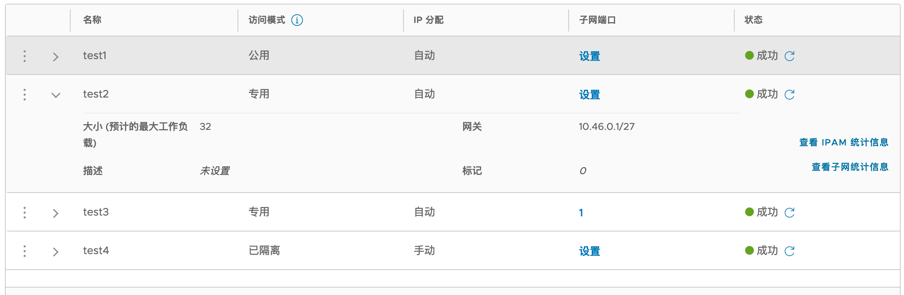

## VPC 下默认的防火墙规则

东西向防火墙规则，所有 VPC 网络到外部均可访问

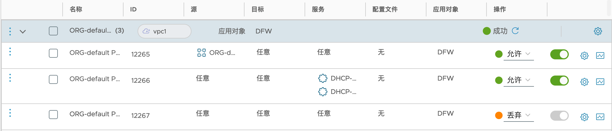

南北向防火墙规则，默认全放行

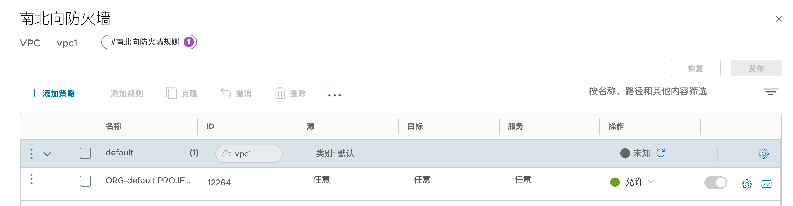

## VPC 下 VM 的防火墙规则

在传统的 NSX 模式下，如果 DFW 规则应用对象是 DFW，则所有 VM 都会继承此规则，在 VPC 模式下，如果在默认的项目中创建全局规则，则 VPC 下的 VM 也会继承此规则。

基础架构类别的规则：

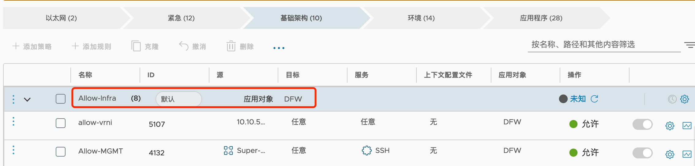

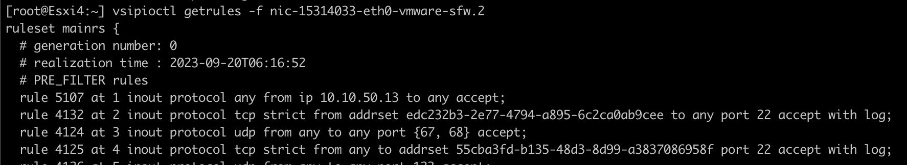

应用程序类别的规则：

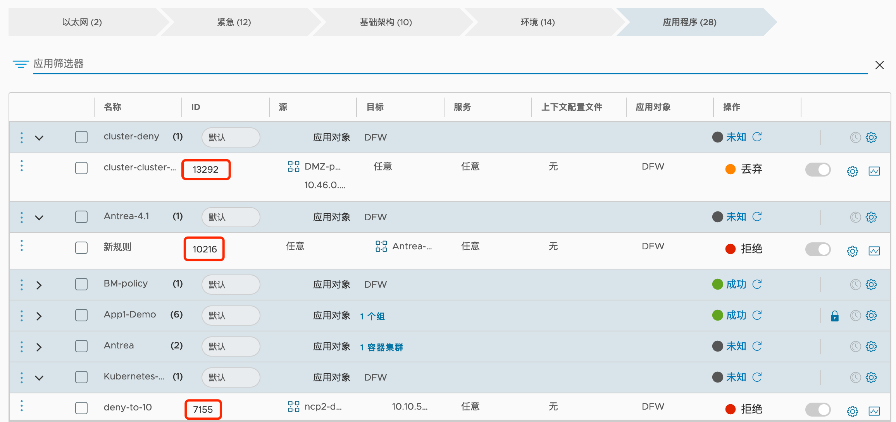

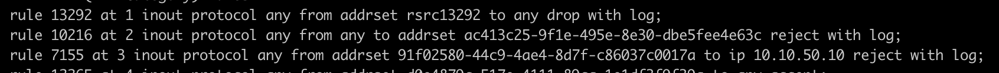

**VPC 自己的规则在全局规则中不可见，仅可在 VPC 的防火墙规则中查看**：

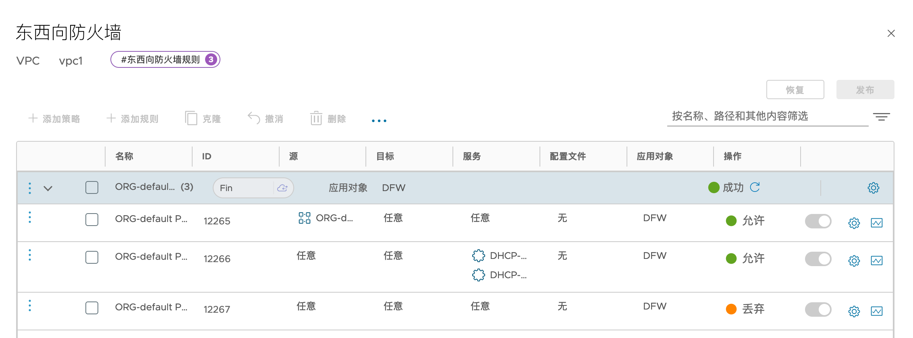

项目的规则以及 NSX 末尾默认的规则：

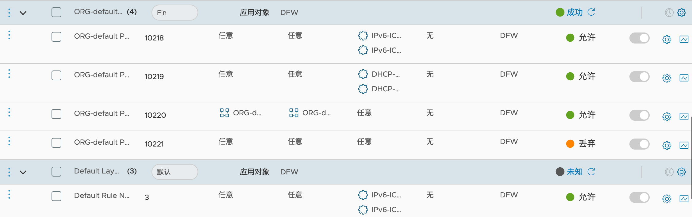

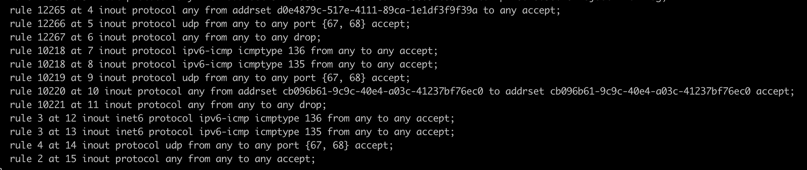

针对其他非此项目的 VM，看不到任何和此相关相关的规则：

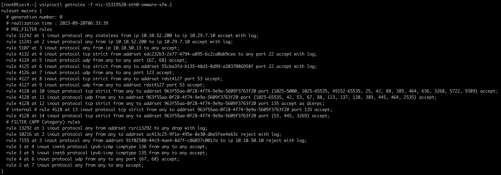

## VPC 下 NAT 规则

Private/Isolated 的网段会被配置 SNAT 规则，10.45.0.32 自动从 Public IP Block 中获取：

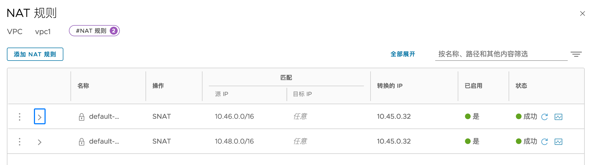

## Avi 与 NSX-T Cloud 集成

从 Avi 30.1.1 开始，也支持与 NSX-T 集成，并和 VPC 特性一一对应。

相关逻辑关系如下：

1. 在 Avi 上配置 NSX 对接；
2. 在 NSX 中为 VPC 开启 Avi 的集成，并为 VPC 添加 subnet；
3. Avi 会自动同步 NSX VPC：
   1. 每个 NSX VPC 在 Avi 中会有相应的 Tenant；
   2. Avi 自动针对每个 NSX VPC 创建 VRF；
   3. Avi 自动同步 NSX VPC 中的的 subnet（包含 Public 和 Private）；
   4. 针对每个 VPC，NSX 会自动为 Avi 分配一个 data nic subnet，这个 subnet 自动从 Private IP Block 中获取。
4. 在 Avi 中手动创建到 Public 和 Private 的 Subnet 的默认路由（0.0.0.0/0 到 Avi 自动创建的 subnet 的网关）；
5. 在 Avi 中创建 VS，VS 的 VIP 需要属于 Private subnet 或者 Public subnet，和 VPC 的 subnet 一一对应；
6. 其余逻辑和 Avi NSX-T Cloud 对应，在 T1 上会有到 VIP/32 的静态路由指向 SE 的 data nic IP。

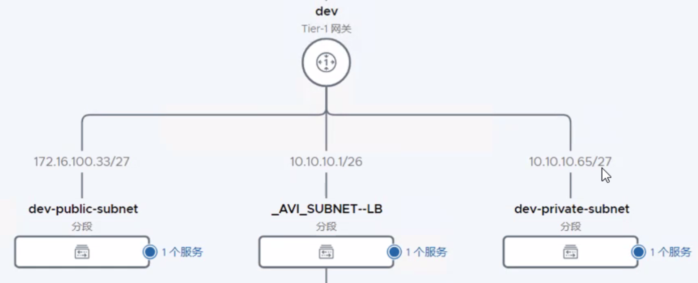
