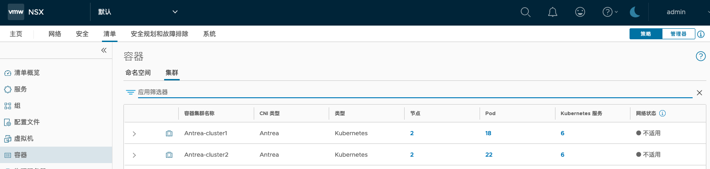
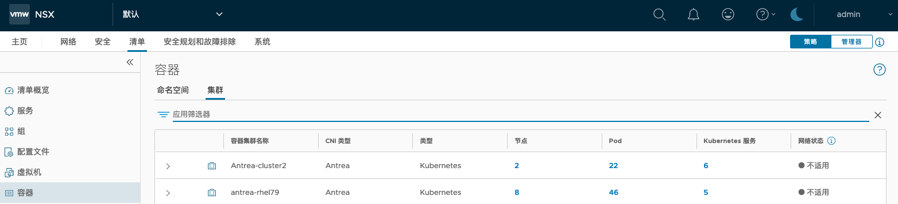

# 从 NSX-T 中强制删除 Antrea 对接

## 目录
{: .no_toc .text-delta }

1. TOC
{:toc}

本文讲下如何进行 Antrea 商业版 + NSX-T 集成的卸载，参考文档：

[https://docs.vmware.com/en/VMware-Container-Networking-with-Antrea/1.7.0/rn/vmware-container-networking-with-antrea-170-release-notes/index.html](https://docs.vmware.com/en/VMware-Container-Networking-with-Antrea/1.7.0/rn/vmware-container-networking-with-antrea-170-release-notes/index.html)


## 正常的操作

如果 Antrea 集群运行正常，此时需要进行卸载操作，只需要登陆目标集群，在部署 antrea-Interworking 的目录下可以看到 `deregisterjob.yaml` 和 `inventorycleanup.yaml` 这两个文件，分别应用，清理本地集群的资源和对接：

```shell
cd antrea-interworking-0.9.0/
[root@master01 antrea-interworking-0.9.0]# ls
deregisterjob.yaml
inventorycleanup.yaml
```


## 强制的操作

如果出于各种原因，导致 nsx 对接没能正确清理，则需要找一个可运行 antrea-interworking 容器的环境，进入到容器内通过 antreansxctl 命令进行清理：

```shell
docker run -it projects.registry.vmware.com/antreainterworking/interworking-debian:0.9.0 bash

root@6890c61a223b:/# antreansxctl --help
antrea-nsx command line utility - version 0.9.0-21108758

# 运行下列集群获取已对接集群信息（和 NSX UI 看到的一致）
root@6890c61a223b:/# antreansxctl cluster-list --nsx-ip=10.10.50.111 --user admin --password 'VMware1!VMware1!'

----- Cluster Control Plane Resources -----
  CLUSTER-NAME                           CLUSTER-ID
Antrea-cluster1                      cec9e900-f89f-4e49-97b7-c16bfb0c3ab8
Antrea-cluster2                      91d93ba9-f458-4df8-85a6-e708cf034635
antrea-rhel79                        f29513ec-5903-4b7c-a281-b105fc12dbab
antrea-site2                         0cf0cfd0-9e4f-48e3-8856-cd19b26582f3

----- Antrea Container Cluster Inventory Resources ----
  CLUSTER-NAME                        CLUSTER-ID
Antrea-cluster1                      cec9e900-f89f-4e49-97b7-c16bfb0c3ab8
Antrea-cluster2                      91d93ba9-f458-4df8-85a6-e708cf034635
antrea-rhel79                        f29513ec-5903-4b7c-a281-b105fc12dbab
antrea-site2                         0cf0cfd0-9e4f-48e3-8856-cd19b26582f3

# 运行下列命令清除对接
antreansxctl --nsx-ip=10.10.50.111 --user admin --password 'VMware1!VMware1!' cluster-cleanup --cluster-name Antrea-cluster1
Do you confirm to delete the cluster(Antrea-cluster1,):
input 'yes' if you confirm to delete the cluster:yes
I1110 06:22:10.225487      26 main.go:171] "Clean up cluster" User="admin" ="VMware1!VMware1!" cert="" key="" ClusterName="Antrea-cluster1" clusterID=""

----- Cluster Control Plane Resources Deleted-----
  CLUSTER-NAME                           CLUSTER-ID
Antrea-cluster1                      cec9e900-f89f-4e49-97b7-c16bfb0c3ab8
I1110 06:22:10.430774      26 main.go:192] "Deleted Cluster Control Plane Resource" ClusterName="Antrea-cluster1" ClusterID="cec9e900-f89f-4e49-97b7-c16bfb0c3ab8"

----- Antrea Container Cluster Inventory Resources Deleted----
  CLUSTER-NAME                        CLUSTER-ID
I1110 06:22:10.466238      26 main.go:216] "Successfully clean up cluster" Name="Antrea-cluster1" ID=""
```

清理前：



清理完成后 Antrea-cluster1 在 NSX 清单中消失：



