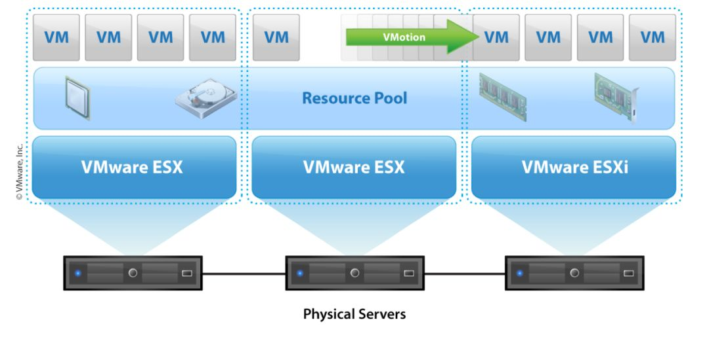
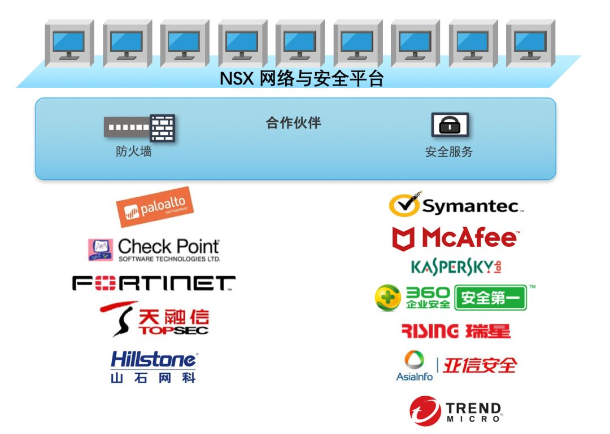
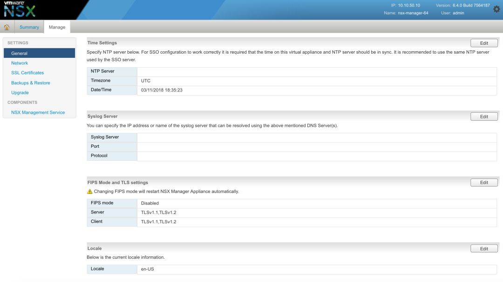
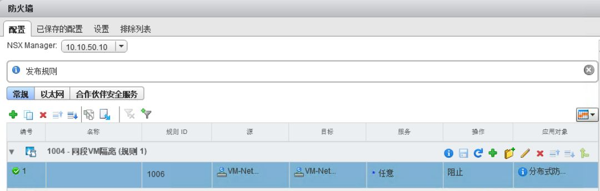
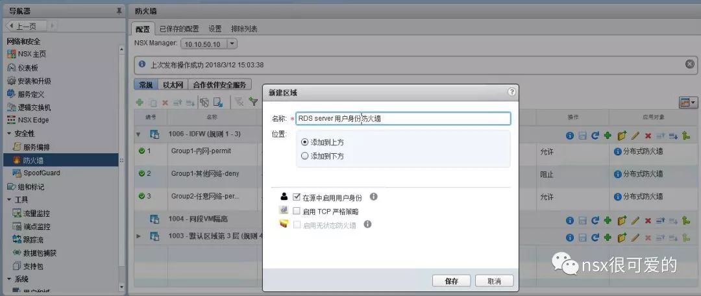
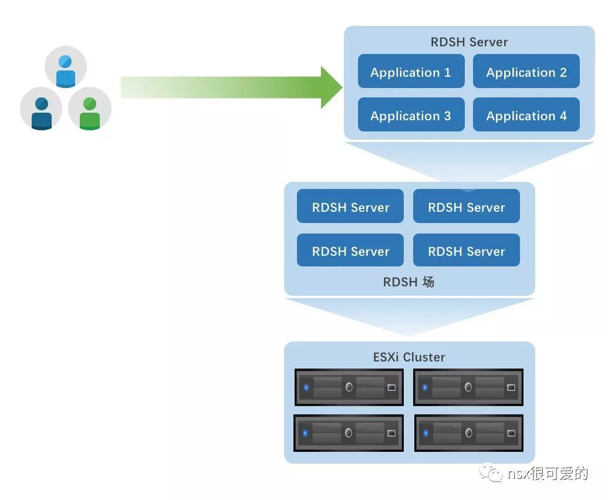
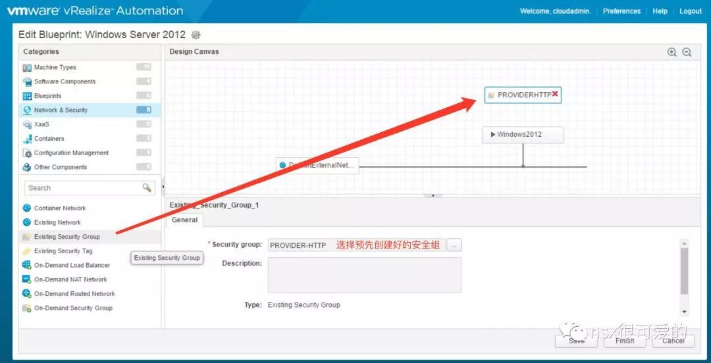
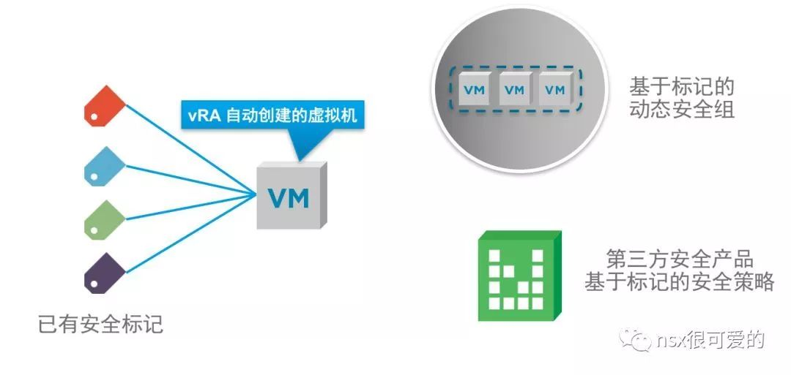

# NSX-v 安全

## 目录
{: .no_toc .text-delta }

1. TOC
{:toc}

# 概要

本文记录“nsx很可爱的”公众号从2018年5月到2018年底的一系列文章，分背景、使用和场景三大块，背景、场景偏向解决方案角度，中间也有大量 VMware 其他产品的介绍。

## NSX 介绍——系统工程师篇

从第一次接触 NSX 到现在已经有三年时间。还记得我第一次自觉学习 NSX 的时候，竟然翻到了之前一年听 NSX 讲堂的笔记，那些内容足够深、足够细，然而我都不记得了，原因就是在于没有体系的从基础来了解这个产品。不了解一个产品的背景、设计思路和基本知识，单纯了解产品的卖点和知识点是做不好产品的。因此我觉得有必要来一个**“从入门到精通”**。今天献上第一篇，简单介绍下 NSX。

首先，假定我的读者有两种类型，一种是做过服务器虚拟化的系统工程师，知道 vSphere 是什么；另一种，是网络工程师，知道路由、交换、防火墙这些东西。如果是第一种，接着看就行，如果是第二种，可以补充看看下一期的“网工篇”- NSX 从入门到精通（2）：NSX 介绍-网络工程师篇，里面会有虚拟化网络的一些介绍。

如果你自己装过 vSphere，应该了解过 vSphere 的虚拟交换机，也可能接触过物理交换机。在虚拟化中，无论是虚拟交换机还是物理交换机，其作用几乎只是做了“通道”，此通道从虚拟机的虚拟网卡-->vSphere 主机的虚拟交换机-->主机的物理网卡-->物理交换机-->核心交换机-->客户的其他网络。vSphere vSwitch 配置非常简单，两三步就可以创建好，对应的物理网络要求也很简单，一个服务器多个网卡统统接到交换机，所有端口配置为 Trunk 即可。

我们再看看真实世界的物理交换机，有哪些常见功能：

**① 交换：**同网段数据包的转发。

图 1

**② 生成树：**受限于以太网的设计“缺陷”。如果两个交换机 A 和 B，中间接两条链路，配置一模一样，A 上接了一个客户端 C，C 发了一个广播包给 A，A 会将此报文发给 B，此时 B 的操作是在其所有其他端口上再转发此报文，也就是数据包又会发回给 A。这个过程叫环路。生成树是来避免交换环路的，其工作原理是屏蔽掉多余的链路，让一个报文只有一条路可以走。

图 2

**③ 端口聚合：**把两个物理接口组成一个逻辑的接口去用，逻辑接口带宽是物理接口速率之和。这样在某些时候可以避免使用生成树。

端口聚合又分静态聚合和动态聚合(LACP)，每种聚合都有流量负载的算法，每个厂商对静态聚合和动态聚合的支持不一定统一。

图 3

**④** **VLAN：**VLAN 相当于把一个物理交换机拆成了多个交换机使用。如果没有 VLAN，假如 A 和 B 两个团队共用一个交换机，那么 A 发的广播包 B 可以收到，B 发的 A 也可以收到，这样很不安全。VLAN 就可以将 A 与 B 简单隔离起来。VLAN 是需要每个设备都配置的。

图 4

**⑤ 设备堆叠：**为了简化管理，可以将多个交换机逻辑堆叠在一起，相当于将两个独立的大脑合并成为一个大脑，这样管理方便，两台交换机之间也不用担心环路问题。比较重要的是，做了堆叠，两两设备互联时架构可以变得很简单。

图 5

以上是交换机必备的基础技能，有没有觉得已经挺复杂了，网络工程师很多时候面对的就是这些，这还不算安全。

**⑥** **MAC 地址绑定（Port Security）：**目的是将物理端口和所接终端的 MAC 地址绑定起来，防止别人私接设备。但是破解此问题很简单，使用工具改下私接 PC 的 MAC 就可以正常入网了。

图 6

**⑦** **SpoofGuard ：**利用 DHCP + ARP inspection 等手段，实现 IP 地址到 MAC 地址的绑定。主要是防止用户私改 IP。

**⑧** **ACL：**访问控制策略，主要用于控制接口上能通讯的报文，17 年勒索软件爆发，很多企业都在交换机所有接用户的接口上加了 ACL 来封堵某端口。

**⑨** **Private VLAN(或者 Protected Port)：**可以让同 VLAN 的多个终端之间不能通，但是到外部网络通，做到横向隔离

**其他高级功能：**

**⑩** **Storm Control：**用于限制接口上的广播包，组播包，通常可以用来防止恶意的广播报文攻击。

**⑪** **SPAN：**将一个端口的流量镜像到流量监控设备，用于分析流量

**以上大概是所有物理交换机常见的功能，实际在虚拟化中，****vSwitch** **能实现的有：****1、3、4、9、11**

**不需要的有：****2、5、6**

**需要但没有的：****7、8、10**

实际上，7、8、10 都是与安全相关的需求，在有了虚拟化之后，一台服务器的一个接口会承载很多虚拟机，因此外部交换机的安全特性不能用于虚拟化，这块一直是空白！

现在 NSX 就可以解决以上提到的遗留问题，而且是以一种优雅的方式：

对于 8，NSX 的微分段功能就能做到任意虚拟机到任意位置的访问控制。策略配置就像下图一样简单：

图 7

而如果要用交换机做这样的配置，需要在每个接口下写至少这么多命令：

图 8

对于 7，NSX 自带 Spoofguard 功能，不需要借助任何其他功能，直接开启绑定就行。

图 9

对于 10，NSX 什么都不用配，装上就可以做到广播抑制。

基本上，NSX 的基本安全功能就是如此简单，在这个基础上，可以延展出很多场景，和其他很多产品结合，这个我们以后再说。

## NSX 介绍——网络工程师篇

接上一篇 [NSX 从入门到精通（1）：NSX 介绍-系统工程师篇](http://mp.weixin.qq.com/s?__biz=MjM5MDcyNjM4MQ==&mid=2650595503&idx=1&sn=eb3ad961e472610d0c711e9d07a896a4&chksm=be48212d893fa83b67ad125a305941fd43c501c4823461ee42468ee8027f0dde601a69f2de91&scene=21#wechat_redirect)，此章节主要补充介绍下 vSphere。通过上一篇大家可能发现，NSX 更偏向于一个网络产品，如果要做复杂的环境，少不了网络工程师的参与。这里提一下，现在计算机行业的发展趋势是传统的知识变得越来越交叉、对技术人员的综合要求越来越高。如果做数据中心的业务，关于数据中心的三大件：计算、网络、存储都需要了解，并且更进一步，需要了解基础设施的架构如何更好的支持复杂多变的应用环境。在设计数据中心、容灾等复杂架构时，需要通盘掌握计算、网络和存储的组成和组合。如果你只会登录设备敲命令是远远不够的，云计算的环境需要传统的工程师转变为一个“架构师”。

作为网络工程师，应该清楚 Access 口和 Trunk 口的区别，简单说 Access 口接终端、Trunk 口接交换机。面对于服务器，很多人第一直觉是配成 Access 口，然而，在虚拟化的世界里，是不推荐的配置，我们就从这个网工常见的问题谈谈虚拟化网络。

首先，什么是虚拟化？通常我们提到的虚拟化是指计算虚拟化，计算指的就是计算机，这个计算机可以是我们的笔记本，或者机房的 X86 服务器。

在虚拟化之前，一个计算机上面只能运行一个操作系统，一个操作系统上运行很多应用，这是大部分办公计算机的场景，在商业服务器场景中，这样的配置有以下一些问题：

  ① 大家都知道电脑软件装多了软件，电脑可能会变卡，问题就是运行的程序太多，资源争夺；

  ② 很多应用程序共享一个操作系统，应用之间没有任何隔离手段。举个简单的例子，你在电脑里装了网银客户端，我装了一个网络抓包工具，那这时候我可以通过我的抓包工具看到你的任何报文；

  ③ 操作系统本身会存在漏洞，其他应用也会有漏洞，抛开应用间隔离不说，一旦操作系统中毒，所有应用不可幸免；

  ④ 解决 1、2、3 很简单，每个应用用一个操作系统，每个操作系统用一个硬件。但对于企业，硬件扩容远跟不上软件的扩展要求，成本、空间上也不允许每个应用用一套独立的硬件；

  ⑤ 即使解决了 1、2、3、4，如果硬件坏了怎么办？硬件故障上面运行的应用必然会宕机，解决办法就是将应用直接开发成集群形式，而现实是开发集群式的应用成本会很高很高。

为了解决以上 5 个问题，有了计算虚拟化，简单来说就是在服务器上安装“瘦操作系统”，此操作系统只用于资源的调度分配，这个操作系统有自己的管理界面，在这个界面里，你可以创建虚拟机（虚拟机和物理机可以做对应，物理机是真实能看到的计算机，虚拟机则是被模拟出来的，真实看不到的计算机），给这个虚拟机安装操作系统，然后再操作系统里装软件。

有了计算虚拟化：

  ① 提升 CPU、内存的利用率，降低硬件投资。如果硬件上直接装操作系统再装应用，拿 Web 服务器为例，很可能 CPU、内存占用不超过 10%，90% 的资源处于空闲；在虚拟化之后，每个硬件上可以运行 8 个操作系统，CPU、内存占用达到 80%，只有 20% 资源剩余；

图 1

  ② 硬件利用率高了，空间占用就小了，对机房制冷、耗电也会减小，降低了机房的日常维护成本；

  ③ 做到虚拟机和虚拟机之间的隔离。在传统的计算虚拟化之上，可以做到虚拟机存储、CPU 和内存的隔离，不过网络隔离依然是个空缺；

  ④ 按照业务重要性分配不同的优先级，保证重要业务稳定运行；

  ⑤ 动态按需分配资源。比如一个业务刚上线需要的资源很小，但一段时间后用户剧增，处理性能跟不上，那直接给业务在线增加虚拟内存和 CPU 即可；

  ⑥ 在硬件和虚拟机之间多了一层后，虚拟机的操作系统可以无需关心底层硬件的兼容性(比如 Windows XP 很难在新电脑上装成功，但有了虚拟化随便装)，因为虚拟化有一个很重要的作用就是将硬件做了硬件标准化；

  ⑦ 因为上述的标准化，虚拟机理论上就可以在任意硬件上运行，虚拟化还提供一个叫迁移的功能，可以在线将一台虚拟机从主机 A 迁移到主机 B，业务不会中断(VMware 称之为 vMotion)；

图 2

  ⑧ 虚拟化之后，多台硬件设备可以组成一个集群，有了集群，虚拟机可以动态在多个主机之间迁移，保证集群中硬件的使用率相对均衡(VMware 称之为 DRS)；

图 3

  ⑨ 有了集群，虚拟机能够在其所属主机故障后，在集群其他主机上自动开机，此时业务有中断，但是中断时间在分钟级别(VMware 称之为 HA)；

图 4

  ⑩ 统一管理，一个管理界面，可以管理成百上千个业务；

  ⑪ 如果架构合理，除非硬件坏了需要更换，否则不用进机房，在电脑前就能完成任何故障处理。

一开始提到传统架构的五个问题，服务器虚拟化技术基本解决了，而且基于此还带来了十几项易用的功能，这就是服务器虚拟化被市场普遍接受并且还在持续增长的原因。简单的讲，服务器虚拟化对客户来讲——省钱、好用！

细心的你可能注意到了第三项，网络的隔离是个空缺。 

通常，交换机和物理服务器对接，端口只需要两个配置：

  ① 设为 Access 口，将其放在某 VLAN

  ② 如果一个网口带宽不够，或者为了保证冗余，两个接口做一个端口聚合

图 5

但在虚拟化中，这样配是不行的，因为一台主机上可能会同时存在 VLAN 10、11、12 的虚拟机，物理交换机对应接口只能配置为 Trunk，放行 VLAN10、11、12（为了简便以及未来扩展，最好不要在 Trunk 去限制 VLAN）：

图 6

在这样的结构里，虚拟机发的包必须有 VLAN 标签才能正常让交换机转发，这个 VLAN 标签就由虚拟化里的虚拟交换机来打了。

普通交换机有接终端的接口(一般叫 Edge 边缘接口)，有接其他交换机的(一般叫互联口)。

类似的，虚拟交换机有接虚拟机的接口(Internel，接虚拟机的虚拟网卡)，有接物理交换机的接口(Uplink，关联到物理服务器的物理网卡，再连接到物理交换机)。配置 VLAN 方式略有不同，交换机配置 VLAN 是直接在接口上敲 VLAN xxx；虚拟交换机是先创建一个端口组，给这个端口组关联 VLAN，然后再将虚拟机关联给这个端口组。

图 7

这里着重提一下，虚拟交换机是不能和其他虚拟交换机直连的，或者理解为虚拟交换机就是虚拟机到物理交换机的一个桥，只做通道用。不能相互连，也就意味着没有传统交换里的二层环路，也就不需要生成树协议。

如上图所示，服务器有两个网卡，没做任何特殊的配置，多个虚拟机的流量自动从两个网卡传输，简言之，虚拟化里，没有端口聚合也可以实现负载均衡(暂且记住这点，不要每个和服务器对接的环境都去做端口聚合，未来会展开讲这部分设计)。

说了这么多，其实想表达，在虚拟化这么长时间里，计算虚拟化能有那么多的特性和优点，而网络层面却只做了个“桥”，严重依赖于物理网络设备提供的特性，没有安全功能。

2008 年，斯坦福大学的一位博士生成立了一家创业公司叫 Nicira，他推出了一款产品叫NVP（Network Virtualization Platform），提出了“网络虚拟化”的概念，彻底改变了这一点。传统的虚拟交换机和物理交换机组成支撑的虚拟机的网络其实是一个“通道”。而网络虚拟化融合了虚拟二层、三层网络，安全，支持各种标准网络协议，在虚拟世界里构建了一个完整的网络。众所周知，这家公司后来被 VMware 收购，这款产品就成了现在的 NSX。

以前虚拟机需要网络功能，在硬件交换机、路由器、防火墙、负载均衡、IPS、WAF 挨个去配置，去串接，架构无比复杂，有时候还达不到想要的效果（颗粒度不够细）。

图 8

NSX 之后，自身提供基础网络功能(路由、交换、安全)，提供接口引入高级服务（NGFW、IPS、防病毒)。更重要的是，以上功能和服务可以无缝集成起来，实现网络和安全的联动，更加适应一个虚拟化和云计算的环境。

图 9

图 10

那既然网络都虚拟化了，还要硬件网络做什么？

  ① NSX 目前仅用于数据中心的虚拟化环境，纯物理服务器环境和传统园区网络的一大部分是不去管的；因为这两个领域传统网络已经足够很好的支撑；

  ② NSX 需要硬件交换机来做传输通道，只是将其功能部分上移，而不是替代。

对于技术人员来说：NSX 也需要网络架构师来设计网络的，发挥才能的时候到了。

正如计算虚拟化对硬件服务器的改造一样，NSX 是对数据中心网络的改造。计算虚拟化解决了 5 个问题，还增加了几十上百个优化，NSX 在这个基础上，又带来更多的便利。

## 浅谈现代化数据中心架构

以一个案例开始。

读者中一定有人听过“割接”一词，这一词常用在电信机房要做新老设备更换时，为保证切换切换最短，会让新旧设备一起并行工作，然后在某个风清月圆的夜晚，大家拿起剪刀一起剪掉旧设备的线，割接完成后，系统或业务通过手动或自动切换到新设备上，再拆掉旧设备，这整个过程就是割接。

直到今天，“割接”过程和上面大同小异，但有些人可以做到很优雅的割接，有些人只能半夜 12 点准时开始，早上 8 点结束。两者最重要差别就是“割接的操作时间不一样”，这个背后的因素可能是架构复杂，或者设备众多，或者连线过多，或者切换方案不平滑。

有些听众此时会微微一笑：因为我是卖服务器的，服务器到场，预装好了虚拟化管理程序，IP 地址规划在项目一期已经做好，配好 IP，接入网络，加入集群，测试基本功能，撤人。

图 1

有些读者回忆起了痛苦的过去：提前很多天确定割接方案，利用旧设备配置编写脚本，配置新设备，测试功能；割接当天下午到客户现场，割接前准备，备份旧设备配置，到点后割接，拔线，装新设备，插线，测试连通性，测试业务。中途无故障两三个小时，有故障排查，排查不出来回退，轻松到第二天 8 点。

图 2

区别两张图片就可以表现出来：网络的割接远比服务器的复杂，接线更多，且很多时候是原位替换，很难做到平滑。

再往细里说：服务器借助于服务器虚拟化，单台主机可以在线进入维护模式，直接进行设备更换；可以在线添加服务器，扩容。交换机一方面做不到更换前后设备配置一致，一方面做不到在线下电。

解决问题的关键就是“标准化”。

VMware 在 2013 年提出 SDDC（软件定义数据中心）的概念，旨在通过一层软件来做到数据中心各种资源的标准化。在软件层之上，是最终应用系统（VM），在软件层之下，是各式各样冰冷的硬件设备。标准化后，上层业务可以不用关心底层硬件，在任意地方运行。

2017 年，SDDC 的概念发展为现代化数据中心：

图 3

这样的图景不是天方夜谭，Google 早已步入这样的阶段。

标准化包含的不是几个简单的产品，将一些硬件做标准化，还包含架构的标准化，服务的标准化，操作流程的标准化。

硬件的标准化：

**① VMware vSphere：**服务器虚拟化业界公认的标准，将计算资源做到了标准化；

**②** **vSAN：**将每台服务器的本地硬盘组成一个逻辑的存储池，使用软件策略为业务提供不同的存储容量、不同的存储服务、不同的保护级别。vSAN 为上层虚拟机提供一致的存储，底层可以是任意厂商的服务器，搭载任意品牌的硬盘（同 vSphere 一样，有兼容列表）；

**③** **NSX：**为虚拟机提供统一的网络服务，包括常见的交换、路由、负载均衡和安全，极大简化了物理网络的架构和配置，在虚拟化层构建了一个标准化的网络资源池。	

**④** **带外管理网络：**这是很多数据中心忽略的地方，VMware 的软件让 80% 的操作通过远程 Client 进行；19% 则是硬件本身的管理，例如排错，重启，更新固件；剩下 1% 才是硬件真的故障，去机房进行硬件更换。如果建立好带外管理网络，将所有交换机、服务器带外管理网络建立起来，那有 99% 的工作都可以通过远程完成，不需要去机房。

  架构的标准化： 

架构包含虚拟化层之上的“虚”的规划，和虚拟化层之下的“实”的规划。

具体到技术：vSphere 的规划、IP 地址规划、命名规划、虚拟机规划，软件层面的设计追求完整可扩展。以及：物理设备带外管理网络规划、接线原则的规划、功能配置的规划，硬件的设计追求简而稳固。

以上完全可以用一张表格实现，在同类项目中直接套用。

下图为双中心 VMware 虚拟化的网络规划及硬件标准接线图。

图 4

图 5

服务的标准化：

IT 系统的最终目的是给用户提供服务，提供服务的方式有两种，被动和主动。

在做完以上基础架构的标准化之后，终归要给业务部门或者最终用户提供服务，IT 管理员类似于服务供给者，在没有服务标准化之前，业务部门要什么我们提供什么，长久下来业务逻辑千疮百孔，基础架构管理员也无能为力了（比如我遇见过一个虚拟机使用了 64G 内存，24 颗 vCPU）。

如果在最初，就定义好标准，未来用户只能选择“安全区”内的资源和服务，那一方面可以提高服务的供给速度，降低 IT 运维人员的工作负担，一方面也可以很好地进行监控和控制，避免各种不合理发生。

这实际是很多云计算平台在做的，云计算包含以下关键词：

  **① 量化：**量化才能决定最小单位，决定如何分配资源

  **② 运算资源：**CPU，内存，存储

  **③** **网络：**有了网络才能到达每一个地方

  **④** **界面：**有了界面才能提供通用性服务

  **⑤** **服务：**将资源加壳变成服务的模样，方便计价和计量

  **⑥ 用户：**需要服务的对象

VMware SDDC 做到了前三项，为数据中心提供了各种的标准化的资源；云管理平台做 4 和 5，用户一直在那里。

下图为 VMware vRealize 蓝图界面，在蓝图中可以将计算、存储、网络、安全、操作系统、应用、业务逻辑等资源进行标准化模板定制。

图 6

操作流程的标准化：

操作流程标准化有一部分包含在服务标准化中，服务制定包含了要提供的资源以及如何获取这些服务（也就是流程）。

图 7

另一部分是对运维人员而言的标准化流程，虚拟化固然好，但前提是正常操作。如果在不将主机进入维护模式直接下点，就是存在一些风险。

在操作流程标准化里，包含日常运维的内容，每个不同的组件都有自己特定的维护方式；需要有设备更换的流程；需要有故障排除的流程；需要有合理的升级流程。

下图为一份 VMware 组件升级顺序

图 8

做完以上各种标准化之后，人们还会想到一个不近不远的问题：新架构的支持！最近几年常谈及的关键词是：容器、人工智能、区块链、混合云。（确定么？）

其中需要基础架构做出适配的有容器和混合云，而现在的 VMware 平台上，都是支持的。

## NSX 带来的安全转型

安全是一个比较大的话题，从不同角度看有多种安全。以一台个人电脑为例，如何才能保证电脑的安全？

首先要清楚安全的最终目的是什么。对于个人用户来说，最重要的是数据，比如珍贵的文稿，珍贵的照片。

普通电脑的所有资料只是保存在单个硬盘之中，保证数据安全的第一步就是避免单硬盘的故障，最简单的解决办法是两个硬盘保存同样的数据。在企业环境中，同样地，任何的业务系统首先会做到存储层面的多设备冗余，避免物理设备的单点故障。

图 1

但是第一种办法有个缺陷，假如电脑丢了，或者误操作删除了文件，普通用户很难去找回数据，那这时候有一个移动硬盘备份就很好，定期备份重要数据，如果误删除，使用历史备份数据恢复，也不至于损失太大。企业环境里，会有专业的备份系统支撑，相比移动硬盘，设备可靠性更高，且可以近乎实时的备份数据。

图 2

前两种办法做了数据层面的安全，但只做了防丢失，而很多时候重要的数据也要求防窃取。

曾经去一些涉密单位做项目，经常看到他们屏幕保护程序上会有动画演示，要求所有终端不接 U 盘，不连互联网。还说不要将涉密 U 盘插在家用电脑上，即使断网也不行，因为家用电脑上可能存在恶意软件，在电脑联网后，恶意软件会将涉密文件上传到互联网。

上面演示的是一种最基本的数据泄露的途径。围绕上述场景有几个关键字：恶意软件、互联网、人员。

图 3

企业为了解决这些问题需要使用各种各样的手段。为了避免恶意软件，需要在每个终端上部署防病毒软件；为了避免恶意软件通过网络进入终端，需要在终端和互联网之间加一道防火墙；通过技术手段或者行政手段，要求人员禁用移动存储设备传输涉密文件，禁止将涉密文件传输到互联网。

以上是最基础的防护手段，从原理上说，防病毒软件需要通过病毒特征库来杀毒，而特征库是基于病毒样本，也就是说防病毒只能做到“事后”安全，为了将杀毒软件作用发挥到最大，需要在第一时间更新病毒库。

图 4

防火墙分传统防火墙和下一代防火墙（NGFW）。传统防火墙只做基础的阻断，让流量按照我们预期放行或者阻止，其策略形式为：电脑 A 禁止访问服务器 B；NGFW 在传统防火墙的基础上，添加了一些针对应用、用户或内容的访问控制，其策略可以是：用户 A 不能将文件B发送到互联网，或者用户 A 不能访问优酷等视频网站。

图 5

针对人员，普通企业的管控可能为 0；或者基础防护：每台电脑装防病毒软件；或者高级防护，每台电脑里再装文件加密软件，文件在其他地方被打开时要求密码；或者再高级，员工使用 Flex 或者 VDI 解决方案，所有与企业相关的数据都在数据中心统一保管，通过技术手段禁止员工进行敏感数据的传播。

下图为标准 VDI（虚拟桌面）解决方案示意图：

图 6

然而，做到以上并不安全，以 2017 年全球爆发的基于“永恒之蓝”的“WannaCry”为例，此恶意软件的传播途径是操作系统的漏洞，利用的是 Windows 的一些常见端口。传统的安全的前提是：在我允许的范围内，没有安全风险。

图 7

现实很残酷，现在更多的安全事故都发生在“允许的范围内”，比如很早就有的针对网站漏洞的注入攻击，简单说就是攻击人员利用合法的访问权限，利用一些网页程序自身的开发漏洞进行的攻击。注入攻击和 WannaCry，可以同归为“利用应用的漏洞来发起的攻击”。

图 8

除了此攻击，还有针对用户的社会工程学攻击，比如收集与某个人相关的个人信息，如手机号、生日、或其他网站登录时用的一些登录凭据（曾经 CDSN 暴库后有大量登陆信息），通过各种各样的信息发起对个人的攻击，攻击后的最终对象可能是电脑、互联网账户等，不过这类攻击主要面向与人，且攻击成本比较高，对于企业来说，防护的方法或许就是强制要求每个员工定期修改强密码以及用动态登陆口令替代固定密码登陆。

以前也遇到过 iPhone 被神奇重置，开机后要求输入密码，而与 iPhone 关联的 Apple 账号已经无法访问。这可能是针对于个人的社会工程学攻击，或许可能只是在某个公众场所连了“错误的 WiFi” ，或许是装了不该装的 App。其实被重置还好，要是iCloud里的数据丢失才是大事。现在很多企业允许 BYOD（Bring Your Own Device），更多员工也在使用移动设备进行办公，处理企业敏感信息，在这样的环境下，移动终端的安全也是未来必须关注的。

从以上的种种介绍，可能有人注意到了，安全风险在向更精细化的方向走，而这时候，安全防护也要向更精细化走。

NSX 的安全，正是为了达成这一目标。

**NSX 的第一个变革，是改变安全边界：**

图 1

为了让安全策略可以更精细化，传统思维是在每个有通讯的业务之间（边界和边界间）加一些防护策略，如果这样的方式使用物理防火墙，那未来网络拓扑图就是上面左图所示。实际上，上左图准确应该表述为业务逻辑图，是未来安全策略要达到的效果。真实的防火墙部署应该像右侧一样，在最接近业务系统的地方（虚拟化中即为虚拟机的虚拟网卡），部署一道防火墙。

右侧，就是真实的 NSX 防火墙的部署图。读者可能会想，这么多防火墙怎么管理？在 NSX 的世界里，所有防火墙都可以统一一个界面管理！即统一管理分布式处理。

**实现原理很简单：**

❶ 与每个虚拟机的虚拟网卡最近的位置是 vSphere，NSX 的防火墙就运行在每个 vSphere 上面。也就是说，在 NSX 之后，所有业务流量第一跳经过就是安全设备。

❷ 统一图形化界面配置所有安全策略，最终安全策略会经过筛选只发放给与其相关的虚拟机。这样的方案既不失管理性，也不会因为全局策略过多导致防火墙性能下降。1000 个策略应用给 1000 个虚拟机，每个虚拟机只继承一条策略，其性能和 1000 个策略分别应用于 1000 个虚拟机的性能是有质的差别。

❸ NSX 与 vCenter 关联后，可以获取非常丰富的可以描述/区分业务的信息。例如虚拟机名称、虚拟机操作系统、登陆用户、网段，真正做到安全策略与 IP 地址弱相关。

图 2

**NSX 的第二个变革，是改变安全思路：**

在 NSX 的安全应用场景中，有一个概念叫 DMZ Anywhere。DMZ 是网络中常见的一个术语，运行一些易被攻击或攻破的应用，在 DMZ 区和后端的服务器端会设置一道墙，避免 DMZ 区被攻陷后影响后端最最重要的数据。

图 3

前面提到这样的安全边界的定义已经不够，NSX 提供的解决方案叫“微分段”。基于微分段，可以做的两个事是：

- DMZ Anywhere：根据业务来将一个或多个虚拟机定义为一个安全域，在此基础上设置域间安全策略。
- 零信任：限制任意业务虚机到任意业务虚机不能访问，通过白名单方式只允许应用间授信的访问。

图 4

上图是个简单的环境，使用 NSX 实现图示的安全只需要三步：

❶ 定义两个以部门为单位的安全组；

❷ 禁止部门间相互访问策略；

❸ 设置Web层虚拟机之间互访。

**NSX 的第三个变革，是打破安全产品间壁垒：**

之前的文章多次提到传统网络和安全的一些问题，有个重点是平台不够标准化，NSX 同 ESXi 一样，实现了网络和安全平台的标准化。

在安全方面，NSX 将虚拟机终端安全的接口(EPSec)和网络安全接口(NetX)集成在了一起。以NSX为中心，上层是业务虚拟机，下层是第三方安全产品，NSX提供标准接口、提供基础的安全功能，通过接口和基础的安全功能，将一系列安全解决方案融合在一起。

图 5

**NSX 的第四个变革，是改变了安全能触碰到的最小单位：**

NSX 目前有两个版本，一个是适用于 vSphere 环境的 NSX-v，另外一个是兼容更多开放平台的 NSX-T。

在 vSphere 平台内，NSX-v 做到了安全策略细化到每个虚拟机的每个网卡；

如果将 NSX-v 用于移动终端环境，还可以做到 Per-APP VPN。传统的 VPN 大部分是基于设备的，就是说一个 VPN 连接可以被多个移动终端上的多个应用使用，一个 VPN 的后端，直通数据中心内部，安全风险显而易见。NSX 的解决方案就是做到授信应用到数据中心内指定业务的访问，消除了任何多余的访问权限。

\* 为了实现下图的效果，需要搭配使用 Airwatch

图 6

在 NSX-T 环境中，安全变得更接近应用：

- NSX-T 支持 vSphere 平台，也支持 KVM 等虚拟化平台；
- NSX-T 支持新型的应用基础架构：容器；
- NSX-T 支持 AWS 等公有云平台。

NSX 目前在集成 SD-WAN No.1 VeloCloud 的解决方案，未来安全更是会到每个网络可及的地方。毕竟，NSX 有一个小目标： NSX Anywhere。

图 7

**NSX 最后一个，算不上变革，弥补了长期忽视的问题：虚拟化里的网络流量可视化。**

传统的流量分析工具有两种获取流量的方式，一种是要求硬件网络设备将所有流量转发给分析设备；另一种是采用 Netflow 等标准协议，将网络流量的统计信息发送给流量分析设备。

第一种方式在小规模下可行，在稍大的环境中，让一个设备将所有流量转发到一个地方已经不现实了。

第二种方式，Netflow 是个比较简单的协议，最多只能用来进行统计、分析，满足诸如排错、监控网络异常、绘制拓扑这样的需求就不够了。

NSX 将虚拟化的网络和安全统一管理起来，任何与虚拟机有关的网络监控、排错、拓扑都可以轻松实现。配合 VMware 的其他工具，可以实现从虚拟化到物理设备，从业务虚拟网卡到途经每个逻辑或者虚拟接口的可视化，实现 360° 网络可视化。

关于监控这部分内容，可以读读“NSX 之后如何运维”，未来可能会有更详细的针对每个产品的介绍。

图 8

后续：

文章写的比较长，能看到最后的都是真爱，不要忘记点赞哦！希望通过这一篇文章，能让大家能够熟悉 NSX 在安全方面的变化。

NSX 安全是 NSX 诞生以来应用最多的一项功能，在以往很多话题里我将 NSX 描述为网络与安全，主要原因是 NSX 有着相对独立的两个大的功能集网络与安全，功能集之间可以没有任何联系，对于没有网络基础的读者，安全是一个非常好的入门方案。接下来，我会分享与 NSX 安全相关的场景、功能细节以及部署，在这之后，开始网络的篇章。

## NSX 微分段架构、组件及实践

**NSX 安全的核心组件叫"分布式防火墙"(Distributed Firewall)，传统防火墙都是集中式的数据处理，而 NSX 将防火墙功能放在了每台 ESXi 上，生效级别是每个虚拟网卡，实现了集中管理和分布式处理。**

从架构上来说，NSX 防火墙分为两层：**管理层和数据层。**

管理层包含 NSX Manager，NSX Manager 为单独的一台虚拟机，一般同 vCenter 在一个网段，作为虚拟化的管理组件。

数据层是最终进行数据处理的地方，包含两个组件：

- 主机上的 vsfwd 进程（/etc/init.d/vShield-Stateful-Firewall），负责与 NSX Manager 通信，接收 NSX Manager 下发的防火墙策略。
- 主机上的 esx-vsip 进程，最终进行所有网络流量的处理（放行还是阻止）。

图 1

下面我们 Step by Step 部署一套 NSX 防火墙：

1、打开 vCenter，选择部署 ovf 模板

图 2

选择已经下载好的 NSX Manager ova 文件

图 3

按照向导完成 IP 地址以及密码等配置

图 4

图 5

图 6

2、将部署的 NSX Manager 开机，浏览器打开 https://NSX-Manager-IP 并登陆

图 7

3、点击"管理>通用"进行基础的配置，例如配置时区。（此处建议语言使用 en-US，否则未来做 NSX Manager 备份时可能出现兼容问题）

图 8

4、进入“Manage>NSX Management Service” 配置 NSX Manager 和 vCenter 以及 PSC （lookup service）的关联

图 9

图 10

配置完成后两个连接状态都应该为绿色 Connected

图 11

5、登陆 vCenter，会发现多了一个网络与安全的按钮(如看不到，稍等片刻再重新登陆 vCenter)

图 12

6、在“安装和升级”中进行主机准备（即安装 NSX 数据层面的组件），主机准备是以集群为单位进行的。

图 13

图 14

图 15

安装完毕，看到防火墙状态为“已启用”，可以开始测试 NSX 分布式防火墙了！

图 16

我们先建立一个简单的防火墙规则，测试 NSX 能够实现同网段虚拟机的网络隔离。

点击防火墙，新建名为“同段 VM 隔离”的区域。

\* 区域是 NSX 中比较好用的功能，如下图所示，其图标是文件夹，也就是代表它的作用类似于我们电脑的文件夹，用于区分以及存放东西。在最终使用NSX防火墙时，可以按照部门或者业务组来创建区域，在区域内中添加与部门或业务组有关系的安全规则，这样未来管理运维会很清晰。

图 17

同传统防火墙规则一样，NSX 防火墙规则是按照由上至下的顺序执行的。因此创建区域时需要确定好其位置。

\* 区域中有三个高级选项：

1、在源中启用身份认证是 NSX 6.4 的新功能，其适用场景是 Horizon RDSH 或者 XenApp（使用 vSphere 作为底层时）环境，其功能是实现共享桌面环境下 per 用户 Session 的访问控制，未来会有章节详细介绍这块内容。

2、启用 TCP 严格策略也是 NSX 6.4 的新功能。NSX 6.4 起支持简单的 7 层防护，目前支持识别 50 多种常见应用。

3、支持无状态防火墙模式。

创建完区域后，下一步是在区域内创建防火墙规则：

图 18

图 19

我们设置规则的源为虚拟机“win7-1”，目标为“Ubuntu-2”，操作为阻止

图 20

图 21

图 22

在发布之前，在 Win7-1 上长 ping Ubuntu-2，网络可达

图 23

返回 vCenter 点击“发布更改”

图 24

虚拟机之间的通信中断，基础的防火墙功能验证成功！

图 25

在 NSX 中，几乎所有与虚拟机有关的信息都可以用来建立防火墙规则，刚刚演示的是直接指定虚拟机为源和目标，下面我们尝试利用“端口组”来设置防火墙规则，实现同网段任意虚拟机到任意虚拟机不能互访。

\* 端口组是 vSphere 环境下一个概念，第二篇文章介绍过，一般与端口组相关的是一组同网段的虚拟机。

删掉刚才的策略，添加新防火墙策略，将防火墙的源和目标均设置为 VM Network 端口组。

图 26

图 27

图 28

在下发防火墙策略前，虚拟机之间访问没有问题。

图 29

下发防火墙策略后，虚拟机之间通信中断。

图 30

在上述测试中，NSX 防火墙规则均是用一些静态的对象配置的，相比传统防火墙基于 IP 五元组的配置方式，NSX 基于对象的安全策略可读性更高。

在大型环境中，尤其是云计算平台中，使用静态对象的安全策略很难满足业务有序或者无序的变化，因此 NSX 引入了“安全组”这一概念，使用静态对象与动态对象结合的方式来描述一组有共性的业务，真正做到安全与业务组挂钩。下一篇，我们会详细讲一讲安全组以及围绕安全组的策略制定。

从安全策略制定上来说，会变为下图这样，安全组在中间，之上对应的是业务组，之后关联的是安全规则。

图1

这样做有一定的好处，举个例子：下面的Finance部门的用户和Finance部门的服务器都属于可能会变动的，如果使用静态的安全规则，当用户和服务器有任何变动，安全规则需要手动修改。

如果有安全组作为“容器”，动态将所有Finance部门用户关联在一个组，将Finance 部门的服务器关联到另一个组，针对两个安全组去做安全规则，未来用户再怎么变，安全规则是不用变的。

图2

为了能更精确地描述出一组业务，安全组包含多种匹配规则：

图3

举个例子：

将所有与部门 Finance 相关的 CentOS 虚拟机加到一个组。

 

安全组配置方式：

- 动态包含： 虚拟机名称包含 Fin 且 计算机操作系统名称包含 CentOS
- 静态包含：空
- 静态排除：空

 

对应在 NSX 中配置方法：

打开NSX配置>安全性>服务编排>安全组，点击“安全组”按钮

图4

安全组名称为：Finance CentOS 虚拟机

图5

动态成员规则第一条： 匹配虚拟机名称包含Fin；

动态成员规则第二条： 匹配虚拟机操作系统名称包含 CentOS；

两条规则需要同时匹配(全部匹配)。

图6

其他选项无需配置，直接点击完成。

返回查看安全组，已经关联了所有 Finance 的 CentOS 虚拟机。

图7

创建好安全组后，可以直接返回防火墙，使用安全组去建立防火墙规则：

图8

NSX 除了可以将虚拟机加组，也可以将多条安全规则设为组，在 NSX 中，这个功能叫“ 安全策略”。

 

使用安全策略，有以下功能和优点：

1. 将多条安全规则（例如防病毒规则、DFW防火墙规则、第三方防火墙规则）嵌套在一起，应用在一个组上；

2. 将安全策略做成组后，可以反复套用给各种业务；

3. 替代传统防火墙策略设置规则，直接将安全策略应用给业务组。

   

图9

个人觉得，最实用的功能是1和2，使用3来创建安全规则会增大安全策略的理解难度。

 

NSX 现在已经集成了 EPSec 和 NetX 两个接口，分别用来集成第三方防病毒产品和NGFW产品。而集成各种安全产品的核心就是安全组和安全策略。

 

以 NSX 集成无代理防病毒软件为例，在 NSX 中，操作步骤是：

- 设置防病毒安全组，将需要进行安全防护的虚拟机加到该组（使用上面介绍的各种动态、静态匹配规则）；

图10

- 设置安全策略，在安全策略中配置 Guest Introspection 服务，将流量应用给第三方安全产品；

图11

- 将安全策略应用给安全组

图12

图13

为了让安全组与各种安全规则的关联关系更清晰，NSX 里多了个“画布 Canvas” 功能。画布可以围绕着安全组，展示与安全组相关的安全标记、虚拟机、安全策略、Guest Introspection规则、防火墙规则、NGFW 规则。

图14

在以前的文章中，介绍过 NSX 和杀毒软件联动做安全，而要实现这一功能，需要介绍 NSX 的另外一个组件：安全标记。

 

前两篇文章我们介绍了 NSX 防火墙的创建及使用，而这些规则都是基于 NSX 和 vCenter 的对象。而在有些时候，安全规则不能直接附加给基于 vCenter 的安全组。比如：

1. 安全规则和 vCenter 的目录结构不能匹配；

2. 基于名称的安全组可能因为名称被误修改而失效（尤其是有多个 vCenter 管理员时）；

3. 第三方安全解决方案和 NSX 结合做安全联动；

4. 第三方云管理平台和 NSX 结合去做安全。

   

使用安全标记后，架构会变成这样子，安全标记作为安全组的一个中间角色使用：

图15

如果要实现下图中的安全联动，则步骤为：

- 一旦防病毒软件查出虚拟机有病毒，为其打上 ANTI_VIRUS.VirusFound 的安全标记
- 基于安全标记预先配置安全组“隔离”
- 设置安全策略，规定虚拟机只能访问安全工具，不能访问其他任意网络
- 将安全组与安全策略做关联

图16

图17

小结：

以上两篇文章围绕着 NSX 防火墙的各种组件、组件之间的搭配使用、安全规则的制定、安全规则的易读性等方面内容，简单介绍了NSX分布式防火墙的应用场景。

在生产环境中，需要熟悉每个组件的功能和优势，在适宜的时候去使用。安全规则的制定没有统一的标准，但是有一个统一的目标：足够安全、管理方便。希望这两篇文章可以作为引子，帮助大家更好了解 NSX 带来的一系列变化，在不变与变化中取舍。

## NSX 微分段的周边

[前两篇介绍了 NSX 微分段的架构以及使用。](http://mp.weixin.qq.com/s?__biz=MjM5MDcyNjM4MQ==&mid=2650595903&idx=1&sn=35561f76f534adacef8fdb34b7367b54&chksm=be4823bd893faaab6d98db6d850992649197d9caf4a37c7e4329559492758c6cc6fbdf1e1714&scene=21#wechat_redirect)NSX 微分段可以满足大部分客户对于虚拟机网络访问的控制，在访问控制之外，NSX 也提供了一些增强的安全功能以及分析功能，帮助用户更好地使用 NSX。

01

—

Spoofguard

 

在任何一个企业中，IT 管理员总是试图做到“可控”，尤其是像 IP 地址这样重要的资源。在物理网络中，管理员可能要求所有终端使用静态IP地址，并在对应的二层交换机上启用地址绑定功能，防止设备私接、防止IP地址篡改，甚至防止 ARP 欺骗攻击。

*ARP 欺骗是局域网中常见的一种恶意攻击，通常可以用来嗅探其他同网段主机的流量，或者导致其他主机无法正常上网。其原理非常简单：发送伪造的 ARP 广播包，使得被攻击主机认为其网关为攻击者，然后将所有流量发送给攻击者。在传统网络内，只能使用交换机的 ARP inspection功能才能避免此攻击。

*
*

在数据中心内，这样的需求依然存在。

**
**

NSX 自带了一个名为 Spoofguard 的功能，其作用就是实现虚拟化中虚拟机 IP 地址到 MAC 地址/网卡的绑定，并阻止合法的 ARP 包通过，简言之，可以实现防 IP 篡改以及 ARP 欺骗攻击。

下面来做个简单的实验，实验环境中，有两台在同网段的 WindowsXP（请忽略操作系统类型..）测试机，左侧 XP 正常可以访问互联网的 223.5.5.5 ，而如果在另一台攻击者机器上运行“局域网终结者”工具，左侧机器网络会立即出现问题：

图1

返回 NSX 网络与安全配置界面，点击左侧的Spoofguard，默认功能是被关闭的。

图2

点击编辑按钮，勾选 Spoofguard 为已启用。

操作模式有两种：可以选择信任虚拟机用的第一个 IP，或者手工检查所有配置的 IP。

图3

根据需求配置以上选项，点击完成即可。

 

返回测试机，可以看到左侧虚拟机网络立刻恢复正常，右侧虚拟机的 ARP 欺骗包完全不会影响左侧虚拟机。

图4

在 NSX Spoofguard 界面中，可以看到两个 XP 对应的 MAC 地址以及审批通过的 IP 地址。

图5

接着我们测试手动修改 XP-1 的 IP 地址，观察其网络通信情况：

修改完 IP 地址后，任何访问均失败，包括到其网关的访问。

图6

图7

再回到 NSX 配置界面，在“非活动虚拟网卡”中，能看到 XP-1 的批准 IP 与实际 IP 不符。

此时解决办法只能是将 XP-1 的 IP 地址改回10.10.50.101，或者管理员将 10.10.50.105 添加为批准 IP。

图8

测试将 IP 地址改回批准的 IP 后，网络立即恢复正常。

图9

Spoofguard 功能就是这样的简单直接，而在有些时候却能避免很大的故障发生。

曾经遇到过一个 CASE，客户的邮件系统故障，最终发现是网络原因，再具体点，是某公司搭建自己的业务系统时，配置的 IP 和邮件系统冲突了。出错只在一刹那，而排查整整花了半天。相信在启用 Spoofguard 之后，这样的问题不会存在。

02

—

Flow Monitoring

NSX 的防火墙很好用，但最终，也是需要安全管理员来根据业务互访关系去创建这些策略；在策略创建完成后，也需要对流量进行可视化的监控，或者将虚拟化的流量发送给更加专业的流量监控分析工具。

NSX 自带了一个小工具流量监控(Flow Monitoring)，可以帮助实现以上需求。

NSX 流量监控集流量收集、展示与分析为一体，具体有以下功能：

- 流量统计：展示流量的概况，流量排行榜，流量放行/阻止情况。

  

图10

- 按服务(端口)展示流量的明细，并提供了快捷的防火墙规则创建按钮。

  

图11

- 虚拟机接口实时流量监控。

图12

- 通过 IPFix 协议将流量统计信息发送给第三方收集器。

图13

- 应用程序规则管理器：收集与业务组相关的流量，帮助管理员根据业务互访关系创建防火墙策略。

下面来演示一下应用程序规则管理器如何使用：

打开应用程序规则管理器，点击启用新会话。

图14

设置会话名称，并将要收集流量的虚拟机加入该组。

图15

点击确定自动开始收集流量。

图16

待收集完成后(收集时间越长数据越准确)，点击“停止”。

图17

点击“分析”，流量会由 IP 五元组变为 NSX 可以识别的对象，例如XX虚拟机、XX服务。

图18

图19

选中分析后的流量，点击“创建防火墙规则”。

图20

图21

如果觉得以上规则不完全贴切环境，可以稍作修改。例如将源改为空（即代表任意），禁止 Ping 操作。

图22

点击确定后，防火墙规则会被自动创建，但尚未发布。

图23

点击“发布”，会要求选择防火墙区域的存放位置，我们选择放在最顶端，点击确定。

*防火墙区域的介绍请参见“[NSX从入门到精通(6)：NSX 微分段架构、组件及实践 Part1](http://mp.weixin.qq.com/s?__biz=MjM5MDcyNjM4MQ==&mid=2650595861&idx=1&sn=625d4a128a716cb07249e7e8b602ce20&chksm=be482397893faa81c610aef0a778a9a2bfdc9d7736703116543bc862d9c4e3fc0e8cb7fa2a43&scene=21#wechat_redirect)”。

图24

打开 NSX 防火墙配置界面，可以看到已经通过应用程序规则管理器创建了防火墙规则。

图25

03

—

vRealize Network Insight

之 Plan Security

在第二部分，介绍了 NSX 自带的流量分析工具 Flow Monitoring，在简单监控排错时功能足够，而在稍大规模环境下使用则有些吃力，尤其是在长时间流量收集上。

 

因此 VMware 提供了一款更专业的流量收集、分析、排错工具 vRealize Network Insight，简称 vRNI，属于 NSX 家族的一员。

 

图26

概括来说 vRNI 主要有三大功能：

1. 分析业务系统之间互访关系，帮助制定安全规则(Plan Security)；

   

2. 虚拟化网络及物理网络的 360° 可视化运维；

   

3. 确保 NSX 按照最佳实践部署，提供优化建议，NSX 整体健康监控。

   

在和 NSX 防火墙搭配使用时，需要使用第一个功能：Plan Security

图27

Plan Security 的功能和 Application Rule Manager 类似，不同的是 Plan Security 会收集所有虚拟化的流量信息，然后再过滤出需要使用的信息。

 

点击 Plan Security，选择展示过去1天的流量信息。

图28

左侧会按照“VLAN/网段/集群/文件夹/虚拟机/安全组”等多个属性展现流量关系。

右侧是一些汇总的统计信息。

图29

如果点击任意的扇形块，可以展示出与这个块相关的流量信息。

图30

图31

系统会自动根据历史收集到的流信息，推荐一组防火墙规则，管理员则可以依靠这个去 NSX 防火墙中设置规则。

图32

vRNI 的其他功能，未来会有专门的篇章介绍。

回顾一下，本文着重介绍了 NSX 微分段相关的三个功能：

- Spoofguard：地址防篡改、防 ARP 欺骗攻击；

  

- Flow Monitoring：简单的流量收集、监控，规划微分段安全策略；

  

- vRNI - Plan Security ：更加专业的流量统计、分析、规划微分段安全策略；

## NSX 微分段的使用场景之虚拟化安全

前面几篇文章依次介绍了 NSX 微分段的技术实现、基本的安装和使用功能，这篇介绍下 NSX 微分段的一些使用场景，希望能够抛砖引玉，让大家发现 NSX 微分段的更多潜力。

01

—

阻断

在[NSX从入门到精通(4)：NSX 带来的安全转型-上篇](http://mp.weixin.qq.com/s?__biz=MjM5MDcyNjM4MQ==&mid=2650595603&idx=1&sn=65ae294aeb3d4e8db93c81ac43d976b8&chksm=be482091893fa987317a6cc01f2829fe924f8788a41f0e30b54c74ff6bca2e4694f70adcc488&scene=21#wechat_redirect)中，提到了一些企业可能遇到的安全风险，其中有一项是攻击者利用应用的漏洞来攻入企业内网中，而在传统的安全下，内网之内很少会有隔离手段。

图1

因为这种架构的缺陷，在2017 WannaCry 爆发时只要企业有一台机器被感染，通常很多内网机器也会受影响，当时全国几乎所有企业都在做一件事：封端口！

以WanaCrypt0r为例，其感染流程为：

1. 利用漏洞进入主机，目标未安装ms17-010补丁的PC（winxp-win8.1）

   

2. 执行payload，释放资源，执行mssecsvc.exe（母体）

   

3. 解压释放敲诈者模块及配置文件，执行加密流程

   

4. 扫描其他漏洞主机，利用ms17-010网络感染其他主机，实行大规模传播

图2

可能有人注意到 WannaCry 的一个感染流程是：扫描其他漏洞主机。很多恶意攻击的基础原理就是先进行端口扫描，端口扫描可以获得两个信息：开放端口(应用程序)和操作系统类型及版本。再利用这些信息查询相关的操作系统或应用程序漏洞，再利用漏洞进行攻击。

而以上的工具和资源，对于任意一个懂计算机的人都是可以轻易获取到的。

*下图为通过nmap扫描一台Windows机器的结果

图3

操作系统和应用的漏洞是不可避免的，是软件就有Bug，我们能做的，就是阻止恶意扫描操作，阻止任何不合规的访问。

 

如果要在 NSX 环境中进行 WannaCry 的防护，只需要创建几条防火墙策略，点击立即发布即可。

图4

*使用上述 NSX 防火墙策略后，再次通过nmap扫描结果

图5

通过简单的 NSX 防火墙策略，原本操作系统开放的一些端口被关闭，恶意软件则无法再利用这些端口去进行攻击。

02

—

隔离

第一个场景提到 NSX 可以做一些阻挡的操作，不过这样针对性的阻止只能是事后的，最稳固的办法，是一开始就了解该放行哪些端口，剩下的所有访问全部拒绝。

 

一般的Web应用架构分为三层：Web层、Application层和DB层。

Web层(表现层)直接面向最终用户，提供接收用户输入并展示数据的功能；

Application层(业务逻辑层)，处理Web层用户的请求并进行处理，需要和DB层连接调取数据；

DB层(数据层)，存储数据，一般运行数据库。

这样的分层架构有着扩展性强、方便维护、安全等特点。通常的访问关系是这样子：

图6

外部可以访问 Web 层的 80/443 端口，Web 层访问 App 层的指定端口，App 层访问 DB 层的指定端口，其他的访问都必须阻止。

 

传统的安全可以做到不同层之间的访问控制(虽然网络架构会较复杂，难以维护)，但做不到同层之间的安全隔离。

 

而 NSX 的防火墙可以做到任意源到任意目的的访问控制，弥补这部分空缺。

如果企业内有很多部门，而部门和部门之间没有任何业务逻辑关系，那部门之间也需要做到隔离，对于 NSX 来说也不是什么难题，只需根据部门业务关键词(例如Fin和HR)，配置一条 Fin 虚拟机到 HR 虚拟机不能相互访问的策略即可。

图7

在老的计算机等级保护条例实施了近10年之后，2017年公安部颁布了《信息安全技术网络安全等级保护基本要求 第2部分：云计算安全扩展要求》，也就是俗称的“等保2.0”。[1]在“等保2.0”中，明确要求云租户能够实现虚拟机之间的安全隔离、安全策略能跟随虚拟机进行迁移等一系列针对云计算、虚拟化环境的安全要求。

 

NSX 正是满足“ 等保 2.0”要求的最佳解决方案。

下面为 NSX 动态安全组和防火墙的演示视频，时长13分钟：

03

—

安全联动

NSX 提供多种接口供第三方安全产品集成，通过一些标准的组件（如安全标记，详见[NSX从入门到精通(7)：NSX 微分段架构、组件及实践 Part2](http://mp.weixin.qq.com/s?__biz=MjM5MDcyNjM4MQ==&mid=2650595903&idx=1&sn=35561f76f534adacef8fdb34b7367b54&chksm=be4823bd893faaab6d98db6d850992649197d9caf4a37c7e4329559492758c6cc6fbdf1e1714&scene=21#wechat_redirect)）实现安全产品间的联动。

 

NSX 介于虚拟机和第三方安全产品之间，提供安全的标准接口，提供安全融合的接口。 

 

在具体应用上，有以下使用场景：

1、防病毒软件与 NSX 实现的无代理防病毒

NSX 之前，虚拟化防病毒有两种存在形式：每个虚拟机都部署防病毒代理、或者利用 VMware 提供的vShield Endpoint进行无代理防病毒。

 

从 vSphere6.5 以后，vShield Endpoint 已经被 NSX 替代，未来 vSphere 环境的无代理防病毒解决方案都需要通过 NSX 来实现。

 

集成之后一个很大的好处是能够以安全标记为中心，做到防病毒软件和 NSX 防火墙的联动，或者说安全自动化：

图8

2、NGFW、IPS、IDS 等与 NSX 集成

NSX 具备2~4层防火墙功能，目前6.4及以后版本支持7层应用识别，而在一个完整的安全解决方案中，通常还需要NGFW、IPS、WAF等组件。

 

NSX 提供NetX接口，可以让多个厂商的安全产品以虚拟串联的形式集成起来，虚拟机的流量可以依次通过各个厂商的安全设备进行扫描和分析，借助安全标记，也可以实现安全的联动。

 

例如， IPS/IDS 通常会扫描经过其的数据包，通过一些特征库判断是不是存在攻击，而判断结果可能为“确认为攻击”、“疑似威胁”和“正常”。

对于确认的攻击可以直接进行阻拦；对正常的包进行放行；而疑似威胁的包可以临时让 NSX 防火墙进行隔离，例如禁止访问互联网。

接着 IPS/IDS 将疑似威胁的包发回安全产品的云端沙箱进行分析，分析完成后 IPS/IDS 再根据分析结果进行更加确切的阻止或放行操作。

3、“等保 2.0” 的安全要求

在“等保2.0”中除了对虚拟机网络访问控制有要求外，也提到了虚拟机之间、虚拟机到物理机的流量识别和监控，在[NSX从入门到精通(8)：NSX 微分段的周边](http://mp.weixin.qq.com/s?__biz=MjM5MDcyNjM4MQ==&mid=2650595929&idx=1&sn=a3df76d5146d2f24da1b2847c3fbaff5&chksm=be4823db893faacdf4f303f0175deca1a0cd792a166abb4503352a20ad705ef8db5b24ef85db&scene=21#wechat_redirect)第二、三部分均介绍了如何在 NSX 环境下做到流量可视化；

 

“等保2.0”还要求平台提供开放接口，允许接入第三方安全产品。这就要求在等保合规建设时，虚拟化平台必须要能与上述两类安全产品集成，NSX 便是实现开放接口的必备平台。

04

—

多数据中心的统一安全

多数据中心的统一资源池是近几年很多企业的 IT 建设方向，尤其是有多个分支的企业、多个校区的高校、多个分院的医院等等。

多中心统一资源池建设有以下优点：

1、统一管理，减少管理成本；

2、资源池化，灵活进行资源调度，提高各个中心计算资源的利用率，减少硬件投资，降低整体运营成本；

3、灾备和双活，在多地存储重要数据，避免自然灾难带来的数据丢失，尽量减少重大事故时重要业务的中断时间；

4、方便在其之上建立云平台，云平台只负责资源的分发和业务自动置备，而无需关心底层架构的复杂性。

多中心资源池的建设基础是虚拟化，虚拟化能够排除基础架构底层硬件的差异性，为虚拟机提供标准的计算和存储资源，进而实现业务在多中心不同的硬件架构上任意移动。

图9

在上述架构中，虚拟机跨中心在线迁移技术已经很成熟，但有个小小的问题，虚拟机在线迁移后也需要对外提供服务，而这时候，要求无论虚拟机到哪里，网络和安全就需要跟随到哪里。

 

以两个数据中心为例，为了保证任意一个中心的故障不会导致其他中心无法管理，需要在每个数据中心部署一套 vCenter，每个 vCenter 只管理本地的主机和虚拟机；为了实现统一管理，需要配置 vCenter 增强链接模式将多个 vCenter 链接在一起，登陆任意一个 vCenter 都可以统一管理所有资源。

*下图为 vSphere + SRM 实现双数据中心灾备的架构图，每个中心都有独立的管理组件存在，对应组件之间配置了关联

图10

*vSphere 6.7之后，增强链接模式的架构略有变化，详见：[vSphere 6.7 的新 PSC 对我的环境意味着什么？](http://mp.weixin.qq.com/s?__biz=MzUxODgwOTkyMQ==&mid=2247483666&idx=1&sn=b20a6abb5b97cc241f4dbfde8a85f3bc&chksm=f982713ccef5f82a421a1f1bccfda0cdc8a43bacaf5e78f2778ee150f060ad97917211dc3a9a&scene=21#wechat_redirect)

一个 vCenter 就是一个管理域，在 NSX-v 的架构下，每个 vCenter 需要对应一个 NSX manager，意味着多个 vCenter 时，会有多个 NSX manager，也就意味着有多个 NSX 环境。

 

NSX 从 6.2 版本开始发布了 Cross vCenter NSX 这一功能，允许将多个 NSX manager 关联起来，实现统一的安全。

图11

如上图，Cross-VC NSX 有一个 Primary NSX Manager 节点，一般运行在主数据中心，负责全局网络和安全策略的配置及下发。其他站点的 NSX manager 均为 Secondary 节点，通过 Universal Synchronization Service 服务和 Primary 节点同步配置信息。

 

在 Cross-VC  NSX 之后，虚拟化环境里会有两种防火墙，一种是本地的 分布式防火墙 DFW，另外一种是全局分布式防火墙 UDFW（Universal DFW）。

 

UDFW 即是可以跨越多个数据中心，多个 vCenter 管理域，多个 NSX manager 的全局统一防火墙。

 

在功能上 UDFW 与 DFW 无任何差别，策略统一配置而分布式数据处理，能保证虚拟机迁移到哪里，安全策略跟随到哪里。

在配置上最新的 NSX 支持利用以下元素创建全局防火墙策略：

•  全局 IP 地址组

•  全局 MAC 地址组

•  全局动态安全组（虚拟机名称、IP/MAC 地址组、安全标记）

防火墙具体的配置和使用可以参照 [NSX从入门到精通(6)：NSX 微分段架构、组件及实践 Part1](http://mp.weixin.qq.com/s?__biz=MjM5MDcyNjM4MQ==&mid=2650595861&idx=1&sn=625d4a128a716cb07249e7e8b602ce20&chksm=be482397893faa81c610aef0a778a9a2bfdc9d7736703116543bc862d9c4e3fc0e8cb7fa2a43&scene=21#wechat_redirect)及[NSX从入门到精通(7)：NSX 微分段架构、组件及实践 Part2](http://mp.weixin.qq.com/s?__biz=MjM5MDcyNjM4MQ==&mid=2650595903&idx=1&sn=35561f76f534adacef8fdb34b7367b54&chksm=be4823bd893faaab6d98db6d850992649197d9caf4a37c7e4329559492758c6cc6fbdf1e1714&scene=21#wechat_redirect)

*使用 NSX 安全组创建 Universal 防火墙策略，相关对象会有一个小地球的标识

图12

除此之外，Cross-VC NSX 在多中心网络上也有很多增强功能，未来的网络部分会详细介绍。

以上，便是 NSX 在数据中心安全的一些场景，汇总一下，使用 NSX 可以实现阻断、隔离、安全联动和多数据中心统一安全。

- 阻断：弥补传统安全的空缺，通过微分段实现虚拟网卡级别的最细化的安全管控；

  

- 隔离：实现任意组即为安全域，一条策略实现域间的隔离；

  

- 安全联动：开放安全接口，可以和第三方安全产品集成实现安全联动，从各个层面增强数据中心安全；

  

- 多数据中心统一安全：跨中心实现统一安全管理，保证业务在哪里，安全跟随到哪里。

接下来两篇，会依次介绍 NSX 在 EUC 环境和 vRealize Automation 环境的使用场景。

[1]中国网络安全等级保护网:

http://www.djbh.net/webdev/web/HomeWebAction.do?p=init (复制链接到浏览器进行查看）

## NSX 微分段的使用场景之终端用户安全

引用一位前辈的话：“在普遍的认知中，VMware 是做服务器虚拟化的，是不做前端的，只存在于数据中心，因此你很难跟你的家人亲属讲清楚 VMware 是做什么的， 而在 VMware 收购 Airwatch 后，VMware 的业务方向似乎在逐渐变化，直到 VMware 收购 VeloCloud，一切变得更加清晰”

后端：

后端以软件定义的数据中心为基石，承载任何数据中心的应用，服务于企业用户：

前端：

前端以 Airwatch 为核心，实现用户端设备的统一管理，提供统一的服务界面和一致的应用体验：

中间：

中间，是数据中心到最终用户的通道，这个通道即是网络，而为了保证传输的数据不被窃取，需要再加上安全。NSX 便是实现通道的关键。在早期 NSX 只是一个产品，名为 NSX for vSphere，也是目前 NSX 从入门到精通主讲的产品，而现在 NSX 已经成为一个家族，逐渐从数据中心走向了各个角落：

01

桌面虚拟化的网络安全

首先请大家思考一个问题，桌面虚拟化和云计算有关系吗？

个人觉得，两者最相同之处即：终极目标都是服务。

同是服务，又有些许差别：桌面虚拟化为企业各个员工提供操作系统（OS）、应用（Application）、内容（Content）和数据（Data）服务；云计算为用户提供基础架构（IaaS）、平台（PaaS）、软件（SaaS）、任意即服务（XaaS）。

同是服务，又必须有相似之处：服务的前端是用户，服务的后端是 IT 管理员。用户想要更快捷的个性化服务，IT 管理员想要在合规的前提下尽力提供快捷的服务。

而通常，个性化和合规会有一定冲突，为了解决这种冲突，需要设立一个界限：服务需要满足大部分人的需求，同时做到100%的合规，再预留一定个性化的空间。拿办公环境举例，大部分人需要的办公软件必须提供（例如Office），企业安全合规必须满足，而留有 Portal 或者权限允许用户自定义使用部分合规的软件或者工作空间（桌面等个性化配置）。

回到正题，[“NSX从入门到精通(4)：NSX 带来的安全转型-上篇”](http://mp.weixin.qq.com/s?__biz=MjM5MDcyNjM4MQ==&mid=2650595603&idx=1&sn=65ae294aeb3d4e8db93c81ac43d976b8&chksm=be482091893fa987317a6cc01f2829fe924f8788a41f0e30b54c74ff6bca2e4694f70adcc488&scene=21#wechat_redirect)一文中讲不同层面的安全时，提到了桌面虚拟化这一概念，VMware 的桌面虚拟化解决方案名为 Horizon View。

桌面虚拟化的核心架构是分离，将用户端和桌面服务端做分离，实现用户和服务及数据的松耦合。

分离之后，两个系统相互独立，服务的更新不会影响用户的终端接入设备，不同的终端设备始终能获取到一致的服务。

经典的虚拟桌面架构分为三段：

- 最左是用户+设备：用户以部门、工作内容、级别等元素成组，每个组对应的服务不同；设备可以是公司配发的PC、瘦客户机，也可以是自带的笔记本、平板甚至手机；
- 中间是传输网络：网络为终端设备和后端服务器的桥梁，服务通过网络递交给最终用户；
- 最右是用户桌面：多个桌面操作系统运行在标准的虚拟机基础架构平台上，静态（一一对应）或动态（浮动桌面池）分配给最终用户。

使用虚拟桌面有非常多的优势和价值：

- 减少 PC 采购投入，保护资产。传统企业通常会批量采购很多同款的 PC，批量采购可以降低单价减少整体投入，同款 PC 也可以方便未来的桌面运维。通常为了满足业务需求，也会有一个硬件更新周期，一般为3~5年。桌面虚拟化之后，PC 的作用仅是输入/输出，只要硬件不坏，PC 使用年限可以大大延长（笔者有个鼠标用了10年）；
- 满足用户对于 PC 硬件的个性化需求，除了统一配发 PC，更多企业愿意为用户提供电脑补贴，让用户自行购买喜欢的 PC，这样可以从硬件层面最大程度满足用户的个性化需求，也可以节省部分统一维护的成本；
- 数据安全，分离之后，所有用户数据保存在数据中心，在数据中心内部，可以使用多种备份手段保证数据安全；
- 提升桌面在线时间，在桌面虚拟化架构中，所有桌面都会运行在计算虚拟化之上，企业级硬件+企业级软件+各种高可用功能保证桌面系统稳定运行，服务器的硬件维护也不会影响桌面的使用（[详见NSX从入门到精通(2)：NSX介绍-网络工程师篇](http://mp.weixin.qq.com/s?__biz=MjM5MDcyNjM4MQ==&mid=2650595526&idx=1&sn=24acbe4399a5179096d072ae64ea61c5&chksm=be482144893fa85207cc521bf2acd33507efe3114d89918623c2f916b48cb7418d0445bdd0a2&scene=21#wechat_redirect)）；
- 更多服务选择，桌面虚拟化架构有个关键词叫“模板”，每个模板可以区分提供不同的服务内容，例如Windows 7 桌面，或Windows 10 桌面，而这些服务都可以即时提供给用户，实现一套设备多种桌面；
- 标准化服务，在一个模板内，可以预安装很多应用，提供标准的应用服务；
- 增强安全，同样，在父模板内可以预安装安全代理、审计工具等组件，做到安全可控、事件可追踪；
- 即时应用交付，操作系统可以做成模板，应用也可以做成模板。这样的架构可以实现秒级应用安装、秒级应用更新；
- 应用容器，可以将同一个应用的不同版本封装成“容器”，满足不同业务对于终端软件的兼容性要求（比如XX网银只能使用IE8，而YY网页却必须用IE10才能正常访问）；
- 统一管理，桌面虚拟化之前，每个 PC 都是独立的存在，还不方便移动，如果出现任何软件、硬件问题，只能是 Helpdesk 到处跑（此处想起了英剧 IT 狂人的片段...）。而桌面虚拟化可以通过一个控制台管理所有“PC”，处理任何系统和软件层面问题。
- 减少运维成本，统一管理之后，可以实现很多批量的操作，例如打补丁、更新软件、下发安全策略，极大减少管理员工作负载；

不过目前的虚拟桌面方案一直存在一个安全漏洞，即无网络安全。

具体来说有两类风险：

1. VDI 桌面之间的非授权访问
2. VDI 桌面到后端服务器的非授权访问

前面多篇文章提到了 NSX 微分段，在 VDI 环境下微分段可以轻易实现多个 VDI 桌面之间的隔离，做到不同部门的安全隔离。同时，NSX 防火墙也可以设置 VDI 桌面到后端服务器/研发环境的访问控制。

如下图所示：一个企业内部有多个部门，也有很多外来驻场开发人员，NSX 可以通过一条策略禁止不同部门之间的互访，再根据用户和业务系统关系，有条件地放行用户到业务的访问。

在背后的实现上， 以 AD 的安全组为中心，Horizon View 提供桌面池、控制用户权限、可使用的软件等等功能，NSX 实现针对用户的安全策略，架构如下：

下面是一个 NSX 与桌面虚拟化集成的演示视频，时长7分41秒，里面演示了如何在 NSX 下配置针对用户的访问控制：

02

共享桌面的网络安全

前面提到的桌面虚拟化通常为一个用户至少对应一个桌面。从资源利用上来说，依然是每个用户至少要占用2~4G内存，1~4核CPU（简单办公场景），如果可以让多个用户共享一个操作系统，则可以大大提高单个虚拟桌面的利用率，降低整体的计算资源消耗。

微软 Windows Server 的 RDSH（Remote Desktop Session Host） 就是这样的一种解决方案。

VMware 将 Windows Server 的这一项功能无缝地集成到了 Horizon View 中。

在 NSX 之前，这种共享式桌面虚拟化架构依然存在章节1中提到的安全隐患。

早期的 NSX 版本不支持共享虚拟桌面下 Per User Session 的安全控制，难点在于 NSX DFW 的生效位置是虚拟机的虚拟网卡，而在共享虚拟桌面环境下，多个用户共享一个虚拟网卡。

在 NSX 6.4 及之后版本，NSX 可以通过 Guest Introspection 组件区分出同一台虚拟机中不同用户的会话，并针对用户来做网络访问控制。

下面通过一个实验演示如何进行相关的配置：

实验环境：Windows server 2016 一台，已经安装 RDS 服务，已经加入 Windows 域，两个用户 user1 和 user2 分别属于不同的用户组 IDFW-group1 和 IDFW-group2 。

测试项目：user 1 只可以访问内网的业务，禁止访问互联网；User 2 则可以访问任意网络。

1.打开 NSX 配置界面，点击“安装和升级”>“服务部署”，部署 Guest Introspection

2.使用 IP 地址池给 Guest Introspection 虚拟机分配地址。

3.部署完成后，等待安装状态和服务状态均为绿色状态。

4.在NSX>安全性>防火墙中添加区域，名为“RDS server 用户身份防火墙”，勾选“在源中启用身份认证”

5.创建如下的防火墙策略：

6.使用 user1 登陆 Windows Server 2016，无法访问互联网。

7.在 NSX DFW 界面可以看到 IDFW-group1 的源显示为User1：

8.使用 user2 登陆Windows Server 2016，可以访问所有网络。

9.在 NSX DFW 界面可以看到 IDFW-group2 的源显示为 User2：

这里需要重点提的是，两个用户是同时登陆到 Windows Server 2016的：

03

应用虚拟化的网络安全

与共享桌面虚拟化类似，应用虚拟化可以直接将应用的界面推送给用户使用（而不是推送一个完整的桌面环境），在用户体验上更佳。

例如我使用的是 Mac OS 系统，但是可以通过 Horizon View 打开远程的 IE 浏览器来使用：

VMware 对应的解决方案为 RDSH App，Citrix 对应的解决方案为 XenApp。

对于 NSX 来说，共享式的桌面虚拟化和应用虚拟化工作原理并无太大差异，因此依然可以根据用户身份来做网络访问控制。

配置方法与章节 2 一致。

04

移动终端的网络安全

现在越来越多的企业都会有移动办公的需求，为了让远程办公用户可以访问到企业内部的系统，通常有以下三种服务部署模式：

- 直接将服务器部署在公有云，所有用户均可直接访问；
- 服务器部署在企业数据中心，通过 NAT 将网站发布到互联网供员工使用；
- 服务器部署在企业数据中心，用户通过 VPN 接入内网，再通过内网地址访问服务器。

如果去分析安全风险，1 和 2 都直接将服务置于整个互联网，任何人都能够访问到这些服务，而这时候不可避免地，有人会去恶意攻击这些服务器，获取企业敏感数据。

而 3 相对之下安全很多，不会将内部服务和数据直接置于互联网，用户需要先进行 VPN 认证才能访问到内部系统。

使用第三种解决方案时，通常需要在远程办公电脑上安装一个 VPN Client，和总部的 VPN Server 建立安全隧道，这样远程办公用户便可以通过安全隧道访问到企业内部的系统。

这时候，问题又来了，一个远程办公电脑上会运行非常多的软件，而且同时连接了互联网和企业内网，相当于直接将企业内网环境暴露在了互联网中，一旦电脑中有恶意软件，会直接影响到整个内网。

解决办法就是再将 VPN 细分，由以前的 Per-Device VPN 变为 Per-App VPN，每个应用一个 VPN 隧道，VMware 的 Airwatch 中便提供了这样的功能。

Per-App VPN 可以控制终端上的应用能否访问内网，而不能控制这些应用具体可以访问哪些内网系统，不能访问哪些内网系统。这时候，则需要搭配 NSX 来实现真正的端到端安全访问控制。

下面是 Airwatch 与 NSX 集成的演示视频，长1分35秒：

再回到第一个章节的问题：桌面虚拟化和云计算有关系吗？

除了前面提到的异同，可能有人注意到了，两者都建立在基础架构平台之上，即 vSphere 平台。

NSX 在基础架构平台中提供网络和安全的功能，必然是可以和其上层建筑结合实现端到端的网络和安全，而在当今的安全形势和网络快速发展形势之下，这样的架构也成为了必需。

小知识补充

文中提到了很多 EUC（终端用户计算）的词汇、功能和产品，汇总如下：

- 桌面虚拟化：将用户使用的桌面环境与其终端设备进行分离的技术；
- VDI ：Virtual Desktop Infrastructure，等同于桌面虚拟化；
- Horizon View：VMware 桌面虚拟化解决方案；
- AD：Active Directory，Windows 活动目录；
- ThinApp：可以将一个应用封装成单一可执行文件包，允许在一个环境中不安装此软件直接运行，或用于一个操作系统同时使用多个版本的同一软件；
- App Volume：将虚拟机中安装的应用封装在 VMDK 中，即时将其挂载给任意虚拟桌面使用；
- RDSH：Remote Desktop Session Host，微软 Windows Server 的一种远程桌面服务；
- Airwatch ：统一的企业移动化管理平台，具体功能见本文第二张图。

## NSX 微分段的使用场景之云安全

今天话题为云安全，讲一下目前 NSX 与云安全相关的话题，文章中也会包括以前规划的 vRA 的部分。

文章较长，下面是大纲，可以按需阅读：

一、关于云计算

前段时间，有个公众号连续发了几篇关于 Openstack 的文章，有褒有贬，夸奖的部分觉得，Openstack 开源、开放、灵活、低成本，在某些场景下可以大量节省成本提高效率；批评的部分则表示，入不敷出、研发热度下降、未跟上时代潮流、技术问题等等。

我对 Openstack 的认识只是通过新闻，几年前，还在想是不是得学学 Openstack，顺应下发展趋势，几年后，很庆幸自己没学，还是专注在商业化产品。

云计算这个词出现已经超过 10 年，对于这个词的理解有很多，关于这个词的滥用也很多，大家最认可的定义是：云计算是一种服务模式，能够通过网络将计算资源或者更高阶的服务按需快速提供给用户。

云计算有两大优势：提升效率、节省成本。

那怎样才能做到这两点？

举个例子，一个企业想要拥有自己的邮箱，可以选择 DIY、也可以选择阿里云等提供商的现成服务，下面是两种搭建方式的对比：

以上表格便可以体现出云计算的两大优势：

- 效率方面：DIY 需要关心非常多的小细节，做很多设计、采购、安装实施，而云服务只需要通过网络去申请，很短时间内便可以使用；
- 成本方面：DIY 需要采购很多设备、软件、运维服务，而使用云服务则可以按需付费，势必 DIY 成本会很高。

如果从底层看，阿里云并不是不需要 DIY 的那些软硬件，而是这部分对最终用户不可见，阿里云所做的，就是将很多资源进行了“包装”，包装成一个个服务提供给客户，客户可以按照自己需要去使用这些服务。

云计算（或阿里云）有哪些关键词？

大量计算资源：阿里云会为很多用户去提供服务，后端需要大量服务器的支撑；

网络：通过网络将大量的服务器连接起来，通过网络将服务提供给最终用户；

量化：需要通过一些手段将服务器的硬件资源进行池化，且能切分成很多小的单元，最终以可计量的形式交付；

界面：一个交付服务的界面，通过这个界面用户可以自己去申请服务，申请完成后，通过后端的自动化程序完成服务置备，置备完成后用户使用这个界面管理购买的服务；

服务：单独的硬件资源池化后，可以直接交付给客户，这样的服务叫基础架构即服务（Infrastructure as a service），或者像上述的举例，在计算资源之上部署一套邮箱软件，然后将软件的功能作为服务交付给客户，这叫软件即服务（Software as a service）；

用户：服务的使用对象，提供的服务必须能够解决用户的某些需求。

二、云计算与虚拟化

前面提到，云计算这个词会被滥用，而有一种说法便是：虚拟化=云计算。

如果按照云计算的关键词，会发现虚拟化可以包含于云计算：

- 虚拟化可以将大量硬件服务器虚拟化，做成虚拟资源池，且这个池原生就可被切分，可被计量；
- 虚拟化提供大规模物理服务器管理能力，可以方便地对上千台服务器做升级维护，能够提供接口让其他软件对接，完成高级的服务定制；
- 虚拟化提供的虚拟机本身可以作为服务提供给用户，在虚拟机上也可以部署软件来提供 SaaS；
- 虚拟化自带冗余能力，可以避免硬件故障带来的服务中断；
- 虚拟化一般具备专业的运维工具，可以保证底层基础架构正常工作，保证上层业务健康；

如果对比云计算的定义，会发现虚拟化距离云计算只差服务的封装和界面，这些功能就是由云计算管理平台去提供的。

三、公有云与私有云

那么对于企业来说，使用云计算有意义吗？

这时候需要提及一下云计算的多种形式：公有云、私有云，以及两者的结合，混合云。

公有云：前面提到的阿里云便属于公有云，通常公有云的所有底层资源都由服务提供商提供，且一套资源可能给多个不同的企业（租户）去使用；

私有云：企业自己拥有数据中心，自己进行服务的定义、供给，企业内部自己使用服务。

公有云和私有云最大的区别便是：资源的拥有者不一样，服务的提供商不一样

而与这两个区别相关的重要区别有：成本、安全、管理及运维方式

成本在这里不多提，公有云采用按量付费的方式，而私有云是一次性硬件投入+日常使用开销的总和，面对不同的场景可能公有云更省钱，也可能私有云更省钱。

安全性上会有比较大的差别：

公有云因为其特殊的属性，能够提供的服务都是标准化的模块，很难个性化定制，更不可能让客户自行部署安全设备，在这个层面上，公有云可能无法满足企业对于安全的合规要求；

私有云的各种服务由客户自行制定，在构建基础资源层时，也可以任意配置安全设备来满足安全合规的要求。

管理和运维上的差异是最大的：

使用公有云时，企业 IT 部门无需关心云计算基础架构的运维和安全，这些全部由公有云提供商提供，唯一需要担心的可能只是业务运行状况，以及数据安全。但考虑到监控和数据安全，采用公有云时面临的又是工具的变更，因为很可能原来本地数据中心的运维、备份系统无法在公有云去使用，需要为公有云定制一套运维工具，新采购一套备份系统。

如果做私有云，则更多的是在虚拟化的基础之上做一些标准化、服务封装等的工作，底层环境完全可以根据以往的经验来构建，运维团队也可以是同样的人，只是需要多学习一些跨域的知识，运维工具也可以保持不变。

理解了上面的内容后，再来看云计算对企业是否有意义。

这个问题不会有标准的答案，原因在于需求不一致时，适合的方案也就不同，举两个场景：

场景1

客户属性：互联网初创公司

人数 ：50 人，但在快速增加

业务：自研的线上业务，总服务器需求 20 台，未来视业务情况可能扩展

场景2

客户属性：某大型代工厂

人数：1000

业务：工控、ERP、Mail 等，总服务器需求 100 台，视项目可能需要增加服务器

对比两个场景，场景 1 更加适合使用公有云，公司规模并不确定，使用公有云可以快速满足业务的资源需求，公司规模较小，如果自建数据中心需要投入人力、空间等资源，总成本会很高；场景 2 则更加适用私有云，公司规模很大，相对稳定，服务器众多，有专业的运维团队，未来会有一些业务扩展的需求，构建私有云可以加快新业务上线的速度，也可以做到新上线业务的标准化。

区分了共有云和私有云，再详细讲讲私有云。

四、私有云的价值

前面泛泛的提到很多概念，相信你已经听晕，或许你只想知道一件事：我需不需要将虚拟化改造为私有云？

这个问题其实可以简化为：云管理平台能干什么？

以下是 VMware 云管理平台 vRealize Automation 的一些功能，按号就座即可：

1、服务蓝图设计：服务蓝图是云管理平台很重要的一个功能，它能将原来裸的 CPU、内存、存储、网络等资源封装成可以直接使用的服务，例如 Web Server服务、数据库服务、备份服务等。

*下图是一个 vRA 部署 WordPress 服务的蓝图，在蓝图中我们可以将操作系统（含存储、计算配置）、软件组件、软件配置、网络配置等编排到一起，组合成一个大的服务。

蓝图设计看似挺简单，但能给企业带来很大的价值：加速业务上线时间，保证标准化，方便运维。

业务上线通常需要经过一系列步骤，而如果使用传统手工置备，则每个步骤可能由不同人来执行，交付一个新虚拟机可能需要几天的时间；每个步骤都由人来执行，如果没有很详细的操作文档，很难保证配置一致性，人工配置也很容易出错。

而如果将以上操作全部做成标准的流程，然后使用机器自动化执行，则能极大加快业务上线速度，减少人工配置失误，保证新创建业务的标准化，一切标准化之后，也可以使用一些自动化运维工具来减少人肉运维。

2、服务目录及自助服务：服务目录是直接提供给最终用户的交互界面，在这个界面中，用户可以查看与自己相关的服务，点击 Request 请求服务。操作很类似于应用商店，非常简便。

3、多级审批及最小权限管理：在传统资源的置备中一般会有很多审批流程，只是传统更多依赖于纸质审批或者 ERP，但是无论哪种流程审批，审批的资源始终是与审批流程独立的，很难以业务为中心做审计、运维，使用云管理平台后，审批过程直接与申请的资源相关，伴随整个业务生命周期。

vRA 使用了“最小权限原则”给用户赋权，可以从根本上避免越权的非法操作，保证整个系统的安全。

4、多租户支持：vRealize Automation 原生支持多租户，允许在一套硬件资源上创建多个相互隔离的租户，每个租户可以根据需求创建自己的蓝图、服务目录、审批流程等。对于企业 IT 部门而言，通过 vRA 可以轻松实现运维角色到运营角色的转变。

5、支持网络自动化：vRA 支持与 NSX 集成来实现网络的自动化置备。

在一个业务上线过程中，网络及安全配置是必不少的一步，而在传统的 IT 架构下，网络、安全及系统管理员通常是分离的多个部门，跨部门协作会极大降低工作效率，vRA 与 NSX 集成后，管理员可以将网络配置及安全配置预先定义在蓝图中，按需自动提供给最终用户。

6、支持策略驱动的存储（vSAN）：在提及策略驱动的存储之前，推荐大家读读"一篇 vSAN 入门，送给大家"，文中提到分布式存储很重要的一项功能“区分服务”，对于上层业务人员而言，每个业务都会有重要级别的划分，比如：重要业务>普通业务>测试环境，三者对于服务等级需求也不同，对应到底层基础架构，需要提供的计算存储资源也是不一致的：

为了保证上述的服务级别，后端的资源池必须能够按需提供不同的资源，对于存储而言，最佳解决方案就是“策略驱动的存储”，这样的存储可以按需快速置备，使用方便，容易管理。

7、生命周期管理：在 vRA 中创建的每个业务都会有其租期，vRA 能够保证每个业务到期后都可以自动回收资源。

8、支持混合云架构：vRA 除了支持 vSphere 环境外，也支持 AWS、Azure 等公有云，在一个蓝图中可以同时调用 vSphere 资源及公有云资源，打造一个混合的服务蓝图。

9、成本分析及计量计费：vRA 与 vRealize Bussiness 集成后可以实现类似于公有云的计费功能，能够直观展示不同业务组的资源用量、花费等信息。

以上便是 vRA 的一些核心功能，但要真正让虚拟化平台变为服务提供平台，还缺少服务状态监控，这部分便是由 vRealize Operations 来完成的。vRops 支持监控虚拟化基础架构、操作系统、应用等，能通过多种监控数据分析业务运行状况，确保其满足服务等级要求。

五、私有云的安全自动化

既然私有云=虚拟化+云管理平台，那私有云的安全其实也就=虚拟化的安全+安全与云管理平台的集成。

虚拟化的安全前面很多文章都有提及，感兴趣的可以查看历史文章，这里着重讲讲 vRealize Automation 如何与 NSX 集成实现安全的自动化。

在前面我们提到，vRA 与 NSX 集成后，可以在 vRA 中将网络及安全的配置加入蓝图中，进而实现网络及安全随业务按需置备，在操作层面有四种实现方式：

*在阅读下列部分前强烈建议先读 [NSX从入门到精通(7)：NSX 微分段架构、组件及实践 Part2](http://mp.weixin.qq.com/s?__biz=MjM5MDcyNjM4MQ==&mid=2650595903&idx=1&sn=35561f76f534adacef8fdb34b7367b54&chksm=be4823bd893faaab6d98db6d850992649197d9caf4a37c7e4329559492758c6cc6fbdf1e1714&scene=21#wechat_redirect)

1、已有安全组（Existing Security Groups）

管理员预先创建好安全组，在 NSX DFW 中预先设定好与此安全组相关的防火墙规则，新增的虚拟机会自动加入已有安全组，自动继承安全规则。在虚拟机被删除后，相关对象也会从安全组中被移除。

在 vRA 中，已有安全组与 vRA 的关联可以在以下两个位置设定：服务蓝图及资源预留中。

*在蓝图中关联安全组

*在资源预留中关联安全组

2、已有安全标记（Existing Security Tags）

在业务被 vRA 创建时，会自动关联预先配置好的安全标记，此安全标记可以被第三方安全产品识别并对虚拟机进行安全防护，也可以通过标记建立 NSX 动态安全组，使用此动态安全组创建防火墙规则。

3、按需安全组（On-Demand Security Groups）

在业务被 vRA 创建时，自动创建相应的安全组，并将虚拟机加入新建的安全组，需要预先为按需安全组指定安全策略。按需安全组会随着业务的生命周期进行创建和销毁。

按需安全组只能在蓝图中进行配置：

4、应用隔离（App Isolation）

应用隔离通常用于隔离任意两个不同的部署，开启应用隔离后，所有进出此部署的流量都会被禁止，只允许内部虚拟机之间互访。

如下图所示，如果开启了应用隔离，两个使用相同蓝图创建的应用之间是不能互访的，而在内部不同层的虚拟机之间可以访问。

应用隔离是在新建每个蓝图时开启的：

开启应用隔离后，每一次部署 NSX 会自动创建相应的安全组，然后为其分配一个安全策略，允许组内虚拟机的互访，禁止其他访问：

六、VMware 的混合云战略

在 2017 年的时候，VMware 与 AWS 共同发布了 VMware Cloud on AWS，简称 VMC on AWS。

下图是 VMC on AWS 的架构图，VMC 更像是一朵承上启下的云，它将 AWS 的硬件资源与 VMware 的 vSphere 软件平台集成起来，服务由 VMware 提供，资源由 AWS 提供。

VMC 有三大使用场景：

- 跨地域扩展：

  假如企业要在一个新的地区扩展业务，通常也会对 IT 资源进行扩容，而在新地区完整搭建一个 DC 成本会非常高，使用公有云服务可以减少开支；

  或者客户需要一个完整的异地容灾方案，使用按需付费的公有云可以节省大量成本。

  

- 资源整合，到公有云的迁移：

  此种场景下客户希望逐渐将私有云转移到公有云，如果使用传统的手段将 vSphere 环境的虚拟机迁移到 AWS/Azure 等平台，只能重新搭建应用或者冷迁移，在 VMC 的架构下，vSphere 到 VMC 的迁移可以像本地 vMotion 一样方便简单。

  

- 按需灵活置备：

  公有云有一个很大的特征是按需置备，按量付费，对于一个短期的项目来说，按量付费的方式通常比购买固定资产更加节省资金。

传统的公有云通常能提供虚拟机、对象存储、数据库等服务，而 VMC 提供的是更底层的资源：配置好的 ESXi 主机、完整的 vCenter 管理平台、vSAN 存储、NSX 网络虚拟化、SRM 等解决方案。

相较于传统的公有云，VMC 最大的优势便是底层基于 vSphere，可以更好地和客户已有数据中心结合：

- 用户可以将本地的 vCenter 与 VMC 的 vCenter 通过“混合链接模式 Hybrid Linked mode” 链接起来，实现混合云的单点登录（SSO）；多个数据中心可以使用统一的界面进行管理；支持远距离 vMotion、Per-VM EVC 等功能；如果搭配 NSX Hybrid Connect（详见HOL 更新，NSX 部分有重大变化）或 NSX（L2VPN 及跨云安全服务），可以真正实现在线上云或者下云。

- 管理 VMC 与管理传统 vSphere 差别不大，因此企业 IT 运维人员无需学习太多新知识，直接可以上手操作，传统 vSphere 的运维工具在 VMC 上依然可以使用，例如 vRealize Operations、PowerCLI、vSphere API 等。

  

- VMC 提供了 Site Recovery 容灾服务，用于构建本地 DC<-->VMC、VMC<-->VMC 这样的双向容灾架构。传统 SRM 的 DR 演练功能在 VMC 中也受支持，允许用户在不影响业务的隔离环境中进行 DR 演练（更多内容见 HOL 1987-01）。

- 为了简化网络管理，VMC 可以和本地数据中心通过一套 NSX 环境管理，并且开发了一个简单的界面，让不懂网络的人快速配置站点间的网络和安全（只需要选中站点间的连线，选择创建 VPN、防火墙规则即可）。

- VMC 也支持 vRealize Automation，创建跨云的混合蓝图。

对于 vRA 而言，VMC 就是一个 vCenter Endpoint，操作上和本地vCenter Endpoint 无任何区别。

除了上述常用功能，VMC 还有些“云定制”功能：

- 前面提到 VMC 能够提供很基础的资源：主机，按照云的按需置备特性，VMC 也支持集群的横向扩展，即可以按需扩大集群中主机数量。

- vSphere 中有一个很好用的功能 DRS，可以自动迁移工作负载，让集群中的主机利用率保持平衡，VMC 中新增了一个功能 Elastic DRS，可以在集群资源不够用的情况下自动添加主机。

  

- 如果客户同时使用 VMC 和 AWS 原生服务，传统架构下两个云服务必须通过 VPN 才能互联，VMware 与 AWS 共同创建了 ENI（Elastic Network Interface），ENI 相当于 VMC 和 AWS 之间的一个虚拟专线，提供高速的东西向通信网络。

七、混合云的安全

通过上面一大堆的讲解，相信你已经猜到了答案，混合云的安全就是由 NSX 去做的。

不过并不是我们前面文章讲的那个 NSX（NSX-V），而是 NSX-T，以前发的[“这篇文章”](http://mp.weixin.qq.com/s?__biz=MzUxODgwOTkyMQ==&mid=2247484335&idx=1&sn=00fc29bb8a81ed2ed33523a3d947d271&chksm=f9827381cef5fa9762b005ffc78597da87b82f1e0ad96fdc6e791fc2eff656c34e141880f3b7&scene=21#wechat_redirect)中有讲过。

NSX-V 虽然好用，但是与 vCenter 强关联，在混合云这样复杂的架构下，为了统一管理只能将网络和安全作为一个平台独立出来，其他所有需要网络和安全服务的组件都这个平台连接，所有第三方的网络安全产品也可以集成在这个平台，为多种复杂的环境提供高级安全服务，这便是 NSX-T 的架构。

虽说 NSX-T 的未来好于 NSX-V，不过目前市场还是以 -V 为主，-T 与 -V 很多理念、工作原理都是相通的，因此还得继续学习好 NSX-V，待 -T 市场成熟了，转变过来也很容易。

