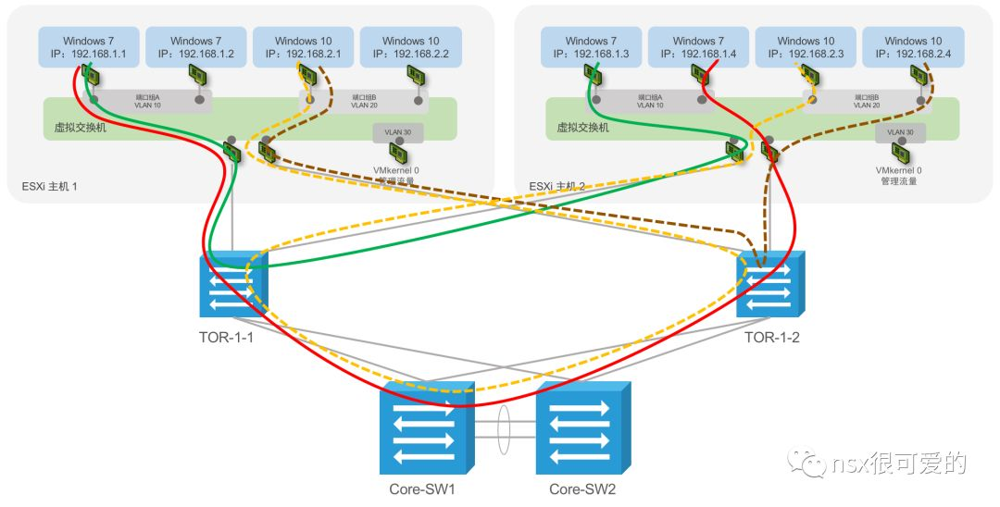
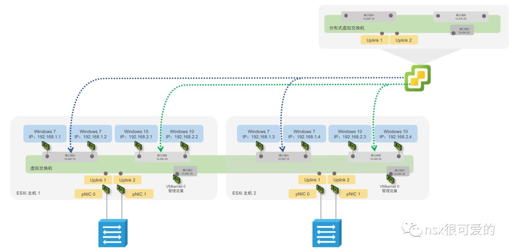
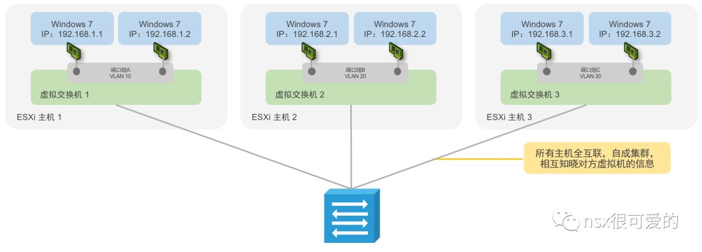

# NSX-v 网络

## 目录
{: .no_toc .text-delta }

1. TOC
{:toc}

# 概要

本文记录“nsx很可爱的”公众号从2018年5月到2018年底的一系列文章。

## 一篇文章让你读懂网络-上

网络的世界里面有个关键词：“**端到端的通道**”

该通的时候通，就表示网络正常；

该通的时候不通，便是网络故障；

该不通的时候通，是安全漏洞；

该不通的时候不通，是安全加固。

在前面很多章节，讲的基本都是与 NSX 安全相关的内容，接下来的话题讲讲怎样保证网络通。

而这一切的基础，是要先了解网络的通信原理。

任意一个网络节点要与其他节点通信，有三个重要的组件：

1. 网卡：大到服务器、小到手机，必须有一张网卡，这个一般是物理的设备，是操作系统与外部网络通信的桥梁；
2. MAC地址：每个网卡会有固化的硬件地址，类似于我们的身份证号，全球唯一；
3. IP 地址：每个节点会有一个 IP 地址，类似于我们的姓名，可能重复。

和生活中的交流一样，我们习惯于通过姓名来区分一个人，但真正要区分这一个人，我们需要知道其身份证号码。

网络里面，这两者都用到了，两个节点要通信需要以下信息：

源 IP 地址、源 MAC 地址、目标 IP 地址、目标 MAC地址。

前三个对于想要发送数据包的节点来说是已经知晓的，唯一不知道的是目标的 MAC 地址，这时候出现了个协议叫 ARP（Address Resolution Protocol，地址解析协议）协议，其作用就是**将 IP 地址解析为 MAC 地址**。

**解析原理是广播，在一个网络内向所有人发送请求信息，问 XX IP 对应的 MAC 地址是多少，而配置有这个 IP 的 PC 才会私信告诉发送者它的 MAC 是多少。**

这句话是万物之源，也是万恶之源。

再来通过不同场景，看看两个网络节点之间如何通信？

场景1：两个 PC 直连

PC1 和 PC2 配置如下地址，PC1 需要给 PC2 发一个报文（首次发送）：

好了，这么简单的网络怎么配都能通吧？ 

No！

**ARP 解析有一个前提，即源和目标的 IP 在同一个网段，而这个网段由 IP 地址和掩码两个元素来决定（具体怎么算请自行查询）**

举例：

192.168.1.1 255.255.255.0 和 192.168.1.2 255.255.255.0 属于同一个网段 192.168.1.0

192.168.1.1 255.255.255.0 和 192.168.2.2 255.255.255.0 不属于同一个网段，前者网段是 192.168.1.0，后者是 192.168.2.0

但偶尔有例外：

192.168.1.1 255.255.255.0 和 192.168.1.2 255.255.0.0 不属于同一个网段，前者网段是 192.168.1.0，后者是 192.168.0.0，但是两个 PC 能通。

原因在于，掩码用于**本地区分**目标是否和自己在同网段，同网段通信直接就能通，而跨网段，必须有路由器的介入。

在上述的特例中，192.168.1.1 给 192.168.1.2 发包，将 192.168.1.2 与自己的掩码 255.255.255.0 相与，结果是 192.168.1.0，刚好和自己的网段匹配。

192.168.1.2 给 192.168.1.1 发包，将 192.168.1.1 与自己的掩码 255.255.0.0 相与，结果是192.168.0.0，也恰好和自己网段匹配，于是双方都觉得没什么问题，通了。

------

场景2：两个 PC 通过一个交换机相连

一个网络中不可能只有两台设备需要相互通信，因此需要一个中心节点将众多设备汇聚起来，通常使用的汇聚设备是交换机。

> 1. PC1 发送 ARP 解析包；
>
> 2. 交换机收到此 ARP 解析包，记录通过这个端口收到的报文的 MAC 地址，即 PC1的 MAC 地址，这个记录会被保存在交换机 **MAC 地址表**中；
>
>    交换机读取 ARP 解析包的目标地址，发现是一个广播地址，会**将其复制转发给其他所有端口**；
>
> 3. PC2 收到这个 ARP 解析包之后回包；
>
> 4. 交换机将 PC2 的 MAC 地址记录在 MAC 地址表中；
>
> 5. PC1 封装包，并发送给 PC2；
>
> 6. PC2 给 PC1 回对应的包。

上面的过程有两个东西非常重要，即过程 2 的 **MAC 地址表**和**广播转发**。

MAC 地址表是交换机上用来记录客户端 MAC 地址和接口的对应表，有了这个表，交换机收到一个包之后，就知道将这个包转发给哪个端口了。

对于目标 MAC 地址是广播的包，交换机会将其发送给所有其他端口，所以广播包在局域网存在很多安全的问题，例如我可以通过一个软件不停发广播包，造成网络拥塞。

MAC 地址表是有空间的，在其空间利用完成后，新的 MAC 地址是不能被加入表中的，在 MAC 地址表中查不到目标 MAC 地址的包，都被称为未知单播包。交换机对于这些包的处理方式是：**发送到其他所有端口***。

于是有人注意到这个漏洞，会使用软件随机生成 MAC 地址大量发包，将交换机的 MAC 地址表恶意填满，导致正常的报文以泛洪的方式（将这些正常报文**转发给所有端口**）发出来，这样就可以直接嗅探这些包的内容。

或者，直接用软件频繁发未知单播包，这样也会引起网络拥塞。

**其实这是个不可避免的问题，因为交换机如果发现一个包的 MAC 地址不在其 MAC 地址表中，只能通过泛洪的方式去发送，否则只能丢弃了。*

网络世界里还有个组播包，对于交换机来说，组播包的处理方式和前面的广播以及未知单播都是一样的，即**泛洪****转发**。

不过交换机有个 IGMP Snooping 机制，其功能类似于 MAC 地址表的功能，也有一张表记录组播接收端和其对应物理接口的信息，只将组播包发给需要的用户。

总结一下，上面其实说的是某些文档里提到 BUM 包：**B****roadcast 广播、Unknown Unicast 未知单播 和 Multicast 组播**。 

**广播和未知单播是非常头疼的两个东西，处理不好会造成网络拥塞甚至数据泄露。**

*这里又有个东西早就淘汰了但在教科书里还有：集线器
*

*集线器功能和交换机类似，为了把多台终端接在一起，但是原理上相当于把所有 PC 物理链路接通，好比一群人在一起玩抢数字游戏，很可能同时两个人发话，这时候就冲突了，为了避免这个问题，有一个机制叫 CSMA/CD 带冲突检测的载波侦听多路访问，通过一系列的约定和规则避免冲突。*

既然 BUM 这么头疼，有没有办法缓解呢？

答案是隔离。受限于同网段 PC 通信的原理，同一个网段的所有设备**需要**在同一个广播域内才能通，那为了减少这个广播域，唯一的办法就是将一个大域切分成很多小域，将 BUM 包的影响范围缩小至一个小域内。而要实现这一功能需要**二层隔离**技术，这里说的二层技术就是 VLAN 。

用 VLAN 隔离起来，带来的后果是每组 PC 需要使用不同的网段，而这些 PC 之间需要通，这时候就引入了第三个场景。

------

场景3：两个不同网段的 PC 通信 

前两个场景都是同网段 PC 的通信，直接通过 ARP 解析到对方的 MAC 地址，直接发数据包即可通信，但如果要跨网段通信，则必须有**网关**的介入，这个跨网段通信一般叫做**三层通信**，一般由路由器来实现。

> 1. PC1 给 PC2 发报文，检测到 PC2 不在同一网段，所以需要将其先发送给路由器；
> 2. PC1 目前还不知道路由器的 MAC 地址，所以发送 ARP 广播包请求路由器接口1的 MAC 地址；
> 3. 路由器收到这个 ARP 包之后回应，并在其 ARP 表中记录 PC1 的 MAC 地址；
> 4. PC1 记录路由器的 MAC 地址，将发给 PC2 的包递送给路由器；
> 5. 路由器收到 PC1 发的包，目标地址是 192.168.2.1，但其 ARP 表中没有与之对应的 MAC 地址，于是发送 ARP 广播包请求 PC2 的 MAC 地址；
> 6. PC2 给路由器回应 ARP 包，并记录路由器接口2的 MAC 地址，保存在其 ARP 表；
> 7. 路由器收到 PC2 的 ARP 回应，记录 PC2 的 MAC 地址，将 PC1 发的包转发给 PC2
> 8. PC2 回应 PC1的包 

在以上过程中，路由器相当于一个中介，在 PC1 看来，其网关地址是 192.168.1.254，MAC 地址是路由器接口1的地址，在 PC2 看来，其网关地址是 192.168.2.254，MAC 地址是路由器接口2的地址。

以上过程比较好理解，但熟悉路由器的人可能知道， 路由器的接口非常少！两台PC这样接没问题，那4台，8台呢？

**这时候，就需要将交换机和路由器结合起来了**。

于是有了下面的结构：

问题再次出现，路由器接口数量始终是有限的，如果有很多网段呢？

或者，上面的图中每个网段都用了一个交换机，好浪费，可不可以很多网段共用交换机？

所以又出现一个现在已经没人用的技术，单臂路由：

单臂路由有三个关键技术：

- VLAN 隔离：在一个交换机上，使用 VLAN 将不同网段的设备隔离起来。VLAN  需要在每个交换机上都配置，然后需要将接口关联给某 VLAN ，在未来数据包转发的时候，此 VLAN 产生的广播包只会在此 VLAN 里传播。

- Trunk：如果 VLAN 只是本地有效，那会非常不科学，网络规模巨大的时候，多个设备可能属于同一个网段，但是接在不同交换机上，所以 VLAN 需要有跨交换机的特性。实现原理比较简单，当跨跨交换机转发报文的时候，给对应的数据包打上 VLAN 标记，且将一个互联口定义为 Trunk 口，允许其转发包含 VLAN 标记的报文。

- 子接口：子接口是路由器的一个概念，前面提到路由器接口可能不够用，因此有了子接口这一概念，**允许将一个物理接口虚拟成多个逻辑接口使用**。这多个逻辑接口需要作为不同网段的网关，而这些不同网段已经在交换机上做了 VLAN 的隔离，为了对应，子接口也需要支持 VLAN，最终结果就是每个子接口对应一个 VLAN，配置了该 VLAN 的网关地址。

------

再回到这张图，单臂路由存在两个问题：1、和交换机相连的接口带宽有限，不能承载太多终端；2、只是实现多网段之间的通信，却需要至少一个路由器+一个交换机，依然有些浪费。

于是路由器和交换机合二为一，就是现在我们说的**三层交换机**，或者是具备三层路由转发功能的交换机。

在三层交换机中，有个很类似于子接口的虚拟接口，思科设备将其称为 SVI （Switch Virtual Interface 交换虚拟接口），其功能和子接口一样，对应到不同的 VLAN，然后成为此 VLAN 的网关。

光有三层交换机还不够，因为通常来说网关只能有**一个**，而这**一个**设备就意味着其接口数量、性能是有限的。另外三层交换机价格会比纯二层交换机贵一些。在稍大规模，会将多个交换机连接起来，组成一张支持很多终端设备的网络。

通常来说，接用户终端的网络可能有上互联网的要求，这时候只需要增加一台路由器，一边接互联网，一边接三层交换机。

这时候问题又来了，前面提到了终端在同一个网段如何通、不同网段相互之间如何通，并未提及如何和外部网络通信。这时候有个很重要的术语：路由（Route）。

路由功能很类似于路标，简单说是个**网络中的指路牌**。

**
**

对于三层交换机而言，它要和外部通信，只需要将任何不知道目的地的地址指向路由器，这样的路由叫**默认路由**，其特征是目标地址不明确，用一个 **0.0.0.0/0 替代**。

(其实默认路由和 PC 设置的默认网关概念类似，对于一个 PC 而言，它只认识自己配置的网络，其他任何网络都是未知的，对于发往这些未知网络的报文，直接丢给网关即可)

**
**

对于路由器而言，它需要将终端设备的数据发往互联网，也要将互联网发回来的数据传送给终端设备，因此需要同时设置两条路由：一条指向互联网的默认路由，将所有未知目的地的包全部转发给互联网；一条指向三层交换机路由，将所有目的地为终端设备的网络转发给三层交换机。

上图第二个问题是，用户网络要和互联网相互通，前提是**互联网也知道用户网络的位置**，这时候需要让终端使用互联网可辨别的**公网地址**。了解过 IP 历史的知道公网 IPv4 的地址已经枯竭，为了节省公网 IP 地址，只能给路由器分配一个公网地址，然后让所有用户配置私网地址，共享这一个公网地址来上网。

为了实现多个用户共用一个公网地址，第二个技术 NAT 又引入了，NAT 全称 Network Address Translation，网络地址转换。实现原理是改变报文头部的源或者目标 IP。

拿上述需求举例，多个 PC 上网时，发的报文源地址是自己配置的私网 IP，目标地址是某个网站，经过路由器 NAT 之后，其源地址会变为一个公网地址，目标地址保持不变。通过这样的一个转换，用户通过默认路由可以将数据包发送给互联网，互联网也可以将数据包发送回来。

------

综合上述所有知识，如果用户规模再大一些，就有了一种很经典的网络架构：

- 接入层使用纯的二层接入交换机，价格便宜，端口数量多，可以接很多终端；
- 汇聚层连接多个接入层的交换机，通常来说汇聚层交换机会充当用户的网关；
- 核心层再连接所有汇聚层的交换机，实现高性能的三层转发、实现更多高级的服务、实现和其他区域的互联。

这种分层的架构在园区网络中可能刚好和物理位置匹配，例如：核心层交换机摆放在中心机房；汇聚交换机摆放在每个大楼的机房；接入层交换机则在每个楼层摆放，这样从架构、接线和维护角度来说都很清晰：

这种架构也适合于数据中心的网络：每个汇聚层交换机对应不同的业务区域；区域内每个机架顶部放置接入层交换机；不同业务区域之间通过核心交换机互联：

这种架构也可以根据需求调整，例如将核心层和汇聚层合为一体，也就回到了这样的架构：

或者将用户的网关放置在核心层，汇聚层和接入层只做二层网络透传：

用户区域和数据中心区域都用这样的架构建设，使用安全设备进行隔离：

这样的三层架构虽然很经典，但也有很多缺点，为了解决这些缺点需要付出的代价是复杂性，也就回到了[NSX从入门到精通(1)：NSX介绍-系统工程师篇](http://mp.weixin.qq.com/s?__biz=MzUxODgwOTkyMQ==&mid=2247483697&idx=1&sn=9f078cb1d1448e3135a370e92a8d6bac&chksm=f982711fcef5f80958d58e77436b82d6876a0092b45faa4e29f68355e54e19272f0a2901ef19&scene=21#wechat_redirect)里面提到的很多技术，下篇文章，将谈一谈如何加固这些架构，以及虚拟化及 NSX 的出现对于这些架构意味着什么。

------

上半部分文章接近尾声，回到文章的第一句话，网络的关键词是**端到端的通道**，这个通道由端到端沿途的所有组件组成：

- 两个 PC 直连要通，网卡、中间的网线组成通道；
- 多个 PC 通过交换机要通，网卡、交换机及网线组成通道；
- 多个 PC 跨网段要通，网卡、中间的交换机、路由器以及网线组成通道；
- 稍微大规模的结构中，PC 之间互通，网卡、二层交换机、三层交换机及网线组成通道；
- PC 与互联网通，网卡、二层交换机、三层交换机、路由器、运营商及网线/光纤组成通道。

网络搭建和排错的基础即是**熟悉每一个环节的工作原理**，只有每个组件均正常工作，配置正确，网络才可能通

## 一篇文章让你读懂网络-下

以这张经典的架构图开始讲起：

上图中，显而易见的问题便是**单点故障**：所有同一个位置的设备均为单个，且相互之间的连线也是单根。

先解决**链路单点故障**：

解决单点故障的办法很简单，由单线变为双线，而根据[NSX从入门到精通(20)：一篇文章让你读懂网络-上篇](http://mp.weixin.qq.com/s?__biz=MzUxODgwOTkyMQ==&mid=2247484046&idx=1&sn=d452c724245ffd12a5530c06d3eba6d7&chksm=f98272a0cef5fbb69c59ff935802eaf494e83de807f16043ed5212dcbb6bd0e20987a471dd54&scene=21#wechat_redirect)中提到的以太网和交换机的工作原理，如果单纯使用两根线连接两台设备，会出现**交换环路**，其带来的影响是**广播风暴**。

上图详细描述了广播风暴的发生过程，发生的原因就是上一篇中提到的交换机对于广播包的处理方式：**将报文复制转发给其他所有端口**。

当然交换机有避免交换环路的方法：**生成树（Spanning Tree Protocol，STP）**。通过生成树协议，交换机可以检测到两个交换机之间的多根链路，并**逻辑阻断**某个端口，实现同时只有一条链路可以传输数据，而另外一条链路作为热备存在。

上一篇也提到了 VLAN 这一概念，VLAN 可以隔离广播域；归根结底，STP 也是为了防止广播风暴发生。因此最终 STP 也有两种形式，基于设备的和基于 VLAN 的。

 

- 基于设备的：**CST**（普通生成树）和 **RSTP**（快速生成树），两者的区别是后者的收敛时间更快；
- 基于 VLAN 的：**MSTP**（多 VLAN 生成树）

以上都是由 IEEE 制定的标准，现实中很多厂商会可能自行开发或者基于标准再二次开发，于是有了 Cisco 的 **PVST**（每 VLAN 生成树）、**PVST+**、**Rapid** **PVST+**，对应国内厂商也有 **VBST**（VLAN Based Spanning Tree）。

其中，真正各大交换机厂家都支持的唯一“标准协议”只有 MSTP。

现实是，虽然大家都支持这个标准，但在具体实现上算法又不一致，需要一些额外配置才能保证不同厂家交换机之间兼容。

为了解决链路单点故障，采用双线连接，而双线引来新问题需要 STP 来解决，有更好的办法吗？

答案是：**链路聚合，链路聚合可以将两个参数一致的物理链路进行逻辑捆绑**，逻辑端口的速率加倍，两根物理链路可以分别传输一部分数据做到负载均衡，在单物理链路故障后可以快速完成故障切换**。**

链路聚合也是一个和 STP 同样混乱的协议。

通常链路聚合也分两类：

- 静态（强制）链路聚合
- 动态（协商）链路聚合：包含PAgP（Cisco）和 LACP（标准）协议

其中动态协商，协商一般需要双方交换机都参与，这时候根据是否主动发送协商报文，又分为了主动和被动两个角色。

链路聚合的很大问题和 STP 一样，各厂家的定义不一样，命令也不能一一对应，最终是否能成功对接也不一定。

下表是 Cisco 定义的对接表，不同厂家的设备不一定能按照下图来执行。绿色是推荐的两种成功率比较高的方案。

链路聚合看似很好解决了链路单点故障，但链路聚合有一个前提，**聚合的两个端口必须被同一个大脑管理**。

也就是下图的架构是不可行的。

------

再来看如何解决设备的单点故障：

通常交换机有两种，**盒式交换机**和**机箱式模块化交换机**：

盒式交换机一般为 1U 的高度，能够提供的接口最多为 52 口 (SFP或者RJ45接口)，盒式交换机的特点是功能固定，接口固定，不能进行硬件升级；

机箱式交换机采用模块化设计，电源、引擎(大脑)、接口板、风扇等等全部都是可拆卸的，特点是可以根据选配的板卡实现不同的功能，扩展性较强，可以配置多引擎、多板卡提高可靠性。

回到一开始的图，不同层级的设备配置方案则会有差异。核心层会采用扩展槽位更多的机型、汇聚层使用扩展槽位略少的机箱式交换机、接入层使用盒式交换机。

根据规模情况、性能需求、功能需求的不同可能有其他配置组合。

再回到单点故障的问题，不同交换机解决单点故障的方法也不同。

**机箱式交换机可以通过三种方式提高可用性**：

**1、单设备配置多电源、多引擎、多板卡**

多电源同时工作或者主备工作，避免单电源故障；多引擎以主备方式运行，单引擎故障后能在极短时间内恢复；同一种用途的板卡配置两块，使用双线和对端互联。

**2、双设备集群**

一般各大厂商的中高端机箱式交换机都会支持集群技术，例如 Cisco 的 VSS、Huawei 的 CSS、H3C 的 IRF 等。

这些技术的实现原理较为相似，即使用**多根万兆链路将双设备互联**，然后使用软件搭建交换机集群。在集群后，多个设备在管理上可以视为**同一台设备**，使用相同的 IP 地址、MAC 地址、路由协议等等，支持**跨设备链路聚合**。

下图的架构便能成为现实：

使用双设备集群来提高设备冗余性的同时，也可以帮助实现链路冗余，看似完美。不过这种架构存在一个风险，即脑裂。

一旦当设备之间的**集群线路故障**或者**集群软件工作异常**（例如意外掉电后设备开机），很可能两台设备均变为 Active 或者均变为 Standby 状态。

双 Active 可能会导致部分用户网络正常，部分用户网络访问异常的情况，这时候管理员很可能也意识不到是脑裂造成网络异常（因为设备管理 IP 能正常访问，网管软件也很难检测脑裂的发生）。

如果双 Stanby，则两台设备都不会转发报文，造成网络中断。

**
**

**3、双设备直接互联**

如果单纯将两台设备放在一个位置，提供相同的功能，同时工作，不就可以不需要堆叠，也能解决设备单点故障？

可以，像左侧的图一样，上面两台交换机互联，同时与下面交换机连。如果拿出三台交换机，会构成一个三角形，这也会出现前面说的**交换环路**，解决办法也是生成树。

生成树可以保证一个复杂的网络中，A点到B点只有一条通路，以此来避免环路，未来通路的结构很像倒着的树枝，所以生成树有个“树”这样的关键词。

以上图是基于设备的生成树实现的最终效果，可以看到有一半的设备以及链路浪费掉了，因此可以使用 MSTP 这样基于 VLAN 的多生成树，将不同 VLAN 分流到不同设备上以实现负载（通过调整优先级实现）。

一般交换机除了提供二层通信功能，也需要提供**网关功能**，而一般网关地址只能有一个，如果两台设备不使用集群技术独立存在，那网关 IP 只能配置在单台设备上，一旦设备故障，终端网关则会异常。

这时候有了一个协议 **VRRP（虚拟路由冗余协议 Virtual Router Redundancy Protocol）**，VRRP 的工作原理很简单，在以前每个设备都可以配置不同的**虚拟交换接口**（SVI，上一篇中有描述）地址，VRRP 可以创建一个浮动的虚拟 IP ，与接口地址同网段，这个地址默认在优先级高的交换机上，一旦故障发生，备交换机立即接管。

将 MSTP 与 VRRP 搭配，可以实现二层+三层的分流与互备：

**对于盒式交换机，一般有两种模式提高可用性：**

1、**双设备堆叠**：很类似于机箱式交换机的集群，不同的是一般会有专用的堆叠模块和堆叠线，不需要占用正常的交换机端口，一般也不需要额外的配置，直接通过堆叠线将两台设备连在一起即可。

2、**双设备互联**：和机箱式交换机一样，面临着交换环路的问题，需要借助 STP 来解决，如果设备充当网关，也需要使用 VRRP 提供网关冗余。

如果进行一个对比，会发现各有优缺点，没有完美的解决方案。一般为了稳定，会使用第三种，生成树+VRRP 的解决方案。

这里遗漏了一种情况，这种情况是在纯交换网络上的微优化：

下图的架构中，汇聚层和核心层之间所有接口全部配置为三层接口（而非 Trunk 口），配置路由，形成一个**三层网络**，这个网络中没有交换环路，不需要 STP，但是能实现链路故障切换、实现多条链路的负载均衡。而只有最下面的一个个小网络才需要生成树。

如果放大只看三层网络这块，使用**静态路由**配置，还是有一定复杂度。

以及，**上述配置并不能避免故障发生**。存在以下问题：

为了解决上述配置存在的问题，需要引入两个词，**浮动路由**和能够进行**链路或设备活动状态检测的机制（IP SLA、 BFD）**。

**浮动路由**等于备份的一条路由，只有在主路由条目失效后才生效。

**IP SLA、BFD** 等技术可以用来检测远端设备是否通信正常，根据检测结果调整本地的路由(一般是从路由表中删除主路由，让浮动路由变为主路由)，实现链路或设备故障后的路由切换。

**以上，都是静态路由需要的配置**，如果使用**动态路由协议**，让各个设备能相互学习对方的网络，则配置会少很多，而且动态路由一般都支持**等价负载均衡**，即源到目标有两条等价路径时，数据包可以负载到两个链路上进行转发。

使用动态路由协议搭建的网络很稳健，不会有交换环路这样的问题，也很少有路由环路出现，可以说是非常完美的一种组网的方案。

最常用的动态路由协议为 OSPF 和 BGP 。

既然动态路由协议这么简单好用，为什么要讲静态路由？

现实是**目前很多企业的网络都使用静态路由搭建的**。

这有可能是历史问题，比如很多年前网络规模小的时候用静态路由打通网络，而随着网络规模增大，也没人再去做一个“优化”；也可能是政策要求做到网络可控，必须用静态路由；或许单纯是觉得动态路由太过复杂（完全学懂一个动态路由协议很困难，但配置和维护相当简单，在规划合理的情况下很少出现问题），不敢用。

以上所有内容，都是在说高可用的解决方案，回归最初始，**实际我们只想解决两个问题：链路单点故障、设备单点故障**。但传统的解决方案都是那么令人无奈。

这时候 Cisco 出了一个很不错的方案，可以在各个方案中达到平衡，它的名字叫 vPC （Virtual Port Channel），Huawei 对应的解决方案叫 M-LAG（Multichassis Link Aggregation Group）。

vPC 是一种几近完美的跨设备链路聚合方案。

前面说到链路聚合的前提是：**聚合的两个端口必须被同一个大脑管理**，因此为了做链路聚合必须是单设备或者多设备使用集群/堆叠技术，统一控制平面，但集群技术存在脑裂的风险。**vPC 可以不依赖于集群/堆叠技术实现跨设备链路聚合，使用 vPC 时，两个交换机依然拥有自己的大脑，可以独立工作**。

在 vPC 之后，也不会有交换环路的出现，也就不需要生成树协议。vPC 也支持通过 **HSRP** （类似于 VRRP，Cisco 私有协议）实现网关冗余。  

除了优势，剩下的都是缺点：只有 Cisco 的 Nexus 高端数据中心交换机支持，要求型号一致，对软件版本有严格要求，配置复杂，维护复杂，设计复杂。

有没有办法真的解决上面所有的问题？

有，解决办法是抛弃传统网络的工作原理，抛弃传统设备的工作原理，回到最初的目的：**满足端点之间的通讯需求**。

**
**

**解决方案为：有一个统一的控制器，可以知晓网络中所有的终端和网络设备，任意两点之间的通信都由这个控制器来控制。**

这便是 SDN 的理念，转发层和控制层分离，集中控制。SDN 还有一个特点是开放接口，允许其他人开发一些更高级的功能与其集成。

SDN 只有一个缺点，那就是“颠覆”了现网的架构，需要替换所有设备才行，对于任何企业来说都是一笔不小的开支。

> 讲到这里我已经眩晕，像是有没完没了的问题和解决方案和问题。。。。。

------

上面所有内容都是传统网络架构中的技术，下面回到数据中心。

目前很多数据中心已经被高度虚拟化，有虚拟化和无虚拟化对网络的需求并不太一样。

虚拟化有一个功能叫 vMotion （[NSX从入门到精通(2)：NSX介绍-网络工程师篇](http://mp.weixin.qq.com/s?__biz=MzUxODgwOTkyMQ==&mid=2247483712&idx=1&sn=65b665c274fbcf16fb389c4b198b6410&chksm=f982716ecef5f878492752148fba45c5e68cd60d90c8185999494449f6a2be9c5bfc66a0d71e&scene=21#wechat_redirect)中有介绍），可以实现虚拟机在不同主机间的在线迁移，迁移之后，虚拟机的所有配置都会保持不变，包括 IP 地址。迁移之后，也要求此虚拟机和外部网络互通以正常提供服务。

虚拟化中还有一个功能，叫 DRS，DRS 可以实现虚拟机在一个集群内的自动迁移。

这些功能对于网络架构的要求就是，**无论虚拟机在哪里，虚拟机的网络****都必须通，都要在对应的 VLAN 且能和它的网关通信**。

在数据中心规模比较大的情况下，需要一个很大的二层网络：

矛盾出现了，上一篇提到因为传统以太网有很多问题，所以要减少二层广播域，而**虚拟化要求广播域很大**。

这是一个无解的问题，直到 VXLAN 这样的 Overlay 技术（在原来网络的基础上套一层网络）的出现。VXLAN 可以在现有任意网络架构上构建出一套无环路的大二层网络。既兼顾了对传统架构的支持，又兼顾了虚拟化对网络的特殊要求。

VXLAN 是 Virtual eXtensible LAN 的缩写，其概念很类似于 VLAN（Virtual LAN），可以理解为 VXLAN 是对 VLAN 的一个扩展，以前 VLAN ID 用 12-bit 的二进制数表示，最多能表示 4096 个数。

VXLAN 的 ID 用 24-bit 二进制数表示，最多能表示 16,777,216 个数，再大的网络规模都可以使用 VXLAN 来隔离网段（VXLAN ID 通常被称为 **VNI**（VXLAN Network Identifier） ）。

VXLAN 的工作原理也很简单，如下图所示，要保证 PC1 和 PC2 在任意网络上都能通讯，只需要让 SW1 与 SW2 对原来数据包进行一个“包装”，PC1 与 PC2 的通信实际上只需要简化为 **SW1 和 SW2 的通信**，**PC1 及 PC2 完全不需要关心其他网络架构是怎样的**。

以上的图只画了两个节点，如果应用于大规模，类似于 SW1 和 SW2 这样角色的交换机会有 N 多台，如何让这些交换机知道其他终端在什么位置？

于是有了 SDN 与 VXLAN 的结合。SDN 控制器可以知晓所有终端的位置，控制转发器进行报文转发；转发器具有 VXLAN 封装功能，可以将终端的包二次封装以便在任意网络中传输。

**NSX 便是这种架构的最完美实现。**

------

小结：

使用两个篇幅写完了传统网络的一些技术和架构，共计约 1 万字，耗时约 25 小时。

这两篇是理解 NSX 工作原理、NSX 最佳实践、NSX 与现网结合、NSX 排错等内容的基础。希望没有网络背景的人可以花一些时间学习一下，有网络背景的也可以温故一下。

最后，希望各位老板们看完后能关心一下公司的网络工程师，网络这么久以来就像是填坑挖坑，一路过来坑坑洼洼，很不容易。遇到网络问题不要觉得就是网工没做好工作，很可能是网络架构本身的问题、历史遗留问题、或者只是没有投入足够的资金采用稳健的方案。如果遇到网络很稳定，给网工们一个大大的赞👍吧。

## 虚拟化网络的最佳解决方案 - NSX

01

—

标准虚拟交换机

在第20篇文章中，简单提到了物理交换机及其工作原理，简单说，**交换机用于将多个终端设备汇集起来，实现相互之间的通信或隔离**。

在虚拟化中，也有一种类似的设备，**虚拟交换机**，其目的是实现虚拟机之间或与物理网络世界的通信。

回到这样一种最基础的架构，当一个物理设备要与外界通信的时候，需要三个关键词：

- 网卡（Network Interface Card，简称 NIC ）：每个设备必须有一张网卡，是一个硬件设备；
- MAC 地址：每个网卡通常有一个全球唯一的 MAC 地址，固化在网卡中；
- IP 地址：在操作系统上配置，与网卡绑定，一个网卡可以有多个 IP 地址。

如果加入了虚拟化，情况会变得稍微复杂一点：

以前操作系统可以直接管控到网卡，因此可以给网卡配置 IP 地址实现通信， 但在虚拟化中，多个虚拟机运行在同一台主机上，好像不能直接把单个网卡直接分给某个虚拟机去使用，否则其他虚拟机无法通信，除非每个虚拟机配置一张物理网卡。

一种经济有效的办法便是**共享网卡**，同时，为了沿用以前以太网通信的原理，需要创造出一些虚拟的组件，例如 vNIC，每个 vNIC 需要一些虚拟的 MAC 供虚拟机使用。

而原来的物理网卡，在这样的架构中只被称作“上行链路”，可以简单理解为一个虚拟化到物理网络的桥梁。

同物理交换机一样，虚拟交换机也需要实现**通信和隔离**两个基础的功能。为了保证冗余，也需要**多个物理链路**。

VMware 的虚拟化程序是 ESXi，一般每个 ESXi 都需要有 IP 地址进行管理，所以在上面的架构中多了一个组件 **VMkernel**，除了管理以外，ESXi 也支持很多其他功能，这些功能也需要独立的虚拟网卡来传输流量。

最终，一个虚拟交换机会变得稍微复杂些。

在这样的架构下，图中组件的相互通信情况可能是这样子，总结来说：

- 同主机同 VLAN 直接通过虚拟交换机内部通信；
- 不同 VLAN 需要通过外部物理网关通信；
- 与外部设备通信必须经过物理交换或网关设备；
- 多张网卡不做任何额外配置可以实现简单的负载均衡。

------

如果将一台主机扩大至两台主机，且应用第21篇讲到的架构时，接线情况和二层通信情况是这样，总结来说：

- 为了保证物理冗余，每台服务器的两个网卡接不同的置顶交换机，两个置顶交换机和核心交换机互联；
- 任何一个 vNIC 到外部网络可能有两条路，排列组合，任意虚拟机到任意虚拟机，总共会有4条物理的路；
- 同 VLAN 通信可能需要过二层交换机，也可能需要过核心交换机。

为什么会这么乱？？？

这与交换网络的架构和交换机的工作原理密不可分，交换机会记录一个虚拟机 MAC 对应的物理接口的位置，根据此表进行转发，上图的对应关系如下（下图以 IP 地址来区分不同虚拟机）：

如果是虚拟机跨主机三层通信，则所有的交互都得经过核心交换机。

------

02

—

分布式虚拟交换机

标准交换机的结构非常简单清晰，但其功能比较简单，且需要基于每主机进行配置，不便于运维。因此有了一种增强型的虚拟交换机，可以实现统一的管理，分布式的处理：**分布式虚拟交换机 vDS**。

从单个主机角度看，标准虚拟交换机与分布式虚拟交换机架构差异不大，需要注意的两点是：

- 标准虚拟交换机直接关联物理 NIC；分布式虚拟交换机有了 Uplink 这一逻辑端口，再给 Uplink 关联物理 NIC；
- VMkernel 同虚拟机的 vNIC 一样，需要关联到端口组中去。

从管理角度上看，只需要在 vCenter 创建一个分布式虚拟机交换机的模板（有哪些端口组，有几个 Uplink），再进行主机关联即可（Uplink 对应的物理 NIC 是哪个）。

有了vDS，端口组的管理会方便且标准，除了这一个优势外，vDS 还支持非常多的特性：Port Mirroring（端口镜像）；Network IO Control （网络 IO 控制）、PVLAN、LAG（链路聚合）、批量端口组迁移、NetFlow、LLDP 等功能。

------

03

—

一种假想的架构

上一篇的末尾，提到了两个词，VXLAN 和 SDN。VXLAN 实现在现有网络上嵌套一层网络，SDN 实现统一的网络管理，知晓整个网络。那具体这些怎么实现呢？

为了实现通讯的终极目标**互通**，我们需要让所有虚拟机一出来就知道**目标是什么，目标在哪里**，即**目标 MAC 地址是什么，从哪个物理端口发出去**。

基于前两小节的介绍，虚拟化中，虚拟机发送的流量第一跳是到**虚拟交换机**，我们是否可以在虚拟交换机上做手脚，让虚拟交换机一开始便知晓其他所有虚拟机的 MAC 地址以及位置信息？

方式有两种：

1、所有主机相互通信，成为一个集群，相互学习对方的虚拟机网络信息。

2、有一个统一的控制器（配置3台保证可靠性），所有主机将自己本地的虚拟机网络信息发送给控制器，控制器拥有所有虚拟机的网络信息，主机可以通过查询方式获取未知虚拟机的网络信息。

以上两种方式各有一些缺点：第一种如果集群过大，系统会不好维护，每个节点上会有相当多的数据库信息，每次网络变动所有主机都需要更新数据库，浪费资源。第二种严重依赖于控制器，假如控制器故障则全网故障。

以上过程都可以称为学习过程，单纯虚拟交换机并不具备这个功能，因此需要在每个节点安装一个额外的组件（**Agent**）来实现这个功能，这个组件无论是和其他节点通信，还是和控制器通信，都需要网络，不妨直接使用管理网络吧。

假如通过上述手段每台主机都能知晓其他虚拟机的位置，我们遇到的第二个问题是如何转发。此时还需要考虑的问题是，**如何兼容现有的物理网络和虚拟网络架构**。

VXLAN 这样的技术刚好派上用场。

在每个主机上部署一个 VXLAN 解封包的组件，将虚拟机的流量进行二次封装，会让网络变得极其简单。  

在 Underlay 网络复杂时，这样的优势会变得非常明显，**任何虚拟机之间的通信都会变成两个 VTEP 节点之间的通信**。

你可能会问，以上架构全部在说虚拟机之间如何通信，这样的环境与外部环境如何互通？？

确实，正因为每个主机都有 Agent 以及 VTEP 的存在，相互之间才能学习和知晓，如果对外要和其他网络设备通信，必须想办法**兼容传统网络**。

有种非常简单的解决方案：通过一个专用节点做协议转换，或者说做**虚拟化到外部的桥梁**。

这个节点必须同时接入 VXLAN 的网络和传统的 VLAN 网络，必须具备传统的三层路由功能。

------

04

—

NSX 网络架构

综合前三小节内容，得出的便是 NSX 的架构，NSX 在具体实现上考虑的更为全面，组件更多。

NSX 会先借用 vDS 建立一个**逻辑交换机**，逻辑交换机对应到 VNI，用于区分不同网段，逻辑交换机存在形式是一个端口组。

如果虚拟机在同一个逻辑交换机上，跨主机通信时，路径如下（为了清晰，所有虚拟交换机均未绘制 Uplink 及物理 NIC ）：

上图中的交换机可以代表任意的 Underlay IP 网络，唯一的要求是更改 MTU。

为了实现虚拟机跨主机跨网段通信，NSX 引入了**分布式路由器（DLR）**的功能，DLR 和传统的路由器功能类似，不同的是**每台主机都有一个一模一样的路由器进程，拥有同一个网关 IP**。这样便可以非常简单的实现虚拟机网络的第一跳路由优化，**三层通信再也不需要依赖于物理路由器了**。

为了实现虚拟机与传统网络的通信，NSX 引入了 **Edge Service Gateway** 这一组件，简称 ESG，ESG 以虚拟机的形式存在，至少需要两张网卡，一张与 DLR 通过逻辑交换机相连，一张通过 VLAN 端口组与物理交换机相连。

在上图的架构中，ESG 好像会成为虚拟化到外部的一个瓶颈，为了解决这个问题，NSX 支持多台 ESG 并行运行，通过路由的负载算法让多台 ESG 分担流量（ECMP 模式）。

另外，如果物理网络运行动态路由，为了实现无缝对接，也需要 ESG 以及 DLR 支持路由功能。

于是 DLR 又多了个组件，**DLR Control VM**，简称 DLR CVM。其存在形式是虚拟机，这个虚拟机的用途非常单一，**进行动态路由邻居的建立、学习动态路由条目、给每台主机上的 DLR 进程下发路由**。

在这样的设计下，单纯路由层面网络结构和传统网络并无任何差别：

综合以上，完整的 NSX 架构如下：

**管理层**，提供配置、管理功能：

NSX 将管理层独立出来，实现统一管理，管理层的组件叫 NSX manager，存在形式是一台虚拟机。

NSX manager 部署完成后需要和 vCenter 对接，在 vCenter 中安装“**网络与安全**”插件，未来所有配置均在 vCenter 的界面中进行。

**控制层**，负责提供一些与决策相关的功能：

**控制器**：负责存储虚拟机的网络信息（按需存储）、下发虚拟网络相关的配置，存在形式是三台虚拟机；

**DLR CVM**：负责与 ESG 进行动态路由学习，为数据层 DLR 组件下发路由，存在形式是虚拟机；

**ESG**：负责与外部网络建立路由关系，负责与 DLR 建立路由关系；

**UWA**：一系列 ESXi 主机中的 Kernel Module，负责与 Controller 或者 NSX Manager 的通信。

**数据层**，负责真实的数据转发：

分布式逻辑交换、分布式逻辑路由、DFW 分别提供二层转发、三层转发、防火墙的功能；

**ESG**：ESG 不但要进行路由学习，也要进行路由转发（所以 ESG 是个兼备数据层功能和控制层功能的组件）。

------

NSX 网络介绍部分到此结束，接下来的话题会从 Underlay 网络、NSX 虚拟网络、vSphere 设计等层面逐个去讲 NSX。

如果要给本文加个结尾，我觉得讲讲 NSX 虚拟网络的价值最好：

- 支持任意 IP 网络架构，可以有效保护现有硬件投资；
- 构建在虚拟化之上，架构灵活，可以降低硬件投资；
- 虚拟二层网络不会有环路，自带广播抑制功能；
- 虚拟网络兼容标准的路由协议，无需对网络做太大改造；
- ESG 能够提供负载均衡、VPN、NAT 等很多常用功能，无需额外费用；
- 实现虚拟机流量路径的第一跳优化，提高网络性能；
- 如果将架构延展到多个数据中心，可以实现跨中心的大二层网络，能够用于灾备和双活场景；
- 开放 API，允许各种云管理平台接管，实现网络自动化部署；
- 通过其他一些 API，能够实现虚拟网络的 360 度可视化运维。

 

可以说，NSX 是虚拟化网络改造的最佳方案，在兼容性、架构、性能等方面做到了极致的平衡。

## NSX 与网络隔离

这篇文章很短，最近在看一些经典的云计算数据中心解决方案，看到了一个词：**VRF**，好像在前面的文章中遗漏了这一重要技术。

VRF 的全称是 virtual routing and forwarding，其用途是允许同一个设备出现多个路由转发表，实现不同网络之间的流量隔离。

回顾一下，在前面的文章中，我们介绍了 VLAN 技术，VLAN 可以实现二层网络隔离，保证不同 VLAN 的终端之间不通。而大部分时候，这些分隔的网络是要对外提供服务的，这时候引入了路由器，路由器可以实现不同网络之间的三层通信。

再回过来看现在的虚拟化数据中心建设，我们需要：

**1、安全分区**

**2、统一资源池**

这两个词几乎就是互斥的，安全分区要做到拆分隔离，而资源池要求统一管理。

在 NSX 安全引入之后，问题变得简单一些，因为 NSX 分布式防火墙技术能够实现资源池内任意 VM 到任意 VM 的隔离。

但是，问题并没有结束，架构中未提到物理网络！如果需要将物理网络与虚拟化网络连接起来，会遇到一个怎么连的问题。

物理网络一般也会按照不同区域建设，要让每个网络都可以访问虚拟化中属于自己的业务，则必须都接入数据中心的网络，**这相当于把客户努力要隔离的网络又连在了一起**。

原因在于，虚拟化资源池一般只有一套物理网络，对外只有一个出口：

------

为了在安全隔离和资源池之间妥协，有三种解决方案：

**1、多资源池**

每个安全分区建设一套虚拟化环境，每套虚拟化环境有自己独立的服务器、网络和安全等设备。

这种解决方案架构最清晰，但成本最高：

- 每个资源池都需要购买硬件，硬件投入很大，整体资源利用率比较低；
- 随着设备数量增多、管理域增多，管理成本上升；
- 长期运营成本增加，这包括电力、空间、制冷等等成本。

在这种架构下，有些资源还是可以共享的，比如共享存储、备份系统。

**2、VLAN 二层隔离**

既然 VLAN 可以实现二层隔离，那理论上只要让端到端的网络只通过二层连接，就能通过 VLAN 来隔离。

在这样的架构中，虚拟化有一个物理的资源池，网络设备均为一套，但是**所有虚拟化的交换机全部工作在二层转发模式，所有虚拟机的网关均在其对应区域的核心交换机上**。

这样的架构的问题便是前面一直提到的：广播域过大，这里不再赘述。

**3、VRF 三层隔离**

回到一开始关于 VRF 的介绍，VRF 允许让一个路由设备(三层设备)存在多个路由转发表，实现三层网络的隔离。

VRF 是个本地隔离技术，即关于一个 VRF 定义、接口关联配置、路由配置均在设备本地配置，不能传递给其他设备。

从大的角度看， VRF 隔离与 VLAN 隔离的架构会有一些相似：

这样的架构下，隔离由两部分组成，虚线段使用 VLAN 隔离，实线段使用 VRF 隔离。

------

NSX 提供了第四种解决方案：**逻辑路由隔离**。

上一篇简单讲解了 NSX 的一些组件， 逻辑交换机 LSW、分布式逻辑路由器 DLR、边界服务网关 ESG等。

LSW 用于实现二层通信；DLR 连接多个 LSW，用于实现虚拟机之间的跨三层通信；ESG 用于连接虚拟化网络与物理网络。

**以上所有组件均是通过软件实现，可以随意创建，搭配组合**。

比如创建多个 LSW 给不同网络使用，与之对应，创建多个 DLR 处理三层流量，创建多个 ESG 负责不同网络的虚拟化与物理网络对接。

**进行这样的网络改造，所有服务器端配置无需改变，需要的只是多创建几个虚拟机。**

这样的改造之后，每台主机会有两个独立的 DLR 进程，可以根据需求运行静态路由、OSPF 或 BGP。

这种架构原理与 VRF + VLAN 的组合类似，但有很多重要的区别：

- VRF 依赖于物理设备的功能和架构，且每台设备需要独立配置，NSX 完全摆脱了对物理网络的依赖，架构更加灵活，配置更加方便，管理难度低；
- VRF 必须在核心层交换机配置，是种集中式的隔离，NSX 是分布式架构，有第一跳优化，性能更佳；
- VRF 在一台设备上配置，很难分割管理权限，NSX 的 LSW、DLR、ESG 均是独立的组件，可以交给不同用户授予不同的权限来进行管理。

这个功能也使得 NSX 非常适合于多租户的场景，所有的网络功能都可以通过 NSX 开放接口进行自动配置，且原生隔离。搭配云管平台，创造出一套完整的网络环境，也就是分分钟的时间。

------

最后可能会有人问，通过多逻辑路由器的隔离和 NSX 防火墙隔离，有什么区别？

如果仔细读过以前的文章，会发现两者最大的区别是物理网络架构的不同。

如果客户有一个虚拟化，一套网络，为不同部门来提供服务，只是想实现不同部门之间的隔离，则可以用 NSX DFW 来做隔离。

如果客户有一个虚拟化环境，但是有多个隔离的网络，或者有多个租户（通常多个租户都有自己的物理网络环境），则必须使用逻辑路由来实现网络隔离。