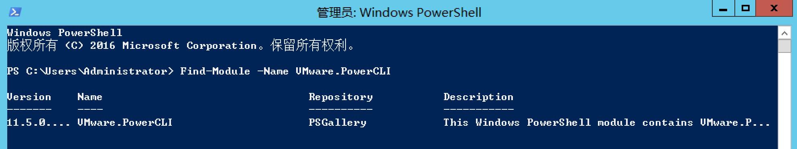
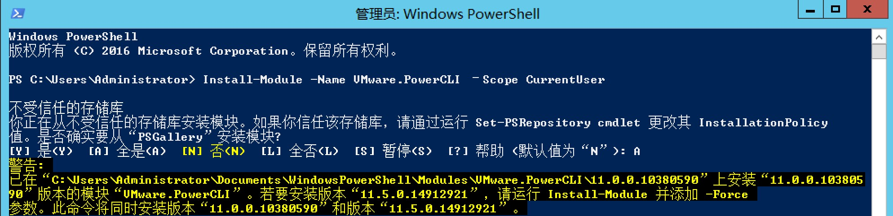
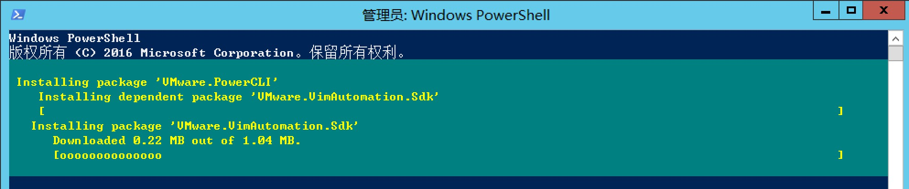
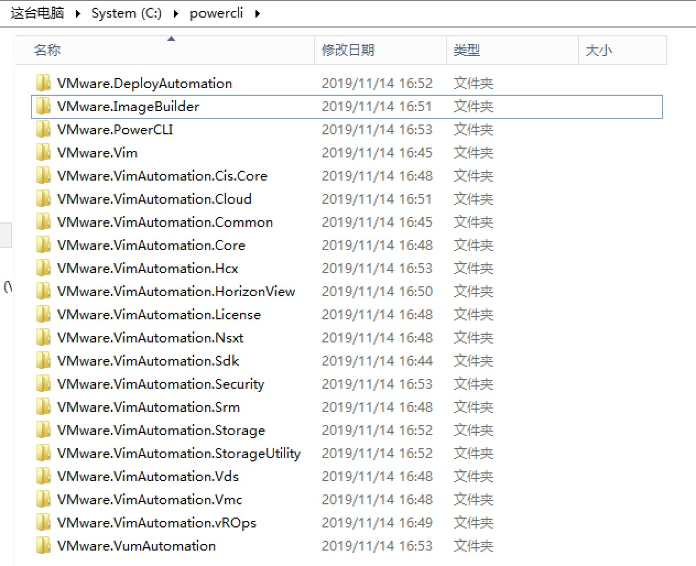
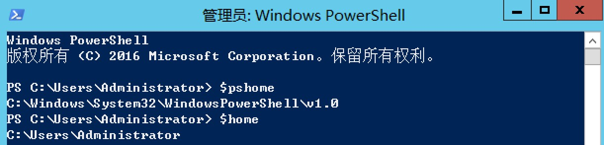
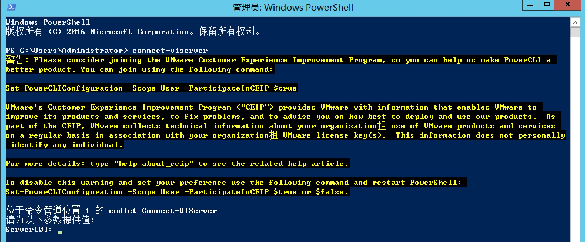

# PowerCLI 安装
{: .no_toc}

## 目录
{: .no_toc .text-delta }

1. TOC
{:toc}


## 概要

PowerCLI 6.5.1 版本之前，VMware会提供 .exe 安装包用于安装 powercli ，但是在此版本之后必须通过PowerShell Gallery 来在线安装。


**PowerCLI 6.5.0 的下载链接如下：**

链接: [https://pan.baidu.com/s/1zpxmj-MkIBQs5HdtZ1C_BA](https://pan.baidu.com/s/1zpxmj-MkIBQs5HdtZ1C_BA)  密码:fn0m


**PowerCLI 11.5.0 的下载链接如下，使用方法见下文：**

链接:[https://pan.baidu.com/s/1bCxLfmvkDR_Kedb-bzpMTA](https://pan.baidu.com/s/1bCxLfmvkDR_Kedb-bzpMTA)  密码:4rbi


## 如何通过 PowerShell Gallery 安装


1、电脑联网，打开 Powershell ，输入下列命令

```powershell
Find-Module -Name VMware.PowerCLI
```



2、使用下列命令安装 PowerCLI

```powershell
Install-Module -Name VMware.PowerCLI –Scope CurrentUser
```




## 离线安装 Gallery 的模块

1、使用下列命令查找并保存模块

```powershell
Find-Module -Name VMware.PowerCLI
Save-Module -Name VMware.PowerCLI -Path C:\Path\To\Desired\Folder
```



下载完毕：



2、将下载好的模块放入下列路径

```
仅该用户使用时: $home\Documents\WindowsPowerShell\Modules
所有用户: $pshome\Modules
```

在 powershell 命令行输入` $pshome `可以通过查看 powershell 模块的路径：




## 使用 PowerCLI

当离线将 PowerCLI 放到指定目录后，理论上只要打开 Powershell 即可调用 powercli 的命令。

例如下方使用 `connect-viserver `  命令去连接 vCenter Server。




## 6.5.0 版本使用 PowerCLI

如果你用的是文章前面给的百度链接的模块，则在每次使用 powercli 前必须手动导入模块，可以通过下列命令完成：

```powershell
Import-Module VMware.PowerCLI
```

或者可以将主要模块导入：

```powershell
Import-Module VMware.VimAutomation.Core
```


## 参考链接

[https://blogs.vmware.com/PowerCLI/2017/04/powercli-install-process-powershell-gallery.html](https://blogs.vmware.com/PowerCLI/2017/04/powercli-install-process-powershell-gallery.html)