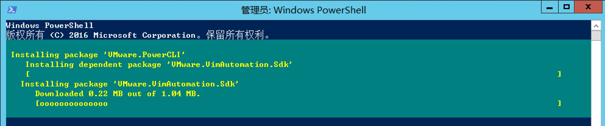
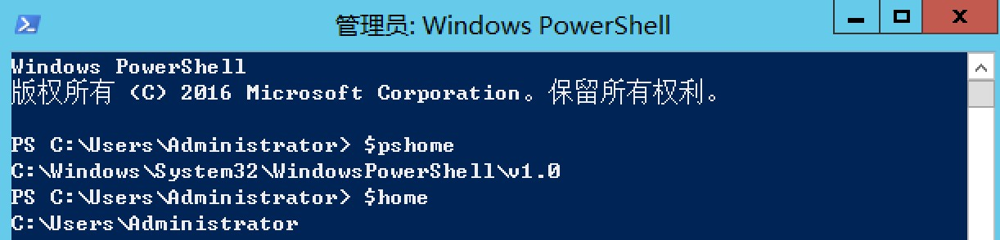
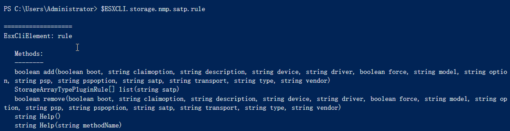

# PowerCLI 安装
{: .no_toc}

## 目录
{: .no_toc .text-delta }

1. TOC
{:toc}

# Windows 

## 概要

PowerCLI 6.5.1 版本之前，VMware 会提供 .exe 安装包用于安装 powercli ，但是在此版本之后必须通过PowerShell Gallery 来在线安装。


**PowerCLI 6.5.0 的下载链接如下：**

链接: [https://pan.baidu.com/s/1zpxmj-MkIBQs5HdtZ1C_BA](https://pan.baidu.com/s/1zpxmj-MkIBQs5HdtZ1C_BA)  密码:fn0m


**PowerCLI 11.5.0 的下载链接如下，使用方法见下文：**

链接:[https://pan.baidu.com/s/1bCxLfmvkDR_Kedb-bzpMTA](https://pan.baidu.com/s/1bCxLfmvkDR_Kedb-bzpMTA)  密码:4rbi


## 兼容性要求

亲测 PowerShell 4.0 版本使用不了 10.x 以上版本的 PowerCLI，但是vmware官方兼容性里竟然写了这个版本。


可以通过 `$psversiontable` 获取当前 powershell 版本。


建议直接参照下列 kb 将 powershell 升级至最新的 5.1

[https://docs.microsoft.com/en-us/skypeforbusiness/set-up-your-computer-for-windows-powershell/download-and-install-windows-powershell-5-1](https://docs.microsoft.com/en-us/skypeforbusiness/set-up-your-computer-for-windows-powershell/download-and-install-windows-powershell-5-1)


## 如何通过 PowerShell Gallery 安装


1、电脑联网，打开 Powershell ，输入下列命令

```powershell
Find-Module -Name VMware.PowerCLI
```


2、使用下列命令安装 PowerCLI

```powershell
Install-Module -Name VMware.PowerCLI –Scope CurrentUser
```


## 离线安装 Gallery 的模块

1、使用下列命令查找并保存模块

```powershell
Find-Module -Name VMware.PowerCLI
Save-Module -Name VMware.PowerCLI -Path C:\Path\To\Desired\Folder
```



下载完毕：


2、将下载好的模块放入下列路径

```
仅该用户使用时: $home\Documents\WindowsPowerShell\Modules
所有用户: $pshome\Modules
```

在 powershell 命令行输入` $pshome `可以通过查看 powershell 模块的路径：




## 使用 PowerCLI

当离线将 PowerCLI 放到指定目录后，理论上只要打开 Powershell 即可调用 powercli 的命令。

例如使用 `connect-viserver `  命令去连接 vCenter Server：


## 6.5.0 版本使用 PowerCLI

如果你用的是文章前面给的百度链接的模块，则在每次使用 powercli 前必须手动导入模块，可以通过下列命令完成：

```powershell
Import-Module VMware.PowerCLI
```

或者可以将主要模块导入：

```powershell
Import-Module VMware.VimAutomation.Core
```


## 报SSL/TLS错误

在使用 nsx-t 的模块时，系统报 `connect-nsxtserver 基础连接已经关闭：未能为 SSL/TLS 安全通道建立信任关系`

此时可以使用下列命令忽略证书相关的错误：

```powershell
Set-PowerCLIConfiguration -InvalidCertificateAction Ignore -confirm:$false
```

# Macos

## Macos 安装 Powershell 及 Powercli

可以到此链接下载 Mac 版本的 Powershell，或者使用`brew cask install powershell`安装

[https://github.com/PowerShell/PowerShell](https://github.com/PowerShell/PowerShell)

安装完成后运行 `pwsh` 即可切换到 powershell

通过`Get-PSRepository`看到当前 PSGallery 为非信任状态


使用 `Set-PSRepository -Name PSGallery -InstallationPolicy Trusted`信任


通过`Find-Module "VMware.PowerCLI" | Install-Module -Scope "CurrentUser" -AllowClobber` 查找并安装 powercli 


我在安装 powercli 时遇到了` PackageManagement\Find-Package @PSBoundParameters`报错，最后用 sudo pwsh 进去就好了，可能是权限问题。


### 手动安装 powercli 

如果在线安装 powercli 网速过慢，可以考虑下载 powercli 的包然后手动安装。

1、下载 Powercli 的包，链接： [https://code.vmware.com/web/tool/11.5.0/vmware-powercli](https://code.vmware.com/web/tool/11.5.0/vmware-powercli)


2、为当前用户创建 Modules 目录

```shell
mkdir -p ~/.local/share/powershell/Modules
```


3、通过 unzip 将 powercli 解压到 modules 目录下（注意不能用 Macos 自带的 Archive Utility 解压）

```shell
unzip VMware-PowerCLI-11.5.0-14912921.zip -d ~/.local/share/powershell/Modules
```

*如果需要让所有用户使用，请解压至 /usr/local/microsoft/powershell/6/Modules 目录*


4、退出所有 powershell ，再重新打开，查看已安装的模块


5、设置忽略 SSL 证书

```powershell
Set-PowerCLIConfiguration -InvalidCertificateAction "Ignore"
```


6、连接到 vCenter


## 类似于 ISE 的 IDE

在 Windows 下经常使用 ISE 去编辑和运行 Powershell，在 Mac 下可以用 virtual studio code 替代 ISE，装了 Powershell 模块，使用 Powershell 主题后和 ISE 无异：


# 命令大全

1. Connect-VIServer – 连接虚拟化平台
2. get-vicommand – 显示所有命令列表
3. help Get-vm -- 查看命令帮助
4. get-vmhost – 显示ESXi主机列表
5. get-cluster – 显示群集列表
6. get-datastore – 显示存储列表
7. get-resourcepool – 显示资源池
8. get-vm – 显示虚拟机列表
9. get-virtualswitch – 显示虚拟交换机列表
10. start-vm\stop-vm – 启动或关闭虚拟机
11. new-vm – 创建虚拟机
12. get-template – 显示模板列表
13. get-oscustomizationspec – 显示自定义规范列表
14. get-vapp – 显示vapp应用列表
15. get-folder – 显示文件夹列表

# esxcli 用法

使用下列命令调用 esxcli

```powershell
$esxcli = Get-EsxCli -VMHost $VMHost
$esxcli.software.vib.install(各种参数)

#同 esxcli 一样，当输入的命令不完整时，系统会自动返回可以输入的命令，例如输入 $esxcli.software 时，系统会提示接下来可以使用 install、remove、upgrade 等命令。
#当到最后需要执行某个命令时，一般命令后都有个（），括号中需要输入各种参数，这些参数的意义和数量也可以通过自动补全来获取（反正我是没查到文档）

```

如果想使用 v2 的 esxcli

```powershell
$esxcliv2 = Get-EsxCli -VMHost $VMHost -V2
$viblist = $esxcliv2.software.vib.install(各种参数)
```


###举例：获取已安装的 vib 

```powershell
$esxcliv2 = Get-EsxCli -VMHost $VMHost -V2
$viblist = $esxcliv2.software.vib.list.invoke()
```


### 举例：修改华为存储的多路径策略

出于某些未知的原因，华为要求在做虚拟化时调整存储的多路径策略，具体命令如下：

```
esxcli storage nmp satp rule add -V HUAWEI -M XSG1 -s VMW_SATP_ALUA -P VMW_PSP_RR -c tpgs_on
```


通过$esxcli.storage.nmp.satp.rule 获取到 add 命令下有下列参数，我们只需要按照华为文档修改以下参数 :
-V : vender

-M : model

-s : name

-P : psp

-c : claimoption




利用 powercli 来批量执行此命令

```
$ESXCLI.storage.nmp.satp.rule.add($null,"tpgs_on",$null,$null,$null,$null,"XSG1",$null,"VMW_PSP_RR",$null,$null,$null,"MP","HUAWEI")
    
```


## 参考链接

[https://blogs.vmware.com/PowerCLI/2017/04/powercli-install-process-powershell-gallery.html](https://blogs.vmware.com/PowerCLI/2017/04/powercli-install-process-powershell-gallery.html)


Macos 上安装powercli 

https://blogs.vmware.com/PowerCLI/2018/03/installing-powercli-10-0-0-macos.html

https://ithinkvirtual.com/2018/03/04/install-powershell-and-vmware-powercli-on-macos/