# PowerCLI 性能优化
{: .no_toc}

# 目录
{: .no_toc .text-delta }

1. TOC
{:toc}

# 参考资料

此文章大部分内容取材于 [https://adamtheautomator.com/powershell-multithreading/](https://adamtheautomator.com/powershell-multithreading/ ) 


# 概要

在用 PowerCLI 处理批量任务时会非常慢（例如批量创建虚拟机，批量获取主机信息），主要原因在于 Poershell 是顺序执行脚本的，因此可以通过代码改造让命令可以并行（或者后台）执行将能极大加快运行速度。


# 异步执行命令

PowerCLI 的某些操作可以使用异步执行，即 PowerCLI 脚本只进行任务的下发，执行交给 vCenter 去执行。

这样的操作有：

虚拟机批量开关机、修改虚拟机配置等等。

示例：

```powershell
Set-VM -vm $vmGuest -MemoryMB "81920"  -Confirm:$false -RunAsync
#调整虚拟机的内存大小，异步执行
```


对于某些操作，例如批量收集主机的信息，显然难以用异步，因为需要收集且处理信息，此时可以优化代码，以及将任务拆分，多线程执行。

# 优化代码

## 查看瓶颈在哪里

有时候性能差是程序逻辑设计的问题，或者循环的问题，需要尽早完成这部分优化。

可以通过 `Measure-Command{ 命令内容 }`来查看命令的运行时间。


一个通用的优化方式如下：假如你要先收集大量的数据，应当尽早对数据进行过滤，以缩减这部分数据的大小，再进行其他二次过滤。或者按照原作者的话，将过滤往代码的左边移动。


例如：

想要通过 get-process 获取 Dock 这个进程的 CPU 信息，可以通过以下两组代码实现：

```powershell
Get-Process -Name 'Dock' | Where-Object {$_.CPU -ne $null} | Select-Object CPU
```


```powershell
Get-Process | Where-Object {$_.ProcessName -eq 'Dock'} | Select-Object CPU | Where-Object {$_.CPU -ne $null}
```


性能对比如下：

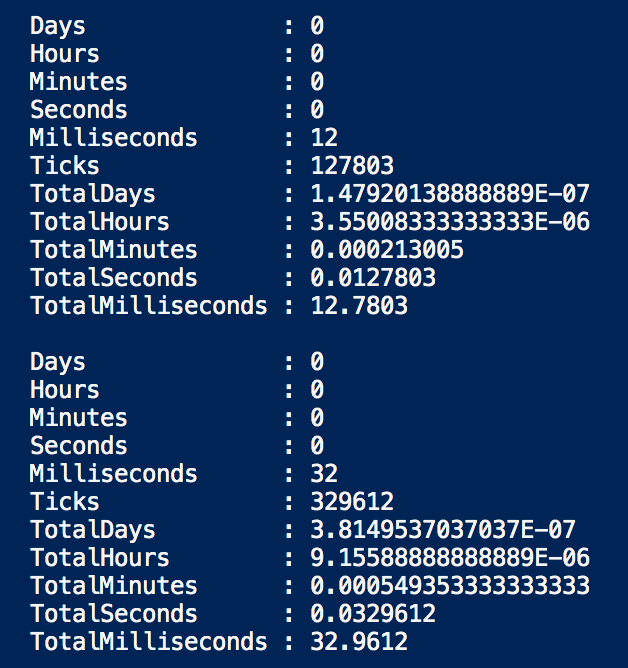


可以看到前者运行速度比后者要快将近一倍，如果是执行大量的任务，这一点点差距累计起来的差距是很大的。

## PowerCLI 代码性能优化

笔者对 PowerCLI 的脚本进行了类似测试发现随着写法不同，代码执行速度差异很大，如下例：获取主机所在集群信息：

```powershell
Get-VMHost $vmHost | Get-cluster
```

```powershell
Get-Cluster -vmhost $vmHost
```


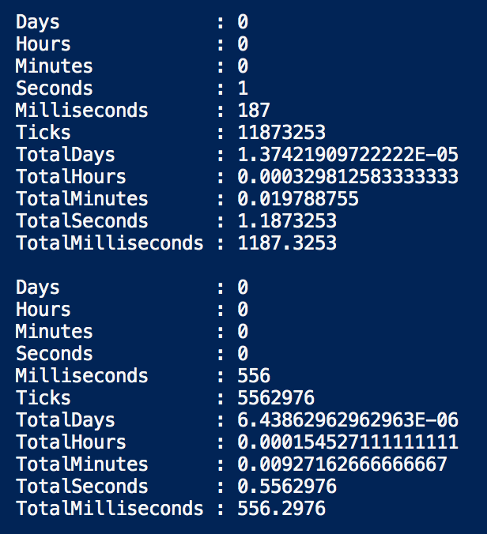


又如对 ESXi 本地盘数量的统计：

虽然 esxcli 看似步骤更多，代码更多，但使用 esxcli 的效率明显高于 get-scsilun 的效率

```powershell
$ESXCLI = Get-EsxCli -VMHost $VMHost 
$luncount=$ESXCLI.storage.core.device.list() | select DeviceType | where DeviceType -eq "Direct-Access"
write-host "Count is" $luncount.Count -ForegroundColor Green
```


```powershell
$luncount=get-vmhost $VMhost| Get-ScsiLun -LunType disk 
write-host "Count is" $luncount.Count -ForegroundColor Green
```


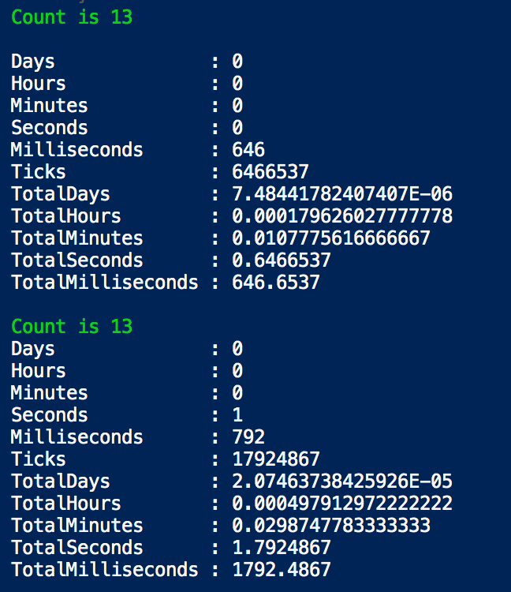


又如获取主机 BIOS 信息，加了过滤和不加过滤也有差异：

```powershell
 $biosHost = Get-VMHost $vmHost | Get-View -Property hardware
 Write-Host $biosHost.Hardware.BiosInfo.biosversion
```


```powershell
 $biosHost = Get-VMHost $vmHost | Get-View
Write-Host $biosHost.Hardware.BiosInfo.biosversion
```

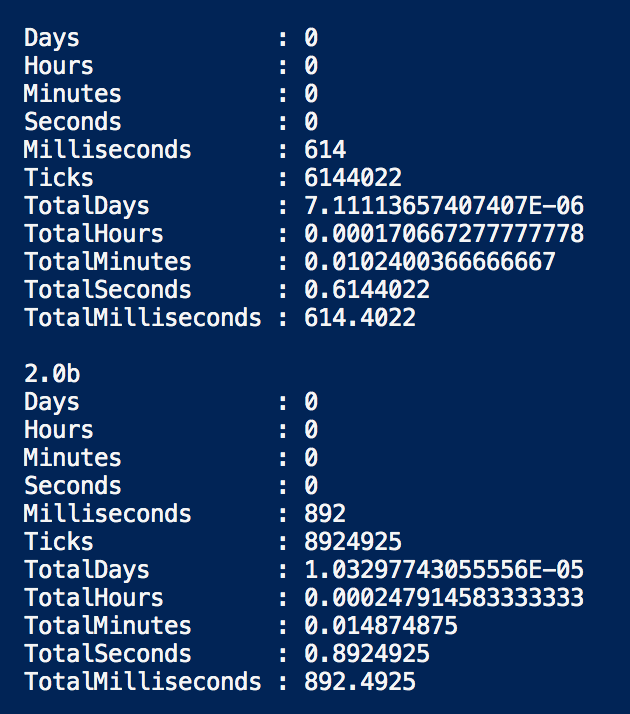

遇到大量代码时，需要反复测试不同写法带来的速度差异，选择最优的。

## 赋值远比执行一条命令快捷

另外测试发现，所有赋值的操作速度都低于 1ms，所以这类操作并不影响性能。具体到代码优化上，应该尽可能减少与 vCenter 的交互。例如获取主机所在集群：

```powershell
Get-VMHost $vmHost | Get-cluster
#或者
Get-Cluster -vmhost $vmHost
```


```powershell
$info.cluster=  $vmhost.Parent.name
```

直接的赋值远比执行一条命令快。三条命令执行速度分别如下：

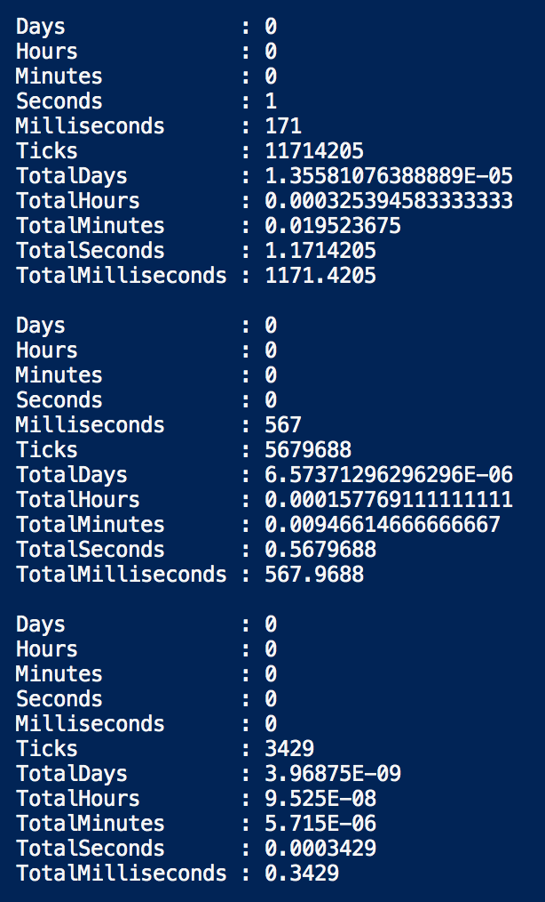

通过上述的方法逐行对一个硬件信息统计脚本进行了优化。优化前需要 15 分钟，稍微优化一下就降到了 8 分钟。

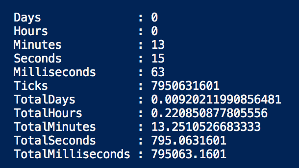

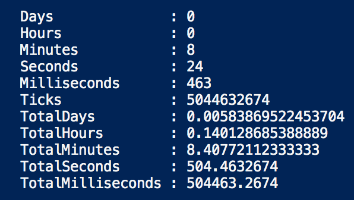

# 多线程

## 多线程使用前提条件

如果要使用 powershell 的多线程，前提条件有：

- Powershell 3.0 以上版本
- 宿主机的内存和CPU足够多
- 确保程序可以多线程运行

*注意：在进行多线程改造前，需要确保多线程运行时，多个线程间不会冲突。*例如多个进程同时写入文件便会冲突，但是同时读取一个文件就没问题。


## PSJobs ：Powershell 的多线程任务

实现 powershell 多线程的最快方法是用 PSJobs，此 cmdlet 内置于 *Microsoft.PowerShell.Core*  中，可以使用下列命令查看此 cmdlet 下的命令：

```powershell
Get-Command *-Job
```

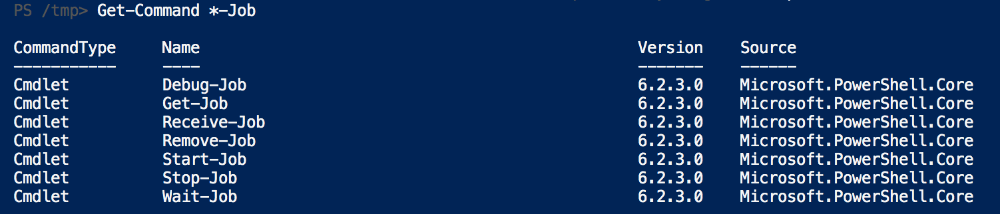

PSJobs 共有8种状态，最常用的如下：

- Completed ：Job 已经完成，可以获取 job 输出的信息，或者 job 可以被安全移除。
- Running：Job 正在运行，无法停止（除非强制停止），无法获取输出信息。
- Blocked：Job 正在运行，但是系统提示要求输入信息才能继续。
- Failed：执行 Job 时出错。


## get-job 获取 job 状态

通过 **get-job** 命令可以查看 Job 的运行情况。


下列命令用于创建一个任务并查看任务的状态：

```powershell
PS51> Start-Job -Scriptblock {Start-Sleep 5}
PS51> Get-Job
```


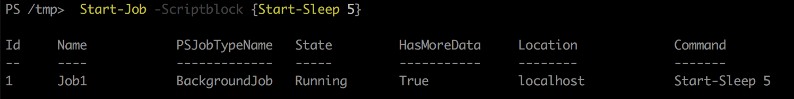

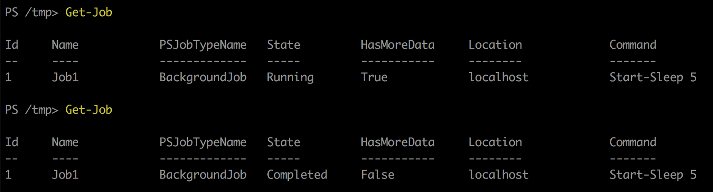


上例中，如果任务还在运行，则 State 显示 Running，如果运行完毕，State 为 Completed。

另外在运行完后 HasMoreData 值为 False，表示此 Job 没有输出。


下图是其他状态的截图，使用的命令见 Command 列。

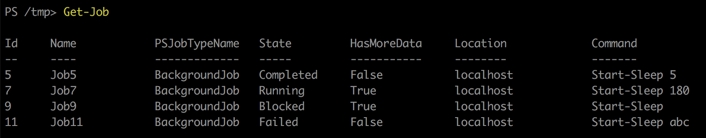


### start-job 开始任务

使用 Start-Job 可以创建一个新的任务，如果使用 measure-command 查看任务执行时间，可以看到远远小于命令真实的执行时间。

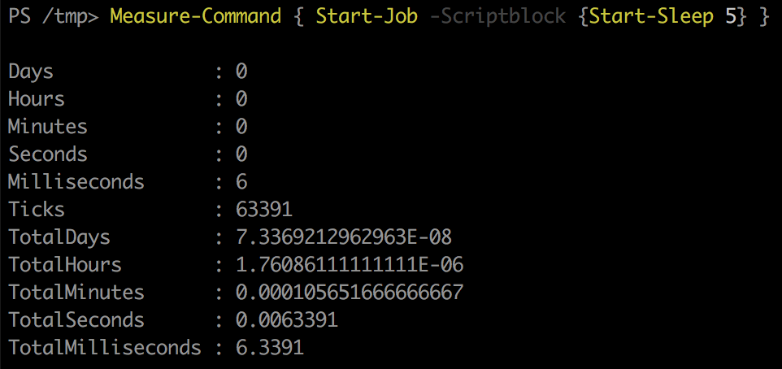


### receive-job 获取任务输出

```powershell
$Job = Start-Job -ScriptBlock {Write-Output 'Hello World'}
Receive-Job $Job
```

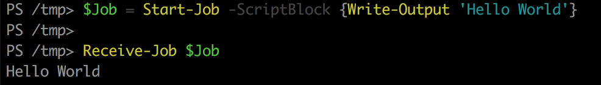

### 参数传递

默认 start-job 生产的任务无法使用全局定义的变量，需要 ArgumentList 进行变量的传递。

```powershell
Start-Job -Scriptblock {param ($Text) Write-Output $Text} -ArgumentList "Hello world!"
```


### 任务执行完毕后的操作

在做一些批量收集的时候，我们通过 `start-job` 来创建了大量的 Job，但这只是下发了任务，我们还需要在任务执行完毕后读取并处理数据，在此我使用 for 循环定期检查 Job 是不是已经完成，只有等待完成后才批量读取数据，具体操作如下：

```powershell
 $tasklist=@(
 "task1"
 "task2"
 "task3"
 )
 
 $jobs=@()
  Foreach ($task in $tasklist) {
	write-host "Starting Job..."
  $jobs += start-job -ScriptBlock {
  param ($taskname)
  	sleep 5
 		Write-Output "Task Finished : "$taskname
		} -ArgumentList $task
}

while($jobs.state -contains "Running")
  {write-host "still running!" -ForegroundColor Yellow
  sleep 1
  }  
 
write-host "Finished!" -ForegroundColor Green

receive-job $jobs
  
```


### 输出优化

上面提到可以在 job 内使用 `Write-Output ` 输出信息 ，job 外使用`receive-job` 来接受信息，

在实际测试时发现 `Write-Output ` 对于一个比较大的变量效率非常低（例如我尝试输出 get-vmhost 的结果，几十分钟没有反应），低到怀疑人生，因此最佳方法是在 Job 内完成该有的过滤。

例如：

```powershell
Measure-Command{
  write-host "Starting Job..."
  $job = start-job -ScriptBlock {
$debuginfo=Connect-VIServer -Server "192.168.1.1" -User 'administrator@vsphere.local' -Password 'VMware1!' -WarningAction Ignore

  $vmHost =get-vmhost "esx06.vsphere.local"
Write-Output $vmHost
Disconnect-VIServer -Server "192.168.1.1" -Confirm:$false
}

while($job.state -contains "Running")
  {write-host "still running!" -ForegroundColor Yellow
  sleep 1
  }  
write-host "Finished!" -ForegroundColor Green
receive-job $job

}
```


```powershell
Measure-Command{
  write-host "Starting Job..."
  $job = start-job -ScriptBlock {
$debuginfo=Connect-VIServer -Server "192.168.1.1" -User 'administrator@vsphere.local' -Password 'VMware1!' -WarningAction Ignore

  $vmHost =get-vmhost "esx06.vsphere.local"| select name,Version
Write-Output $vmHost
Disconnect-VIServer -Server "192.168.1.1" -Confirm:$false
}

while($job.state -contains "Running")
  {write-host "still running!" -ForegroundColor Yellow
  sleep 1
  }  
write-host "Finished!" -ForegroundColor Green
receive-job $job

}
```


后面的只是在输出是增加了 `select name,Version` ，执行时间只有 7 秒，而前面的程序几十分钟了还没反应。

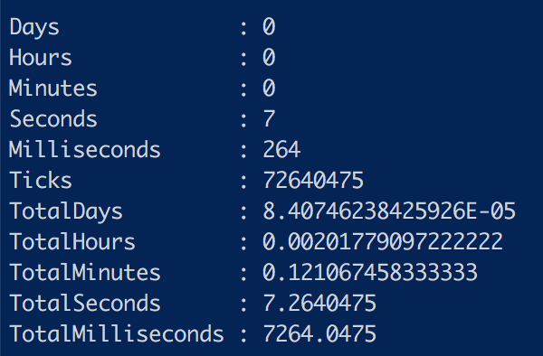


# 应用于 PowerCLI

在应用于 PowerCLI 时，发现每个 job 都必须单独连接 vCenter，好在这个操作无需交互，为了减少无用的输出，可以在命令前加上 `$debuginfo=`：

```powershell
$debuginfo=Set-PowerCLIConfiguration -Scope User -ParticipateInCEIP $false -Confirm:$false
$debuginfo=Connect-VIServer -Server "192.168.1.1" -User 'administrator@vsphere.local' -Password 'VMware1!' -WarningAction Ignore
```


一个最终优化的主机、BIOS、CPU、内存、硬盘信息收集脚本如下：

```powershell
Measure-Command{
  
  $esxilocationlist=@(
Cluster-01
Cluster-02
Cluster-03
Cluster-04
Cluster-05
  )


  $jobs=@()
  Foreach ($esxilocation in $esxilocationlist) {
    write-host "starting job on "$esxilocation -ForegroundColor Green
   
    $jobs += start-job -ScriptBlock {
    param ($esxilocation2) 

   $debuginfo=Connect-VIServer -Server "192.168.1.1" -User 'administrator@vsphere.local' -Password 'VMware1!' -WarningAction Ignore
   
    $vmHosts =get-vmhost -location $esxilocation2
    
    $outputInfo = @()
    Foreach ($vmHost in $vmHosts) {
      $biosHost = Get-VMHost $vmHost | Get-View  -Property hardware
      $mgmtip=Get-VMHostNetworkAdapter -VMHost $VMHost -VMKernel | where {$_.ManagementTrafficEnabled -eq $True }
      $ESXCLI = Get-EsxCli -VMHost $VMHost -WarningAction Ignore
      $luncount=$ESXCLI.storage.core.device.list() | select DeviceType | where DeviceType -eq "Direct-Access"
      $sninfo=$ESXCLI.hardware.platform.get() 
      
      $Info = "" | Select Cluster, VMHost,MGMT_IP , Manufacturer, Model,BIOS,SN, ESXiVersion,Build, CPU,CPUnum,Mem,Diskcount
      $info.cluster=  $vmhost.Parent.name
      $Info.VMHost = $vmHost.Name
      $Info.MGMT_IP = $mgmtip.ip
      $Info.Manufacturer = $vmHost.Manufacturer
      $Info.Model = $vmHost.model
      $Info.BIOS=  $biosHost.Hardware.BiosInfo.BiosVersion
      $Info.SN=$sninfo.SerialNumber
      $Info.ESXiVersion = $vmHost.Version
      $Info.Build = $vmHost.Build
      $Info.Cpu = $vmHost.ProcessorType
      $Info.Cpunum = $vmHost.NumCpu
      $Info.Mem= $vmHost.MemoryTotalGB
      $Info.Diskcount=$luncount.Count
      $outputInfo += $Info
    }
    
    Disconnect-VIServer -Server "192.168.1.1" -Confirm:$false
    
 
    Write-Output  $outputInfo
 
  } -ArgumentList $esxilocation
 
 sleep 2
 #创建下一个进程前休息一下
 
 }
 
#检查所有任务是否均已完成
while($jobs.state -contains "Running")
  {write-host "still running!" -ForegroundColor Yellow
  sleep 1
  }

write-host "Finished!" -ForegroundColor Green

#收集所有job的输出
$allinfo=receive-job $jobs
$allinfo = $AllInfo | Select Cluster, VMHost,MGMT_IP , Manufacturer, Model,BIOS,SN, ESXiVersion,Build, CPU,CPUnum,Mem,Diskcount
     
$AllInfo 
$AllInfo |Export-Csv -NoTypeInformation BIOS-info.csv
  
# Export to HTML
$css  = "table{ Margin: 0px 0px 0px 4px; Border: 1px solid rgb(200, 200, 200); Font-Family: Tahoma; Font-Size: 8pt; Background-Color: rgb(252, 252, 252); }"
$css += "tr:hover td { Background-Color: #6495ED; Color: rgb(255, 255, 255);}"
$css += "tr:nth-child(even) { Background-Color: rgb(242, 242, 242); }"
Set-Content -Value $css -Path BIOS-info.css
$AllInfo | ConvertTo-Html -CSSUri "BIOS-info.css" | Set-Content "BIOS-info.html"
}


```


多线程跑起来了，电脑也跟着卡了，不过整体来说比较值得。

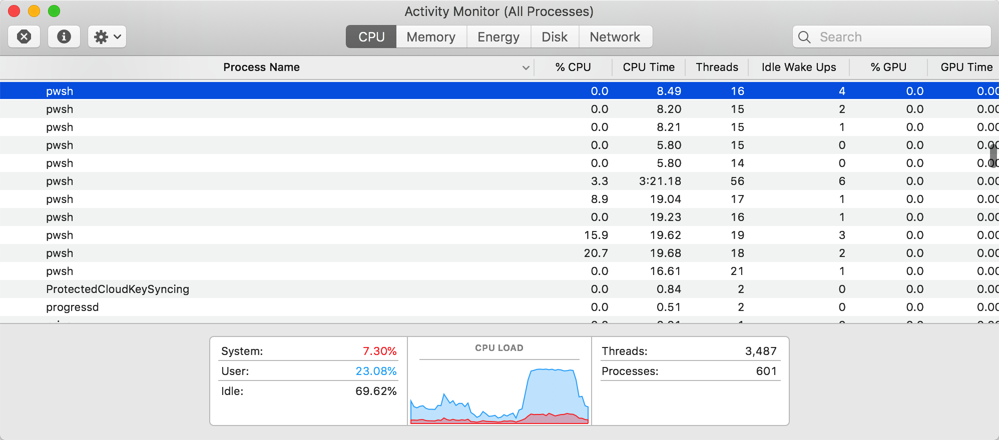


最终使用多线程优化的执行速度不到 3 分钟，又远远超过之前的 8 分钟：

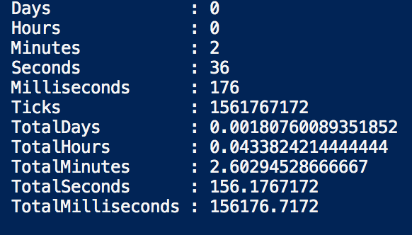


运行结果如下：

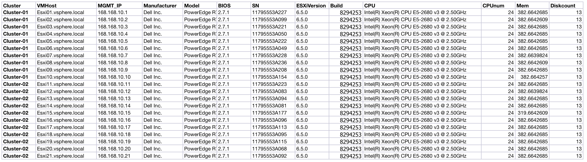