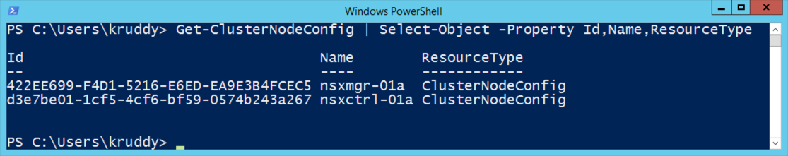
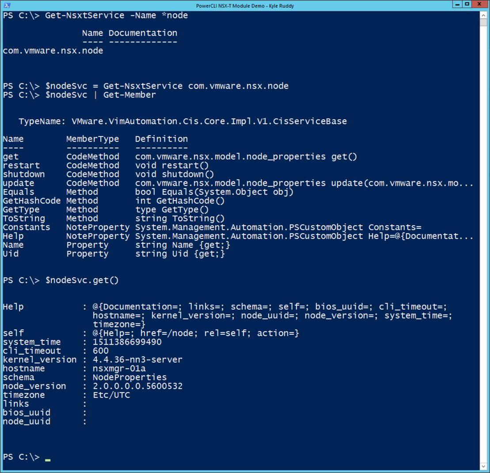
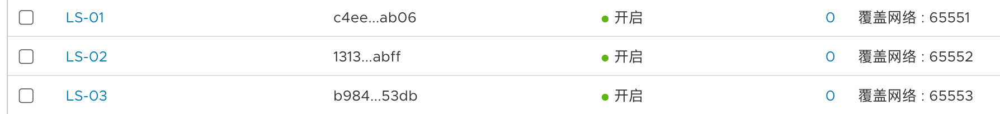
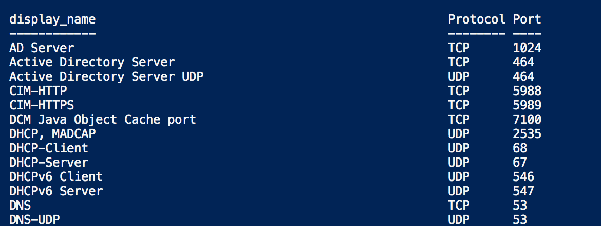
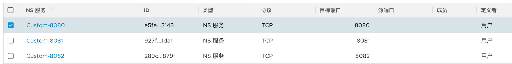
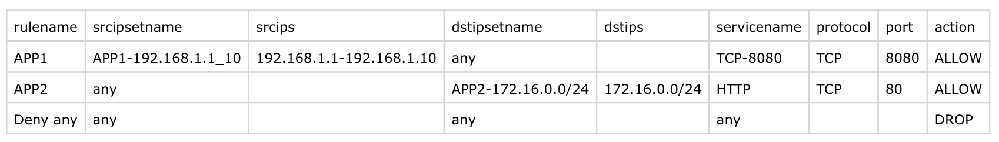
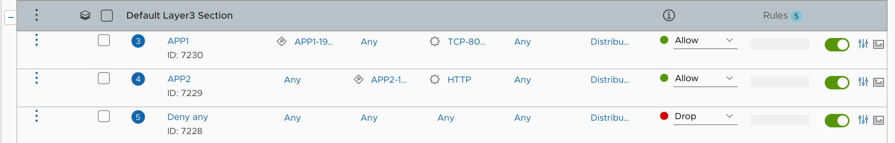
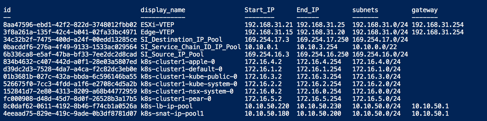

# NSX-T 相关
{: .no_toc}

# 目录
{: .no_toc .text-delta }

1. TOC
{:toc}

## 简介

NSX-T 有两种 powercli 模块，一个是官方出品的低阶模块，直接集成在了powercli中。

另一个是高阶的还未完成开发的模块，被放在了 Fling 上（[链接](https://flings.vmware.com/powercli-preview-for-nsx-t)），高阶的模块依赖于低阶的模块。


那为啥要有高阶模块？

低阶模块的命令就像直接调用API一样复杂，在使用上需要先用 create 创建某个对象的变量，然后再补全变量中的参数，目前也没有特别好的帮助文档，用着很复杂。

高阶模块就类似于我们平时用的 get-vmhost，非常简单易用。


参考链接：

[https://blogs.vmware.com/PowerCLI/2017/11/getting-started-nsx-t-powercli.html](https://blogs.vmware.com/PowerCLI/2017/11/getting-started-nsx-t-powercli.html)

[https://www.vmbaggum.nl/2019/03/automate-nsx-t-with-powercli/](https://www.vmbaggum.nl/2019/03/automate-nsx-t-with-powercli/)

## Powercli Fling 

目前 powercli Fling 只有一些 get 的功能，仅能用于报表生成等，还不能创建资源

```powershell
PS C:\Users\Administrator>  Get-Command -Module VMware.VimAutomation.Nsxt.Commands

Get-AcceptableComponentVersion                 
Get-ActionableResourceListResult               
Get-AdvertisementConfig                        
Get-AdvertiseRuleList                          
Get-AllocationIpAddress                        
Get-AppDiscoverySession                        
Get-AppDiscoverySessionResultSummary           
Get-AppDiscoveryVmInfo                         
Get-AppInfo                                    
Get-ApplianceManagementTaskProperties          
Get-AppProfile                                 
Get-Association                                
Get-AuthenticationPolicyProperties             
Get-AwsAccount                                 
Get-AwsAccountStatus                           
Get-AwsGatewayAmiInfo                          
Get-AwsGatewayDeployConfig                     
Get-AwsGatewayStatus                           
Get-AwsKeyPair                                 
Get-AwsRegion                                  
Get-AwsSubnet                                  
Get-AwsVpc                                     
Get-BackupConfiguration                        
Get-BackupOperationHistory                     
Get-BaseHostSwitchProfile                      
Get-BaseSwitchingProfile                       
Get-BfdConfig                                  
Get-BgpConfig                                  
Get-BgpNeighbor                                
Get-BridgeCluster                              
Get-BridgeClusterStatus                        
Get-BridgeEndpoint                             
Get-BridgeEndpointStatistics                   
Get-BridgeEndpointStatus                       
Get-Certificate                                
Get-CloudVirtualMachine                        
Get-ClusterBackupInfo                          
Get-ClusterConfig                              
Get-ClusterNodeConfig                          
Get-ClusterNodeConfigNetworkInterface          
Get-ClusterNodeConfigNetworkInterfaceStat      
Get-ClusterNodeStatus                          
Get-ClusterProfile                             
Get-ClusterRestoreStatus                       
Get-ClusterStatus                              
Get-CommunicationEntry                         
Get-CommunicationMap                           
Get-CommunicationProfile                       
Get-CommunicationProfileEntry                  
Get-ComputeCollection                          
Get-ComputeCollectionFabricTemplate            
Get-ComputeCollectionTransportNodeTemplate     
Get-ComputeCollectionTransportNodeTemplateState
Get-ComputeManager                             
Get-ComputeManagerState                        
Get-ComputeManagerStatus                       
Get-Crl                                        
Get-CsmStatus                                  
Get-CurrentBackupOperationStatus               
Get-CurrentRealizationStateBarrier             
Get-DeploymentZone                             
Get-DhcpIpPool                                 
Get-DhcpLeases                                 
Get-DhcpProfile                                
Get-DhcpRelayProfile                           
Get-DhcpRelayService                           
Get-DhcpServerStatus                           
Get-DhcpStaticBinding                          
Get-DhcpStatistics                             
Get-DiscoveredNode                             
Get-DneGlobalConfig                            
Get-DneKeyManager                              
Get-DneKeyPolicy                               
Get-DneKeyPolicyRule                           
Get-DneKeyPolicyStats                          
Get-DneRuleState                               
Get-DneRuleStats                               
Get-DneSection                                 
Get-DneSectionRule                             
Get-DneSectionState                            
Get-Domain                                     
Get-DomainDeploymentMap                        
Get-EdgeCluster                                
Get-EffectiveMemberTypeListResult              
Get-EnforcementPoint                           
Get-ErrorResolverInfo                          
Get-EulaAcceptance                             
Get-EulaContent                                
Get-ExcludeList                                
Get-FabricVirtualMachine                       
Get-FeatureStackCollectionConfiguration        
Get-FeatureUsageList                           
Get-FileThumbprint                             
Get-FirewallRule                               
Get-FirewallSection                            
Get-FirewallSectionState                       
Get-FirewallStats                              
Get-FirewallStatus                             
Get-GlobalCollectionConfiguration              
Get-Group                                      
Get-HeatMapTransportZoneStatus                 
Get-Infra                                      
Get-InterfaceNeighborProperties                
Get-IpBlock                                    
Get-IpBlockSubnet                              
Get-IpfixCollectorConfig                       
Get-IpfixConfig                                
Get-IpfixObsPoint                              
Get-IpfixObsPointSwitchGlobal                  
Get-IpPool                                     
Get-IPPrefixList                               
Get-IPSet                                      
Get-LbAppProfile                               
Get-LbClientSslProfile                         
Get-LbMonitor                                  
Get-LbPersistenceProfile                       
Get-LbPool                                     
Get-LbPoolStatistics                           
Get-LbPoolStatus                               
Get-LbServerSslProfile                         
Get-LbService                                  
Get-LbServiceStatistics                        
Get-LbServiceStatus                            
Get-LbVirtualServer                            
Get-LbVirtualServerStatistics                  
Get-LbVirtualServerStatus                      
Get-License                                    
Get-LogicalDhcpServer                          
Get-LogicalPort                                
Get-LogicalPortOperationalStatus               
Get-LogicalPortState                           
Get-LogicalPortStatistics                      
Get-LogicalRouter                              
Get-LogicalRouterPort                          
Get-LogicalRouterPortArpEntry                  
Get-LogicalRouterPortStatistics                
Get-LogicalRouterPortStatisticsSummary         
Get-LogicalRouterRoutingForwardingTable        
Get-LogicalRouterRoutingRouteTable             
Get-LogicalRouterRoutingRoutingTable           
Get-LogicalRouterStatus                        
Get-LogicalService                             
Get-LogicalSwitch                              
Get-LogicalSwitchState                         
Get-LogicalSwitchStatistics                    
Get-LogicalSwitchStatus                        
Get-LogicalSwitchStatusSummary                 
Get-MACAddressElement                          
Get-MacPool                                    
Get-MACSet                                     
Get-ManagementConfig                           
Get-MandatoryAccessControlProperties           
Get-MetadataProxy                              
Get-MetadataProxyStatistics                    
Get-MetadataProxyStatus                        
Get-NatRule                                    
Get-NatStatisticsPerRule                       
Get-NatStatisticsPerTransportNode              
Get-NetworkEncryptionStatus                    
Get-Node                                       
Get-NodeAuthProviderVidmProperties             
Get-NodeAuthProviderVidmStatus                 
Get-NodeCapabilitiesResult                     
Get-NodeHttpServiceProperties                  
Get-NodeHttpServicePropertiesStatus            
Get-NodeInfo                                   
Get-NodeInstallUpgradeServiceProperties        
Get-NodeInstallUpgradeServicePropertiesStatus  
Get-NodeLogProperties                          
Get-NodeNameServersProperties                  
Get-NodeNetworkInterface                       
Get-NodeNetworkInterfaceProperties             
Get-NodeNetworkInterfacePropertiesStat         
Get-NodeNetworkInterfaceStat                   
Get-NodeNetworkProperties                      
Get-NodeNtpServiceProperties                   
Get-NodeNtpServicePropertiesStatus             
Get-NodeProcessProperties                      
Get-NodeProperties                             
Get-NodePropertiesService                      
Get-NodePropertiesServiceCmInventory           
Get-NodePropertiesServiceCmInventoryStatus     
Get-NodePropertiesServiceLiagent               
Get-NodePropertiesServiceLiagentStatus         
Get-NodePropertiesServiceMgmtPlaneBus          
Get-NodePropertiesServiceMgmtPlaneBusStatus    
Get-NodePropertiesServiceNodeMgmt              
Get-NodePropertiesServiceNodeMgmtStatus        
Get-NodePropertiesServiceNsxMessageBus         
Get-NodePropertiesServiceNsxMessageBusStatus   
Get-NodePropertiesServiceNsxUpgradeAgent       
Get-NodePropertiesServiceNsxUpgradeAgentStatus 
Get-NodePropertiesServiceSearch                
Get-NodePropertiesServiceSearchStatus          
Get-NodePropertiesServiceSnmp                  
Get-NodePropertiesServiceSnmpStatus            
Get-NodePropertiesServiceSyslog                
Get-NodePropertiesServiceSyslogStatus          
Get-NodeProtonServiceProperties                
Get-NodeProtonServicePropertiesStatus          
Get-NodeRouteProperties                        
Get-NodeSearchDomainsProperties                
Get-NodeSshServiceProperties                   
Get-NodeSshServicePropertiesStatus             
Get-NodeState                                  
Get-NodeStatus                                 
Get-NodeSummaryList                            
Get-NodeSyslogExporterProperties               
Get-NodeUserProperties                         
Get-Normalization                              
Get-NSGroup                                    
Get-NSGroupEffectiveIPAddressMember            
Get-NSGroupEffectiveLogicalPortMember          
Get-NSGroupEffectiveLogicalSwitchMember        
Get-NSGroupEffectiveVirtualMachineMember       
Get-NSGroupMetaInfo                            
Get-NSGroupUnassociatedVirtualMachine          
Get-NSService                                  
Get-NSServiceGroup                             
Get-NsxManagerAccount                          
Get-object                                     
Get-PolicyTemplate                             
Get-PortConnectionEntities                     
Get-PortMirroringSession                       
Get-PortStatus                                 
Get-PrincipalIdentity                          
Get-RealizationStateBarrierConfig              
Get-RealizedEnforcementPoint                   
Get-RealizedFirewallSection                    
Get-RealizedNSGroup                            
Get-RealizedNSService                          
Get-RealizedSecurityGroup                      
Get-RedistributionConfig                       
Get-RedistributionRuleList                     
Get-RegistrationToken                          
Get-RestoreConfiguration                       
Get-Role                                       
Get-RoleBinding                                
Get-RouteMap                                   
Get-RoutingConfig                              
Get-RuleState                                  
Get-Service                                    
Get-ServiceEntry                               
Get-ServiceProfile                             
Get-SoftwareModuleResult                       
Get-SshKeyProperties                           
Get-StaticHopBfdPeer                           
Get-StaticRoute                                
Get-SwitchingProfileStatus                     
Get-TaskProperties                             
Get-Traceflow                                  
Get-TraceflowObservation                       
Get-TransportNode                              
Get-TransportNodeRemoteTransportNodeStatus     
Get-TransportNodeState                         
Get-TransportNodeStatus                        
Get-TransportZone                              
Get-TransportZoneProfile                       
Get-TransportZoneStatus                        
Get-TransportZoneTransportNodeStatus           
Get-TrustManagementData                        
Get-TrustManagementDataCsrPemFile              
Get-TunnelProperties                           
Get-UpgradeEulaAcceptance                      
Get-UpgradeEulaContent                         
Get-UpgradeHistory                             
Get-UpgradePlanSettings                        
Get-UpgradeStatus                              
Get-UpgradeSummary                             
Get-UpgradeUnitAggregateInfo                   
Get-UpgradeUnitGroup                           
Get-UpgradeUnitGroupAggregateInfo              
Get-UpgradeUnitStatus                          
Get-UpgradeUnitTypeStats                       
Get-UserInfo                                   
Get-VidmGroup                                  
Get-VidmUser                                   
Get-VirtualNetworkInterface                    
Get-VniPool                                    
Get-VtepLabelPool     
```


使用下列命令查看用法

```
PS C:\Users\Administrator> Get-Command -Syntax Get-ClusterStatus

Get-ClusterStatus [-Source <string>] [-Server <NsxtServerInterop[]>] [<CommonParameters>]
```


举例：

```powershell
Get-ClusterNodeConfig | Select-Object -Property Id,Name,ResourceType
```




更多内容可参考此链接：

[https://blogs.vmware.com/PowerCLI/2018/04/powercli-nsx-t-fling.html](https://blogs.vmware.com/PowerCLI/2018/04/powercli-nsx-t-fling.html)

---

接下来，就是低阶 powercli 的相关命令

## 连接 NSX-T server

在使用 nsx-t 的模块时，系统报 `connect-nsxtserver 基础连接已经关闭：未能为 SSL/TLS 安全通道建立信任关系`

此时可以使用下列命令忽略证书相关的错误：

```powershell
Set-PowerCLIConfiguration -InvalidCertificateAction Ignore -confirm:$false
```


连接到 NSX-T manager 

```powershell
Connect-NsxtServer -server 192.168.1.2
```


NSX-T 的模块只有三条命令，剩余两个命令是：

```powershell
Disconnect-NsxtServer
#断开 NSX-T Manager

Get-NsxtService
#囊括所有 NSX-T 的服务的操作
```


## Service查看及配置

### 1、查看所有可用的 service

```powershell
Get-NsxtService 

#执行上述命令，可以查看所有powercli支持的service，大部分的交换、路由、安全、负载均衡模块均可以看到

Name
----
com.vmware.nsx.aaa.registration_token
com.vmware.nsx.aaa.role_bindings
com.vmware.nsx.aaa.roles
com.vmware.nsx.aaa.user_info
com.vmware.nsx.aaa.vidm.groups
com.vmware.nsx.aaa.vidm.search
com.vmware.nsx.aaa.vidm.users
com.vmware.nsx.administration.audit_logs
com.vmware.nsx.administration.support_bundles
com.vmware.nsx.app_discovery.app_profiles
com.vmware.nsx.app_discovery.sessions
com.vmware.nsx.app_discovery.sessions.app_profiles
com.vmware.nsx.app_discovery.sessions.installed_apps
com.vmware.nsx.app_discovery.sessions.ns_groups
com.vmware.nsx.app_discovery.sessions.ns_groups.members
com.vmware.nsx.app_discovery.sessions.re_classify
com.vmware.nsx.app_discovery.sessions.summary
com.vmware.nsx.associations
com.vmware.nsx.batch
com.vmware.nsx.bridge_clusters
com.vmware.nsx.bridge_clusters.status
com.vmware.nsx.bridge_endpoint_profiles
com.vmware.nsx.bridge_endpoints
com.vmware.nsx.bridge_endpoints.statistics
com.vmware.nsx.bridge_endpoints.status
com.vmware.nsx.capacity.threshold
com.vmware.nsx.capacity.usage
com.vmware.nsx.cluster
com.vmware.nsx.cluster_profiles
com.vmware.nsx.cluster.api_certificate
com.vmware.nsx.cluster.api_service
com.vmware.nsx.cluster.api_virtual_ip
com.vmware.nsx.cluster.backups
com.vmware.nsx.cluster.backups.config
com.vmware.nsx.cluster.backups.history
com.vmware.nsx.cluster.backups.status
com.vmware.nsx.cluster.node
com.vmware.nsx.cluster.nodes
com.vmware.nsx.cluster.nodes.deployments
com.vmware.nsx.cluster.nodes.deployments.status
com.vmware.nsx.cluster.nodes.network.interfaces
com.vmware.nsx.cluster.nodes.network.interfaces.stats
com.vmware.nsx.cluster.nodes.repo_sync.status
com.vmware.nsx.cluster.nodes.status
com.vmware.nsx.cluster.restore
com.vmware.nsx.cluster.restore.backuptimestamps
com.vmware.nsx.cluster.restore.config
com.vmware.nsx.cluster.restore.instruction_resources
com.vmware.nsx.cluster.restore.status
com.vmware.nsx.cluster.status
com.vmware.nsx.compute_collection_transport_node_templates
com.vmware.nsx.compute_collection_transport_node_templates.state
com.vmware.nsx.configs.inventory
com.vmware.nsx.configs.management
com.vmware.nsx.dhcp.relay_profiles
com.vmware.nsx.dhcp.relays
com.vmware.nsx.dhcp.server_profiles
com.vmware.nsx.dhcp.servers
com.vmware.nsx.dhcp.servers.ip_pools
com.vmware.nsx.dhcp.servers.leases
com.vmware.nsx.dhcp.servers.static_bindings
com.vmware.nsx.dhcp.servers.statistics
com.vmware.nsx.dhcp.servers.status
com.vmware.nsx.directory.domains
com.vmware.nsx.directory.domains.groups
com.vmware.nsx.directory.domains.groups.member_groups
com.vmware.nsx.directory.domains.ldap_servers
com.vmware.nsx.directory.domains.sync_stats
com.vmware.nsx.directory.ldap_server
com.vmware.nsx.dns.forwarders
com.vmware.nsx.dns.forwarders.nslookup
com.vmware.nsx.dns.forwarders.statistics
com.vmware.nsx.dns.forwarders.status
com.vmware.nsx.edge_clusters
com.vmware.nsx.edge_clusters.state
com.vmware.nsx.edge_clusters.status
com.vmware.nsx.error_resolver
com.vmware.nsx.eula.accept
com.vmware.nsx.eula.acceptance
com.vmware.nsx.eula.content
com.vmware.nsx.fabric.compute_collection_fabric_templates
com.vmware.nsx.fabric.compute_collections
com.vmware.nsx.fabric.compute_collections.network.physical_interfaces
com.vmware.nsx.fabric.compute_managers
com.vmware.nsx.fabric.compute_managers.state
com.vmware.nsx.fabric.compute_managers.status
com.vmware.nsx.fabric.discovered_nodes
com.vmware.nsx.fabric.nodes
com.vmware.nsx.fabric.nodes.capabilities
com.vmware.nsx.fabric.nodes.modules
com.vmware.nsx.fabric.nodes.network.interfaces
com.vmware.nsx.fabric.nodes.network.interfaces.stats
com.vmware.nsx.fabric.nodes.state
com.vmware.nsx.fabric.nodes.status
com.vmware.nsx.fabric.ostypes
com.vmware.nsx.fabric.vifs
com.vmware.nsx.fabric.virtual_machines
com.vmware.nsx.fabric.virtual_machines.tools_info
com.vmware.nsx.firewall.excludelist
com.vmware.nsx.firewall.profiles
com.vmware.nsx.firewall.rules
com.vmware.nsx.firewall.rules.state
com.vmware.nsx.firewall.sections
com.vmware.nsx.firewall.sections.rules
com.vmware.nsx.firewall.sections.rules.stats
com.vmware.nsx.firewall.sections.state
com.vmware.nsx.firewall.sections.summary
com.vmware.nsx.firewall.stats
com.vmware.nsx.firewall.status
com.vmware.nsx.global_configs
com.vmware.nsx.host_switch_profiles
com.vmware.nsx.hpm.alarms
com.vmware.nsx.hpm.features
com.vmware.nsx.hpm.global_config
com.vmware.nsx.idfw.compute_collections.status
com.vmware.nsx.idfw.compute_collections.transport_nodes.status
com.vmware.nsx.idfw.idfw_compute_collections
com.vmware.nsx.idfw.master_switch_setting
com.vmware.nsx.idfw.nsgroup_vm_details
com.vmware.nsx.idfw.standalone_host_switch_setting
com.vmware.nsx.idfw.system_stats
com.vmware.nsx.idfw.transport_nodes.vms.status
com.vmware.nsx.idfw.user_session_data
com.vmware.nsx.idfw.user_stats
com.vmware.nsx.idfw.vm_stats
com.vmware.nsx.ip_sets
com.vmware.nsx.ip_sets.members
com.vmware.nsx.ipfix_collector_profiles
com.vmware.nsx.ipfix_obs_points
com.vmware.nsx.ipfix_obs_points.switch_global
com.vmware.nsx.ipfix_profiles
com.vmware.nsx.ipfix.collectorconfigs
com.vmware.nsx.ipfix.configs
com.vmware.nsx.licenses
com.vmware.nsx.licenses.licenses_usage
com.vmware.nsx.lldp.fabric_nodes.interfaces
com.vmware.nsx.lldp.transport_nodes.interfaces
com.vmware.nsx.loadbalancer.application_profiles
com.vmware.nsx.loadbalancer.client_ssl_profiles
com.vmware.nsx.loadbalancer.monitors
com.vmware.nsx.loadbalancer.persistence_profiles
com.vmware.nsx.loadbalancer.pools
com.vmware.nsx.loadbalancer.rules
com.vmware.nsx.loadbalancer.server_ssl_profiles
com.vmware.nsx.loadbalancer.services
com.vmware.nsx.loadbalancer.services.debug_info
com.vmware.nsx.loadbalancer.services.pools.statistics
com.vmware.nsx.loadbalancer.services.pools.status
com.vmware.nsx.loadbalancer.services.statistics
com.vmware.nsx.loadbalancer.services.status
com.vmware.nsx.loadbalancer.services.usage
com.vmware.nsx.loadbalancer.services.virtual_servers.statistics
com.vmware.nsx.loadbalancer.services.virtual_servers.status
com.vmware.nsx.loadbalancer.ssl.ciphers_and_protocols
com.vmware.nsx.loadbalancer.tcp_profiles
com.vmware.nsx.loadbalancer.virtual_servers
com.vmware.nsx.logical_ports
com.vmware.nsx.logical_ports.forwarding_path
com.vmware.nsx.logical_ports.mac_table
com.vmware.nsx.logical_ports.state
com.vmware.nsx.logical_ports.statistics
com.vmware.nsx.logical_ports.status
com.vmware.nsx.logical_router_ports
com.vmware.nsx.logical_router_ports.arp_table
com.vmware.nsx.logical_router_ports.state
com.vmware.nsx.logical_router_ports.statistics
com.vmware.nsx.logical_router_ports.statistics.summary
com.vmware.nsx.logical_routers
com.vmware.nsx.logical_routers.nat.rules
com.vmware.nsx.logical_routers.nat.rules.statistics
com.vmware.nsx.logical_routers.routing
com.vmware.nsx.logical_routers.routing.advertisement
com.vmware.nsx.logical_routers.routing.advertisement.rules
com.vmware.nsx.logical_routers.routing.bfd_config
com.vmware.nsx.logical_routers.routing.bgp
com.vmware.nsx.logical_routers.routing.bgp.community_lists
com.vmware.nsx.logical_routers.routing.bgp.communty_lists
com.vmware.nsx.logical_routers.routing.bgp.neighbors
com.vmware.nsx.logical_routers.routing.bgp.neighbors.status
com.vmware.nsx.logical_routers.routing.forwarding_table
com.vmware.nsx.logical_routers.routing.ip_prefix_lists
com.vmware.nsx.logical_routers.routing.redistribution
com.vmware.nsx.logical_routers.routing.redistribution.rules
com.vmware.nsx.logical_routers.routing.route_maps
com.vmware.nsx.logical_routers.routing.route_table
com.vmware.nsx.logical_routers.routing.routing_table
com.vmware.nsx.logical_routers.routing.static_routes
com.vmware.nsx.logical_routers.routing.static_routes.bfd_peers
com.vmware.nsx.logical_routers.service_cluster.state
com.vmware.nsx.logical_routers.state
com.vmware.nsx.logical_routers.status
com.vmware.nsx.logical_switches
com.vmware.nsx.logical_switches.mac_table
com.vmware.nsx.logical_switches.state
com.vmware.nsx.logical_switches.statistics
com.vmware.nsx.logical_switches.status
com.vmware.nsx.logical_switches.summary
com.vmware.nsx.logical_switches.vtep_table
com.vmware.nsx.mac_sets
com.vmware.nsx.mac_sets.members
com.vmware.nsx.md_proxies
com.vmware.nsx.md_proxies.statistics
com.vmware.nsx.md_proxies.status
com.vmware.nsx.migration.discovered_switches
com.vmware.nsx.migration.feedback_requests
com.vmware.nsx.migration.feedback_response
com.vmware.nsx.migration.feedback_summary
com.vmware.nsx.migration.grouped_feedback_requests
com.vmware.nsx.migration.logical_constructs.stats
com.vmware.nsx.migration.migration_unit_groups
com.vmware.nsx.migration.migration_unit_groups_status
com.vmware.nsx.migration.migration_unit_groups.aggregate_info
com.vmware.nsx.migration.migration_unit_groups.migration_unit
com.vmware.nsx.migration.migration_unit_groups.status
com.vmware.nsx.migration.migration_units
com.vmware.nsx.migration.migration_units_stats
com.vmware.nsx.migration.migration_units.aggregate_info
com.vmware.nsx.migration.nodes
com.vmware.nsx.migration.nodes_summary
com.vmware.nsx.migration.plan
com.vmware.nsx.migration.plan.settings
com.vmware.nsx.migration.setup
com.vmware.nsx.migration.status_summary
com.vmware.nsx.migration.summary
com.vmware.nsx.migration.switch
com.vmware.nsx.mirror_sessions
com.vmware.nsx.network_migration_specs
com.vmware.nsx.node
com.vmware.nsx.node.aaa.auth_policy
com.vmware.nsx.node.aaa.providers.vidm
com.vmware.nsx.node.aaa.providers.vidm.status
com.vmware.nsx.node.file_store
com.vmware.nsx.node.file_store.thumbprint
com.vmware.nsx.node.hardening_policy.mandatory_access_control
com.vmware.nsx.node.logs
com.vmware.nsx.node.mode
com.vmware.nsx.node.network
com.vmware.nsx.node.network.interfaces
com.vmware.nsx.node.network.interfaces.stats
com.vmware.nsx.node.network.name_servers
com.vmware.nsx.node.network.routes
com.vmware.nsx.node.network.search_domains
com.vmware.nsx.node.processes
com.vmware.nsx.node.rabbitmq_management_port
com.vmware.nsx.node.services
com.vmware.nsx.node.services.cluster_manager
com.vmware.nsx.node.services.cluster_manager.status
com.vmware.nsx.node.services.cm_inventory
com.vmware.nsx.node.services.cm_inventory.status
com.vmware.nsx.node.services.http
com.vmware.nsx.node.services.http.status
com.vmware.nsx.node.services.install_upgrade
com.vmware.nsx.node.services.install_upgrade.status
com.vmware.nsx.node.services.install_upgrade.uc_state
com.vmware.nsx.node.services.liagent
com.vmware.nsx.node.services.liagent.status
com.vmware.nsx.node.services.manager
com.vmware.nsx.node.services.manager.status
com.vmware.nsx.node.services.mgmt_plane_bus
com.vmware.nsx.node.services.mgmt_plane_bus.status
com.vmware.nsx.node.services.migration_coordinator
com.vmware.nsx.node.services.migration_coordinator.status
com.vmware.nsx.node.services.node_mgmt
com.vmware.nsx.node.services.node_mgmt.status
com.vmware.nsx.node.services.nsx_message_bus
com.vmware.nsx.node.services.nsx_message_bus.status
com.vmware.nsx.node.services.nsx_upgrade_agent
com.vmware.nsx.node.services.nsx_upgrade_agent.status
com.vmware.nsx.node.services.ntp
com.vmware.nsx.node.services.ntp.status
com.vmware.nsx.node.services.search
com.vmware.nsx.node.services.search.status
com.vmware.nsx.node.services.snmp
com.vmware.nsx.node.services.snmp.status
com.vmware.nsx.node.services.ssh
com.vmware.nsx.node.services.ssh.status
com.vmware.nsx.node.services.syslog
com.vmware.nsx.node.services.syslog.exporters
com.vmware.nsx.node.services.syslog.status
com.vmware.nsx.node.services.telemetry
com.vmware.nsx.node.services.telemetry.status
com.vmware.nsx.node.services.ui_service
com.vmware.nsx.node.services.ui_service.status
com.vmware.nsx.node.status
com.vmware.nsx.node.tasks
com.vmware.nsx.node.tasks.response
com.vmware.nsx.node.users
com.vmware.nsx.node.users.ssh_keys
com.vmware.nsx.node.version
com.vmware.nsx.normalizations
com.vmware.nsx.notification_watchers
com.vmware.nsx.notification_watchers.notifications
com.vmware.nsx.ns_groups
com.vmware.nsx.ns_groups.effective_directory_group_members
com.vmware.nsx.ns_groups.effective_ip_address_members
com.vmware.nsx.ns_groups.effective_ipset_members
com.vmware.nsx.ns_groups.effective_logical_port_members
com.vmware.nsx.ns_groups.effective_logical_switch_members
com.vmware.nsx.ns_groups.effective_transport_node_members
com.vmware.nsx.ns_groups.effective_vif_members
com.vmware.nsx.ns_groups.effective_virtual_machine_members
com.vmware.nsx.ns_groups.member_types
com.vmware.nsx.ns_groups.service_associations
com.vmware.nsx.ns_groups.unassociated_virtual_machines
com.vmware.nsx.ns_profiles
com.vmware.nsx.ns_profiles.attribute_types
com.vmware.nsx.ns_profiles.attributes
com.vmware.nsx.ns_service_groups
com.vmware.nsx.ns_services
com.vmware.nsx.pbr.sections
com.vmware.nsx.pbr.sections.rules
com.vmware.nsx.pbr.sections.rules.stats
com.vmware.nsx.pktcap.session
com.vmware.nsx.pktcap.sessions
com.vmware.nsx.pools.ip_blocks
com.vmware.nsx.pools.ip_pools
com.vmware.nsx.pools.ip_pools.allocations
com.vmware.nsx.pools.ip_subnets
com.vmware.nsx.pools.mac_pools
com.vmware.nsx.pools.vni_pools
com.vmware.nsx.pools.vtep_label_pools
com.vmware.nsx.realization_state_barrier.config
com.vmware.nsx.realization_state_barrier.current
com.vmware.nsx.service_configs
com.vmware.nsx.service_configs.effective_profiles
com.vmware.nsx.service_profiles
com.vmware.nsx.serviceinsertion.sections
com.vmware.nsx.serviceinsertion.sections.rules
com.vmware.nsx.serviceinsertion.service_attachments
com.vmware.nsx.serviceinsertion.service_chains
com.vmware.nsx.serviceinsertion.service_instances
com.vmware.nsx.serviceinsertion.service_managers
com.vmware.nsx.serviceinsertion.services
com.vmware.nsx.serviceinsertion.services.service_deployments
com.vmware.nsx.serviceinsertion.services.service_deployments.state
com.vmware.nsx.serviceinsertion.services.service_deployments.status
com.vmware.nsx.serviceinsertion.services.service_instances
com.vmware.nsx.serviceinsertion.services.service_instances.instance_endpoints
com.vmware.nsx.serviceinsertion.services.service_instances.instance_runtimes
com.vmware.nsx.serviceinsertion.services.service_instances.instance_runtimes.interfaces.statistics
com.vmware.nsx.serviceinsertion.services.service_instances.instance_runtimes.interfaces.status
com.vmware.nsx.serviceinsertion.services.service_instances.state
com.vmware.nsx.serviceinsertion.services.service_instances.status
com.vmware.nsx.serviceinsertion.services.service_profiles
com.vmware.nsx.serviceinsertion.services.service_profiles.nsgroups
com.vmware.nsx.serviceinsertion.services.service_profiles.service_chain_mappings
com.vmware.nsx.serviceinsertion.services.solution_configs
com.vmware.nsx.serviceinsertion.services.vendor_templates
com.vmware.nsx.services
com.vmware.nsx.switching_profiles
com.vmware.nsx.switching_profiles.summary
com.vmware.nsx.tasks
com.vmware.nsx.tasks.response
com.vmware.nsx.telemetry.agreement
com.vmware.nsx.telemetry.config
com.vmware.nsx.traceflows
com.vmware.nsx.traceflows.observations
com.vmware.nsx.transport_node_collections
com.vmware.nsx.transport_node_collections.state
com.vmware.nsx.transport_node_profiles
com.vmware.nsx.transport_nodes
com.vmware.nsx.transport_nodes.capabilities
com.vmware.nsx.transport_nodes.network.interfaces
com.vmware.nsx.transport_nodes.network.interfaces.stats
com.vmware.nsx.transport_nodes.pnic_bond_status
com.vmware.nsx.transport_nodes.remote_transport_node_status
com.vmware.nsx.transport_nodes.state
com.vmware.nsx.transport_nodes.statistics.nat_rules
com.vmware.nsx.transport_nodes.status
com.vmware.nsx.transport_nodes.tunnels
com.vmware.nsx.transport_zones
com.vmware.nsx.transport_zones.status
com.vmware.nsx.transport_zones.summary
com.vmware.nsx.transport_zones.transport_node_status
com.vmware.nsx.transportzone_profiles
com.vmware.nsx.trust_management
com.vmware.nsx.trust_management.certificates
com.vmware.nsx.trust_management.crl_distribution_points
com.vmware.nsx.trust_management.crl_distribution_points.status
com.vmware.nsx.trust_management.crls
com.vmware.nsx.trust_management.csrs
com.vmware.nsx.trust_management.principal_identities
com.vmware.nsx.trust_management.principal_identities.with_certificate
com.vmware.nsx.ui_views
com.vmware.nsx.ui_views.widgetconfigurations
com.vmware.nsx.upgrade
com.vmware.nsx.upgrade.bundles
com.vmware.nsx.upgrade.bundles.upload_status
com.vmware.nsx.upgrade.eula.accept
com.vmware.nsx.upgrade.eula.acceptance
com.vmware.nsx.upgrade.eula.content
com.vmware.nsx.upgrade.functional_state
com.vmware.nsx.upgrade.history
com.vmware.nsx.upgrade.nodes
com.vmware.nsx.upgrade.nodes_summary
com.vmware.nsx.upgrade.plan
com.vmware.nsx.upgrade.plan.settings
com.vmware.nsx.upgrade.status_summary
com.vmware.nsx.upgrade.summary
com.vmware.nsx.upgrade.uc_upgrade_status
com.vmware.nsx.upgrade.upgrade_checks_info
com.vmware.nsx.upgrade.upgrade_unit_groups
com.vmware.nsx.upgrade.upgrade_unit_groups_status
com.vmware.nsx.upgrade.upgrade_unit_groups.aggregate_info
com.vmware.nsx.upgrade.upgrade_unit_groups.status
com.vmware.nsx.upgrade.upgrade_unit_groups.upgrade_unit
com.vmware.nsx.upgrade.upgrade_units
com.vmware.nsx.upgrade.upgrade_units_stats
com.vmware.nsx.upgrade.upgrade_units.aggregate_info
com.vmware.nsx.upgrade.version_whitelist
com.vmware.nsx.vpn.ipsec.dpd_profiles
com.vmware.nsx.vpn.ipsec.ike_profiles
com.vmware.nsx.vpn.ipsec.local_endpoints
com.vmware.nsx.vpn.ipsec.peer_endpoints
com.vmware.nsx.vpn.ipsec.services
com.vmware.nsx.vpn.ipsec.sessions
com.vmware.nsx.vpn.ipsec.sessions.state
com.vmware.nsx.vpn.ipsec.sessions.statistics
com.vmware.nsx.vpn.ipsec.sessions.status
com.vmware.nsx.vpn.ipsec.sessions.summary
com.vmware.nsx.vpn.ipsec.tunnel_profiles
com.vmware.nsx.vpn.l2vpn.services
com.vmware.nsx.vpn.l2vpn.sessions
com.vmware.nsx.vpn.l2vpn.sessions.peer_codes
com.vmware.nsx.vpn.l2vpn.sessions.remote_mac
com.vmware.nsx.vpn.l2vpn.sessions.statistics
com.vmware.nsx.vpn.l2vpn.sessions.status
com.vmware.nsx.vpn.l2vpn.sessions.summary
com.vmware.nsx.vpn.services.summary

```


### 2、 将某 service 保存到变量

```powershell
$nodeSvc = Get-NsxtService com.vmware.nsx.node
```


### 3、 查看该 service 下可以执行的命令

```powershell
$nodeSvc | Get-Member
```


查看命令帮助

```powershell
$nodeSvc.help.get
$nodeSvc.help.create
```


### 4、执行命令

```powershell
$nodeSvc.get()
```


### 5、示例




## 配置举例

### 查看逻辑交换机

```powershell
Get-NsxtService -Name *switches
$logSwitchSvc = Get-NsxtService -Name com.vmware.nsx.logical_switches 
$logSwitchSvc | Get-Member
$logSwitches = $logSwitchSvc.list().results
$logSwitches
```

### 创建逻辑交换机

```powershell
$tZoneSvc = Get-NsxtService -Name com.vmware.nsx.transport_zones
#获取传输区域相关服务
$tZones = $tZoneSvc.list()
#获取当前已创建的传输区域
$tZones.results
#将结果显示出来

$logSwitchSvc = Get-NsxtService -Name com.vmware.nsx.logical_switches 
#获取逻辑交换机相关服务
$logSwitches = ($logSwitchSvc.list().results | Select-Object display_name)
write-host current logical switches are : 
$logSwitches
#显示当前已有的逻辑交换机，只显示名称

$logSwitchSpec = $logSwitchSvc.Help.create.logical_switch.Create()
$logSwitchSpec.admin_state = "UP"
$logSwitchSpec.display_name = "PowerCLI_Created_LS"
$logSwitchSpec.replication_mode = "MTEP"
$logSwitchSpec.transport_zone_id = ($tZones.results | Where-Object transport_type -eq OVERLAY).id
#假设环境中只有一个 Overlay 的传输区域，可以用上述命令来自动获取并设置 Tranport Zone ID

$logSwitchSpec
$logSwitchSvc.create($logSwitchSpec)
#创建逻辑交换机
```


#### 批量创建 LSW

powershell 默认支持 csv 导入，但是 NSX 很多对象用简单的 csv 不能实现，建议安装 excel 模块

```powershell
Install-Module -Name ImportExcel
```


```powershell

$logSwitchSvc = Get-NsxtService -Name com.vmware.nsx.logical_switches 
#获取逻辑交换机相关服务

$logSwitchSpec = $logSwitchSvc.Help.create.logical_switch.Create()
$logSwitchSpec.admin_state = "UP"
$logSwitchSpec.replication_mode = "MTEP"

$tZoneSvc = Get-NsxtService -Name com.vmware.nsx.transport_zones
#获取传输区域相关服务
$tZones = $tZoneSvc.list()
$logSwitchSpec.transport_zone_id = ($tZones.results | Where-Object transport_type -eq OVERLAY).id
#假设环境中只有一个 Overlay 的传输区域，可以用上述命令来自动获取并设置 Tranport Zone ID


$lswlist = Import-CSV ./lsw.csv 

Foreach ($lswname in $lswlist) 
{
$logSwitchSpec.display_name = $lswname.LS_Name

$logSwitchSpec
$logSwitchSvc.create($logSwitchSpec)
#创建逻辑交换机
}
```

csv 文件：

```csv
LS_Name
LS-01
LS-02
LS-03
```


创建结果：




### 创建路由器接口

一般 T1 和 T0 路由器比较少，工作量大的是创建三层接口，此处只测试创建downlink接口。


com.vmware.nsx.logical_router_ports


### 查看当前服务

```powershell
$servicesvc = Get-NsxtService -Name com.vmware.nsx.ns_services
$servicelist=$servicesvc.list()

$servicelist.results | select display_name,@{Name="Protocol";Expression={$_.nsservice_element.l4_protocol}},@{Name="Port";Expression={$_.nsservice_element.destination_ports}}
```





### 批量创建服务

```powershell
$servicelist = Import-CSV ./service.csv 

$servicesvc = Get-NsxtService -Name com.vmware.nsx.ns_services

Foreach ($service in $servicelist) 
{
$servicespec = $servicesvc.Help.create.ns_service.Create()

$servicespec.display_name = $service.servicename
$servicedetailspec = $servicesvc.Help.create.ns_service.nsservice_element.l4_port_set_NS_service.Create()
$servicedetailspec.destination_ports = New-Object System.Collections.Generic.List[string]
$servicedetailspec.destination_ports.add($service.port)
$servicedetailspec.l4_protocol = $service.protocol
$servicedetailspec.resource_type = "L4PortSetNSService"
$servicespec.nsservice_element = $servicedetailspec
$servicespec
$servicesvc.create($servicespec)
}
```




### 批量创建 IPset

```powershell
$table=Import-Csv ./ipset.csv


$fwruleipsetssvc = Get-NsxtService -Name com.vmware.nsx.ip_sets
$fwruleipsets=$fwruleipsetssvc.Help.create.ip_set.create()
$AllInfo = @()

foreach ($ipset in $table)
{
$fwruleipsets.display_name=@()
$fwruleipsets.display_name=$ipset.ipsetname
$fwruleipsets.ip_addresses=@()
$fwruleipsets.ip_addresses+=$ipset.ips
$fwruleipsets
$fwruleipsetssvc.create($fwruleipsets)
#创建ipset

$fwipseccreated=$fwruleipsetssvc.list().results | where display_name -eq $fwruleipsets.display_name | select id,resource_type,display_name
$AllInfo +=$fwipseccreated

}
$AllInfo | Export-Csv ./ipsetcreated.csv
#将类型、ID、名称等导出，供创建防火墙使用

```


csv 示例：

```csv
ipsetname,ips
APP1-192.168.1.1_10,192.168.1.1-192.168.1.10
APP2-172.16.0.0/24,172.16.0.0/24
```


### 创建防火墙规则

直接贴命令，下面的代码只能接受单行的防火墙规则，会自动检测重复的服务和 IPSet，但是不会检测重复的防火墙规则。示例csv如下：

```csv
rulename,srcipsetname,srcips,dstipsetname,dstips,servicename,protocol,port,action
APP1,APP1-192.168.1.1_10,192.168.1.1-192.168.1.10,any,,TCP-8080,TCP,8080,ALLOW
APP2,any,,APP2-172.16.0.0/24,172.16.0.0/24,HTTP,TCP,80,ALLOW
Deny any,any,,any,,any,,,DROP
```



```powershell
#Author: zm1990s@gmail.com
#import firewall csv
$table=Import-Csv ./fw.csv
[array]::Reverse($table)
#the section you want your rules in 
$fwsectionname = "Default Layer3 Section" 


foreach ($rule in $table)
{


#1. firewall source IPset, if not exist, create it 

$fwruleipsetssvc = Get-NsxtService -Name com.vmware.nsx.ip_sets
if ($fwruleipsetssvc.list().results | where display_name -eq $rule.srcipsetname) {
    Write-Host "Source IPset already created !" -ForegroundColor Yellow
    $fwipseccreated=$fwruleipsetssvc.list().results | where display_name -eq $rule.srcipsetname 
    $srcsetsinfo =""| select target_id,target_type   
    $srcsetsinfo.target_id=$fwipseccreated.id
    $srcsetsinfo.target_type=$fwipseccreated.resource_type
    Write-Host "Source IPset ID is" 
    $srcsetsinfo.target_id
   
}
elseif ($rule.srcipsetname -eq "any") {
    Write-Host "souce is any, ignoring" -ForegroundColor Yellow
}
else {
    $fwruleipsets=$fwruleipsetssvc.Help.create.ip_set.create()

    #1.1. ipset rule name
    $fwruleipsets.display_name=@()
    $fwruleipsets.display_name=$rule.srcipsetname

    #1.2. ipset addresses
    $fwruleipsets.ip_addresses=@()
    $fwruleipsets.ip_addresses+=$rule.srcips
    #for debug: display $fwruleipsets
    #$fwruleipsets

    #1.3 creating ipset
    $fwruleipsetssvc.create($fwruleipsets)

    #1.4 filter created ipsers, get id and type
 
    $fwipseccreated=$fwruleipsetssvc.list().results | where display_name -eq $rule.srcipsetname 
    $srcsetsinfo =""| select target_id,target_type   
    $srcsetsinfo.target_id=$fwipseccreated.id
    $srcsetsinfo.target_type=$fwipseccreated.resource_type
    Write-Host "Source IPset ID is" 
    $srcsetsinfo.target_id
   }

#2. firewall destination IPset, if not exist, create it 

$fwruleipsetssvc = Get-NsxtService -Name com.vmware.nsx.ip_sets
if ($fwruleipsetssvc.list().results | where display_name -eq $rule.dstipsetname) {
    Write-Host "Destination IPset already created !" -ForegroundColor Yellow
    $fwipseccreated=$fwruleipsetssvc.list().results | where display_name -eq $rule.dstipsetname 
    $dstsetsinfo =""| select target_id,target_type   
    $dstsetsinfo.target_id=$fwipseccreated.id
    $dstsetsinfo.target_type=$fwipseccreated.resource_type
    Write-Host "Destination IPset ID is" 
    $dstsetsinfo.target_id
   
}
elseif ($rule.dstipsetname -eq "any") {
    Write-Host "destination is any, ignoring" -ForegroundColor Yellow
}
else {
    $fwruleipsets=$fwruleipsetssvc.Help.create.ip_set.create()

    #1.1. ipset rule name
    $fwruleipsets.display_name=@()
    $fwruleipsets.display_name=$rule.dstipsetname

    #1.2. ipset addresses
    $fwruleipsets.ip_addresses=@()
    $fwruleipsets.ip_addresses+=$rule.dstips
    #for debug: display $fwruleipsets
    $fwruleipsets

    #1.3 creating ipset
    $fwruleipsetssvc.create($fwruleipsets)

    #1.4 filter created ipsers, get id and type
    #$fwipseccreated=$fwruleipsetssvc.list().results | where display_name -eq $fwruleipsets.display_name | select id,resource_type
    $fwipseccreated=$fwruleipsetssvc.list().results | where display_name -eq $rule.dstipsetname 
    $dstsetsinfo =""| select target_id,target_type   
    $dstsetsinfo.target_id=$fwipseccreated.id
    $dstsetsinfo.target_type=$fwipseccreated.resource_type
    Write-Host "Destination IPset ID is" 
    $dstsetsinfo.target_id
  }


#3. creating service

$servicesvc = Get-NsxtService -Name com.vmware.nsx.ns_services

#3.1. Check if service exists
if ( $servicesvc.list().results | where display_name -eq $rule.servicename )
{
    Write-Host "Service already created !" -ForegroundColor Yellow
  
    $fwservicecreated= $servicesvc.list().results | where display_name -eq $rule.servicename 

    $serviceinfo="" | select target_id,target_display_name,target_type
    $serviceinfo.target_id=$fwservicecreated.id
    $serviceinfo.target_display_name=$fwservicecreated.display_name
    $serviceinfo.target_type=$fwservicecreated.resource_type
    Write-Host "Service ID is" 
    $serviceinfo.target_id

}
#3.2. Check if service is any
elseif ( $rule.servicename -eq "any") {
    Write-Host "service is any, ignoring" -ForegroundColor Yellow
} 
#3.3. Check if service does no exists, create it
else 
{   
    $servicesvc = Get-NsxtService -Name com.vmware.nsx.ns_services
    Write-Host "Creating Service!" -ForegroundColor Green
    $servicespec = $servicesvc.Help.create.ns_service.Create()

    $servicespec.display_name = $rule.servicename
    $servicedetailspec = $servicesvc.Help.create.ns_service.nsservice_element.l4_port_set_NS_service.Create()
    $servicedetailspec.destination_ports = New-Object System.Collections.Generic.List[string]
    $servicedetailspec.destination_ports.add($rule.port)
    $servicedetailspec.l4_protocol = $rule.protocol
    $servicedetailspec.resource_type = "L4PortSetNSService"
    $servicespec.nsservice_element = $servicedetailspec
    #$servicespec
    $servicesvc.create($servicespec)

    $fwservicecreated= $servicesvc.list().results | where display_name -eq $rule.servicename 

    $serviceinfo="" | select target_id,target_display_name,target_type
    $serviceinfo.target_id=$fwservicecreated.id
    $serviceinfo.target_display_name=$fwservicecreated.display_name
    $serviceinfo.target_type=$fwservicecreated.resource_type
    Write-Host "Service ID is" 
    $serviceinfo.target_id
}


#4. building firewall rule
$fwrulesvc = Get-NsxtService -Name com.vmware.nsx.firewall.sections.rules
$fwrulespec = $fwrulesvc.Help.create.firewall_rule.Create()

#4.1. getting firewall rule name
$fwrulespec.display_name = $rule.rulename

#4.2. setting firewall rule source
if ($rule.srcipsetname -eq "any") 
{   Write-Host "sources is any, resetting varible!" -ForegroundColor Yellow
    $fwrulespec.sources = @()
}
else{
    $fwrulespec.sources=@($srcsetsinfo)
}

#4.3. setting firewall rule destination
if ($rule.dstipsetname -eq "any") 
{   Write-Host "destination is any, resetting varible!" -ForegroundColor Yellow
    $fwrulespec.destinations = @()
}
else {
    $fwrulespec.destinations=@($dstsetsinfo)
}


#4.4. setting firewall service
if ($rule.servicename -eq "any") 
{
    Write-Host "service is any, resetting varible!" -ForegroundColor Yellow
    $fwrulespec.services = @()
} 
else{$fwrulespec.services = @($serviceinfo)}

#4.5. setting firewall action
$fwrulespec.action = $rule.action

#4.6. turn on logging if you want
#$fwrulespec.logged = $true


#4.7. get section id and current section revision
$fwsectsvc = Get-NsxtService -Name com.vmware.nsx.firewall.sections
$fwsections = $fwsectsvc.list()
$fwsection = $fwsections.results | Where-Object {$_.display_name -eq $fwsectionname}
$fwrulespec.revision = $fwsection.revision

#4.8. display current settings
Write-Host "settings for current rules !" -ForegroundColor Green
$fwrulespec

#4.9. create the firewall rule
$fwrule = $fwrulesvc.create($fwsection.id, $fwrulespec)

#4.10. give it a time to digest
sleep 2

}
```


创建结果：




### IP  Pool 管理

```powershell
$ipPools | Format-Table -Autosize -Property id, display_name,@{Name="Start_IP";Expression={$_.subnets.allocation_ranges.start}},@{Name="End_IP";Expression={$_.subnets.allocation_ranges.end}}

$ipPools | Format-Table -Autosize -Property id, display_name,@{Name="Start_IP";Expression={$_.subnets.allocation_ranges.start}},@{Name="End_IP";Expression={$_.subnets.allocation_ranges.end}},@{Name="subnets";Expression={$_.subnets.cidr}},@{Name="gateway";Expression={$_.subnets.gateway_ip}}
```





# Powershell命令相关

## Key-Value (哈希)表创建

$*array_name* = @{*key1* = *item1*; *key2* = *item2*;...}

例如：

```powershell
$usa_states=@{
   CA = "California";
   NY = "New York";
  "IL" = "Illinois";
  "NH" = "New Hampshire"
}
```


## list 的创建和赋值

```powershell
$list=@()  
$list=(1,2,3)

PS /Users/mattz> $list
1
2
3
```

或者

```powershell
$list=@(1,2,3)  

PS /Users/mattz> $list
1
2
3
```

