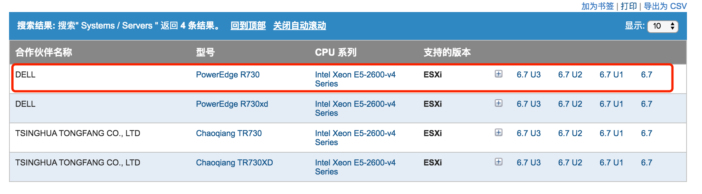
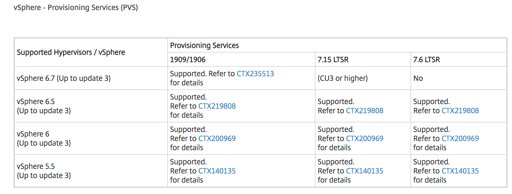

## 服务器兼容性查询

[https://www.vmware.com/resources/compatibility/search.php](https://www.vmware.com/resources/compatibility/search.php)

使用方法：

红色部分是建议填写的，一般服务器兼容性需要匹配**主机型号、CPU 和 ESXi 版本**。

查询结果如下：

可以点开链接查看详细的兼容情况，一般需要以兼容列表为准来进行BIOS、ESXi版本的选择。如果服务器厂商可以提供更佳的配置建议，以服务器厂商的推荐组合为准。

## IO设备兼容性查询

IO 设备一般包括：网卡、HBA卡、RAID卡。

针对每个设备，需要匹配**硬件型号、硬件固件（微码）版本、ESXi 驱动版本**。其中硬件固件由服务器厂商提供，ESXi 驱动由 VMware 提供。

[https://www.vmware.com/resources/compatibility/search.php?deviceCategory=io](https://www.vmware.com/resources/compatibility/search.php?deviceCategory=io)

使用方法：

**安装 ESXI，通过命令查看设备的 VID、DID、SVID、SSID，依据收集到的 ID 在兼容列表右上角输入查询。**

​	**VID** – Vendor ID – 芯片制造商，例如 Emulex, Qlogic, Broadcom

​	**DID** – Device ID – 设备 ID，不同芯片制造商定义的设备 ID

​	**SVID** – SubSystem Vendor ID – 产品制造商，例如 HP, IBM 等

​	**SSID** – Subsystem ID – 类似于 Device ID，产品制造商区别不同设备的 ID

针对不同类型的设备，查看以上四个 ID 的方式一致：

- 如果是 HBA 卡和 RAID，运行 `vmkchdev -l | grep vmhba`
- 如果是网卡，运行` vmkchdev -l | grep vmnic` 

*注意上图中会有非常多的ID，ID 不同代表设备型号不一致，需要针对每种设备都进行兼容性查询。

**注意 vmhba 结果中可能只有一个代表 RIAD卡，其他两个代表 AHCI（可以忽略）。

查询到的结果如下，在列表中列出了验证过的驱动和固件版本，在少数时候，一个驱动可以兼容两个版本的固件，大部分时候结果如下，驱动和固件版本一一匹配。

表格中还提供了驱动的下载链接，下载完成后解压出 vib，上传至 ESXi 的 Datastore， 通过 `esxcli software vib install -v /vmfs/volumes/datastore1/xxxx.vib` 进行安装。

对于固件，则应该要求服务器提供商进行版本的调整（固件版本建议直接找服务器厂商通过 IPMI 或者在 BIOS 中查看，不建议在 ESXi 中查看）。

## vSAN 兼容性查询

vSAN 有三种搭建方式：

1、购买厂商的超融合一体机，例如 VxRail

2、购买 Ready Node，这些 Ready node 是服务器厂商和 VMware 一起验证过可以运行 vSAN 的服务器

3、自己选择兼容 ESXi 的物理服务器，选择兼容 vSAN 的 RAID 卡和硬盘（**注意这行的每一个字**）

对于 Ready Node，参照一下连接进行查询即可：

[https://www.vmware.com/resources/compatibility/search.php?deviceCategory=vsan](https://www.vmware.com/resources/compatibility/search.php?deviceCategory=vsan)

比如通过关键词可以查询到 Dell 基于 R730 做的 Readynode，之后再找服务器提供商直接购买相关机型和配置即可。

如果想自己 DIY，**需要做好觉悟，格外注意每个细节**。

查询链接如下：

[https://www.vmware.com/resources/compatibility/search.php?deviceCategory=vsan](https://www.vmware.com/resources/compatibility/search.php?deviceCategory=vsan)

大部分的时候，客户采购的服务器只说要用于 vSAN，而厂商会尽量提供兼容 vSAN 的机型，但是服务器 BIOS、RAID卡固件、硬盘固件并不一定能满足 vSAN 要求，甚至有些时候厂商会无意地提供不兼容的设备。

1、设备到货后，第一件事是先装 ESXi，然后使用 `vmkchdev -l | grep vmhba`收集 RAID 卡的 SID、DID、SVID、SSID。参照 IO 设备兼容性查询到此设备，例如上文提到的设备，记录设备型号。

2、打开 vSAN 兼容列表，选择设备类型为 IO Controller，关键词输入设备型号，点击查询，最后一个结果即为我们当前使用的设备：

3、点开查询结果，对比 ID 正确，按照 ESXi 版本查看对应支持的驱动和固件版本，以及支持的 vSAN 类型。

此处结果显示 ESXi 6.7U3 支持的驱动版本为` lsi_mr3 version 6.913.05.00-1OEM.650.0.0.4598673`，固件版本为`4.670.00-6500`，支持的 vSAN 类型为`Hybrid 混合模式`（也表示此 RAID 卡不支持全闪类型的 vSAN）

4、收集硬盘的 P/N（Part Number 部件号、或 Product ID）

5、打开兼容列表，选择 HDD，输入产品型号进行查询

6、详细结果如下，文中提到了最低的固件版本，确保硬盘固件版本高于此版本。

*不同厂商的硬盘其固件版本命名可能并不一致，选择一个一致的即可。

7、参照4~6步完成 SSD 的查询。

## 产品互操作性查询（VMware产品间兼容性）

VMware 有非常庞大的产品线，各个组件的不同版本之间并不是完全兼容，会有较为严格的版本兼容性。通过以下链接可以查看具体的兼容性：

[https://www.vmware.com/resources/compatibility/sim/interop_matrix.php](https://www.vmware.com/resources/compatibility/sim/interop_matrix.php)

分别在 1 和 2 选择一个 VMware 的产品，点击查询。

下方我们查询出了 vCenter 与 NSX-T 的兼容性：

## 其他兼容性

除以上内容外，VMware 产品某些时候需要与第三方的产品协作运行，例如 ESXi 和 Citrix XenDesktop、或者 NSX 和无代理防病毒，或者 NSX 和 k8s，这些基本都可以通过三种途径查询到：

1、还是上面的兼容链接

[https://www.vmware.com/resources/compatibility/search.php](https://www.vmware.com/resources/compatibility/search.php)

例如查询 NSX-V 和无代理防病毒的兼容性情况：

2、文档的 installation guide

例如查询 NSX-T 的 NCP 插件和 k8s 兼容性情况：

[https://docs.vmware.com/en/VMware-NSX-T-Data-Center/2.4/com.vmware.nsxt.ncp_kubernetes.doc/GUID-AD7BA088-2A51-4D5F-BC86-6EE14CE17665.html](https://docs.vmware.com/en/VMware-NSX-T-Data-Center/2.4/com.vmware.nsxt.ncp_kubernetes.doc/GUID-AD7BA088-2A51-4D5F-BC86-6EE14CE17665.html)

3、第三方厂商提供的兼容性列表

例如 Xendesktop 和 vSphere 兼容性：

[https://support.citrix.com/article/CTX131239](https://support.citrix.com/article/CTX131239)

