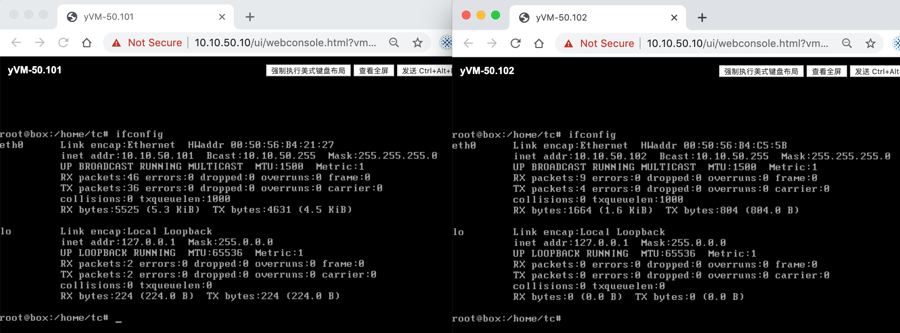

# Avi 快速部署

## 目录
{: .no_toc .text-delta }

1. TOC
{:toc}

# 概要

Avi networks 是 2019 年 VMware 收购的一家纯软件负载均衡公司， 此公司由一些前思科员工创立，在收购时其总融资额已有 1.15 亿美元，公司主要产品为 Avi vantage，这是一款可以和 F5 BIG-IP、Citrix Netscaler 等产品竞争的负载均衡产品。

VMware 收购 Avi 后，将其产品名称改为 NSX advanced Load Balancer，定位是高级负载均衡产品，在一些场景下用于替代 NSX 自带的 LB 。

# 功能特性

- 负载均衡
  - L7 HTTP/HTTPS 负载均衡
  - L4 TCP/UDP 负载均衡
  - 全局负载均衡（GSLB）
  - content switching
  - 缓存/压缩
- 安全
  - WAF
  - SSL 终止
  - DDoS保护
  - L3~L4 ACL
  - L7 规则
  - 微分段
- 分析
  - 应用地图
  - 服务健康评分
  - 网络性能
  - 应用性能
  - 请求日志
  - 安全可视化
- 其他
  - 集中管理
  - 100% API
  - 多租户
  - 服务发现
  - IPAM/DNS

# 架构

Avi 的架构非常简单，包含：

- **控制层**：Avi Controller，可以是 1 台或者 3 台虚拟机，负责提供 UI 和 API，所有负载均衡的配置均在 Controller 中进行配置，Controller 自动根据配置来创建/配置 Service Engine，另外 Controller 也可以通过 SE 来收集性能数据来做统一的展示和分析。
- **数据层**：Avi Service Engine，通过 Controller 自动部署或者手动导入，负责为应用提供负载均衡服务。

# 资源需求

## 虚拟硬件

Avi 支持在 vSphere、Openstack、AWS 等多种云环境中安装，本文档只介绍 Avi 与 vSphere 集成。

Avi 18.2.x 仅支持 vCenter 5.5、6.0、6.5 及 6.7。

### Avi Controller 

需要 8vCPU、24G内存、128G 硬盘。

*注：Avi Controller 仅支持从 vCenter 导入，不支持通过 ESXi 导入。

### Avi Service Engine 

默认规模是 1vCPU、2G内存、10G硬盘，最小可配置为 1vCPU、2G内存、10G硬盘，最大可设置为 64vCPU、256G内存。

如果为 SE 新增了一个 vCPU，应该对应地新增 1GB 内存

*注：18.2.1 后 Avi SE 默认虚拟硬件版本为 10，仅能部署在 ESXi 5.5 及以上版本。

## IP地址

Avi Controller 只需要一个 IP 地址，此地址用于连接所有 Avi Service Engine，也用于提供 UI 和 API，还用于和 vCenter 对接。所以要求此 IP 地址能够访问所有 Avi Service Engine 管理网络、vCenter、ESXi。建议使用静态 IP 地址分配。

*注：如果要组建 Controller 集群，三个节点必须在同一个网段中

Avi SE 至少需要三个 IP：

- 管理 IP：用于和 Avi Controller 通信，此地址可以通过 DHCP、地址池、手动分配的方式指定，一般使用地支持的方式。
- VIP：虚拟服务 IP，此地址在设置 Virtual service 时手动指定，或者通过 IPAM 服务自动分配。
- 连接后端服务器池的 IP：此地址的设定接下来的文章和之后的文章会细讲。

# 性能

## CPU

Avi Service Engine 使用 CPU 来进行 SSL 握手（TPS）、压缩、WAF、流量转发等任务，随着 CPU core 的增加 Avi Service Engine 的性能可以线性增加，建议将相关虚拟机的 CPU 设为预留以保障以上功能的性能。

另外 Service Engine 不能识别服务器是否开启了超线程，一般使用超线程的性能会弱于不使用超线程，因此如果有较高性能要求建议服务器关闭超线程。

## 内存

内存用来进行 HTTP 缓存及增加并发连接，增加内存大小可以有效增加这两个功能的处理能力。

默认 Service Engine 的内存为 2GB，默认开启内存预留。

## 磁盘

SE 会临时保存一些日志（之后这些日志会发给 Controller 进行索引），磁盘空间越大，SE 的日志保存时间可以设置的更久。如果使用 SSD，日志保存速度也会更快。

## PPS（packet per second）

Avi 在虚拟化中的性能受限于 Hypervisior，vSphere 5.5 每虚拟机的性能为 550k pps，vSphere 6.x 每虚拟机的性能为 1.2m pps。

baremetal 下性能则受限于使用的网卡。

Avi Service 也支持 DPDK，当使用 DPDK 时可以突破 Hypervisior 的 PPS 限制，目前有以下网卡支持 DPDK：82599, X520, X540, X550, X552, X710, XL710。

## RPS（request per second） 

RPS 取决于 CPU 型号和 PPS，一般每核的性能为  35~40k RPS。

# 部署 Avi Controller

登录 vCenter，选中目标主机，右键点击“部署OVF模板”，选择 Avi Controller ova 文件，按照想到完成虚拟机的设置和部署

部署完成后开机，初次启动大约需要 5 分钟。

直接通过 IP 地址登录，会出现初始化向导，为 admin 配置密码。

设置 DNS 和 NTP。

暂不配置邮箱

选择和 vCenter 集成。

填写 vCenter 登录凭据，权限选择 Write。

选择 Datacenter 以设置自动发现范围；地址分配方式选择 static。

设置 Service Engine 的管理网络和 IP 地址池。

选择支持多租户（用于测试多租户功能）

多租户模型选择 Service Engine 由管理员管理，租户只能使用 SE。

配置完成后界面如下：

# 熟悉界面

Avi 主界面有五大类菜单，大致内容描述如下：

- Applications
  - 定义 Virtual Service、服务器池
- Operations
  - 查看、配置警告
  - 查看事件
  - 配置 Syslog、邮件通知、SNMP Trap
  - 流量抓取
- Templates
  - 应用模板定义（例如 DNS、HTTP、L4）
  - 持久性模板
  - 健康检查模板
  - 流量克隆模板
  - 安全相关配置：证书、TLS 策略等
  - WAF
  - 自动扩缩
- Infrastructure
  - vCenter 对接
  - Service Engine 管理
  - 网络地址管理
  - 路由配置
  - GSLB
- Administration
  - 用户和角色管理
  - 租户管理
  - DNS、NTP 配置
  - 认证源配置
  - 系统升级、系统层面的事件和警告
  - 备份配置
  - 生成 tech support 支持包

# 角色及权限

概括来说：

- System-Admin：权限最大的用户，默认 admin 使用此角色；
- Tenant-Admin：可以完全管理其所属租户，不具备用户管理功能，根据；
- Application-Admin：具备创建虚拟服务、服务器池、模板等功能；
- Application-Operator：类似于只读权限的用户，可以查看大部分配置；
- Security-Admin：查看安全相关的模板、策略；
- WAF-admin：配置 WAF 功能。

所有默认角色的权限如下，也可以根据需求创建新的角色。

| **名称**             | **Application** | **Profiles** | **Group & Script** | **Security** | **WAF** | **Error Page** | **Operations** | **Infrastructure** | **Administration** | **Accounts** | **GSLB**  |
| -------------------- | --------------- | ------------ | ------------------ | ------------ | ------- | -------------- | -------------- | ------------------ | ------------------ | ------------ | --------- |
| Application-Admin    | Write           | Write        | Write              | Assorted     | Read    | Write          | Assorted       | Assorted           | Assorted           | No Access    | Assorted  |
| Application-Operator | Read            | Read         | Read               | Read         | Read    | Read           | Assorted       | Read               | Assorted           | No Access    | Read      |
| Security-Admin       | No Access       | No Access    | No Access          | Assorted     | Read    | Read           | No Access      | No Access          | Assorted           | No Access    | No Access |
| System-Admin         | Write           | Write        | Write              | Write        | Write   | Write          | Write          | Write              | Assorted           | Write        | Write     |
| Tenant-Admin         | Write           | Write        | Write              | Write        | Write   | Write          | Write          | Write              | Assorted           | No Access    | Assorted  |
| WAF-Admin            | Assorted        | No Access    | No Access          | No Access    | Write   | No Access      | No Access      | Assorted           | Assorted           | No Access    | No Access |

# 多租户管理

点击 “Administration>Accounts>Tenants>Create” 添加新租户。

设置租户名称，设置对 Service Engine 的权限。

## 为租户添加管理员

点击 “Administration>Accounts>Users>Create” 添加新租户。

设置用户名、密码、租户、角色等。

测试可以通过 user1 登录，界面中仅能看到 Tenant1 租户。

# 创建一个应用

## 资源准备

在前面介绍 Service Engine 时提到 SE 需要 3 个 IP：

- 管理 IP：在初始化 Avi Controller 时已经设置好了地址池，SE 会自动从池中拿到地址；
- VIP：在创建应用时指定；
- 连接服务器池的地址：每个业务网段需要一个池。

在第一个实验时我们规划进行如下配置：

| **项目**             | **内容**                                  |
| -------------------- | ----------------------------------------- |
| SE 管理 IP           | 自动从池中获取（10.10.50.35-10.10.50.50） |
| VIP                  | 10.10.50.100                              |
| 服务器池成员IP       | 10.10.50.101 10.10.50.102                 |
| SE 连接服务器池的 IP | 自动从池中获取（10.10.50.35-10.10.50.50） |
| 应用策略             | HTTP 80                                   |
| 健康检查             | HTTP 80                                   |

## 准备服务器

为测试方便简单使用 yVM（一个极轻量的虚拟机模板）搭建了两台 Nginx 服务器，测试服务均正常。

## 创建 Virtual Services

点击“Application>Dashboard>Create Virtual Services>Basic Setup”

设置 Virtual Service 名称，设置 VIP、Application Type 选择 HTTP，端口为80、通过 IP 地址添加 Server。

设置完成后可以看到服务健康状态为红色，点击后看到正在创建 Service Engine。

返回到 vCenter 中，也可以看到两个 Service Engine 部署任务。

等待 Service Engine 创建完毕，每个 Service Engine 的配置均为 1vCPU、2G内存、10G硬盘、10个网卡。

稍等片刻，Virtual Service Health 状态会变为绿色，此时表示 Service 可以正常访问。

通过浏览器访问 Service 的 VIP，可以正常访问。

返回 Avi 界面，点开 Virtual Service，可以看到应用的访问数据，包括完整路径的延迟信息，吞吐量、连接数、请求数、健康指数等。

第一篇文章到此为止，简单介绍了 Avi Controller 部署、Service 创建、用户管理等基础的功能，可以看到 Avi 的上手非常简单，只需要很少的配置便能自动完成一个“复杂”的负载均衡的配置。

但是读完本文应该会有很多的疑问，例如 Avi 怎么知道应该将 Service Engine 部署在哪台 ESXi，Service Engine 的网络是怎么自动配置的？应用的高级配置如何设置？安全如何做等等，未来的文章会一一介绍。

# 参考文档

[https://avinetworks.com/docs/latest/installing-avi-vantage-for-vmware-vcenter/](https://avinetworks.com/docs/latest/installing-avi-vantage-for-vmware-vcenter/)

[https://avinetworks.com/docs/latest/system-requirements-hardware/](https://avinetworks.com/docs/latest/system-requirements-hardware/)

[https://avinetworks.com/docs/latest/sizing-service-engines/](https://avinetworks.com/docs/latest/sizing-service-engines/)