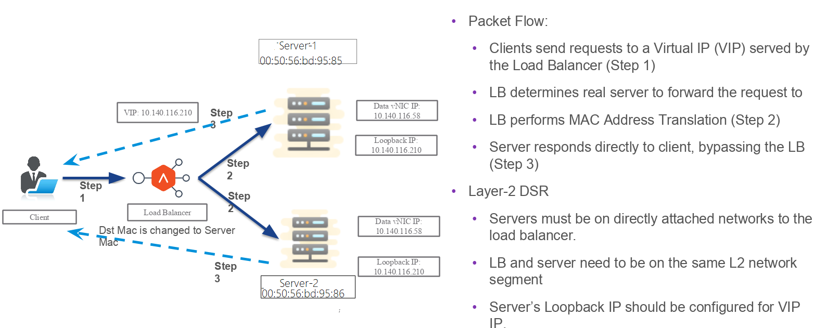
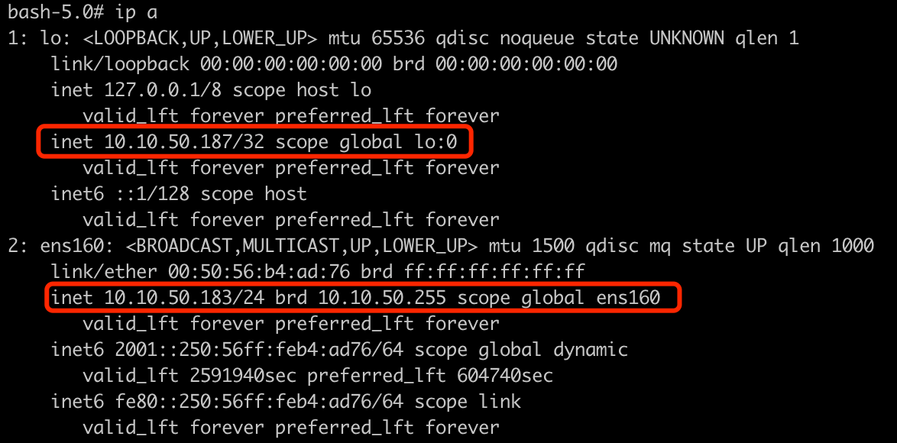
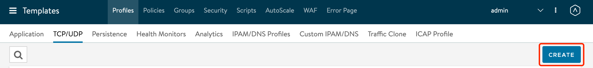
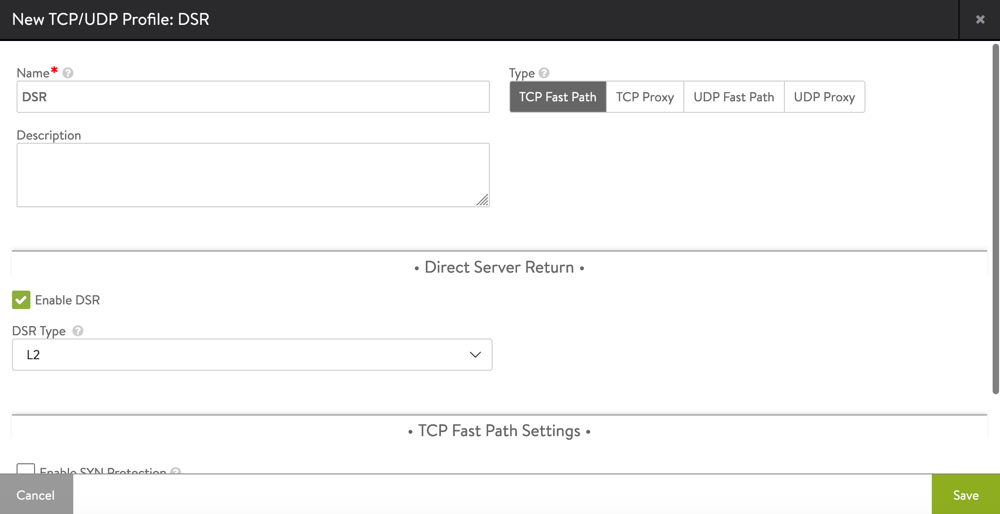
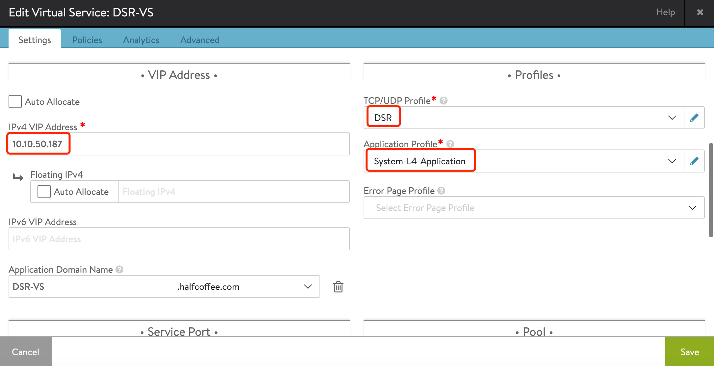
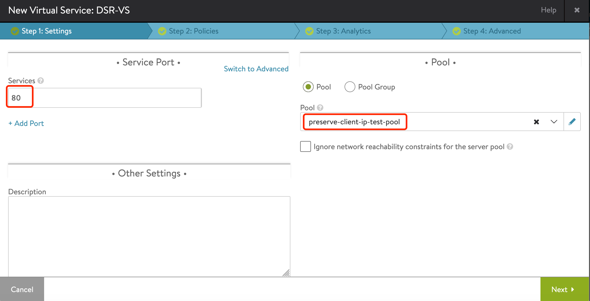
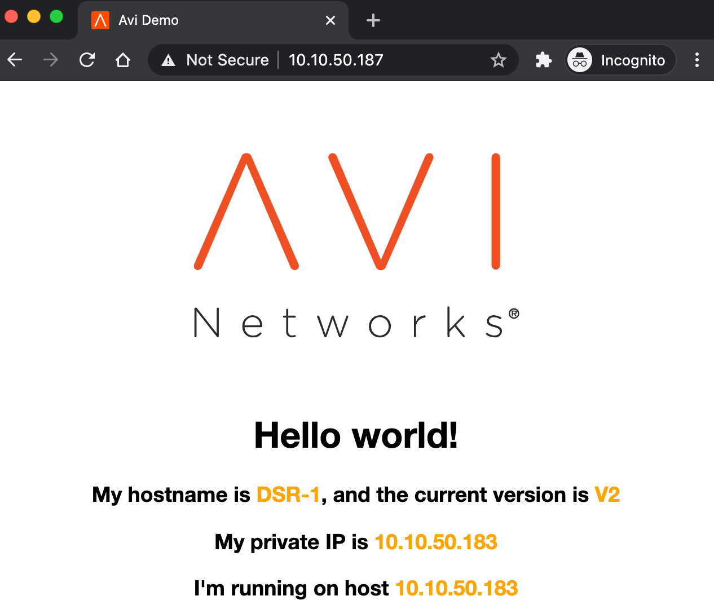
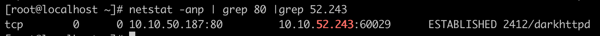

# Avi DSR 三角传输配置


## 目录
{: .no_toc .text-delta }

1. TOC
{:toc}

## DSR（三角传输）

参考文档：https://avinetworks.com/docs/20.1/direct-server-return/

某些特殊应用，例如流媒体、固件更新等应用，因为性能或者应用本身的设计，不能让负载均衡器执行SNAT及DNAT操作，Server 和 Client在传输数据时需要“直连”，负载均衡器只负责请求流量的下发操作。Avi通过Direct Server Return来实现此需求。

具体工作流程如下图：



 

配置步骤如下：

1、假设virtual service的VIP为10.10.50.187。配置每台Server，为其添加一个环回口，地址设置为VIP，并设置以下参数：

```shell
ifconfig lo:0 10.10.50.187 netmask 255.255.255.255 -arp up
echo 1 > /proc/sys/net/ipv4/conf/all/arp_ignore
echo 2 > /proc/sys/net/ipv4/conf/all/arp_announce
echo 2 >/proc/sys/net/ipv4/conf/ens160/rp_filter
sysctl -w net.ipv4.ip_forward=1
```



2、新建一个TCP/UDP Profile，Type为 TCP Fast Path，勾选“Enable DSR”，类型为L2。

TCP/UDP Profile配置位置为：Templates > Profiles > TCP/UDP





3、添加virtual service，设置VIP 10.10.50.187，关联之前配置的 DSR TCP/UDP profile，Application Profile选择“System-L4-Application”。



4、为virtual service 设置端口和Pool



5、通过浏览器访问业务，可以正常访问：

 



 

Server端看到会话由Client （10.10.52.243）和 VIP （10.10.50.187）直接建立：

