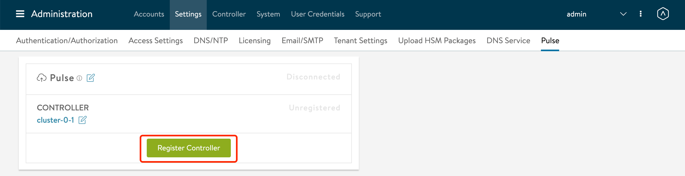

# Avi WAF 相关配置

## 目录
{: .no_toc .text-delta }

1. TOC
{:toc}

## WAF 更新特征库

有两种方式：

1、离线更新

通过 https://portal.avinetworks.com/software/crs 下载

 

 

2、通过pulse自动更新

确保 Controller 可以联网，点击 Register Controller。系统会自动打开 https://portal.avinetworks.com/ ，通过自己的 portal 账户登录后，控制器即可完成注册。

完成注册后在 https://portal.avinetworks.com/assets 可以看到自己的控制器

 

返回Avi 节点，点击 Pulse 编辑，确认邮件和自己的portal账户相符，勾选“Auto Download WAF Signatures”，点击保存即可。

 

配置完成后 Pulse 状态为已连接，Controller状态为 Registered。

## 编写自定义 CRS rule1

客户需求：希望将来自某些Client的IP放行，但是环境中存在双层LB，导致最终发给Avi的IP不是真实的客户端IP，需要判断包头X-Forwarded-for字段来进行放行。

在waf policy 的 Signatures 中添加 pre-CRS rules，内容如下：

SecRule REQUEST_HEADERS:X-Forwarded-for "^10.10.50.*" "phase:1,allow,id:66666,tag:test,log,status:200,msg:'white-list,detection only'"

 

添加完成后通过curl访问测试，会看到访问被记录下来。

curl -H "X-Forwarded-for:10.10.50.3" http://10.10.50.188

 

参考文档：http://www.modsecurity.cn/practice/post/9.html

## 编写自定义 CRS rule2

客户需求：希望将来自移动端的Client不经过WAF检测，其他访问均进行检测。

在waf policy 的 Signatures 中添加 pre-CRS rules，内容如下：

SecRule REQUEST_HEADERS:User-Agent "@containsWord mobile" "phase:1,allow,id:88888,tag:AllowMobileAccess,log,status:200,msg:'white-list, allowed', t:lowercase"

添加完成后通过手机访问测试，会看到访问被记录下来。

