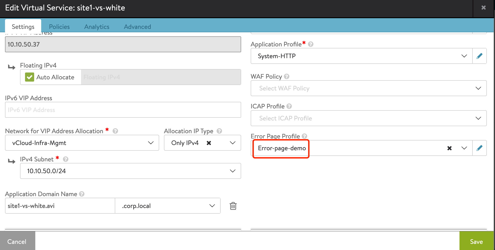
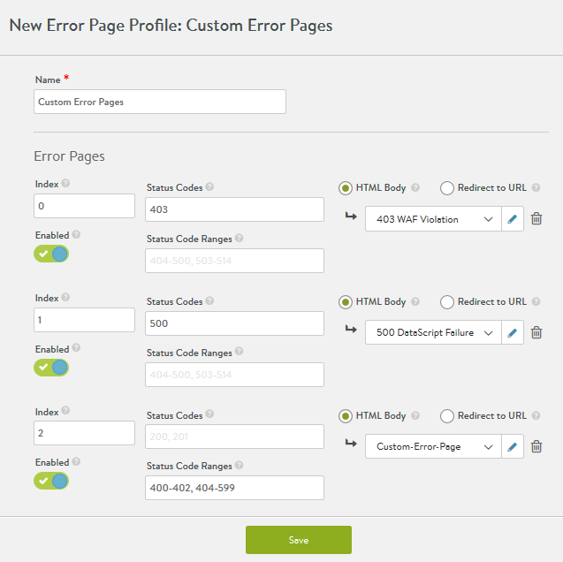
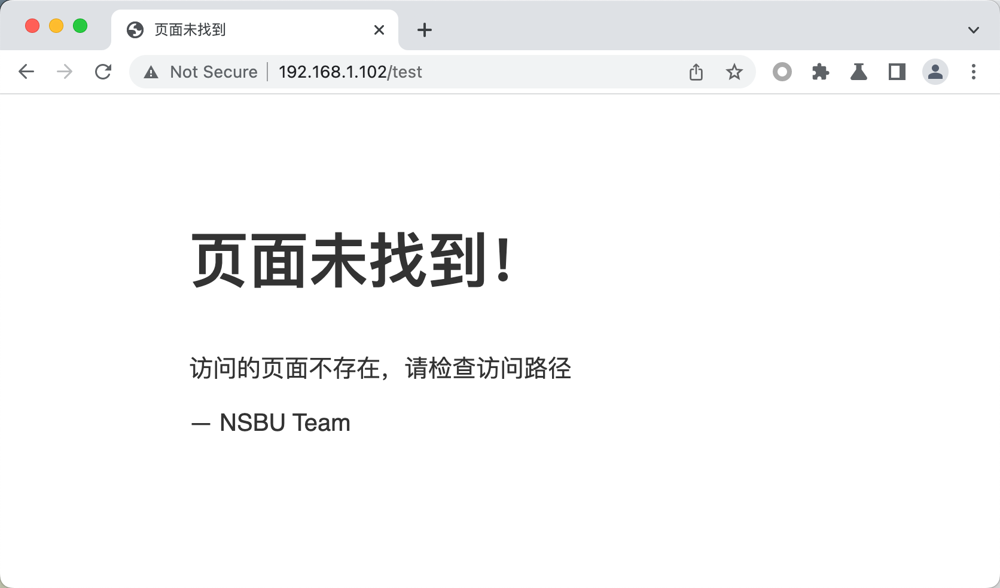
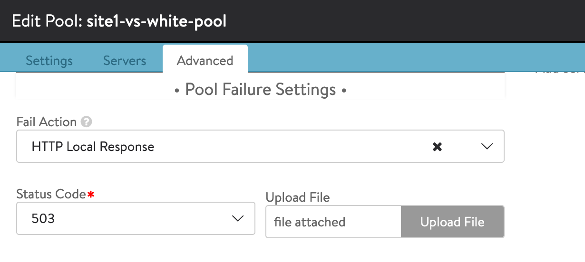
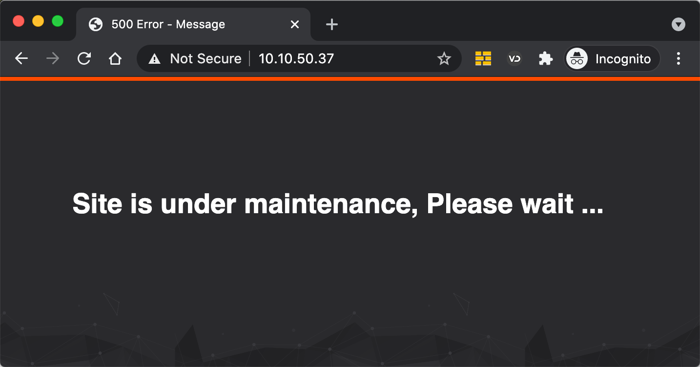

# Avi 自定义错误页面


## 目录
{: .no_toc .text-delta }

1. TOC
{:toc}

## 自定义错误页

参考文档：https://avinetworks.com/docs/20.1/custom-avi-error-responses/

 

Avi 中有三个位置可以配置错误页，配置位置及功能对比如下：

1、Virtual Service 层面关联 error page profile，遇到下列情形时返回页面：

·    流量被WAF检测到并丢弃

·    HTTP Request或者response错误，例如invalid Request

·    SE到后端server握手失败、连接超时

·    DataScript 执行失败





 

2、通过Datascript或者http policy返回页面：

对Request或者response event进行检查，例如response出现404时返回自定义界面。

```lua
status= avi.http.status( )

if string.match(status,"404") then

avi.http.response(404,{content_type="text/html; charset=utf-8"},"<!doctype html><title>页面未找到</title><style> body { text-align: center; padding: 150px; } h1 { font-size: 50px; } body { font: 20px Aria, sans-serif; color: #333; } article { display: block; text-align: left; width: 650px; margin: 0 auto; } a { color: #dc8100; text-decoration: none; } a:hover { color: #333; text-decoration: none; }</style><article> <h1>页面未找到！</h1> <div> <p>访问的页面不存在，请检查访问路径</p> <p>&mdash; NSBU Team</p> </div></article>")

end
```




3、 在pool层面设置Pool Fail Action，返回自定义页面：



