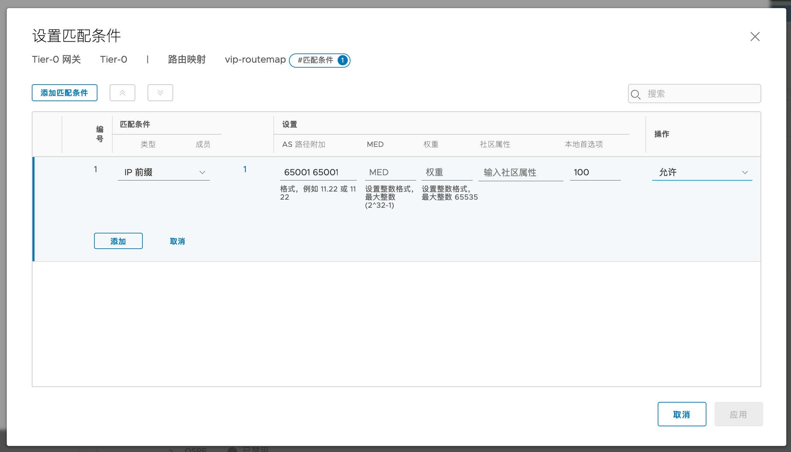
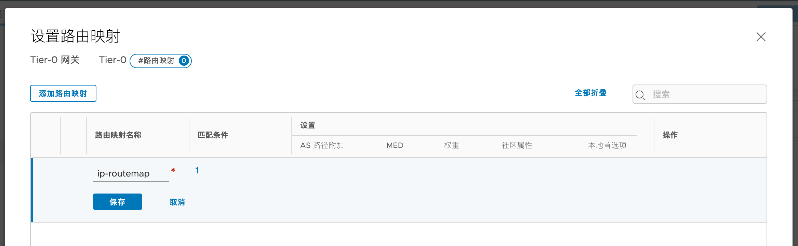
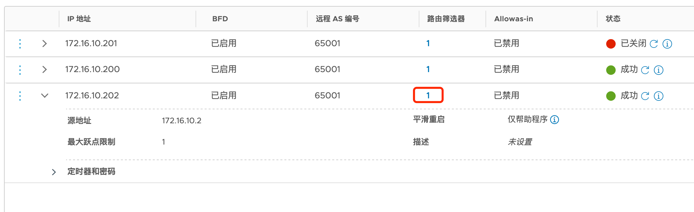
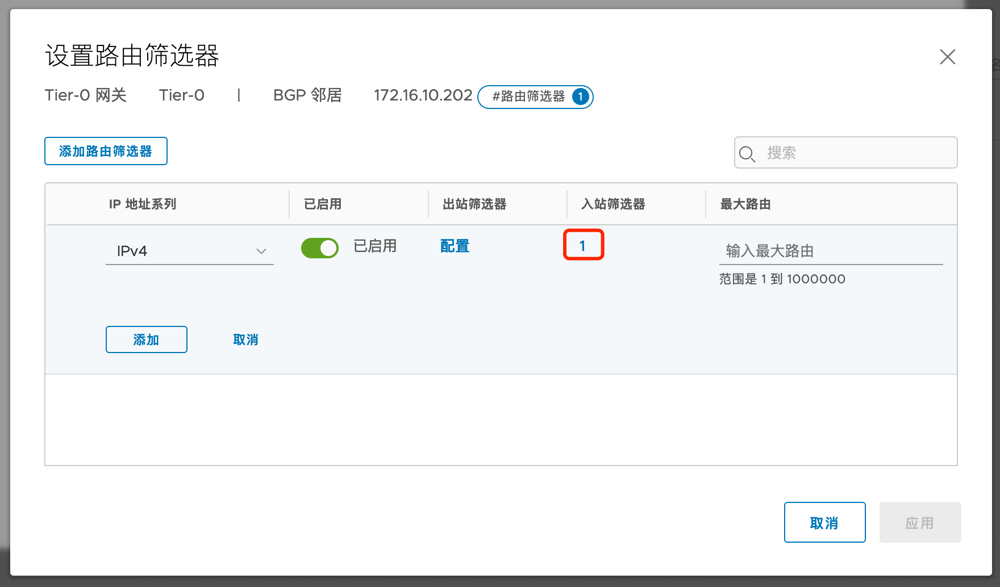

# Avi BGP RHI 配置

## 目录
{: .no_toc .text-delta }

1. TOC
{:toc}

## BGP RHI 对接

通过 BGP 对接后，可以让多台 SE并行工作，由上游路由器进行流量分发，这种模式下可以极大提升负载均衡器的处理性能。

在此模式下，可以将流量分发到2~64个SE上处理，默认是全代理模式，Client IP 地址会被 SNAT 转换成 SE 的地址。一般上游路由器的ECMP最大支持8个下一跳，所以一般最大规模为每个业务8个SE。

在进行BGP 对接时，可以搭配 BFD 进行SE状态监测。Avi 的三种高可用模式均支持BGP。

Avi和上游路由器进行BGP对接时，支持单网卡或者多网卡对接，使用多网卡时，SE 每个网卡**不能**使用相同的地址段。

 

此次测试使用的拓扑如下：

环境中共有三台 SE，分别使用172.16.10.200，201和202 与物理路由器进行BGP对接。

### 1.  Avi 侧基础配置

SE-Group设置，高可用模式选择A/A，根据License数量限制SE的数量，此处设置为了3：

在高级选项中，设置最小值为SE的数量：

设置网络地址池，其中10.10.50.0/24 为管理接口的地址池，172.16.10.0/24 为SE数据接口的IP，此处限制为3个可用地址。

### 2. Avi 侧BGP 对接配置

 

对等项设置：

 

设置完毕后：

 

通过命令行调整BFD时间。

默认Avi BFD时间为1000ms * 3次，可以根据需求调整：

shell

configure vrfcontext global

bfd_profile

mintx 500

minrx 500

save

save

 

参考文档：

https://avinetworks.com/docs/20.1/bgp-support-for-virtual-services/

https://avinetworks.com/docs/20.1/high-frequency-bfd/

### 3. 上游路由器配置（以NSX为例）

依次添加邻居：

设置完成后BGP邻居成功建立：

### 4. 创建虚拟服务

先使用基础向导进行基本的设置，VIP 可以设置为网络中不存在的一个IP，未来通过BGP RHI 发布出去。

再次编辑服务，设置network placement，启用ECMP

手动将应用扩展到多台SE上去：

扩展完成后，会有三台SE来承载此服务（默认AA模式下有两台，N+M模式下一台，如果在SE-Group级别修改了虚拟服务的最小活动SE数量，则此处不需要手动扩展）：

 

### 5. BGP状态查看

1、通过NSX Edge节点查看BGP邻居：

查看BGP表，有三个path：

查看路由表，到10.50.0.11有3个下一跳：

在Avi Controller 命令行查看SE BGP状态：

查看该SE宣告的BGP路由：

### 3.26.6.         多中心的架构

这种拓扑也可以应用在多中心架构中，每个中心都部署一些SE，这些SE可以属于同一个 SE-Group，被同一组控制器管理。默认用户的流量从主中心的三台SE走，当主中心故障后，业务流量可以快速切换到备份数据中心。可以使用BGP的属性来调整流量的主备关系。

 

 

### 多中心架构下的BGP选路配置（以NSX为例）

设置前缀列表，匹配所有IP地址。

设置route map

 

应用给邻居：

 

修改后，NSX路由表中只有两个条目：

 

对应地可以看到来自172.16.10.202的路由存在AS-path 附加：

高可用测试：

关闭两个主节点(200和201)

 

可以进行切换

在上游路由器查看路由表，下一跳切换为202:

 

在Avi端看到服务降级，切换到备中心的SE:

