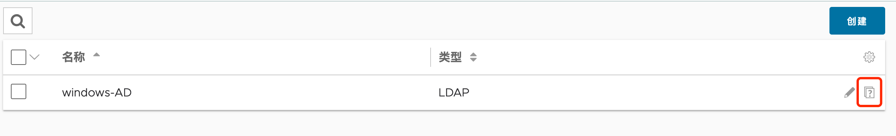

# Avi 与 Windows AD 进行对接

## 目录
{: .no_toc .text-delta }

1. TOC
{:toc}

## Windows AD集成

### 1. AD用户及用户组准备

准备一个名为 avi 的用户，并将其加入 avi-group 组中：

### 2. Avi侧配置

在下列位置添加“身份验证配置文件”：

填写 Windows AD IP、端口、基本 DN、管理员 DN 及密码等信息：

填写用户 DN 位置，在本文中所有用户和组均在 Users 中：

配置完成后点击保存，然后点击策略右侧的问号图标：

 

输入完整的用户名进行测试，确保可以正常返回信息：

输入完整的组 DN 进行测试，确保可以正常返回信息：

### 3. 开启并配置远程登录

在下列位置编辑“身份验证/授权”：

开启远程身份验证，选择上一步创建的 LDAP 配置文件，同时允许本地用户登录：

保存完成后可以看到下列界面，点击新建映射：

输入相关 AD 组的名称：

 

为组设置权限，此处为其指定角色为 Application-Admin，租户为 admin（即默认租户）：

### 3.27.4.         登录测试

使用 AD 用户名和密码进行登录：

测试可以正常登入系统，并具备 Application-Admin 权限：

