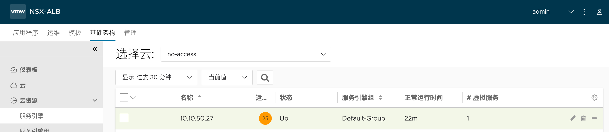
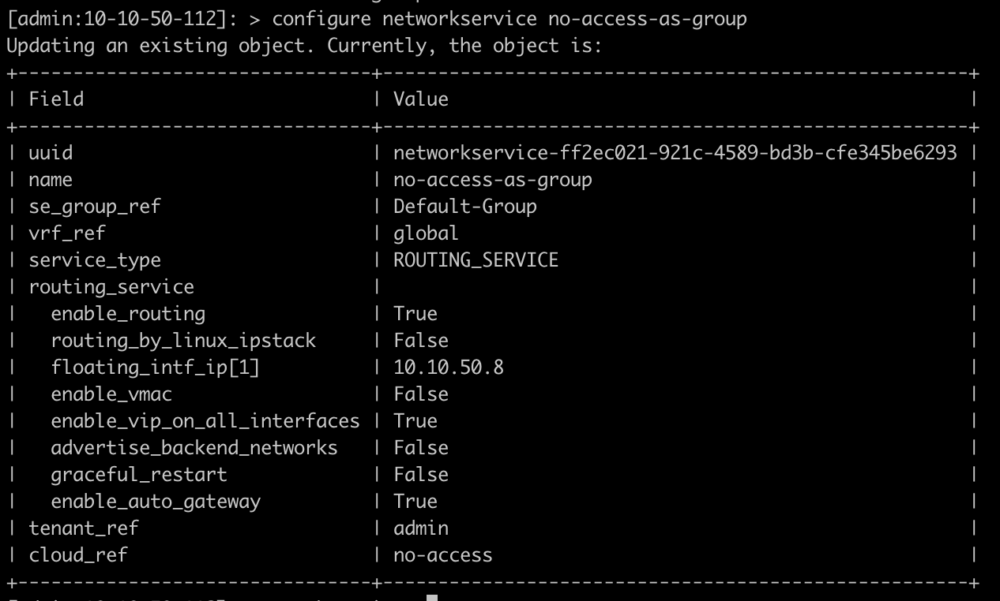
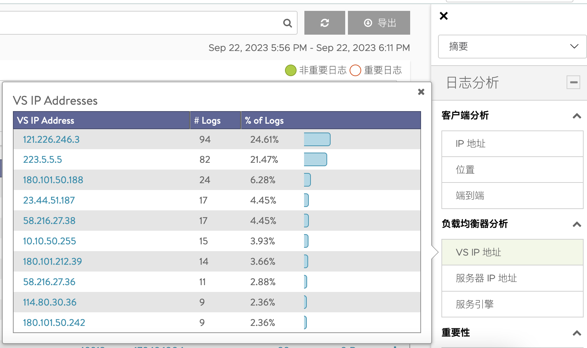

# Avi Wildcard 配置


## 目录
{: .no_toc .text-delta }

1. TOC
{:toc}

## Wildcard 出向负载

参考文档：https://avinetworks.com/docs/22.1/wildcard-vip/

### 1. 限制条件

目前此特性仅支持No Orchestrator Cloud 以及 Linux Server Cloud。

### 2. Cloud及SEG配置

新建一个No Orchestrator cloud：


修改Default SE group，将其高可用模式改为 Active/Standby：


手动部署SE节点：



手动为SE设置IP，此处为SE设置了三个接口地址，其中10.10.50.28面向Client，后两个连接到目标：


手动添加网络，未来会被VIP调用：


### 3. 为SEG设置Floating IP

通过命令行为SE-Group启用路由功能，并设置floating IP：

```shell
ssh admin@<avi-controller-ip>
shell

#按照提示输入Controller 用户名和密码
# 依次输入下列命令：

configure networkservice no-access-as-group
#新建network service，名为 no-access-as-group

cloud_ref no-access
# 关联 no-access Cloud

service_type routing_service
#设置service type 为routing service

se_group_ref Default-Group
#关联默认的SEG Default-Group

vrf_ref global
#关联默认的Global VRF

routing_service
#设置routing service 子项目

enable_routing
floating_intf_ip 10.10.50.8
#设置浮动IP

enable_auto_gateway
save
save
```

 



之后重启SE节点，确保这些配置可以生效。

### 4. 设置Application Profile

在UI创建一个L4 Application Profile，名为L4-noDNAT，不做任何修改：


登陆控制器，通过命令行修改此Application Profile：


输入

```shell
preserve_dest_ip_port
save
```


### 5. VIP 设置


### 6. Pool设置

新增一个Pool，使用Ping健康检查：


输入下一跳IP（此处为方便测试，填写的是两个网段的网关）：


### 7. VS设置

新建VS，选择之前创建的VIP、TCP配置文件、Pool，服务端口写1~65535


 

### 8. Client侧配置

修改Client的网关，将其网关设置为 SE 的floating IP：


访问网站：


在Avi侧查看日志：


多次访问会转发到不同的后端池成员：


通过右侧VS VIP可以过滤目标的IP



### 9. 关于Pool Routing


禁用（默认）：配置一系列Server IP，当做 LB 的下一跳（L2转发，不做DNAT），此时Pool的多个成员可以轮询转发，也可以按照比例来进行转发。此模式下Ping等非TCP/UDP协议不可用。本文前面的部分使用的是这种模式。


启用：根据路由表来传输流量，仅做SNAT，不做DNAT，适用于需要根据目标来选定下一跳的场景。此时ping 可用。


