# Avi Service Engine

## 目录
{: .no_toc .text-delta }

1. TOC
{:toc}

# 概要

在上篇文章我们介绍了快速部署一套 Avi，这篇介绍下 Service Engine 的多种冗余模式、Avi 如何实现 SE 的自动化配置，如何根据不同的网络拓扑来手动调整 SE 的配置。

VMware 收购 Avi 后，将其产品名称改为 NSX advanced Load Balancer，定位是高级负载均衡产品，在一些场景下用于替代 NSX 自带的 LB 。

Service Engines 负责数据层面，也就是负责执行负载均衡操作，SE 必须能够同时访问到 Client 和 Server，三者之间可以直接二层通信也可以通过设置路由三层通信。

# Service Engine 自动部署流程

在上篇文章中我们演示了 Service Engine 会自动部署，完整的 Service Engine 部署流程如下：

1、假设为新环境，则默认无任何的 Service Engine，创建 Virtual Service；

2、Avi Controller 根据 Virtual Service 中 SE Group 的设定决定 SE 高可用模式、部署大小、数量等，根据 Virtual Service 网络配置决定应该在哪些 ESXi 上部署 Service Engines；

3、Avi Controller 将 ova 文件推送到对应的 ESXi 主机，部署 SE 虚拟机（Avi Controller 需要能够与 ESXi 管理网络通信）；

4、Avi Controller 通过 vCenter 对部署出来的 SE 进行网络配置；

5、Avi SE 连接到 Controller，Controller 下发 Virtual Service 的配置。

如果第三步部署失败，Avi Controller 会等待 5 分钟尝试在新的 ESXi 主机上部署 SE。

如果 SE 上已经无关联的 Virtual Service，则 Controller 会等待120分钟后将对应 SE 删除。

如果环境中已经有可用的 SE，则创建 Virtual Service 后可能不会创建新的 SE，除非已有 SE 已经达到能承载的 Service 上限，或者当前 SE 不满足 Virtual Service 的网络设定。

# Service Engine Group

SE 的高可用，大小等均需要通过 Service Engine Group 来进行配置。

默认系统中自带一个名为 Default-Group 的规则，其配置如下：

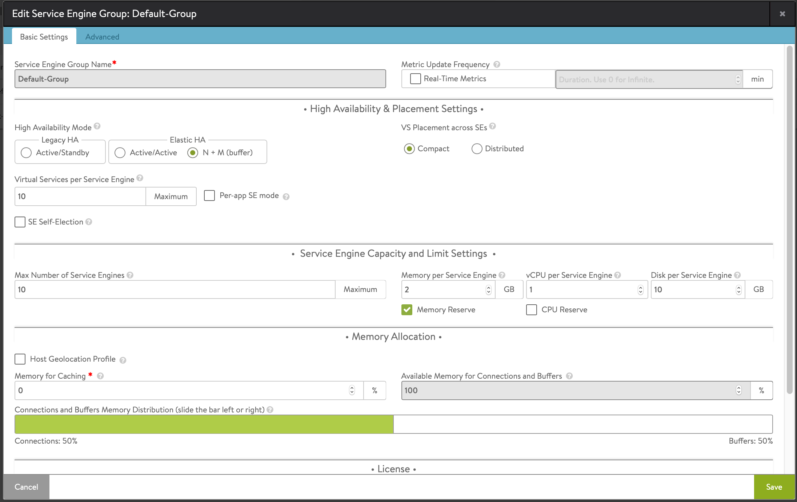

主要的配置有以下几大类：

- 高可用模式
- Virtual Service 分布方式、SE 可承载的 Virtual Service 限制
- SE 大小、预留，SE group 中 SE 的数量限制
- 内存分配设置
- Avi SE 虚拟机名称及部署位置设置

## 高可用模式

三种高可用模式对比及使用场景如下：

| 高可用模式     | 场景                                                         | 描述                                                         | 特点                                       |
| -------------- | ------------------------------------------------------------ | ------------------------------------------------------------ | ------------------------------------------ |
| Active/Standby | 传统负载均衡到Avi的迁移                                      | 一个 SE group 仅有两个 SE，默认一个始终为活动，另一个为热备  | 较为传统的高可用模式，允许单节点故障       |
| N+M            | 单个 SE 能够满足单个 VS 的性能     应用对高可用要求不高，可以接受短暂的服务中断 | 其中 N 代表运行所有 VS 需要的最小 SE 数量，M  代表允许的 SE 故障数。两者共同决定了最终会有多少个 SE 创建出来 | 比较灵活，资源利用率较高，允许多个节点故障 |
| Active/Active  | 承载mission-critical 任务，需要较高的可用性和性能            | 将一个 VS 放在多个 SE 上，实现无感知故障切换                 | 性能有保障，故障切换无感知，资源利用率较低 |

### 传统的主备高可用模式：Active/Standby

此负载均衡模式被大部分传统负载均衡使用，因此在做传统负载均衡到 Avi 的迁移时可以使用。

在传统的主备模式下，一个 SE group 仅有两个 SE，默认一个始终为活动，另一个为热备，所有使用此 SE group 的 Service 只会使用 Active 的 SE 节点（如下图的左侧）。

可以根据需求设置 VS placement accross SES 为 Distribute load，这样可以将不同的 VS 放在不同的 SE 节点，针对单个 VS 是主备模式，但整体看两个 SE 均为活动的状态（如下图的右侧）。

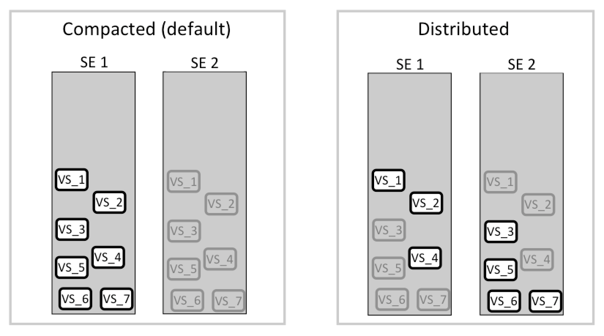

下图是传统 HA 模式的设置截图。

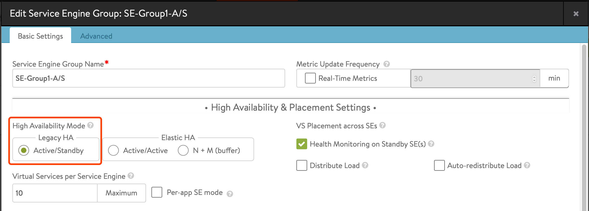

*默认 Legacy HA 下会勾选“Health Monitoring on Standby SE”，勾选此配置会允许 Standby SE 也进行 Service pool 的健康检查，此配置仅在使用了 Active Monitor 后生效，推荐在 Legacy HA 模式下启用。*

### Elastic HA :N+M

N+M 是较为灵活的一种高可用模式，其中 N 代表运行所有 VS 需要的最小 SE 数量，M 代表允许的 SE 故障数。两者共同决定了最终会有多少个 SE 创建出来：

- N：N 由 Virtual Services per Service Engine、Virtual Service 数量、 VS placement 三个参数决定。
- Avi 会自动根据 VS 和 SE 数量以及 Buffer Service Engines（也就是 M 值） 设置来判断应该部署多少个额外的 SE。
- N+M 的数量受限于 Maximum number of Service Engines。
- 默认 Avi 总是尽量将 VS 均衡地分给所有 SE 去处理，保证整体资源利用率的均衡。

对应的配置截图如下：

A：用于限制每个 SE 最大能承载的 VS 数量（默认为10）

E：一个 SE group 中最大的 SE 数量（默认为10）

B、C：每个 VS 能够使用的最小和最大 SE 数量（默认为1和4）

D：冗余 SE 数量（默认为1）

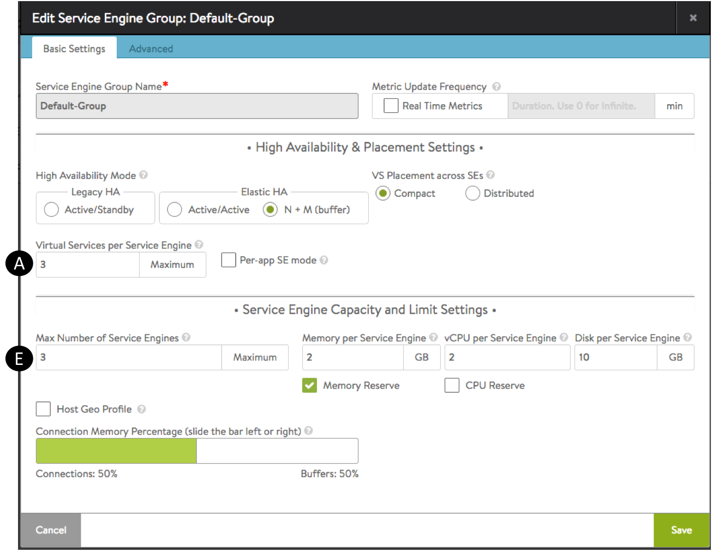

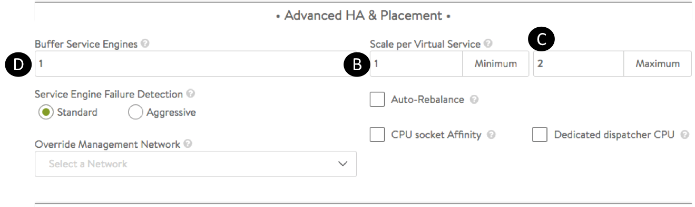

官方资料有几个不错的例子：

**案例1：**

- SE group 设置每个 SE 最大能承载 8 个 VS（下图中的 A ）
- SE group 被 20 个 VS 使用
- 开启 compact placement
- Buffer Service Engines=1

N=3（20/8=2.5，取整数3），M=1，所以共需要 4 台 SE 就可以同时满足承载 20 个 VS 以及允许一个 SE 故障的需求。

Avi 默认会将 VS 分给所有的 SE，所以真实的运行状态就是左下的样子，每个 SE 上均有 5 个 VS。

当一个 SE 故障后，剩余的 SE 也有足够的资源可以接管该 SE 上的 VS（如右下图的样子）。

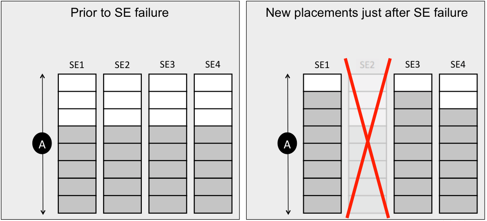

如果在 5 分钟内故障 SE 未恢复，则 Avi 会重启该虚拟机，再等待 5 分钟，如果 10 分钟后 SE 还未恢复，则会删除故障 SE，并创建新的 SE 以满足 M 的要求。（如果一个 SE group 中第一次出现了 SE 故障，则此故障 SE 会保留三天，用于方便用户排错）

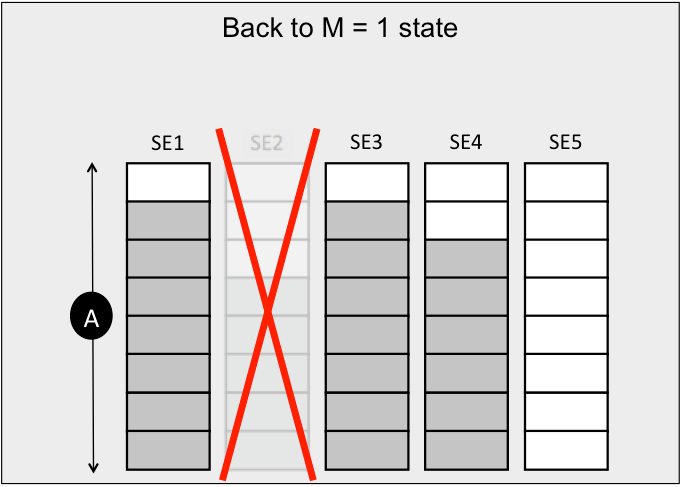

### Elastic HA :Active/Active

在 Active/Active 下，Avi 会将一个 VS 放在多个 SE 上，实现无感知故障切换，默认至少会放置在两个 SE，最大则为 4 个（由 Scale per Virtual Service 来设定范围）。

如果 SE group 中有节点故障，则处理过程如下：

- 已有的 VS 不受影响，因为还有 Active 节点在负责此 VS 的流量转发。但会在一段时间内以这种降级模式运行（即只有一个 Active SE）。

- Avi 会新创建一个 SE，等此 SE 准备好后回将原故障节点上的所有 VS 转移到新的 SE。通过这种方式可以保证在故障前和故障后所有应用的性能均不会受影响。 （在测试时发现如果 SE group 中 SE 已达上限，然后通过重启某个 SE 来模拟单节点故障，则受影响 VS 会始终在降级模式运行，不会自动恢复到 Active/Active）

对应的配置截图如下：

A：用于限制每个 SE 最大能承载的 VS 数量（默认为10）

E：一个 SE group 中最大的 SE 数量（默认为10）

B、C：每个 VS 能够使用的最小和最大 SE 数量（默认为2和4）

D：冗余 SE 数量（默认为0）

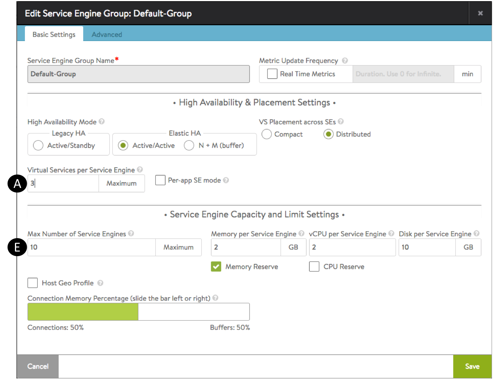

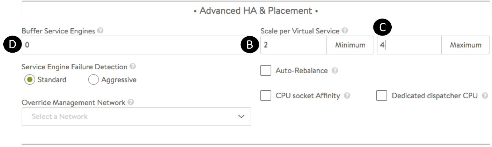

**案例2：**

- SE group 设置每个 SE 最大能承载 3 个 VS（下图中的 A ）
- Minimum Scale per Virtual Service = 2
- Maximum Scale per Virtual Service = 4
- Max Number of Services Engines = 6（下图中的 E）
- SE group 被 20 个 VS 使用

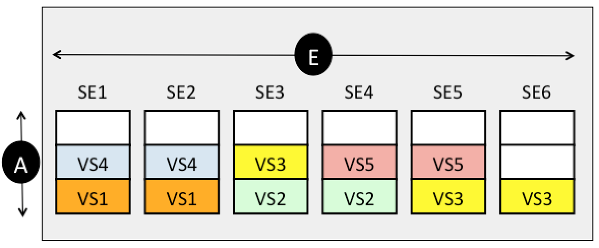

当 SE3 故障后，VS2 和 VS3 的访问不受影响，但是均以降级模式在运行。

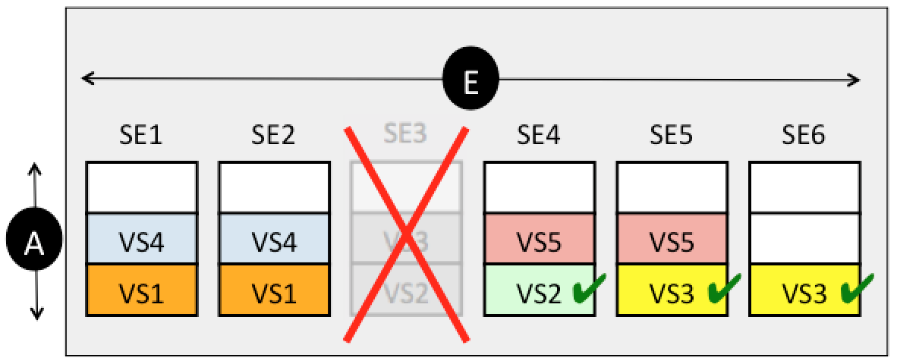

在一段时间后，SE7 被部署出来，SE3 被删除，原来 SE3 上的任务会被分配到 SE7，是的 VS2 和 VS3 恢复到故障前的状态。

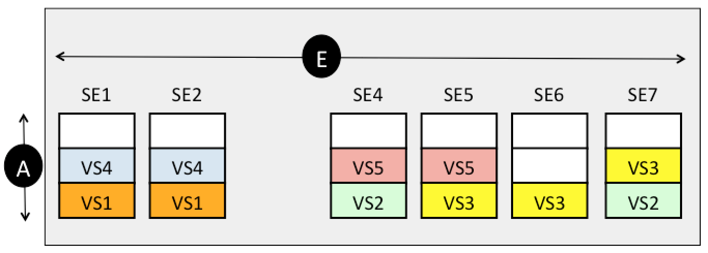

## VS placement 模式

在三种高可用模式下均有一个配置：VS Placement across SEs，此配置有两种选择，两者区别如下：

- Compact 会尽量提高 SE 利用率，减少 SE 数量；
- Distribute 会尽量减少 SE 利用率，但是不关心 SE 数量。

默认 N+M 使用 Compact，Active/Active 使用 Distribute。

**案例3：**

- 高可用模式为 N+M
- M=1
- SE group 设置最大 SE 数量为 4
- 每个 SE 最大能承载 8 个 VS
- 共有8个 VS 需要被创建

创建过程如下：

1、创建 VS1，会出现两个 SE，分别为 SE1 和 SE2，其中 SE2 为冗余

2、创建 VS2，此 VS2 会被分配到 SE2，因为两个 SE 可以满足 N+M 的要求，不需要第三个 SE

3、创建 VS3 及之后的 VS 时，Compact 和 Distribute 模式便有了区别：

Compact 会在满足 N+M 的前提下不部署新的 SE 出来（下图左）。

Distribute 则会尽量为每个 VS 部署一个新的 SE 出来，直至 SE 数量达到上限（此例中为4个），VS5~VS8 最终会被放在已有的 SE 上（下图右）。

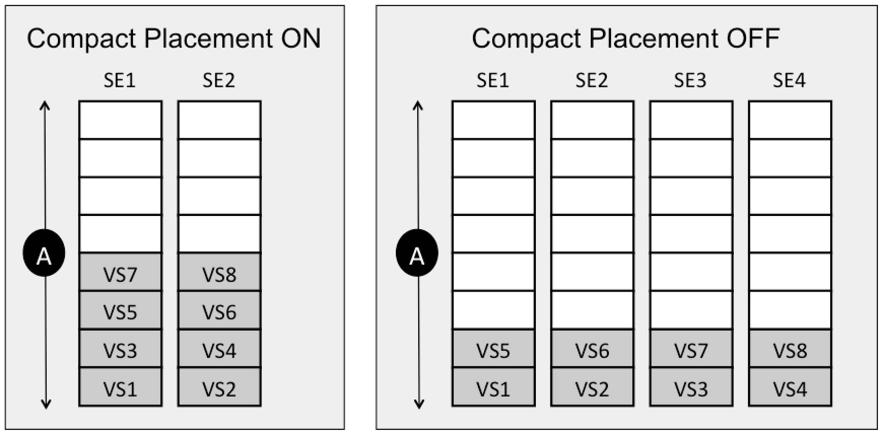

# SE 状态监控

# 参考文档

[https://avinetworks.com/docs/18.2/configuration-guide/infrastructure/#service-engines/](https://avinetworks.com/docs/18.2/configuration-guide/infrastructure/#service-engines/)

[https://avinetworks.com/docs/18.2/elastic-ha-for-avi-service-engines/](https://avinetworks.com/docs/18.2/elastic-ha-for-avi-service-engines/)

[https://avinetworks.com/docs/18.2/legacy-ha-for-avi-service-engines/](https://avinetworks.com/docs/18.2/legacy-ha-for-avi-service-engines/)