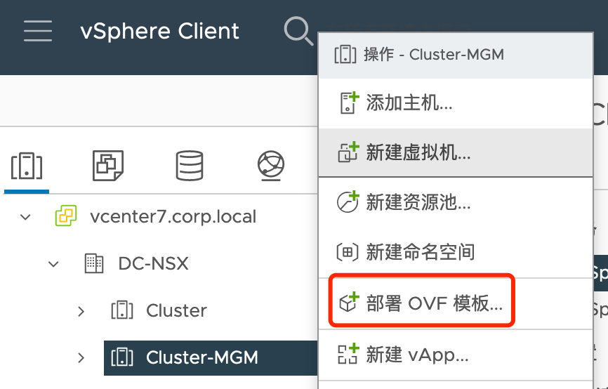
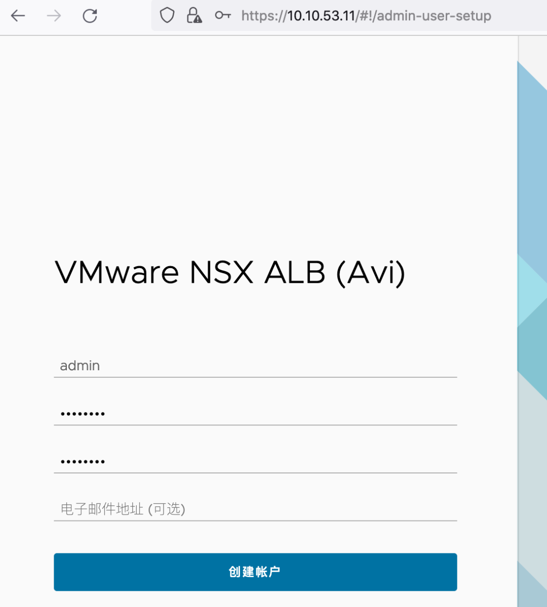
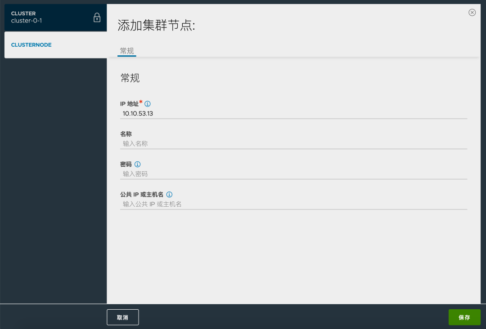
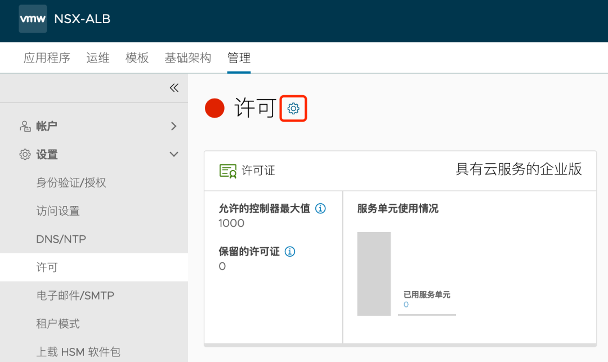
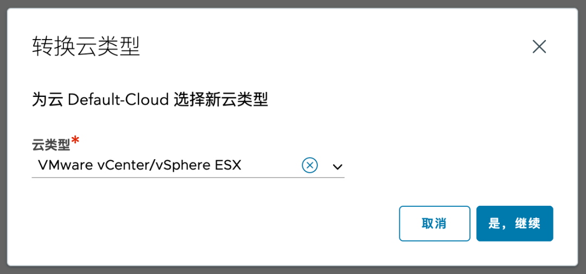
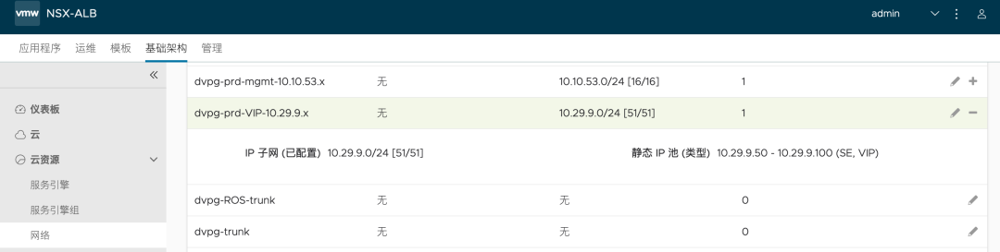
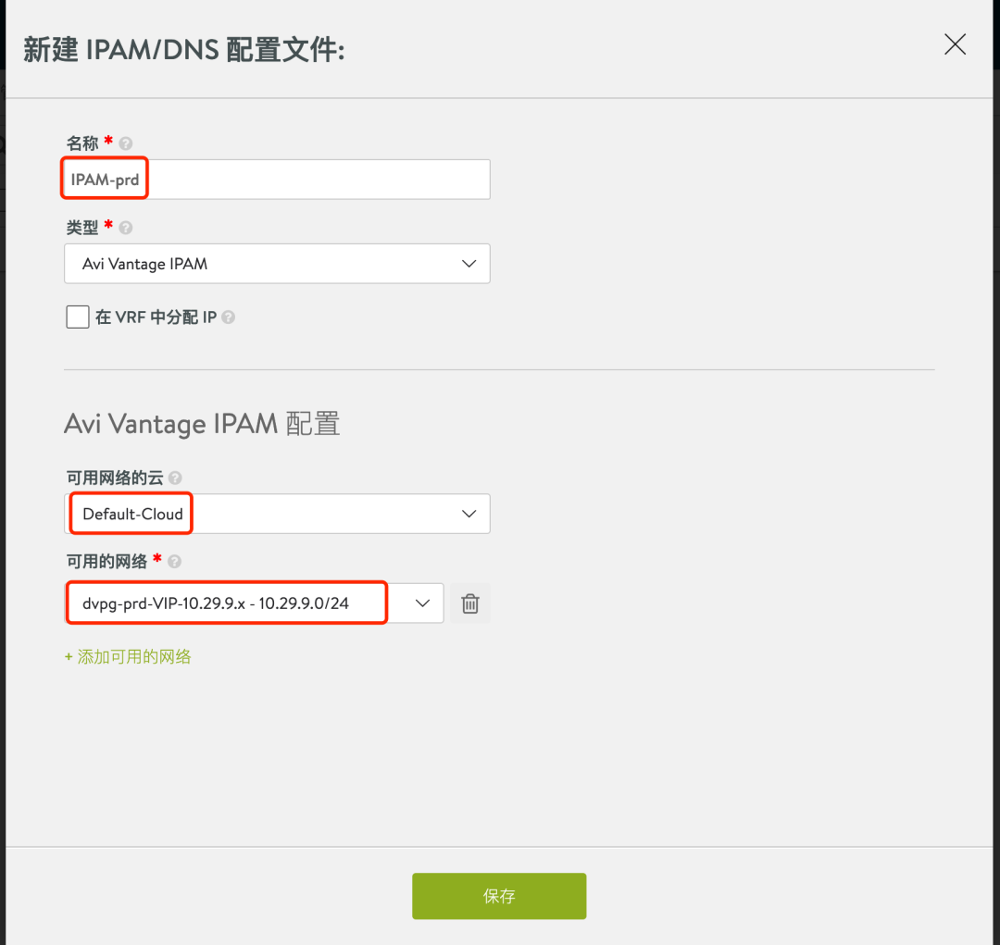
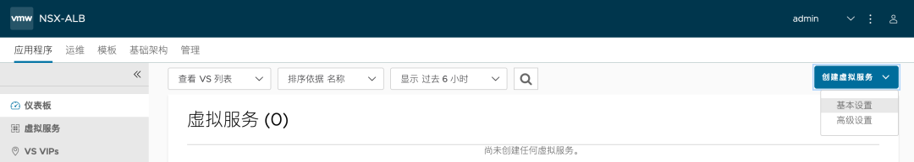

# Avi 部署使用指南(1)：快速部署 

## 目录
{: .no_toc .text-delta }

1. TOC
{:toc}

 Avi 于 2019 年被 VMware 收购，2021 年从 21.x 版本开始支持多语言，可以用熟悉的中文界面来使用负载均衡器，下面奉上快速部署手册。

  本文使用 21.1.3 版本，其他版本的部分界面可能和此版本有所差异。

本文目录如下：

- Avi 部署资源需求
- 部署架构概述
- 在 vCenter 环境下部署并配置 Avi
- 创建一个应用

# 1. Avi 部署资源需求

以下部署资源需求均来自于 Avi Networks 官方网站，不同 Avi 版本需求可能有所差异，具体请查看：

https://avinetworks.com/docs/21.1/system-requirements-ecosystem/

https://avinetworks.com/docs/21.1/installing-avi-vantage-for-vmware-vcenter/

## 虚拟机资源需求

在 vSphere 环境下部署 Avi 时，需要如下资源：

- 一般在生产环境下需要部署三台 Avi Controller 组成集群，POC 环境可以只部署一台；
- 任何情况下都建议给 Avi Controller 搭配一台 Linux Server 做配置备份；
- POC 时可以只部署两台 Avi SE 组成一个组；生产环境则建议部署多台组成集群（数量取决于性能需求及 License 数量）。

## vSphere 版本

在部署 Avi 时有两个层面的版本需要考虑：

- Avi Controller、SE 都会以虚拟机形式运行，虚拟硬件版本使用 11（vSphere 6.0），因此只能运行在 ESXi 6.x 及以上版本；
- Avi Controller 和 vCenter 对接时对 vCenter 版本有要求：21.x 支持 6.x 及以上版本 vCenter。

## IP 地址参考

# 2. Avi 架构概述

Avi 的整体架构在任何 Cloud 环境下均是一致的，包含：

- **控制层**：Avi Controller，可以是 1 台或者 3 台虚拟机，负责提供 UI 和 API，所有负载均衡的配置均在 Controller  中进行配置，Controller 自动根据配置来创建/配置 Service Engine，另外 Controller 也可以通过 SE  来收集性能数据来做统一的展示和分析。
- **数据层**：Avi Service Engine（服务引擎，下面可能会简称 SE ），通过 Controller 自动部署或者手动导入，负责为应用提供负载均衡服务。

# 3. 在 vCenter 环境下部署并配置 Avi

## 3.1 部署前准备

在部署前需要预先配置好 vSphere 基础环境，本文规划将 Avi 控制器放在管理集群，使用 10.10.53.x 网段；业务及 SE 放在业务集群，管理也使用 10.10.53.x 网段，VIP 使用 10.29.9.x 网段。

分别在管理集群的 vDS 和业务集群的 vDS 创建好端口组：

## 3.2 部署 Avi Controller

登录 vCenter，选中目标主机，右键点击“部署OVF模板”，选择 Avi Controller ova 文件，按照向导完成虚拟机的设置和部署。

选择 Controller OVA 文件，此文件和其他 VMware 产品一样，授权用户可以通过 my.vmware.com 下载到。

设置虚拟机名称：

选择目标集群：

选择目标存储：

选择目标网络：

设置控制器网络信息：

检查无误后点击完成：

部署完成后开机，初次启动大约需要 5 分钟。

*注意：如果要部署高可用集群，需要通过同样的方式部署三台 Avi Controller 节点，此处仅部署一台用于功能演示。*

直接通过 IP 地址登录，会出现下列初始化向导，为 admin 配置密码：

设置 DNS 和 NTP：

如环境中无邮件系统，可以不配置邮箱：

多租户配置建议保持默认，未来可以根据需求再次调整：

初始化完成后，会出现下面界面，至此 Avi Controller 部署完成。

## 3.3 设置语言

登陆到控制器之后，点击右上角的用户图标，点击 My Account，在 Display 中可以将语言调整为中文。

## 3.4 （可选）设置高可用集群

前置条件：初始化完第一台 Controller 节点，通过 ova 部署好另外两个节点，开机，但**不进行初始化**。

登陆第一台初始化完成的 Controller ，进入下列位置添加其他另外两个节点的 IP，配置完成后系统不会有任何提示，稍等片刻 Controller 会自动重启。

数分钟后，等待集群稳定后，可以看到下列状态：

## 3.5 设置备份

Avi 控制器支持定期将配置备份到本地或者远程 Linux 服务器中。配置方式如下：

点击“管理>系统>配置备份”：

设置备份密码短语（在控制器初始化时已经设置）、备份频率、备份保留个数等：

勾选“启用远程服务器备份”，将控制器配置信息备份到远程 Linux 服务器：

设置完成后界面如下：

## 3.6 设置 NTP

设置 NTP 服务器可以确保日志时间准确，方便排错。点击“管理>DNS/NTP”：

如果控制器不能联网，则删除默认的 NTP 服务器：

新增内网中的 NTP 服务器：

## 3.7 注册控制器

从 21.1.3 开始，默认 Avi Controller 使用云服务模式，需要联网注册方可使用，为了方便测试，可以降级使用。

具体配置方式如下：点击“管理>设置>许可”，点击许可字样右边的配置按钮。

修改许可模式为“企业版”：

## 3.8 vCenter 对接

点击“基础架构>云”，编辑 Default-Cloud 或者新建一个 Cloud：

选择 vSphere 数据中心；地址分配方式不做调整，默认使用静态 IP 分配；勾选“首选静态路由，而非直连网络”。

设置 Service Engine 的管理网络和 IP 地址池。（注意：本文会将 SE 部署在生产集群中，因此此处需要指定业务集群中相应的端口组）

vCenter 对接配置完成：

之后在“基础架构>云资源>网络”中可以看到从 vCenter 自动获取的 vDS 端口组，同时系统自动为 SE 配置好了地址池：

## 3.9 VIP 网络配置

点击“基础架构>云资源>网络”，找到 VIP 网络的端口组，点击编辑：

添加与该端口组相对应的网段信息：

为该网络添加地址池，这个池中的地址将同时供 SE 数据平面以及 VIP 使用。

网络配置完成：

点击“基础架构>云资源>路由”，为系统设置默认路由：

点击“模板>配置文件>IPAM/DNS 配置文件”，添加新的 IPAM 配置，用于自动为业务分配 VIP：

点击“基础架构>云”，编辑之前配置好的 Default Cloud，为其关联 IPAM 配置文件：

## 3.10 修改高可用模式为 A/A

点击“基础架构>服务引擎组>Default Cloud”，编辑 Default-Group

修改高可用模式为“活动/活动”，建议将“每个服务引擎的虚拟服务数”调整为 100，根据 License 数量调整“最大服务引擎数”，其他选项可以按需调整。

# 4. 创建一个应用

应用及 Avi 相关的网络配置如下：

## 创建 Virtual Services

点击 “应用程序>仪表板>创建虚拟服务>基本设置”：

设置虚拟服务名称，设置应用程序类型选择 HTTP，端口为 80，添加 VS VIP：

在弹出的窗口中配置 VIP，此处借助之前配置的网络和 IPAM 自动分配：

接着添加后端服务器 IP：

设置完成后自动跳到下列页面，可以看到服务健康状态为红色，点击后看到正在创建 Service Engine。

返回到 vCenter 中，也可以看到业务集群中出现了两台 Service Engine 虚拟机：

稍等片刻，虚拟服务状态会变为黄色或绿色，此时表示 Service 可以正常访问。在此界面中可以将鼠标悬浮在虚拟服务名称之上，即可看到虚拟服务的 IP 地址信息等：

通过浏览器访问虚拟服务的 VIP，可以正常访问：

返回 Avi 界面，点开虚拟服务，可以看到应用的访问数据，包括完整路径的延迟信息，吞吐量、连接数、请求数、健康指数等。

在日志菜单中，选择“非重要日志”也可以查看详细的服务访问情况。

# 参考文档

https://avinetworks.com/docs/latest/installing-avi-vantage-for-vmware-vcenter/

https://avinetworks.com/docs/latest/system-requirements-hardware/

https://avinetworks.com/docs/latest/sizing-service-engines/