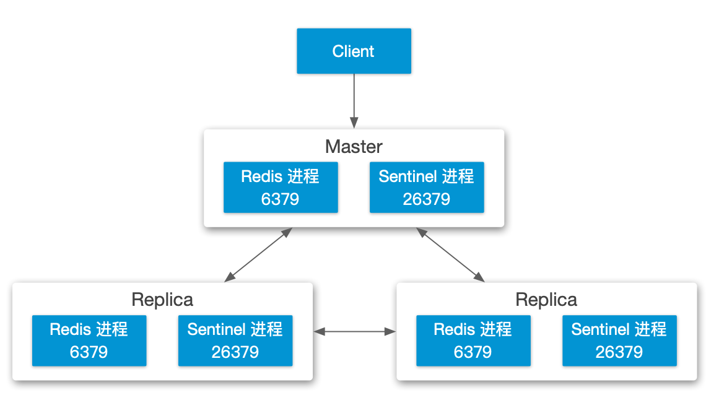
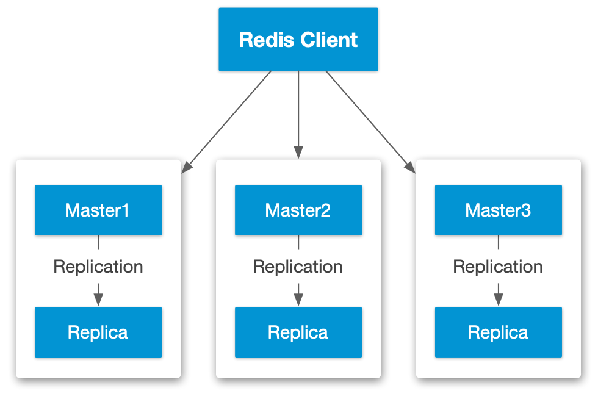

## 目录
{: .no_toc .text-delta }

1. TOC
{:toc}

# 概要

接[这篇文章](https://wiki.halfcoffee.com/docs/db/redis-cluster) ，讲解一下在 Avi 下如何为 Redis 配置负载均衡。

Redis 有两种高可用模式：哨兵模式和集群模式，其中哨兵模式搭配负载均衡使用的情况比较多，集群模式下 Redis 本身有应用层的负载机制和故障切换机制，因此不太需要负载均衡器，但也可以配置负载均衡，下面就两种模式进行配置说明。


# 1. 哨兵模式

此处仅演示三节点模式：



三个节点 IP 规划如下

```
Redis-1 Master: 10.10.50.231
Redis-2 Replica1: 10.10.50.232
Redis-3 Replica2: 10.10.50.233
```

## 1.1 在 Avi 中为读操作创建 VS


### 配置 Pool


### 配置健康检查


### 配置完成后检查

配置完成后，所有 Redis 节点应该为 Up 状态：


点开任意的服务器查看其详情，可以看到运行状况监控器工作正常：


在服务器侧抓包，可以看到 Avi 定期发送健康检查的报文，结果与上面的截图一致：


## 1.2 在 Avi 中为写操作创建 VS


### 配置 Pool


### 配置健康检查


### 配置完成后检查

配置完成后，仅有一个 Redis 节点为 Up 状态：


点开存活的服务器查看其详情，可以看到运行状况监控器工作正常：


## 1.3 访问测试

访问负载后的 VIP，通过 get 查看已有 key 的值：

```
[root@redis-1 ~]# redis-cli -h 10.10.50.150
10.10.50.150:6379> auth SuperS3cr3tP455
OK
10.10.50.150:6379> get key1
"value1"
10.10.50.150:6379> get key2
"value2"
10.10.50.150:6379> get key3
"value3"
```


连接 VIP 的 6380 端口，通过 set 添加新的 key：

```
[root@redis-1 ~]# redis-cli -h 10.10.50.150 -p 6380
10.10.50.150:6380> auth SuperS3cr3tP455
OK
10.10.50.150:6380> set key4 value4
OK
10.10.50.150:6380> set key5 value5
OK
```


## 1.4 故障切换测试

通过 ` redis-cli -h 10.10.50.231 debug segfault` 将 231 节点设为故障，此节点的服务会立即停止。

```shell
[root@redis-1 ~]# redis-cli -h 10.10.50.231
10.10.50.231:6379> auth SuperS3cr3tP455
OK
10.10.50.231:6379> debug segfault
Could not connect to Redis at 10.10.50.231:6379: Connection refused
not connected>
```

在 Avi 侧会检测到故障并进行 Master 节点切换（从 231 切换为 233）：


读服务中 231 节点也被检测为故障，变为红色：


在 Avi 可视化中可会看到相应的切换事件：


# 2. 集群模式




6 个节点 IP 规划如下：

```
Redis Master01: 10.10.50.234
Redis Master02: 10.10.50.235
Redis Master03: 10.10.50.236
Redis Replica01: 10.10.50.237
Redis Replica02: 10.10.50.238
Redis Replica03: 10.10.50.239
```


在配置负载均衡时，需要针对每个 master-replica 组合进行负载均衡配置，在上面的示例中，6 个节点并不一定会按照 234-237,235-238,236-239 的规则来配对，可能是随机的，因此需要人工检查配对关系。

先随便登陆任意节点，获取所有节点的角色：

```
[root@redis-1 ~]# redis-cli -h 10.10.50.234 cluster nodes
c3714caf6e5edbd44ab53bcf3251c8091fb5e3f8 10.10.50.237:6379@16379 slave b0ec762ea5240553d29b5f18a21c10b329a4ef28 0 1683788803737 3 connected
8aabe934824da9c6860967833c8dcc7ec0b31e1a 10.10.50.234:6379@16379 myself,master - 0 1683788803000 9 connected 0-5460
941efc9d0a0cee4def824940b8654820e59e3c8e 10.10.50.239:6379@16379 master - 0 1683788804000 7 connected 5461-10922
b0ec762ea5240553d29b5f18a21c10b329a4ef28 10.10.50.236:6379@16379 master - 0 1683788804539 3 connected 10923-16383
b55ec43e4b5d709426dfa84eb9207d976bdc9e6a 10.10.50.238:6379@16379 slave 8aabe934824da9c6860967833c8dcc7ec0b31e1a 0 1683788803000 9 connected
f9368e155f6dcefd6e04b8562b9078833694faeb 10.10.50.235:6379@16379 slave 941efc9d0a0cee4def824940b8654820e59e3c8e 0 1683788804740 7 connected
```

通过上面命令获取到有三个 master，分别是 234、236、239，依次在每个节点上执行 `info replication`其 Replica 对应关系：

```
[root@redis-1 ~]# redis-cli -h 10.10.50.234 info replication | grep slave
connected_slaves:1
slave0:ip=10.10.50.238,port=6379,state=online,offset=8040010,lag=1

[root@redis-1 ~]# redis-cli -h 10.10.50.236 info replication | grep slave
connected_slaves:1
slave0:ip=10.10.50.237,port=6379,state=online,offset=8121087,lag=0

[root@redis-1 ~]# redis-cli -h 10.10.50.239 info replication | grep slave
connected_slaves:1
slave0:ip=10.10.50.235,port=6379,state=online,offset=7958385,lag=0
```

最终得到下面三组匹配关系

| 组1  | 10.10.50.234 - 10.10.50.238 |
| ---- | --------------------------- |
| 组2  | 10.10.50.235 - 10.10.50.239 |
| 组3  | 10.10.50.236 - 10.10.50.237 |

## 2.1 在 Avi 中创建 VS


## 2.2 配置 Pool


### 配置健康检查

为 Pool 配置自定义健康检查，设置用户输入为`info replication 回车`（系统会自动转换为 `info replication\r\n`），从返回值中检查是否存在 `role:master`


## 2.3 配置完成后检查

配置完成后，每组 Redis 应该只有一个节点为活动的，另外一个会是红色（Replica 节点）：


## 2.4 访问测试

负载配置完成后 IP 如下（此处使用 Avi 的 IPAM 进行自动分配）：


访问任意负载 IP，通过 get 查看已有 key 的值：

```
[root@redis-1 ~]# redis-cli -c -h 10.10.50.145
10.10.50.145:6379> get key1
-> Redirected to slot [9189] located at 10.10.50.239:6379
"value1"
10.10.50.239:6379> get key2
-> Redirected to slot [4998] located at 10.10.50.234:6379
"value2"
10.10.50.234:6379> get key3
"value3"

[root@redis-1 ~]# redis-cli -c -h 10.10.50.149
10.10.50.149:6379> get key1
-> Redirected to slot [9189] located at 10.10.50.239:6379
"value1"
10.10.50.239:6379> get key2
-> Redirected to slot [4998] located at 10.10.50.234:6379
"value2"
10.10.50.234:6379> get key3
"value3"

[root@redis-1 ~]# redis-cli -c -h 10.10.50.148
10.10.50.148:6379> get key1
"value1"
10.10.50.148:6379> get key2
-> Redirected to slot [4998] located at 10.10.50.234:6379
"value2"
10.10.50.234:6379> get key3
"value3"
```


## 2.5 故障切换测试

通过 ` redis-cli -h 10.10.50.234 debug segfault` 将 234 节点设为故障，此节点的服务会立即停止。

```shell
[root@redis-1 ~]# redis-cli -c -h 10.10.50.234 debug segfault
Error: Server closed the connection
```

在 Avi 侧会检测到故障并进行 Master 节点切换：


在 Avi 可视化中可会看到相应的切换事件：


通过 redis-cli 访问负载后 IP，查看 cluster nodes 信息，可以看到 238 已成为 master，234 fail：

```
[root@redis-1 ~]# redis-cli -c -h 10.10.50.145 cluster nodes
b0ec762ea5240553d29b5f18a21c10b329a4ef28 10.10.50.236:6379@16379 master - 0 1683796171000 3 connected 10923-16383
b55ec43e4b5d709426dfa84eb9207d976bdc9e6a 10.10.50.238:6379@16379 myself,master - 0 1683796170000 10 connected 0-5460
8aabe934824da9c6860967833c8dcc7ec0b31e1a 10.10.50.234:6379@16379 master,fail - 1683796058684 1683796056173 9 disconnected
f9368e155f6dcefd6e04b8562b9078833694faeb 10.10.50.235:6379@16379 slave 941efc9d0a0cee4def824940b8654820e59e3c8e 0 1683796170000 7 connected
c3714caf6e5edbd44ab53bcf3251c8091fb5e3f8 10.10.50.237:6379@16379 slave b0ec762ea5240553d29b5f18a21c10b329a4ef28 0 1683796171753 3 connected
941efc9d0a0cee4def824940b8654820e59e3c8e 10.10.50.239:6379@16379 master - 0 1683796171251 7 connected 5461-10922
```


# 3. 负载之外能不能做更多？

Avi 除了能为 Redis 提供丰富的负载均衡以及可视化功能外，还可以**进行自定义编程，来完成一些特殊的任务**。

比如此处使用 Avi 的 Datascript 来进行 Redis 访问和响应的日志记录：

在下列位置添加一个 Avi Datascript：


在 L4 事件中分别添加 Request 和 Response 事件：

```
# Request:
local requests=avi.l4.read()
avi.vs.log("requests:"..requests)

# Response
local responses=avi.l4.read()
avi.vs.log("responses:"..responses)
```


之后再对 Redis 进行访问测试，在 Avi 的日志中会新增下列日志，日志中会记录每个请求和响应结果：


有了这个功能，就可以在负载侧来做 Redis 审计日志记录之类的事，也可以借助 Avi 日志系统来进行关键词过滤等。