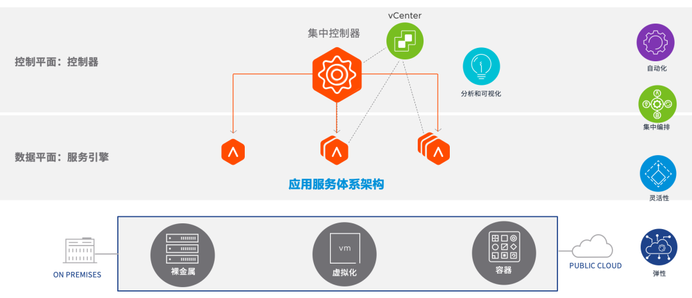
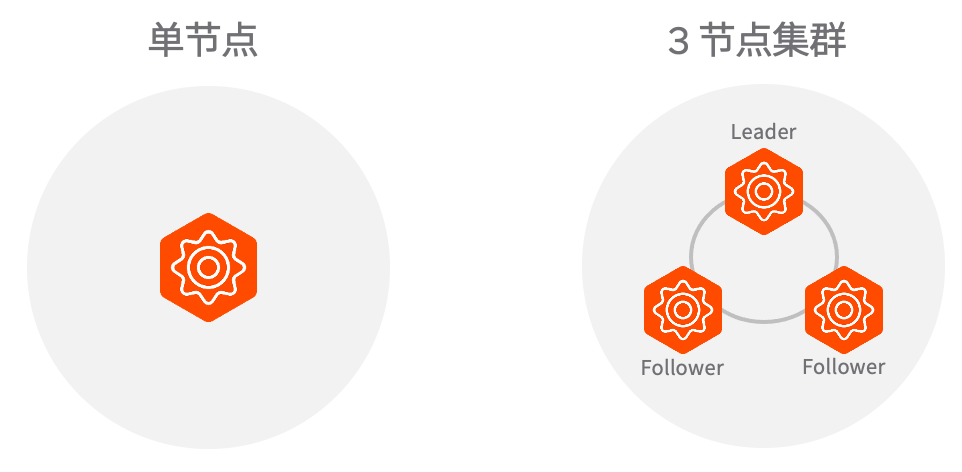
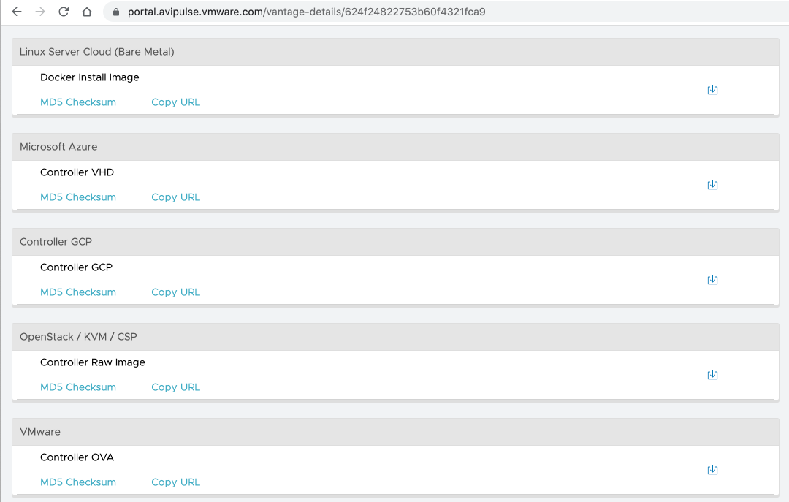
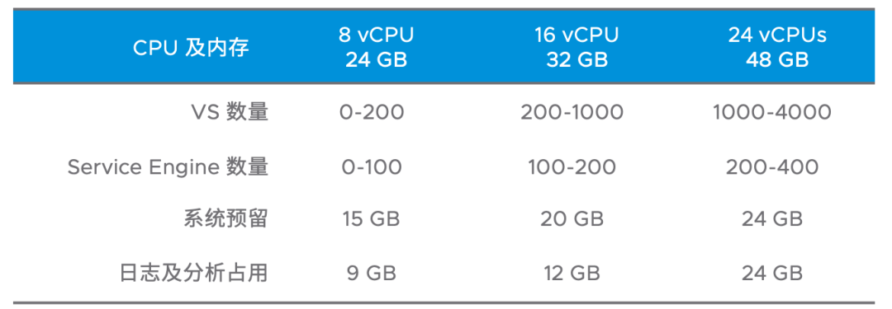
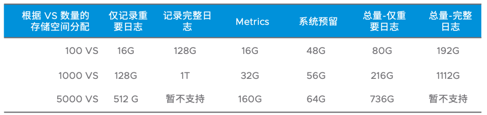

# Avi 部署使用指南(2)：Avi 架构概述

## 目录
{: .no_toc .text-delta }

1. TOC
{:toc}

本文文字较多，阅读大约需要 15 分钟。

# Avi 转控分离的核心架构

[上一篇文章](http://mp.weixin.qq.com/s?__biz=MzUxODgwOTkyMQ==&mid=2247487052&idx=1&sn=7d09922bcb7a3bd99b0ead285272f6ae&chksm=f9827e62cef5f774dad3d8fd12513eeb78c543d888461c6b4d6af11986ba177bbfd3c2cb5e74&scene=21#wechat_redirect)中提到，Avi 共包含两个核心组件：Avi Controller 和 Avi Service Engine。在很多方面，这种架构和 Kubernetes 的架构非常像，熟悉 k8s 的朋友可能知道，在 Kubernetes 架构下，服务器会分成两种角色：Master 和 Worker。

Master 提供统一的 API 来为用户、集群内服务、业务等服务。

Worker 则遵照 Controller Manager 等的分配来运行最终的业务，这种架构下，Worker 实际上可以是无状态的，任意一个 Worker 故障业务可以被调度到其他节点上继续执行。

而 Avi 在工作模式上很 Kubernetes 基本一致，Avi Controller 类似于 Kubernetes Master，有面向用户的 API/UI，也负责工作负载（虚拟服务）的下发。

而 Avi Service Engine 类似于 Kubernetes Worker，执行 Controller 下发的任务，假如 Service Engine 故障，Controller 也可以发现故障并将业务迁移到其他活动的 Service Engine 上（注意：仅有部分配置下才需要 Controller 参与故障切换调度，后面会有详细的文章介绍）。

和 Kubernetes 不同的是，Avi Controller 也支持 Service Engine 的生命周期管理，比如 SE 的创建、自动修复、故障后重建等等工作，在这个层面上比 Kubernetes 要先进一些。

下面详细看看每个层面的组件。

 

# 控制平面：Avi 控制器（Avi Controller） 

## Avi Controller 功能汇总 

1. 集中管理：一套控制器可以管理在多个平台中的 Service Engine，提供一致的管理体验；
2. 提供 GUI、API 及 CLI 三类配置界面：一般普通的管理使用 GUI 即可；一些不常用的高级参数可以使用 CLI 调整；和其他平台的对接使用 API；
3. 配置存储：所有和负载均衡相关的配置，例如 IP 地址分配、虚拟服务配置信息、WAF 策略等配置均统一保存在控制器中，即使控制器故障，只要配置还有备份，就可以通过配置备份进行恢复；
4. Service Engine 的生命周期管理：在 vCenter 等环境下，如果具备相关的权限，则 Controller 可以完全管理 Service Engine 的创建、删除、修复等；
5. IPAM 功能：虚拟服务的 VIP，以及 Service Engine 数据平面的地址均可以通过 Controller 来进行自动分配，分配后的地址不会因重启等操作发生变化；
6. DNS 自动注册：Avi 支持自动实现 FQDN 和 VIP 的绑定，实现 DNS 自动注册，此功能需要启用全局 DNS Service；
7. 可视化分析：Avi Controller 自带了性能分析引擎以及日志收集引擎，可以不依赖第三方组件快速完成业务性能、业务健康度、访问情况等的查看，也可以更加细致地查看业务的访问日志，用于排错和应用访问分析。当然也支持将日志等信息转发到外部收集器，例如 Log Insight；
8. 与 IaaS/CaaS 平台对接：通过 Avi Controller 可以与 vSphere、OpenStack、Kubernetes 等平台进行集成，实现一部分的自动化功能；
9. License 管理：Avi 相关的 License 均是统一输入在控制器中，由控制器根据 Service Engine 的使用情况来动态分配，跨多个环境统一管理 License。

## Avi Controller 高可用 

Controller 支持单节点部署或者三节点集群形式部署，一般生产环境下建议使用三节点集群。任何时候都建议为 Controller 配置备份。具体方法参见[上一篇文章](http://mp.weixin.qq.com/s?__biz=MzUxODgwOTkyMQ==&mid=2247487052&idx=1&sn=7d09922bcb7a3bd99b0ead285272f6ae&chksm=f9827e62cef5f774dad3d8fd12513eeb78c543d888461c6b4d6af11986ba177bbfd3c2cb5e74&scene=21#wechat_redirect)。

在单节点下：

- 假如 Controller 故障，则用户不能对业务进行配置变更，但已经配置好的业务不受影响。

在 3 节点集群下:

- 单节点故障整个控制器集群可以正常工作，业务不受影响；
- 双节点故障下不能对业务进行配置变更，但可以通过一些手段将剩余的节点提升为活动节点，业务不受影响；
- 三节点故障下，如果三个节点最终都无法恢复（例如存储故障），则可以通过备份进行恢复，业务不受影响。

## Avi Controller 部署 

在上文中提到了如何在 vSphere 环境下部署 Controller，实际上 Avi Controller 也可以在下列平台中运行：

- KVM 环境：Avi 提供 qcow2 及 raw 镜像，用户可以通过 KVM 工具创建虚拟机来使用；
- OpenStack 环境：和 KVM 类似，通过 qcow2 或者 raw 格式镜像创建虚拟机使用；
- Linux 裸金属/VM 环境：Avi 提供 Docker 镜像和安装脚本，可以直接运行在兼容的 Linux 发行版和 Docker 环境之上。

*“下图为 Avi 介质下载页面截图”
*

## Avi Controller 大小考量 

前面提到 Controller 提供了性能分析、日志记录等多项功能，因此在中大规模下会需要更多的资源来承载这些服务。

关于不同控制器规模（CPU 和内存）下能承载的最大虚拟服务和 Service Engine 数量，可以参考下列表格：

对于存储的开销，主要取决于虚拟服务的数量和开启的日志级别。不同规模下的磁盘用量可以参考下表：

对于日志和 Metrics，Avi 会自动进行清理/轮询覆盖：

- 日志：日志空间满时自动清理旧日志
- Metrics：实时统计信息保留 1h；5 分钟间隔的统计信息保留 1 天；1 小时间隔的统计信息保留 1 周；1 天间隔的统计信息保留 1 年。

关于控制器容量设计的更多信息，请查看官方文档：

https://avinetworks.com/docs/latest/avi-controller-sizing/

# 数据平面：Avi 服务引擎（Avi Service Engine，简称 SE） 

## Service Engine 功能汇总 

1. 运行服务器负载均衡功能：运行基本的负载均衡功能，支持 4 层 TCP/UDP 应用的负载，也支持七层应用的负载均衡，例如 HTTP 和 FTP 等；
2. 运行 DNS 服务：为环境中的 DNS 服务器提供负载均衡功能；或者自身作为 DNS 服务器工作，执行 A/AAAA 记录解析；
3. 为 Web 应用功能提供 WAF 功能：基于 OWSAP top 10 应用程序安全漏洞列表保护应用；
4. 执行与负载均衡相关的其他功能：例如 L3~L7 安全策略、DDoS 防护、SSL 卸载等；
5. 生成应用日志及 Metrics：应用的访问日志由 SE 生成，然后发送给 Controller 统一进行展示。应用的统计信息也是由 SE 来生成，发送给 Controller 进行加工后做成图表来进行展示。

## Service Engine 形态

为了支持多种云平台，Avi Service Engine 支持多种方式来部署，从技术角度看有下列两种方式：

\1. IaaS 平台托管的虚拟机 ：

- 例如在 vCenter 中，Avi Controller 可以自动通过 vCenter 接口部署虚拟机到 vSphere 环境下，并管理 Service Engine 的生命周期；也可以通过 OVA 形式手动部署成虚拟机。OpenStack 平台下也是类似；
- 在 AWS 等云平台下，由云提供商自动创建并管理 SE。

\2. 裸金属服务器/VM 中部署的 Docker 服务：

- 直接在裸金属服务器/VM 中安装 Linux 和 Docker，以容器形式运行 Service Engine 相关的服务，Service Engine 相关服务可以通过 Avi Controller 自动推送到 Linux Server 中。

## Service Engine 大小考量

Service Engine 作为最终处理业务负载均衡的组件，其大小设计会影响最终的业务承载能力。通常来说需要关注下列两个配置：

- **CPU**：CPU 性能和数量会影响负载均衡能承载的最大新建连接、吞吐等指标，在 Avi 下一般建议按业务需要来购买 License，并分配相应数量的 CPU，具体计算方式请联系相关区域的销售团队。

另外，官方也提供了不同配置下的性能参考，详见：

https://avinetworks.com/docs/21.1/nsx-alb-performance-datasheet/

- **内存**：内存大小会影响并发连接数和 HTTP 缓存等的大小，默认 SE 会配备 2G 内存，生产环境下**建议调整大此值**，例如 1C 搭配 4G 内存，2C 搭配 8G 内存，避免后期因为内存资源不足而达不到最佳的性能。

在虚拟化中，**强烈建议为 SE 开启 CPU 和内存预留**，避免和其他 VM 产生资源争用。

**存储**：在 Avi 下存储主要做系统的承载以及日志缓存，默认 SE 1C 2G 会搭配 15G  磁盘，如果调整大了内存，也需要相应调整磁盘大小，对应关系为：磁盘大小=内存大小*2+5G，例如内存设置为 10G 时，磁盘需要至少设置为  25G。如果设置错误，UI 也会有提示。

## Service Engine 高可用模式

和传统负载均衡器类似，Avi 支持 N+M 和 Active/Passive 这两种常见的高可用模式，额外地，Avi 还独有支持 Active/Active 模式。三种高可用模式简要对比如下：

- Active/Active：对于单个业务，其流量可以由多个 Service Engine 并行处理，当任意一台 Service Engine 故障后，只有部分业务流量短暂受影响。在 A/A 模式下可以灵活地根据业务流量情况让 2~多台 Service Engine 承载流量，支持横向扩容；
- Active/Standby：对于单个业务，只有一台 Service Engine 为活动，另一台为备份；多个业务可以分散在主备两台 Service Engine 上。此模式下不支持横向扩容，仅支持纵向扩容（即更改单台 Service Engine 的 CPU 和内存）；
- N+M：N+M 是一种介于 A/A 和 A/S 之间的高可用模式。N+M 下可以像 A/S 一样针对单个业务使用主/备模式，也可以像 A/A 一样让多台 Service Engine 并行处理单个业务的流量，非常灵活 。N 表示承载所有虚拟服务需要的最少的 Service Engine 数量，M 表示备用 Service Engine 的数量。

## Service Engine Group

通常情况下我们很少去管理单个 Service Engine，在 Avi 下存在一个逻辑概念，叫 Service Engine Group，SEG 可以理解为 vSphere 环境下的 Cluster 或者一个存储的 RAID 组，表示一个**负载均衡器高可用组**。Service Engine 的高可用模式需要在 Service Engine Group 上进行设置。

一个 SEG 中可以有多台 Service Engine，一个虚拟服务通常被托管在一个组内运行，用户可以根据需求使用多个 SEG，灵活地将业务托管在不同的 SEG 上。

除了高可用模式外，在 SEG 上也可以设置 SE 的资源大小、摆放位置、名称等选项。

关于 SE 和 SEG 的更多内容，未来会逐个展开详细介绍，敬请期待。