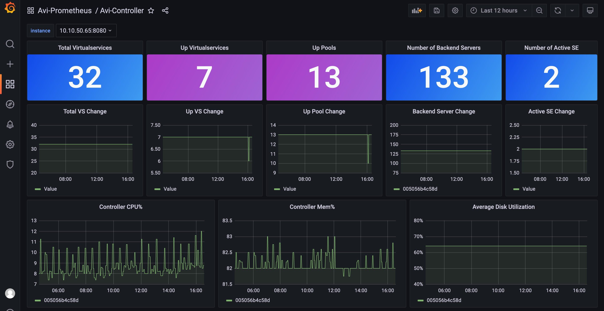
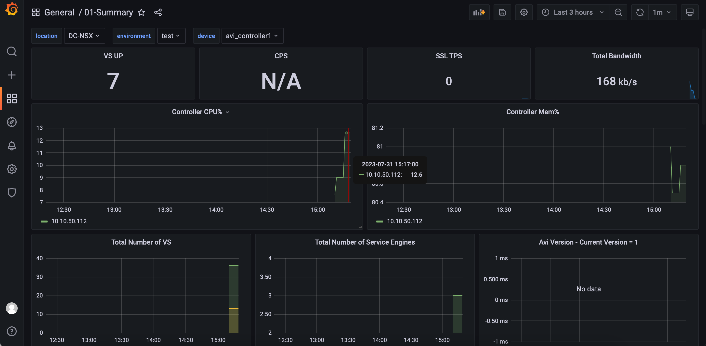

## 目录
{: .no_toc .text-delta }

1. TOC
{:toc}

# 对接方式

Avi 的 Metric 可以通过两种形式丢给 Grafana：

- 部署 Prometheus，直接调用 Avi API 来获取 Metrcs，再通过 Grafana 对接 Prometheus 来展示

- 部署 Avi Metrics Collection，将 Metric 吐给 InfluxDB，再通过 Grafana 对接 InfluxDB 来展示


# 方式1 - 直接对接 Prometheus

从 18.2.6 开始，Avi 提供了 Prometheus REST API，用于直接获取 metric 信息。在进行 Avi 和 Prometheus 对接时有两种配置方式：

- 直接在 Prometheus 上通过 Job 定期从 Avi Controller 拉取 Metric
- 通过 Avi API Proxy 来统一拉取 Metric，Prometheus 通过 Avi Proxy 获取 Metric

例如使用下面的 API 即可获取所有 Virtual Service 的 Metric 信息：


## 配置并部署 Prometheus（直连方式）

准备 Prometheus 目录和配置文件：

```shell
mkdir /root/prometheus
chown 65534:65534 /root/prometheus
chmod 777 /root/prometheus
cd /root/prometheus
cat >prometheus.yml <<EOF
# my global config
global:
  scrape_interval: 15s # Set the scrape interval to every 15 seconds. Default is every 1 minute.
  evaluation_interval: 15s # Evaluate rules every 15 seconds. The default is every 1 minute.
  # scrape_timeout is set to the global default (10s).

# Alertmanager configuration
alerting:
  alertmanagers:
    - static_configs:
        - targets:
          # - alertmanager:9093

# Load rules once and periodically evaluate them according to the global 'evaluation_interval'.
rule_files:
  # - "first_rules.yml"
  # - "second_rules.yml"

# A scrape configuration containing exactly one endpoint to scrape:
# Here it's Prometheus itself.
scrape_configs:
  # The job name is added as a label `job=<job_name>` to any timeseries scraped from this config.
  - job_name: "prometheus"

    # metrics_path defaults to '/metrics'
    # scheme defaults to 'http'.

    static_configs:
      - targets: ["localhost:9090"]
  - job_name: 'avi_vs'
    scrape_interval: 10s
    metrics_path: '/api/analytics/prometheus-metrics/virtualservice'
    params:
#      entity_name: ['DNS,GSLB-DNS']
      tenant: ['admin']
    scheme: 'https'
    tls_config:
      insecure_skip_verify: true
    basic_auth:
      username: 'admin'
      password: 'VMware1!'
    static_configs:
      - targets: ['10.10.50.112']
  - job_name: 'avi_controller'
    scrape_interval: 10s
    metrics_path: '/api/analytics/prometheus-metrics/controller'
    params:
    scheme: 'https'
    tls_config:
      insecure_skip_verify: true
    basic_auth:
      username: 'admin'
      password: 'VMware1!'
    static_configs:
      - targets: ['10.10.50.112']
  - job_name: 'avi_serviceengine'
    scrape_interval: 10s
    metrics_path: '/api/analytics/prometheus-metrics/serviceengine'
    params:
      tenant: ['admin']
    scheme: 'https'
    tls_config:
      insecure_skip_verify: true
    basic_auth:
      username: 'admin'
      password: 'VMware1!'
    static_configs:
      - targets: ['10.10.50.112']
  - job_name: 'avi_pool'
    scrape_interval: 10s
    metrics_path: '/api/analytics/prometheus-metrics/pool'
    params:
      tenant: ['admin']
    scheme: 'https'
    tls_config:
      insecure_skip_verify: true
    basic_auth:
      username: 'admin'
      password: 'VMware1!'
    static_configs:
      - targets: ['10.10.50.112']
EOF
```

通过 Docker 运行 Prometheus，将上面的 prometheus.yml 及目录直接挂给容器：

```shell
docker run --restart always --name prometheus -d \
    -p 9090:9090 \
    -v /root/prometheus/prometheus.yml:/etc/prometheus/prometheus.yml \
    -v /root/prometheus:/prometheus \
    prom/prometheus
```

启动 Prometheus 后，在 Target 中查看 metric 收集状态：


可以在搜索框输入 `avi_healthscore_health_score_value`查看所有 VS 的健康指数，确保 Prometheus 已经正确收集到了信息：


## 配置并部署 Prometheus（代理模式-建议）

在上文中，我们可以看到为了使得 Prometheus 正确获取 Avi Metircs，需要设置一大堆 Job，同时每个部分都需要填写用户名密码，这在一定程度上不够安全，此时可以通过 Avi API Proxy 来代理获取 Metric 信息。

### 部署 Avi API Proxy

注意：为了方便 Metric 传递，建议将 Avi API Proxy 部署在与 Prometheus 同位置的宿主机上。

```shell
docker run -d --restart always --name avi-api-proxy -p 8080:8080 \
-e AVI_CONTROLLER=10.10.50.112 \
-e AVI_USERNAME=admin \
-e AVI_PASSWORD=VMware1! \
-e AVI_TIMEOUT=10 \
-dit avinetworks/avi-api-proxy:latest
```

查看日志运行正常：

```shell
[root@k8s-m01 prometheus]# docker logs c26242bdcf30
I0803 03:50:28.790188       1 session.go:422] Req for uri  RespCode 200
I0803 03:50:28.790324       1 session.go:372] Set the csrf token to IMHyiMaerCPIQigrJ5PbWP3SX3mklTB9
I0803 03:50:28.937897       1 session.go:422] Req for uri login RespCode 200
I0803 03:50:28.937939       1 session.go:372] Set the csrf token to qoAjOR2ktAb5zgwjFCamAwvZv3vRDVOu
I0803 03:50:28.938201       1 session.go:203] response: <nil>
I0803 03:50:28.991116       1 session.go:422] Req for uri /api/initial-data RespCode 200
I0803 03:50:28.991155       1 session.go:372] Set the csrf token to qoAjOR2ktAb5zgwjFCamAwvZv3vRDVOu
I0803 03:50:28.991253       1 main.go:153] [AVIPROXY]: Starting AVI proxy on port 8080
```

在 Avi 控制器中可以看到相关的登录事件：


### 配置部署 Prometheus

准备 Prometheus 目录和配置文件，下面的配置文件 target 为 Avi API Proxy：

```shell
mkdir /root/prometheus
chown 65534:65534 /root/prometheus
chmod 777 /root/prometheus
cd /root/prometheus
cat >prometheus.yml <<EOF
# my global config
global:
  scrape_interval: 15s # Set the scrape interval to every 15 seconds. Default is every 1 minute.
  evaluation_interval: 15s # Evaluate rules every 15 seconds. The default is every 1 minute.
  # scrape_timeout is set to the global default (10s).

# Alertmanager configuration
alerting:
  alertmanagers:
    - static_configs:
        - targets:
          # - alertmanager:9093

# Load rules once and periodically evaluate them according to the global 'evaluation_interval'.
rule_files:
  # - "first_rules.yml"
  # - "second_rules.yml"

# A scrape configuration containing exactly one endpoint to scrape:
# Here it's Prometheus itself.
scrape_configs:
  # The job name is added as a label `job=<job_name>` to any timeseries scraped from this config.
  - job_name: "prometheus"

    # metrics_path defaults to '/metrics'
    # scheme defaults to 'http'.

    static_configs:
      - targets: ["localhost:9090"]
  - job_name: 'avi_vs'
    scrape_interval: 60s
    metrics_path: '/api/analytics/prometheus-metrics/virtualservice'
    params:
#      entity_name: ['DNS,GSLB-DNS']
      tenant: ['admin']
    scheme: 'http'
    static_configs:
      - targets: ['10.10.50.65:8080']
  - job_name: 'avi_controller'
    scrape_interval: 10s
    metrics_path: '/api/analytics/prometheus-metrics/controller'
    params:
    scheme: 'http'
    static_configs:
      - targets: ['10.10.50.65:8080']
  - job_name: 'avi_serviceengine'
    scrape_interval: 10s
    metrics_path: '/api/analytics/prometheus-metrics/serviceengine'
    params:
      tenant: ['admin']
    scheme: 'http'
    static_configs:
      - targets: ['10.10.50.65:8080']
  - job_name: 'avi_pool'
    scrape_interval: 10s
    metrics_path: '/api/analytics/prometheus-metrics/pool'
    params:
      tenant: ['admin']
    scheme: 'http'
    static_configs:
      - targets: ['10.10.50.65:8080']
EOF
```

通过 Docker 运行 Prometheus，将上面的 prometheus.yml 及目录直接挂给容器：

```shell
docker run --restart always --name prometheus -d \
    -p 9090:9090 \
    -v /root/prometheus/prometheus.yml:/etc/prometheus/prometheus.yml \
    -v /root/prometheus:/prometheus \
    prom/prometheus
```

启动 Prometheus 后，在 Target 中查看 metric 收集状态：


相应的，在 Avi API Proxy 容器中也可以看到请求日志：

```shell
[root@k8s-m01 prometheus]# docker logs c26
I0803 03:50:28.790188       1 session.go:422] Req for uri  RespCode 200
I0803 03:50:28.790324       1 session.go:372] Set the csrf token to IMHyiMaerCPIQigrJ5PbWP3SX3mklTB9
I0803 03:50:28.937897       1 session.go:422] Req for uri login RespCode 200
I0803 03:50:28.937939       1 session.go:372] Set the csrf token to qoAjOR2ktAb5zgwjFCamAwvZv3vRDVOu
I0803 03:50:28.938201       1 session.go:203] response: <nil>
I0803 03:50:28.991116       1 session.go:422] Req for uri /api/initial-data RespCode 200
I0803 03:50:28.991155       1 session.go:372] Set the csrf token to qoAjOR2ktAb5zgwjFCamAwvZv3vRDVOu
I0803 03:50:28.991253       1 main.go:153] [AVIPROXY]: Starting AVI proxy on port 8080
I0803 04:00:16.479544       1 main.go:35] [AVIPROXY]: Proxy request GET /api/analytics/prometheus-metrics/pool?tenant=admin
I0803 04:00:17.212622       1 session.go:422] Req for uri api/analytics/prometheus-metrics/pool?tenant=admin RespCode 200
I0803 04:00:18.071544       1 main.go:35] [AVIPROXY]: Proxy request GET /api/analytics/prometheus-metrics/controller
I0803 04:00:18.153900       1 session.go:422] Req for uri api/analytics/prometheus-metrics/controller RespCode 200
I0803 04:00:18.266216       1 main.go:35] [AVIPROXY]: Proxy request GET /api/analytics/prometheus-metrics/serviceengine?tenant=admin
```


## 安装 Grafana

通过 Docker 运行 Grafana：

```
mkdir /root/grafana
chown 65534:65534 /root/grafana
chmod 777 /root/grafana
docker run -d --restart always -p 80:3000 --name=grafana --volume "/root/grafana:/var/lib/grafana" grafana/grafana-enterprise
```

## 初始化 Grafana

在 Grafana 中添加 Prometheus Datasource，名称保持默认不变，将其设为 Default：


### 导入 Dashborad

在[这里下载](https://github.com/avinetworks/devops/tree/master/monitoring/grafana/prometheus) Prometheus 的 Grafana Dashborad。

导入 Grafana 中：


导入完成：


可以看到正确收到了信息：


下面的 Dashborad 是根据官方的微调的，可以统一查看 VS、Pool 和 Server 的变化，[点我下载](/output/Avi-Controller.json) 



# 方式 2 - InfluxDB

InfluxDB 支持两种查询格式，一种是传统的 InfluxQL，使用 SQL 语言，Avi Grafana Dashborad 目前只支持这种形式。另一种查询格式是 FLUX 。

## 安装 InfluxDB

通过 Docker 运行 InfluxDB：

```shell
mkdir /root/influxdb
chown 65534:65534 /root/influxdb
chmod 777 /root/influxdb
docker run -d --name influxdb -p 8086:8086 --volume /root/influxdb:/var/lib/influxdb2 influxdb:2.7.0
```


## 初始化 InfluxDB


设置管理员密码，Org 名称及 Bucket 名称，建议都设为 avi：


**非常重要！！拷贝下面的 token**：

例如：

```
tZEDgsfDFWSS3tlRMaPhcu__Xc2U9cDmhc8J-8PcojXpEA6FFH29j1hyPy6fnTbLPGD2RDC-8HuL4gSI-fF1Xw==
```


点击 Quick Start 继续。


## 安装 Avi Metrics Collection

Avi Metrics Collection 容器用于从 Avi Controller 拉取 metrics 信息，然后输出到时序数据库中。

支持下列类型的时序数据库：AppDynamics, Datadog, Dynatrace, Elasticsearch, Graphite, InfluxDB, InfluxDB_v2, Logstash, Splunk, and Wavefront.

Avi Metrics Collection 有两种方式运行：

- 通过 python3 本地运行，调用本地的 configuration.yaml，一次性收集 metric 并发送给 InfluxDB（如果要重复运行，可以使用循环脚本）
- Docker 容器运行

### 容器运行 Metric Collection

在[下列位置](https://github.com/avinetworks/devops/tree/master/monitoring/metrics%20collection)下载 configuration_example.yaml ：

```shell
[root@k8s-m01 avi]# pwd
/root/avi
[root@k8s-m01 avi]# ls -l
total 168
-rw-r--r--. 1 root root   5381 Jul 31 14:42 configuration.yaml
```

将 configuration_example.yaml 重命名为 configuration.yaml，并进行修改，填写 Avi 和 InfluxDB 相关的配置：

```
#----------Controllers to Poll Data From - REQUIRED ------------
#---------------------------------------------------------------
controllers:
   - avi_cluster_name: avi_controller1
     avi_controller: 10.10.50.112
     avi_user: admin
     #comment: ACCEPTS PLAIN TEXT OR BASE64 ENCODED PASSWORD
     avi_pass: VMware1!
     tags:
      environment: test
      location: DC-NSX
     #comment: Realtime metrics will cause the script to take longer to complete, optional
     virtualservice_stats_config:
         virtualservice_metrics: True
         virtualservice_realtime: False
         virtualservice_runtime: True
         virtualservice_metrics_list:
            - l4_client.avg_bandwidth
            - l4_client.avg_rx_pkts
            - l4_client.avg_tx_pkts
            - l4_client.avg_rx_bytes
            - l4_client.avg_tx_bytes
            - l7_client.avg_ssl_handshakes_new
     serviceengine_stats_config:
         serviceengine_metrics: True
         serviceengine_runtime: True
         serviceengine_realtime: True
     pool_stats_config:
         pool_metrics: True
         pool_runtime: True
         pool_realtime: False
     controller_stats_config:
         controller_metrics: True
         controller_runtime: True
         controller_metrics_list:
            - controller_stats.avg_cpu_usage
            - controller_stats.avg_disk_usage
            - controller_stats.avg_mem_usage
     metrics_endpoint_config:
##----------influxdb_v2------------
         - type: influxdb_v2
           enable: True
           server: 10.10.50.65
           server_port: 8086
           protocol: http
           org: avi
           bucket: avi
           token: tZEDgsfDFWSS3tlRMaPhcu__Xc2U9cDmhc8J-8PcojXpEA6FFH29j1hyPy6fnTbLPGD2RDC-8HuL4gSI-fF1Xw==
           #_comment":"Change metric_prefix only if you need to define a prefix",
           metric_prefix: ""
           #_comment":"If using auth on influxdb_v2 set auth-enabled to true and modify the credential values",
           auth-enabled: False
           username: admin
           password: password
```

其中关键的配置有：

- avi_controller：设置控制器 IP
- avi_user：设置 Avi 用户名
- avi_pass：设置 Avi 密码
- InfluxDB_v2 下面的 Server、org、bucket 和 token（和初始化 InfluxDB 时一致）


运行 Metric Collection 容器，此容器每 60s 收集一次 metric 信息：

```shell
docker run -d --name metricscollectn --restart always --log-opt max-size=1m -e "EN_CONFIGURATION=$(<configuration.yaml)"  avinetworks/metrics-collection:latest
```


通过 docker logs 查看日志：

```shell
[root@k8s-m01 avi]# docker logs c5e962
[{'type': 'influxdb_v2', 'enable': True, 'server': '10.10.50.65', 'server_port': 8086, 'protocol': 'http', 'org': 'avi', 'bucket': 'avi', 'token': 'tZEDgsfDFWSS3tlRMaPhcu__Xc2U9cDmhc8J-8PcojXpEA6FFH29j1hyPy6fnTbLPGD2RDC-8HuL4gSI-fF1Xw==', 'metric_prefix': '', 'auth-enabled': False, 'username': 'admin', 'password': 'password'}]
-------------------------------------------------------------------
============ CONFIGURATION FOR: avi_controller1:10.10.50.112 ============
VIRTUALSERVICE METRICS:  True
VIRTUALSERVICE REALTIME METRICS:  False
VIRTUALSERVICE RUNTIME:  True
SERVICEENGINE METRICS:  True
SERVICEENGINE REALTIME METRICS:  True
SERVICEENGINE RUNTIME:  True
POOL METRICS:  True
POOL REALTIME METRICS:  False
POOL RUNTIME:  True
CONTROLLER METRICS:  True
CONTROLLER RUNTIME:  True
-------------------------------------------------------------------
-------------------------------------------------------------------
=====> Running the following metrics functions:
         avi_metrics.virtual_service_stats_threaded
         avi_metrics.vs_metrics_per_se_threaded
         avi_metrics.vs_oper_status
         avi_metrics.vs_primary_se
         avi_metrics.virtual_service_hosted_se
         avi_metrics.srvc_engn_stats_threaded
         avi_metrics.srvc_engn_vs_count
         avi_metrics.srvc_engn_count
         avi_metrics.se_missed_hb
         avi_metrics.service_engine_vs_capacity
         avi_metrics.se_connected
         avi_metrics.get_serviceengine_version
         avi_metrics.pool_server_stats_threaded
         avi_metrics.active_pool_members
         avi_metrics.controller_cluster_metrics
         avi_metrics.cluster_status
         avi_metrics.avi_subnet_usage
         avi_metrics.license_usage
         avi_metrics.license_expiration
         avi_metrics.get_controller_version
-------------------------------------------------------------------
=====> Chose 10.10.50.112
2023-07-31 07:10:03.731881 10.10.50.112: func gen_inventory_dict completed, executed in 2.817716121673584 seconds
2023-07-31 07:10:03.915173 10.10.50.112: func virtual_service_primary_se completed, executed in 0.04634737968444824 seconds
2023-07-31 07:10:03.953215 10.10.50.112: func se_missed_hb completed, executed in 0.051908016204833984 seconds
2023-07-31 07:10:03.964136 10.10.50.112: func vs_oper_status completed, executed in 0.07005667686462402 seconds
2023-07-31 07:10:03.975770 10.10.50.112: func srvc_engn_vs_count completed, executed in 0.07124471664428711 seconds
2023-07-31 07:10:03.981337 10.10.50.112: func se_connected completed, executed in 0.07481217384338379 seconds
2023-07-31 07:10:03.997768 10.10.50.112: func service_engine_vs_capacity completed, executed in 0.08735084533691406 seconds
2023-07-31 07:10:04.043724 10.10.50.112: func get_serviceengine_version completed, executed in 0.1043388843536377 seconds
2023-07-31 07:10:04.069542 10.10.50.112: func active_pool_members completed, executed in 0.13574719429016113 seconds
2023-07-31 07:10:04.076616 10.10.50.112: func srvc_engn_count completed, executed in 0.12640762329101562 seconds
2023-07-31 07:10:04.111707 10.10.50.112: func virtual_service_hosted_se completed, executed in 0.16533923149108887 seconds
2023-07-31 07:10:04.185456 10.10.50.112: func virtual_service_stats completed for tenant: tkc-avi, executed in 0.3142428398132324 seconds
2023-07-31 07:10:04.370669 10.10.50.112: func virtual_service_stats completed for tenant: tkc-nsx, executed in 0.47557735443115234 seconds
2023-07-31 07:10:04.413118 10.10.50.112: func virtual_service_stats completed for tenant: ncp, executed in 0.5368912220001221 seconds
2023-07-31 07:10:04.426418 10.10.50.112: func vs_metrics_per_se completed tenant: admin, executed in 0.5236365795135498 seconds
2023-07-31 07:10:04.503764 10.10.50.112: func vs_metrics_per_se completed tenant: ncp, executed in 0.6112730503082275 seconds
2023-07-31 07:10:04.514350 10.10.50.112: func license_usage completed, executed in 0.4797637462615967 seconds
2023-07-31 07:10:04.520674 10.10.50.112: func virtual_service_stats completed for tenant: nsx-t, executed in 0.6412820816040039 seconds
2023-07-31 07:10:04.558451 10.10.50.112: func vs_metrics_per_se completed tenant: nsx-t, executed in 0.6068401336669922 seconds
2023-07-31 07:10:04.566203 10.10.50.112: func virtual_service_stats completed for tenant: admin, executed in 0.6930897235870361 seconds
2023-07-31 07:10:04.567907 10.10.50.112: func vs_metrics_per_se completed tenant: nsxt-cloud, executed in 0.626197338104248 seconds
2023-07-31 07:10:04.672493 10.10.50.112: func virtual_service_stats completed for tenant: nsxt-cloud, executed in 0.7841920852661133 seconds
2023-07-31 07:10:05.069654 10.10.50.112: func vs_metrics_per_se completed tenant: tkc-avi, executed in 1.0774989128112793 seconds
2023-07-31 07:10:05.087215 10.10.50.112: func vs_metrics_per_se completed tenant: tkc-nsx, executed in 1.0969946384429932 seconds
2023-07-31 07:10:05.089130 10.10.50.112: func vs_metrics_per_se_threaded completed, executed in 1.222818374633789 seconds
2023-07-31 07:10:05.186412 10.10.50.112: func pool_server_stats for tenant ncp, executed in 1.1803700923919678 seconds
2023-07-31 07:10:05.396762 10.10.50.112: func get_avi_version completed, executed in 1.323627233505249 seconds
2023-07-31 07:10:05.565208 10.10.50.112: func cluster_status completed, executed in 1.5104117393493652 seconds
2023-07-31 07:10:05.675846 10.10.50.112: func pool_server_stats for tenant nsx-t, executed in 1.5812788009643555 seconds
2023-07-31 07:10:05.680721 10.10.50.112: func pool_server_stats for tenant tkc-nsx, executed in 1.6210284233093262 seconds
2023-07-31 07:10:05.774030 10.10.50.112: func pool_server_stats for tenant tkc-avi, executed in 1.7495627403259277 seconds
2023-07-31 07:10:05.942178 10.10.50.112: func pool_server_stats for tenant admin, executed in 1.9335682392120361 seconds
2023-07-31 07:10:05.987164 10.10.50.112: func controller_cluster_metrics, executed in 1.8460571765899658 seconds
2023-07-31 07:10:06.083852 10.10.50.112: func pool_server_stats for tenant nsxt-cloud, executed in 1.983680009841919 seconds
2023-07-31 07:10:06.086249 10.10.50.112: func pool_server_stats_threaded completed, executed in 2.1515016555786133 seconds
2023-07-31 07:10:06.147010 10.10.50.112: func srvc_engn_stats completed, executed in 2.0332729816436768 seconds
2023-07-31 07:10:06.235626 10.10.50.112: func srvc_engn_stats completed, executed in 2.1690895557403564 seconds
2023-07-31 07:10:06.237512 10.10.50.112: func srvc_engn_stats completed, executed in 2.0458872318267822 seconds
2023-07-31 07:10:06.289447 10.10.50.112: func srvc_engn_stats completed, executed in 2.2252352237701416 seconds
2023-07-31 07:10:06.336465 10.10.50.112: func srvc_engn_stats completed, executed in 2.3337392807006836 seconds
2023-07-31 07:10:06.350183 10.10.50.112: func srvc_engn_stats completed, executed in 2.2597501277923584 seconds
2023-07-31 07:10:06.656765 10.10.50.112: func avi_subnet_usage encountered an error
2023-07-31 07:10:06.657865 10.10.50.112: Traceback (most recent call last):
  File "/usr/src/avi/metricscollection.py", line 1814, in avi_subnet_usage
    pool_size = float(s['runtime']['subnet_runtime'][0]['total_ip_count'])
KeyError: 'total_ip_count'

2023-07-31 07:10:06.659320 10.10.50.112: controller specific tests have completed, executed in 5.9794323444366455 seconds
2023-07-31 07:10:06.666439 AVI_SCRIPT: metric script has completed, executed in 5.990527868270874 seconds
2023-07-31 07:10:06.666539 AVI_SCRIPT: sleeping for 54 seconds
[{'type': 'influxdb_v2', 'enable': True, 'server': '10.10.50.65', 'server_port': 8086, 'protocol': 'http', 'org': 'avi', 'bucket': 'avi', 'token': 'tZEDgsfDFWSS3tlRMaPhcu__Xc2U9cDmhc8J-8PcojXpEA6FFH29j1hyPy6fnTbLPGD2RDC-8HuL4gSI-fF1Xw==', 'metric_prefix': '', 'auth-enabled': False, 'username': 'admin', 'password': 'password'}]
```


之后在 InfluxDB 的 Data Explorer 中可以看到收集到的数据：


### 二进制运行 Metric Collection（不建议）

安装下列依赖：

- python 3.6+
- pyyaml
- requests

```shell
yum install -y python3
pip install requests
pip3 install pyyaml
```

按照上个章节的内容准备 configuration.yaml ，具体过程略。

在[下列位置](https://github.com/avinetworks/devops/tree/master/monitoring/metrics%20collection)下载metricscollection.py：

```shell
[root@k8s-m01 avi]# pwd
/root/avi
[root@k8s-m01 avi]# ls -l
total 168
-rw-r--r--. 1 root root   5381 Jul 31 14:42 configuration.yaml
-rw-r--r--. 1 root root 132276 Jul 31 10:48 metricscollection.py
```

运行 metricscollection.py，此脚本会自动调用同级目录下的 configuration.yaml ：

```
python3 metricscollection.py
[{'type': 'influxdb_v2', 'enable': True, 'server': '10.10.50.65', 'server_port': 8086, 'protocol': 'http', 'org': 'avi', 'bucket': 'avi', 'token': 'N7L_7IpQvI506wvit--24dK4zblf_Yc86O1oGJ3Kd47bxtNucZKeVr6t9MdM5N2sBR-Z8TCaraDgC1ZtwO0SxQ==', 'metric_prefix': '', 'auth-enabled': False, 'username': 'admin', 'password': 'password'}]
-------------------------------------------------------------------
============ CONFIGURATION FOR: avi_controller1:10.10.50.112 ============
VIRTUALSERVICE METRICS:  True
VIRTUALSERVICE REALTIME METRICS:  False
VIRTUALSERVICE RUNTIME:  True
SERVICEENGINE METRICS:  True
SERVICEENGINE REALTIME METRICS:  True
SERVICEENGINE RUNTIME:  True
POOL METRICS:  True
POOL REALTIME METRICS:  False
POOL RUNTIME:  True
CONTROLLER METRICS:  True
CONTROLLER RUNTIME:  True
-------------------------------------------------------------------
-------------------------------------------------------------------
=====> Running the following metrics functions:
         avi_metrics.virtual_service_stats_threaded
         avi_metrics.vs_metrics_per_se_threaded
         avi_metrics.vs_oper_status
         avi_metrics.vs_primary_se
         avi_metrics.virtual_service_hosted_se
         avi_metrics.srvc_engn_stats_threaded
         avi_metrics.srvc_engn_vs_count
         avi_metrics.srvc_engn_count
         avi_metrics.se_missed_hb
         avi_metrics.service_engine_vs_capacity
         avi_metrics.se_connected
         avi_metrics.get_serviceengine_version
         avi_metrics.pool_server_stats_threaded
         avi_metrics.active_pool_members
         avi_metrics.controller_cluster_metrics
         avi_metrics.cluster_status
         avi_metrics.avi_subnet_usage
         avi_metrics.license_usage
         avi_metrics.license_expiration
         avi_metrics.get_controller_version
-------------------------------------------------------------------
=====> Chose 10.10.50.112
2023-07-31 14:42:19.046966 10.10.50.112: func gen_inventory_dict completed, executed in 2.2169029712677 seconds
2023-07-31 14:42:19.194529 10.10.50.112: func se_missed_hb completed, executed in 0.0200653076171875 seconds
2023-07-31 14:42:19.195423 10.10.50.112: func srvc_engn_count completed, executed in 0.016956329345703125 seconds
2023-07-31 14:42:19.216298 10.10.50.112: func srvc_engn_vs_count completed, executed in 0.03540635108947754 seconds
2023-07-31 14:42:19.252328 10.10.50.112: func vs_oper_status completed, executed in 0.046395063400268555 seconds
2023-07-31 14:42:19.265204 10.10.50.112: func virtual_service_primary_se completed, executed in 0.051156044006347656 seconds
2023-07-31 14:42:19.270893 10.10.50.112: func virtual_service_hosted_se completed, executed in 0.04396510124206543 seconds
2023-07-31 14:42:19.271299 10.10.50.112: func se_connected completed, executed in 0.06222653388977051 seconds
2023-07-31 14:42:19.276863 10.10.50.112: func service_engine_vs_capacity completed, executed in 0.06584405899047852 seconds
2023-07-31 14:42:19.295395 10.10.50.112: func virtual_service_stats completed for tenant: nsxt-cloud, executed in 0.14561748504638672 seconds
2023-07-31 14:42:19.338999 10.10.50.112: func virtual_service_stats completed for tenant: admin, executed in 0.1882328987121582 seconds
2023-07-31 14:42:19.358343 10.10.50.112: func get_serviceengine_version completed, executed in 0.09877228736877441 seconds
2023-07-31 14:42:19.361402 10.10.50.112: func active_pool_members completed, executed in 0.11545443534851074 seconds
2023-07-31 14:42:19.374169 10.10.50.112: func virtual_service_stats completed for tenant: nsx-t, executed in 0.22335290908813477 seconds
2023-07-31 14:42:19.430565 10.10.50.112: func virtual_service_stats completed for tenant: tkc-nsx, executed in 0.2727832794189453 seconds
2023-07-31 14:42:19.489819 10.10.50.112: func virtual_service_stats completed for tenant: ncp, executed in 0.3336002826690674 seconds
2023-07-31 14:42:19.492644 10.10.50.112: func license_usage completed, executed in 0.1877744197845459 seconds
2023-07-31 14:42:19.510478 10.10.50.112: func virtual_service_stats completed for tenant: tkc-avi, executed in 0.34766411781311035 seconds
2023-07-31 14:42:19.585251 10.10.50.112: func vs_metrics_per_se completed tenant: tkc-nsx, executed in 0.3880307674407959 seconds
2023-07-31 14:42:19.671189 10.10.50.112: func vs_metrics_per_se completed tenant: tkc-avi, executed in 0.4773714542388916 seconds
2023-07-31 14:42:19.697232 10.10.50.112: func vs_metrics_per_se completed tenant: ncp, executed in 0.5066351890563965 seconds
2023-07-31 14:42:19.975459 10.10.50.112: func pool_server_stats for tenant admin, executed in 0.7432208061218262 seconds
2023-07-31 14:42:20.032439 10.10.50.112: func vs_metrics_per_se completed tenant: nsx-t, executed in 0.7758727073669434 seconds
2023-07-31 14:42:20.106988 10.10.50.112: func vs_metrics_per_se completed tenant: nsxt-cloud, executed in 0.8437066078186035 seconds
2023-07-31 14:42:20.183277 10.10.50.112: func vs_metrics_per_se completed tenant: admin, executed in 0.9225368499755859 seconds
2023-07-31 14:42:20.185182 10.10.50.112: func vs_metrics_per_se_threaded completed, executed in 1.0135283470153809 seconds
2023-07-31 14:42:20.507675 10.10.50.112: func pool_server_stats for tenant tkc-avi, executed in 1.208033561706543 seconds
2023-07-31 14:42:20.578861 10.10.50.112: func get_avi_version completed, executed in 1.243788719177246 seconds
2023-07-31 14:42:20.596468 10.10.50.112: func cluster_status completed, executed in 1.2813735008239746 seconds
2023-07-31 14:42:20.642941 10.10.50.112: func srvc_engn_stats completed, executed in 1.3329129219055176 seconds
2023-07-31 14:42:20.657730 10.10.50.112: func controller_cluster_metrics, executed in 1.3466196060180664 seconds
2023-07-31 14:42:20.709302 10.10.50.112: func srvc_engn_stats completed, executed in 1.4606013298034668 seconds
2023-07-31 14:42:20.718162 10.10.50.112: func pool_server_stats for tenant nsx-t, executed in 1.3753714561462402 seconds
2023-07-31 14:42:20.747103 10.10.50.112: func srvc_engn_stats completed, executed in 1.4928643703460693 seconds
2023-07-31 14:42:20.771454 10.10.50.112: func srvc_engn_stats completed, executed in 1.4705049991607666 seconds
2023-07-31 14:42:20.810244 10.10.50.112: func srvc_engn_stats completed, executed in 1.4469120502471924 seconds
2023-07-31 14:42:20.836451 10.10.50.112: func srvc_engn_stats completed, executed in 1.5405888557434082 seconds
2023-07-31 14:42:20.840892 10.10.50.112: func pool_server_stats for tenant ncp, executed in 1.5893144607543945 seconds
2023-07-31 14:42:20.998286 10.10.50.112: func pool_server_stats for tenant tkc-nsx, executed in 1.618445634841919 seconds
2023-07-31 14:42:21.001569 10.10.50.112: func pool_server_stats for tenant nsxt-cloud, executed in 1.670536994934082 seconds
2023-07-31 14:42:21.003609 10.10.50.112: func pool_server_stats_threaded completed, executed in 1.7850444316864014 seconds
2023-07-31 14:42:21.004532 10.10.50.112: controller specific tests have completed, executed in 4.2889931201934814 seconds
2023-07-31 14:42:21.009960 AVI_SCRIPT: metric script has completed, executed in 4.297731399536133 seconds
```

脚本运行完毕后，提示 metric 已经收集完毕，没有报错。

## 安装 Grafana

通过 Docker 运行 Grafana：

```
mkdir /root/grafana
chown 65534:65534 /root/grafana
chmod 777 /root/grafana
docker run -d --restart always -p 80:3000 --name=grafana grafana/grafana-enterprise
```

## 初始化 Grafana

在 Grafana 中添加 Datasource，名称为全小写的 influxdb：


添加 Header，名称为 ”Authorization“，值为 ”Token 空格 + 初始化 InfluxDB 时的 token“，例如：

```shell
Token tZEDgsfDFWSS3tlRMaPhcu__Xc2U9cDmhc8J-8PcojXpEA6FFH29j1hyPy6fnTbLPGD2RDC-8HuL4gSI-fF1Xw==
```

Database 填 InfluxDB bucket 名称，用户名和密码留空，HTTP Method 选 POST：


点击 Save & test，确保 Data Source is working：


### 导入 Dashborad

在[这里下载](https://github.com/avinetworks/devops/tree/master/monitoring/grafana/influxdb) InfluxDB 的 Grafana Dashborad。

导入 Grafana 中：


导入完成：


可以看到正确收到了信息：



# 参考配置

[https://docs.influxdata.com/influxdb/v2.0/install/](https://docs.influxdata.com/influxdb/v2.0/install/)

[https://docs.influxdata.com/influxdb/v2.0/api-guide/api_intro/#authentication](https://docs.influxdata.com/influxdb/v2.0/api-guide/api_intro/#authentication)

[https://avinetworks.com/docs/latest/avi-vantage-prometheus-integration/](https://avinetworks.com/docs/latest/avi-vantage-prometheus-integration/)