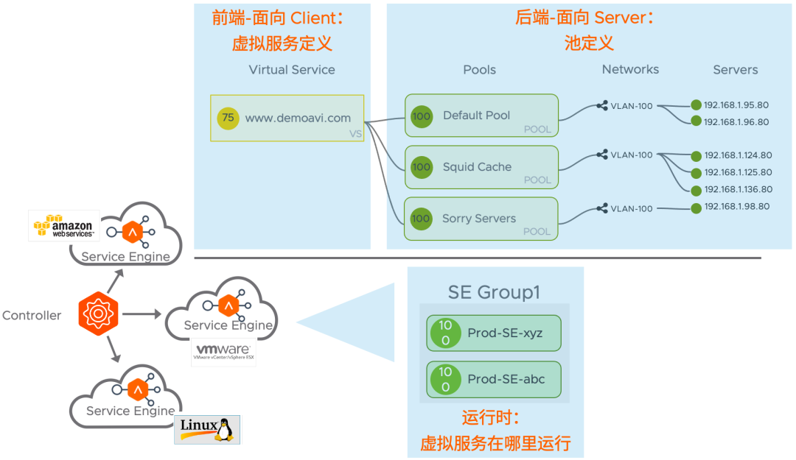
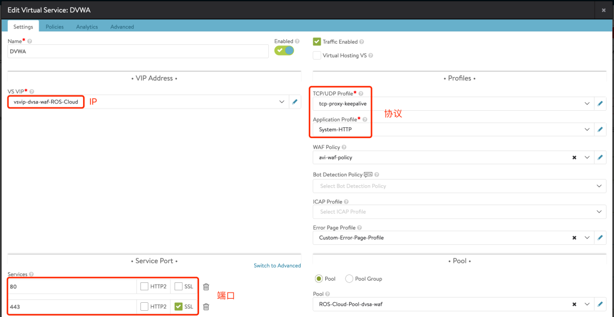
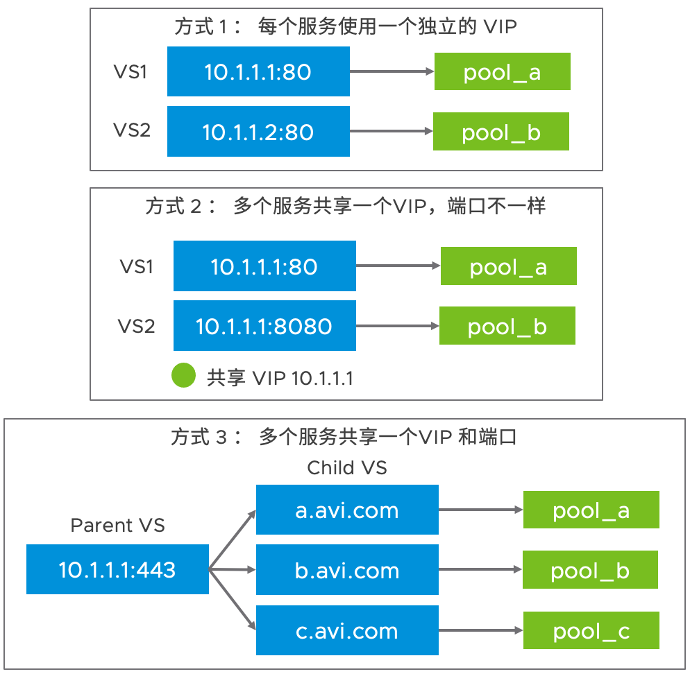
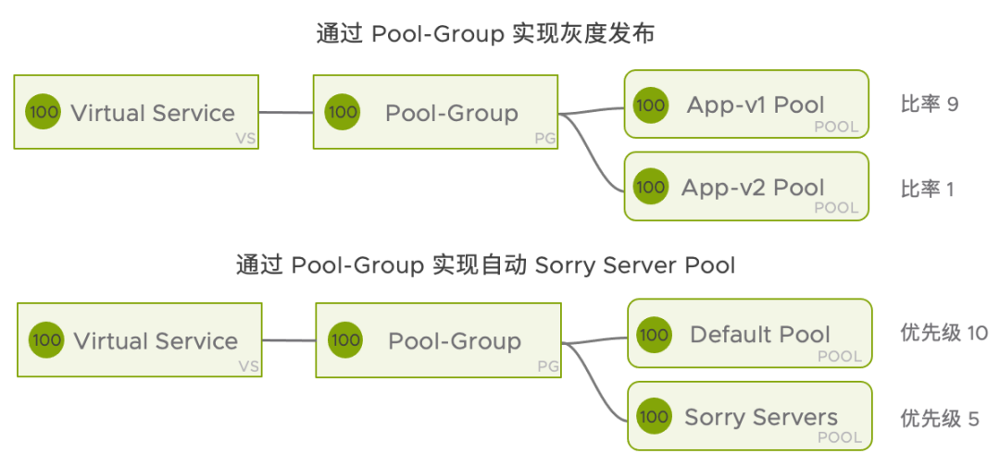
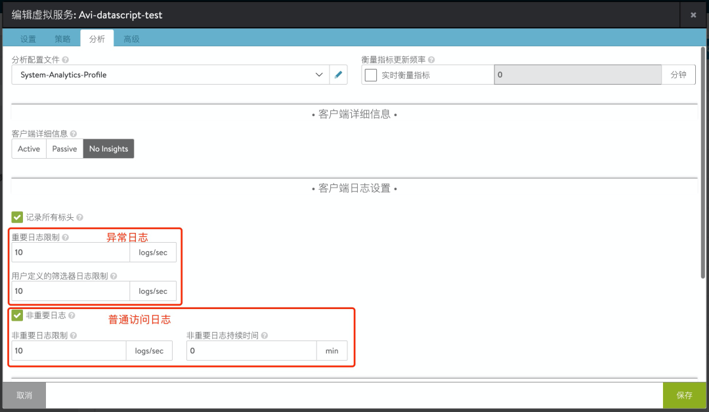

# Avi 部署使用指南(3)：Avi 逻辑组件

## 目录
{: .no_toc .text-delta }

1. TOC
{:toc}

这篇讲述一下 Avi 的逻辑组件。

在[第一篇](http://mp.weixin.qq.com/s?__biz=MzUxODgwOTkyMQ==&mid=2247487052&idx=1&sn=7d09922bcb7a3bd99b0ead285272f6ae&chksm=f9827e62cef5f774dad3d8fd12513eeb78c543d888461c6b4d6af11986ba177bbfd3c2cb5e74&scene=21#wechat_redirect)文章中我们简单介绍了 Avi 的安装部署和使用，流程和步骤并不复杂，但是随着深入使用 Avi，会发现有很多名词不知道什么意思，也不清楚相应选项需要如何配置，Avi 虽然在尝试简化 UI 和配置，但应用交付本来就是一个很复杂的工程，因此接下来的文章会逐一介绍 Avi 相关名的词和概念，帮助用户更好地理解和使用好 Avi。

# Avi 数据平面的三大逻辑组件

从配置层面以及工作原理层面，可以简单将 Avi 数据平面划分成三大块来理解。具体如下图所示：

## 1. 前端 - 虚拟服务(Virtual Service) 

在不同的负载均衡器下，虚拟服务的叫法不一样，例如有些厂商使用虚拟服务器（Virtual Server）来替代，有些使用虚拟主机（Virtual Host）来替代。无论哪种，虚拟服务代表的都是面向用户侧的**逻辑服务**。

虚拟服务决定了用户可以通过什么 **IP + 端口 + 协议**来访问这个服务，以及负载均衡器收到来自用户的请求后**应该如何处理**。通常在负载均衡器下，这个 IP 称为 VIP（Virtual IP），和 Virtual Service 名称类似。

在 Avi 下，VIP + 端口 + 协议分别在下列位置配置，这些属于一个服务必须配置的部分。

在 Avi 下，VIP + 端口 + 协议在不同场景下会有三种配置方式：

1. 为了隔离每个业务，每个虚拟服务都使用一个**独立的 VIP**，然后配置相应的端口+协议，虚拟服务之间无任何关联；
2. 为了节约 IP 地址，多个虚拟服务使用**同一个 VIP**，配置**不同的端口**，负载均衡器可以根据用户请求的端口转发到相应的后端服务器，此配置下一个 VIP 可以提供多个不同类型的服务，例如 80 提供 HTTP 服务，53 提供 DNS 服务等等。[之前 Horizon 文章](http://mp.weixin.qq.com/s?__biz=MzUxODgwOTkyMQ==&mid=2247486950&idx=1&sn=5897f84e9fe4060b2417914d53ccfb12&chksm=f9827dc8cef5f4ded61be47ff3a3b8d3c74c95bb495f4f21c0464fd8b47bc9d5bfa2588262fd&scene=21#wechat_redirect)中 UAG 使用这种配置方式；
3. 为了简化配置，多个服务使用**相同的 VIP**，也使用**相同的端口**，使用高级转发策略来将用户的请求转发到相应的服务。例如通过 7 层 Virtual Hosting，4 层转发策略等进行请求的转发。这时候只会有**一个虚拟服务**，可以为多个应用提供服务，而每个服务的协议也是相同的。

在 Avi 下，默认只要 VS 被成功创建，并有相关 Service Engine 在处理此服务，其 VIP 便始终可以 Ping 通，如果不通则表示网络配置或者 SE 存在问题。

### 转发策略

在 VS 下，有很多其他的配置来决定负载均衡器收到用户的请求后如何处理，通常有下列配置：

- **默认的 Pool/Pool Group**：从用户收来的请求转发给后端哪些服务器。一个 VS 可以有 0~多个 Pool，当不配置 Pool 时，VS 自身可以作为一个服务器来提供服务；
- **HTTP 请求**：针对 HTTP 请求中不同的字段进行转发，例如访问路径起始为 /img 时，将请求转发到非默认的 Pool 中；
- **HTTP 响应**：针对后端服务器返回的字段进行处理，例如返回的 HTTP response code 为 503 时，返回一个网站维护页面；
- **Datascript**：通过 LUA 语言编程实现高级的转发策略，通过 Datascript 可以实现上面的HTTP 请求、HTTP 响应规则，也可以加入更多的判断条件来进行请求的处理。

*“下图为 Avi HTTP 请求策略配置示例”*

### 安全相关策略

在 VS 上也可以添加一些安全相关的配置，具体有：

- **网络安全策略**：工作在 OSI 三层的访问控制策略，可以基于 IP、端口等信息来过滤流量，例如基于僵尸网络 IP 地址库进行请求阻止；
- **HTTP 安全**：仅针对 HTTP 类型虚拟服务生效，可以基于 HTTP 请求详情来进行处理，例如请求路径为 /admin 时关闭连接（曾经在 [Horizon 文章](http://mp.weixin.qq.com/s?__biz=MzUxODgwOTkyMQ==&mid=2247486569&idx=1&sn=b167a88607bf2d7e7ece21f5fc5231dc&chksm=f9827c47cef5f5515dcdc28ba537fe79caa908f0041b91b997d1f9c3e9bcc052fce6b11f9387&scene=21#wechat_redirect)中使用过）；
- **WAF 策略**：仅针对 HTTP 类型虚拟服务生效。WAF 简称 Web 应用防火墙，用于过滤 HTTP 请求中恶意的请求，通常可防护 Web 应用逻辑层面的漏洞，例如 SQL 注入等。前段时间的 Log4j 漏洞就可以用 WAF 来进行防护，[详见此文章](http://mp.weixin.qq.com/s?__biz=MzUxODgwOTkyMQ==&mid=2247486608&idx=1&sn=2931e177deb3e911bb66375745258e53&chksm=f9827cbecef5f5a8b31fa8588714e337d87cffb04db48b8dada35cd3dac04c7755d5df2985d7&scene=21#wechat_redirect)。

### 分析

在 VS 下单独有一个页面用于修改可视化分析、日志相关的配置，通常不需要修改这块的配置，仅在有下列需求时调整：

- **日志转发**：将用户访问日志转发到其他日志平台，例如 Splunk 进行分析；
- **查看用户正常的访问日志**：默认 Avi 只记录异常的访问日志，如果需要进行审计，可以开启正常日志记录；
- **调整可视化分析的间隔**：默认 Avi 可视化统计以 5 分钟为间隔计算，可以启用实时衡量指标来查看实时信息；
- **高级排错**：开启**记录所有标头**选项后可以查看一个请求详细的处理日志，日志会包含原始的请求 Header、发送给后端池的 Header、响应的 Header 等。

*“下图为 Avi 分析相关的配置”*

### 其他配置

在 VS 上还有一些**不常用**的配置被放在高级中，一般不建议进行调整：

- **服务引擎组**：调整运行 VS 的服务器引擎组，默认为 Default-Group；
- **自动网关**：用户请求从哪里发过来（通常来自三层网关），则将回复发回给哪里，而不是根据路由表进行转发；
- **性能限制**：限制 VS 连接数、带宽、并发等配置；
- **通过 BGP 通告 VIP**：通过 BGP 协议将掩码为 32 位的 VIP 通告到网络中，又称 RHI（Route Health Injection），通过此特性可以实现 IP Anycast；
- **SNAT IP**：默认 Avi 使用每个 SE 的 Data Nic 来进行 SNAT，特殊场景下可以自定义 SNAT IP；
- **扩展 ECMP**：默认 Avi 使用 Native Scaling 来进行 A/A 流量处理，如需使用 ECMP，打开此开关；
- **服务器网络配置文件**：默认 Avi 会针对用户侧和服务器侧使用相同的 TCP 配置文件，在特殊场景下，允许用户自定义 SE 到 Server 端的 TCP 配置文件。例如用户侧 MTU 和服务器侧 MTU 不一致时，可以手动设置两端的 MTU。

## 2. 后端 - 池(Pool) 

在 Avi 下，一个**池**包含一组**提供相同服务的****服务器**。这里的服务器是指真实存在的，最终提供服务的服务器。某些厂商会将服务器叫做**真实主机/服务器（Real Server）**、**成员（Member）**或**后端服务器（Backend Server）**等。

在池层面，一般需要进行下列基础配置：

- **默认端口**：后端服务器提供服务时使用的端口，例如 80；
- **负载均衡算法**：使用什么样的负载均衡算法，例如轮询、最小连接数、一致性哈希等；
- **持久性**：在一段时间内，使得一个访问者的请求**持久地**被转发到某台后端服务器。一般会基于源 IP 或者 Cookie 进行持久性；
- **运行状况监控器**：通过被动方式或者主动方式检查后端服务器成员的存活状态。一般主动方式有 ICMP 探测、TCP 端口检查、HTTP 请求检查等；
- **池成员**：最终处理请求的一个个服务器成员；
- **和池成员间是否使用 SSL**：是否和池成员之间使用 TLS 加密，一般在端到端加密场景下需要，例如[之前 Horizon 场景](http://mp.weixin.qq.com/s?__biz=MzUxODgwOTkyMQ==&mid=2247486569&idx=1&sn=b167a88607bf2d7e7ece21f5fc5231dc&chksm=f9827c47cef5f5515dcdc28ba537fe79caa908f0041b91b997d1f9c3e9bcc052fce6b11f9387&scene=21#wechat_redirect)下连接服务器就需要端到端加密。

另外也有一些不常用的配置：

- **自动缩放策略**：根据后端池成员的连接数、CPU 内存使用率等情况动态扩展池成员，此配置需要和 vCenter 等云平台做对接。例如高校的选课系统在高峰期可以使用这种配置进行自动扩缩；

- **池网络放置设置**：设置 SE 通过哪个网络连接到后端服务器，通常由 Avi 自动选择，但用户可以通过此配置强制选择。一般仅在环境中存在多个同名网络时才需要使用（例如一个 vCenter 下有两个 DC，两个 DC 下有同名的 VDS 端口组）；

- **禁用端口转换**：默认 Avi 会将一个 VS 的多个端口同时转发到 Pool 的默认端口上，开启此选项将使用端口一一映射，即前端用哪个端口，后端也会用哪个端口。

  

其他与池相关的配置，例如超时、连接数等不建议配置，如需配置请参考官方文档中的说明：

https://avinetworks.com/docs/latest/configuration-guide/applications/pools/

### 池组(Pool Group)

在池这个概念之上，还有池组这样的一个概念，池组，顾名思义，由多个池组成的组。

使用池组可以非常容易地实现**灰度发布**功能，以及备份或者 Sorry Server Pool 功能。

在池组层面可以设置下列配置将流量转发给不同的 Pool：

- 优先级: 优先级最高的 Pool 会用来优先接受流量；
- 比率: 通过比例将流量转发给不同的 Pool，比例设置范围为 1~1000；
- 最小 Server 数量: 小于此数量的 Pool 会被忽略。

## 3. 运行时 - 服务引擎组(SE-Group) 

在 Avi 下，虚拟服务最终会落在一个服务引擎组（SEG）上被执行，而具体由那个服务引擎来执行一般不需要用户进行设置。（这就好比用户往一个 RAID 组去存数据，并不要关心最终数据写在哪块磁盘一样。）

当虚拟服务被创建后，会由 Avi Controller 来决策将这个虚拟服务推送到 SEG 的哪些 SE 上去执行。假如虚拟服务被禁用，则该虚拟服务及 Pool 相关的对象仅会以配置形式保存在控制器中，SE 中不会有相关的配置。

关于 SEG 的配置非常多，限于篇幅未来会详细介绍。

