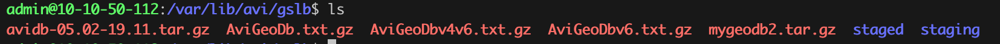

## 目录
{: .no_toc .text-delta }

1. TOC
{:toc}

## 概述

在多中心或者多链路情况下，用户可能希望为不同的运营商过来的用户来返回不同的 IP，此时可以通过 Avi GSLB 来实现。具体原理是在做 DNS 回应时使用**基于请求 IP 的 DNS 转发策略**，此时需要自定义一个运营商 DB 库，下面先讲讲如何生成库，再讲讲如何配置 Avi GSLB。


## DB 生成脚本

```shell
#!/bin/bash
# Avi geodb 格式参考
#startIP,endIP,Latitude,Longtitude,country/Region/City,tag
#10.10.50.1,10.10.50.254,31,-121,Shanghai/-/-,Chinanet
#---
#工作流：1、下载库，2、合并库并添加标签，3、转换 IP 网段到地址范围。4、压缩成 tag.gz，根据时间来命名最终输出db

convertnum()
{
let se2=0
while [ $se2 -le 7 ]
do
if [ $cc -eq 1 ]
# 等于1时输出1
then
shuzux["$se1"]=1;
let cc=0
elif [ $cc -ge 2 ]
then
let bb=$cc%2
# echo $bb xx
shuzux["$se1"]=$bb
let cc=$cc/2
else
shuzux["$se1"]=0
fi
let se1=$se1+1
let se2=$se2+1
done
}

ipzhuanhuan()
{
  let se=0
# let ses1=8

while [ $se -le 3 ]
do
# cc=`echo $ip|awk 'BEGIN{FS="."}{print $'$se'}'`
# 转换第se个分组
# convertnum
let ses=$se*8
#echo $ses=?
# let ses1=$se*8
# echo ${shuzuz[10]::$ses1}
shuzucache=(`echo  ${shuzuin[@]:$ses:8}`)
# echo ${shuzucache[@]}  
# shuzucache 是8位^[[A2进制，转10进制用
let ses1=7
let sum2=0

while [ $ses1 -ge 0 ]
do

case $ses1 in
7)
let sum=${shuzucache["$ses1"]}*1
;;
6)
let sum=${shuzucache["$ses1"]}*2
;;
5)
let sum=${shuzucache["$ses1"]}*4
;;
4)
let sum=${shuzucache["$ses1"]}*8
;;
3)
let sum=${shuzucache["$ses1"]}*16
;;
2)
let sum=${shuzucache["$ses1"]}*32
;;
1)
let sum=${shuzucache["$ses1"]}*64
;;
0)
let sum=${shuzucache["$ses1"]}*128
;;
esac


let sum2=$sum+$sum2
# 计算每8位的和
let ses1=$ses1-1
done
shuzuout["$se"]=$sum2
let se=$se+1

done
}
convertnumto ()
{
  case $lengthmask in
  32)
  mask=255.255.255.255
  reversemask=0.0.0.0
  ;;
   31)
  mask=255.255.255.254
   reversemask=0.0.0.1
  ;;
   30)
  mask=255.255.255.252
   reversemask=0.0.0.3
  ;;
   29)
  mask=255.255.255.248
   reversemask=0.0.0.7
  ;;
   28)
  mask=255.255.255.240
   reversemask=0.0.0.15
  ;;
   27)
  mask=255.255.255.224
   reversemask=0.0.0.31
  ;;
   26)
  mask=255.255.255.192
   reversemask=0.0.0.63
  ;;
   25)
  mask=255.255.255.128
   reversemask=0.0.0.127
  ;;
  24)
  mask=255.255.255.0
   reversemask=0.0.0.255
  ;;
   23)
  mask=255.255.254.0
   reversemask=0.0.1.255
  ;;
   22)
  mask=255.255.252.0
   reversemask=0.0.3.255
  ;; 
  21)
  mask=255.255.248.0
   reversemask=0.0.7.255
  ;;
   20)
  mask=255.255.240.0
   reversemask=0.0.15.255
  ;;
   19)
  mask=255.255.224.0
   reversemask=0.0.31.255
  ;;
   18)
  mask=255.255.192.0
   reversemask=0.0.63.255
  ;;
   17)
  mask=255.255.128.0
   reversemask=0.0.127.255
  ;;
   16)
  mask=255.255.0.0
   reversemask=0.0.255.255
  ;;
   15)
  mask=255.254.0.0
   reversemask=0.1.255.255
  ;;
   14)
  mask=255.252.0.0
  reversemask=0.3.255.255
  ;;
   13)
  mask=255.248.0.0
  reversemask=0.7.255.255
  ;;
   12)
  mask=255.240.0.0
  reversemask=0.15.255.255
  ;;
   11)
  mask=255.224.0.0
  reversemask=0.31.255.255
  ;;
   10)
  mask=255.192.0.0
  reversemask=0.63.255.255
  ;;
   9)
  mask=255.128.0.0
  reversemask=0.127.255.255
  ;;
   8)
  mask=255.0.0.0
  reversemask=0.255.255.255
  ;;
   7)
  mask=254.0.0.0
  reversemask=1.255.255.255
  ;;
   6)
  mask=252.0.0.0
  reversemask=3.255.255.255
  ;;
   5)
  mask=248.0.0.0
  reversemask=7.255.255.255
  ;;
   4)
  mask=240.0.0.0
  reversemask=15.255.255.255
  ;;
   3)
  mask=224.0.0.0
  reversemask=31.255.255.255
  ;; 
  2)
  mask=192.0.0.0
  reversemask=63.255.255.255
  ;;
  1)
  mask=128.0.0.0
  reversemask=127.255.255.255
  ;;
  0)
  mask=0.0.0.0
  reversemask=255.255.255.255
  
  esac
}

function convertsubnet
{
#echo "converting started..."
for ipline in ${lines[@]}; do
       #startip=`nmap -sL -n $ip | awk '/Nmap scan report/{print $NF}' | head -1`
       #endip=`nmap -sL -n $ip | awk '/Nmap scan report/{print $NF}' | tail -1`
      ip=`echo $ipline| awk 'BEGIN{FS="/"}{print $1}'`
      let se1=0
      # 设置数组初始长度,se1为全局变量，值为0-31
      let se=4
      while [ $se -gt 0 ]
      # ip 的四个分组，每个分组进行转换，存入数组中
      do
        cc=`echo $ip|awk 'BEGIN{FS="."}{print $'$se'}'`
        # 转换第se个分组
        #echo $cc
        convertnum
        let se=$se-1
      done

length=`echo $ipline|awk 'BEGIN{FS="/"}{print $2}'`


# 如果$2是掩码，则必需转换成掩码长度lengthmask

lengthmask=$length
convertnumto 
# 将长度转换成掩码

# 逆序变顺序：
let se3=0
while [ $se3 -lt 32 ]
# 总共要循环32次，将32位都转了
do
let se4=31-$se3
if [ $length -gt 0 ]
then
shuzuy["$se3"]=${shuzux["$se4"]}
else shuzuy["$se3"]=0
# 如果length大于0,则照样输出，超出length的部分全清0
fi
let length=$length-1
# echo ${shuzuy["$se3"]}
let se3=$se3+1
done
shuzuz=(${shuzuy[@]})
shuzue=(${shuzuy[@]})
# let se5=$lengthmask+1
# echo se5=$se5
shuzuz[31]=1
# echo shuzuz=${shuzuz[@]}
let se=$lengthmask
while [ $se -lt 31 ] 
do
shuzue["$se"]=1
let se=$se+1
done


# echo ${shuzuy[@]}

# 2进制转换回10进制。。。。。
# 也是四个组合，8位对应乘相应的数再相加输出

shuzuin=(${shuzue[@]})
ipzhuanhuan
ipend=(${shuzuout[@]})


       startip=`echo $ipline| awk 'BEGIN{FS="/"}{print $1}'`
       
       endip=`echo ${ipend[@]} |awk '{print $1"."$2"."$3"."$4}'`
       #time startip=`nmap -sL -n $ip | awk '/Nmap scan report/{print $NF}' | awk 'NR==1'`
       #endip=`nmap -sL -n $ip | awk '/Nmap scan report/{print $NF}' | awk 'END{print}'`
       echo $startip,$endip
     #   eval echo $ips | tr ' ' '\n'

done
}


dirname=avidb-`date +%m.%d-%H.%M`
mkdir $dirname
cd $dirname
wget https://bgp.space/chinanet.html https://bgp.space/unicom.html https://bgp.space/cmcc.html
textutil -convert txt *.html

# 转换电信 IP
echo "converting chinanet"
lines=`cat chinanet.txt  | grep '^[1-9]' | grep -v ":"`
#cat chinanet.txt  | grep '^[1-9]' | grep -v ":" | sed 's/$/,31,121,China\/-\/-,Chinanet/g'
convertsubnet | sed 's/$/,31,121,China\/-\/-,Chinanet/g' > $dirname.txt

# 转换移动 IP
echo "converting chinamobile"
lines=`cat cmcc.txt  | grep '^[1-9]' | grep -v ":"`

convertsubnet | sed 's/$/,32,121,China\/-\/-,Chinamobile/g' >> $dirname.txt

# 转换联通 IP
echo "converting chinaunicom"
lines=`cat unicom.txt  | grep '^[1-9]' | grep -v ":"`
#cat chinanet.txt  | grep '^[1-9]' | grep -v ":" | sed 's/$/,31,121,China\/-\/-,Chinanet/g'
convertsubnet | sed 's/$/,33,121,China\/-\/-,Chinaunicom/g' >> $dirname.txt

tar -zcvf $dirname.tar.gz $dirname.txt
```


## 1. 新建GSLB service

新建一个GSLB service，


 


 

创建一个Pool，算法选择topology


 


 

在 pool 中添加两个成员，分别表示不同运营商的服务：

 


 


 

## 2. 上传 geodb 文件

 

Geodb 由脚本根据三大运营商BGP路由表生成，内容如下：


 

 


 

上传完成后在控制器的 /var/lib/avi/gslb目录下可以看到

 



 

## 3. 配置geo 策略


 

## 4. 在 GSLB DNS上配置 topology 策略


 

## 5. 测试

 

使用Chinanet 的用户被分配到站点1的服务


 

 

使用中国移动的用户被分配到站点2的服务


 


 

## 6. 根据内外网IP返回不同的结果

### 6.1. 定义 public ip 和 private IP


 

 为每个 pool 成员配置 public IP


 


 