# Avi 部署使用指南(4)：深入理解 Avi 网络

## 目录
{: .no_toc .text-delta }

1. TOC
{:toc}

这篇讲述一下 Avi 的网络架构。Avi 纯软及多云的架构使其部署架构非常灵活，在不同的网络环境和不同的需求下会有不同的配置方式，本文将逐一进行梳理。

本文目录如下：

- 负载均衡器的基本工作原理
- Avi 的网络连接
- Avi 支持的网络拓扑汇总
- Avi 三种最常用的网络拓扑

本文内容较多，阅读大约需要 20 分钟。

# 负载均衡器的基本工作原理

在介绍 Avi 的网络之前，先简单讲述一下负载均衡器的工作原理，只有这样才能理解负载均衡器在网络中的作用以及对于网络连接的需求。

## 负载均衡器的作用 

负载均衡器，如其字面意思，是用来给多台服务器均匀分配网络流量的设备。负载均衡器可以确保每台服务器都接收到一部分流量，避免单台服务器承载的流量过大，同时负载均衡器也可以主动对后端的服务器进行检查，在后端服务器故障后，将用户请求转发到其他正常工作的服务器之上。

*“下图为一个简单的负载均衡器工作原理示例”*

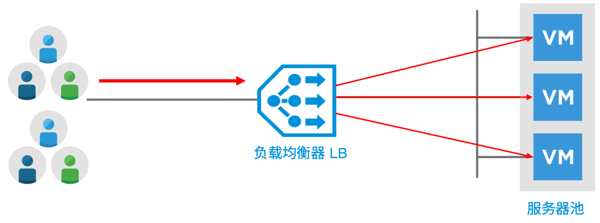

## 反向代理 

与负载均衡器同时被提及的还有个词，叫**反向代理**，市面上很多反向代理工作在 OSI 7 层，负载均衡器则通常可以工作在 3~7 层，具备反向代理的所有功能。

日常生活中，我们连接国际互联网时可能经常用到代理（或者内网用户访问互联网），这种代理是一种正向代理，即：代理服务器代表我们的 PC 去访问其他网站，对于被访问网站来说它只能看到代理服务器，而看不到真实的用户，这在某些程度上可以保护用户（保护机制和 NAT  类似，用户可以正向访问外部，但外部无法反向访问用户，从而保证用户网络安全）。

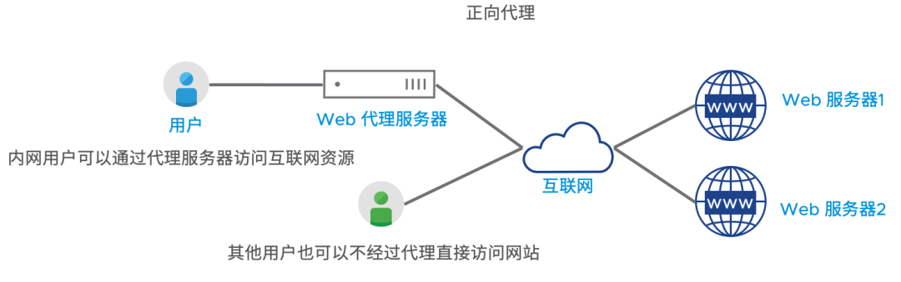

反向代理则是将整个过程调换过来，代理服务器的作用是代理服务器，而非用户。在这种架构下，用户只知道代理服务器（也认为他在直接访问服务器），而不知道后端还有服务器的存在。同样**反向代理对于服务器来说也有一定的保护作用**，因为可以只暴露指定端口和服务，后端服务器的其他端口和服务对于外部网络来说无法被访问到。

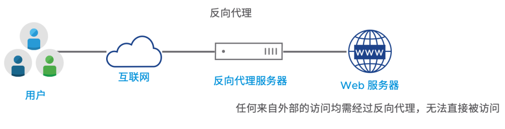

反向代理介于用户和服务器之间，所以可以查看到用户和服务器双方的所有访问和请求，进而对这些请求进行过滤。因此一般在反向代理的位置可以很容易加入很多安全功能，例如 Web Application Firewall、DDoS 等。

## 最常用的负载均衡工作方式- 全代理 

负载均衡器最常见的模式是全代理，站在网络层面，全代理是指负载均衡器会分别和源（Client）及目标（Server）进行连接建立，将原本的一个访问拆分成两段。

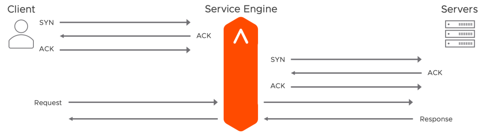

如上图所示，当客户端发起一个请求时，请求发送给 SE，SE 和客户端建立 TCP 连接，接着再和后端 Server 建立 TCP 连接。

在这种模型下，Client 到 SE 段，以及 SE 到 Server 段可以有不同的网络参数，比如两段的 MTU 可以不一致，连接速率可以不一致，因此适应性非常强，几乎可以应用于所有网络环境。

同时在这种模式下可以天生让后端服务器免受 TCP SYN Flood 等攻击，因为只有 Client 成功和 SE 建立连接后，SE 才会和后端建立连接。在 SE  级别也可以进行一些基本的限速，比如来自一个客户端最大可以建立多少连接，连接速率为多少等，进一步防护其他 DoS 攻击。

在此模式下，Avi 默认有下列 IP 对象：

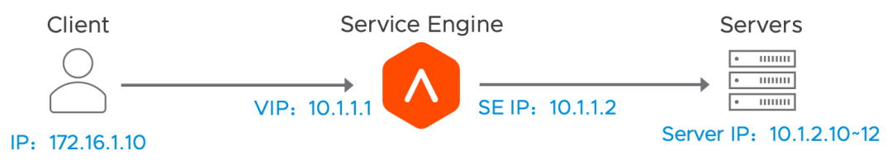

1. Client IP：客户端的真实 IP；
2. VIP：虚拟服务的 IP，浮动托管在一台 SE 节点上。客户端访问此 IP，和此 IP 建立 TCP 连接；
3. SE IP：SE 和后端 Server 连接使用的 IP；
4. Server IP：服务器的真实 IP。

前面的文章中提到 Avi 支持多节点 AA 模式，在 AA 模式下，每个 SE 都会有一个 IP 与后端服务器连接，这种方式可以有效提升整个环境的**并发连接数**。

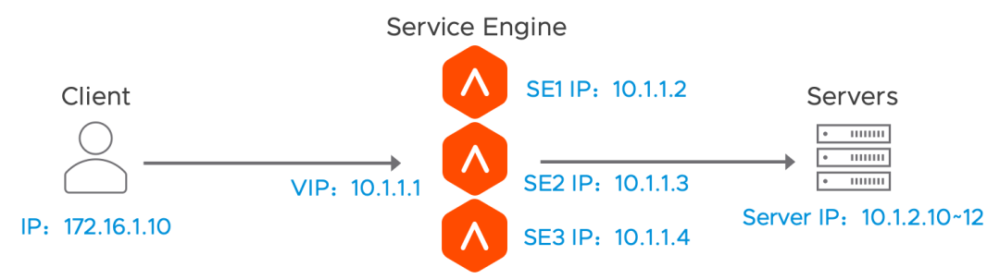

受到 TCP/IP 协议的限制，一个 IP 下只有 65535 个可用端口，如果和其他系统建立连接，最大则只能建立 64k 个连接（通常 0-1023 会被系统预留），这在负载均衡场景中也不例外，通常传统负载均衡器会使用 SNAT 地址池的方式来提高连接数，一个 SNAT 池内有多个 IP，每个 IP 可以建立 64k 的连接，系统最大连接数就等于 64k* SNAT IP 数量。

在 Avi 下 AA 模式默认会使用每个 SE 的 IP 和后端建立连接，因此无需任何配置就能支持很大的并发连接，例如上图中有 3 台 SE，3 台 Server，则一共可以建立 64k *3 *3 = 57.6w 的连接，这已经可以满足大部分企业需求，如果想进一步提高并发，简单地增加 SE 节点或者 Server 节点即可，已有架构无需变动。

Avi 为了兼容传统的一些负载均衡模式，也支持配置 SNAT 地址池，这种方式和传统负载均衡器工作原理一致。

全代理模式是兼容性最好的一个模式，对于网络的需求也非常简单，Client -> SE 以及 SE -> Server IP 可达即可，可以是任何网络拓扑。

### 客户端 IP 地址保留

仔细看全代理模式，会发现这种模式有个“缺陷”，即 Client IP 和 Server IP 在环境中会被双向转换，这会使得网络变得不那么透明，进而影响 Server 对于访问者的追踪。

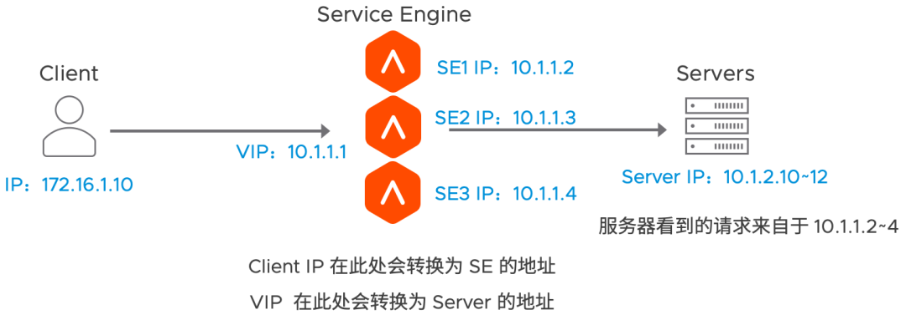

为了使得 Server 能够知道 Client 的真实 IP，延伸出一些解决方案：

- HTTP X-Forwarded-For Header：LB 在处理请求时，可以将客户端真实的 IP 写入 HTTP Header 中，这样服务器读取此 Header 就能获取到客户端的真实 IP。业界有很多 Web Server 支持识别此字段；

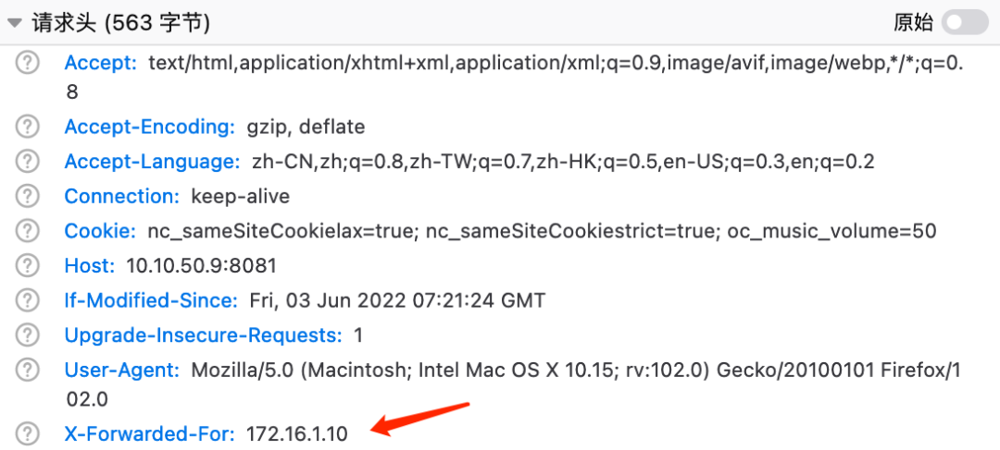

- TCP Proxy Header：针对 TCP 类型的业务，可以使用 TCP PROXY Protocol 来将客户端真实 IP 发送给服务器。PROXY Protocol 工作在 OSI 4 层，同样需要服务器端的应用支持（详见：https://www.haproxy.com/blog/use-the-proxy-protocol-to-preserve-a-clients-ip-address/）；
- In-line 路由模式：将负载均衡器串联在网络中，当做一个路由设备运行，不对客户端的源 IP 进行修改，这种模式一般要求后端服务器的网关指向负载均衡器，但对后端应用没有特殊要求，相比之前的 X-Forwarded-for 和 TCP PROXY Header 适应性更强一些。

## In-line 路由模式 

In-line 路由模式是传统负载均衡器以及 NSX 原生 LB 使用较多的一种模式，在此模式下负载均衡器相当于一台路由器，在 SE 收到 Client  发来的流量后，仅做 DNAT 地址转换，将 VIP 转换成 Server 的真实 IP，然后将流量发送给 Server。

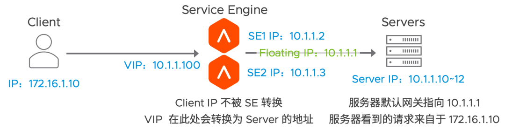

对于 Server 而言收到的请求 IP 等于 Client IP，为了保证流量回向也经过 SE 处理，必须将 Server 网关指向 SE 的浮动 IP（或者不将 SE 设为网关，通过路由方式保证回向流量可以经过 SE）。

In-line 模式有个小的限制就是只能使用传统的 Active/Standby 高可用模式，不具备灵活扩展的特性，除非应用有特殊需求，否则一般不使用。

## DSR 三角传输模式 

在现实中，还有一些特殊应用要求负载均衡器不能做任何 SNAT 和 DNAT，或者要求服务器返回的流量直接发送给 Client，而不经过 LB（比如软件更新服务）。给这类应用做负载均衡时，就需要用到 Direct Server Return 这样的技术，其工作示意图如下：

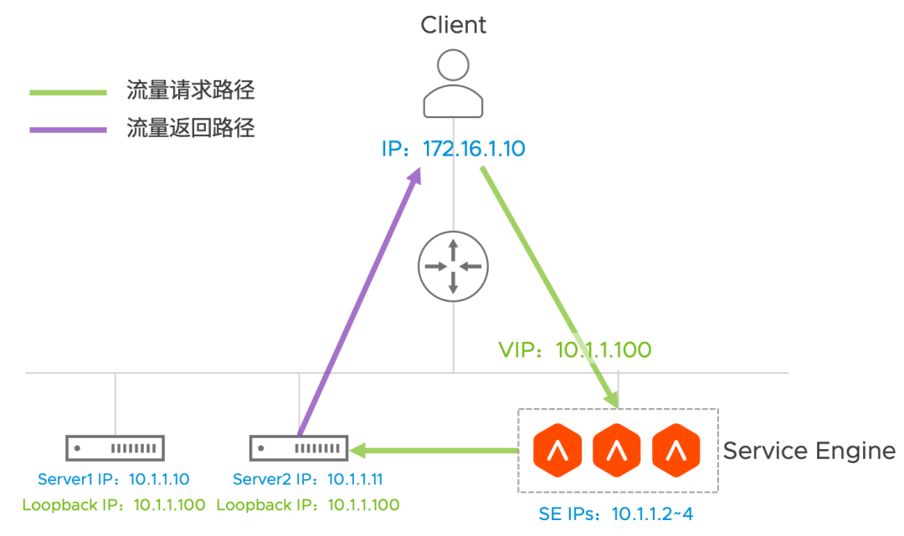

在上图中，可以明显看到流量并不是对称传输的，Client、LB 和 Server 组成了三角形一样的传输路径，因此这种模式又叫三角传输。

在这种模式下负载均衡器只做请求流量的分发和重定向，并不和客户端建立 TCP 连接，因此也没有 SNAT/DNAT 发生。

对于 Server 而言，收到的流量源为 Client IP，目标为 VIP，为了使得 Server 能正常响应此请求，Server 需要象征性地将 VIP 配置在本地，一般使用 Loopback 口，而且为了避免地址冲突等问题，此接口不能进行 ARP 请求的响应。

Avi 支持两种 DSR 模式：

- **Layer2 DSR**：最常用的 DSR 模式，Avi 在收到流量后修改报文的目标 MAC，使得流量能二层转发到 Server；
- **Layer3 DSR**：SE 和 Server 间建立 IP-in-IP 或者 GRE 隧道，通过隧道将客户端的请求流量发送给服务器。

关于 DSR 这部分内容，请阅读此文章查看具体配置方式：https://avinetworks.com/docs/21.1/direct-server-return/

# Avi 的网络连接

注意：此章节不考虑管理网络的设计。

上个章节简单介绍了负载均衡器的几种工作模式，可以注意到不同模式下 IP 地址需求和网络配置有些许差异，另外为了适应不同的应用架构、访问需求和隔离需求，负载均衡器在接法上又有一些区分。

## 单臂模式 vs 双臂模式 

前面提到负载均衡的代理模式会将请求拆分为 Client->SE 和 SE->Server 两段，在物理连接上，这两段可以共用一条链路，也可以分成两条链路。

如下图所示，左侧拓扑中 SE 仅有一张数据网卡，既用于接收来自 Client 的流量，也用于传输到 Server 的流量，所以称之为单臂模式；右侧拓扑中面向用户侧使用一张网卡（VIP 托管在此网卡），面向 Server 侧使用另一张网卡，所以称之为双臂模式。

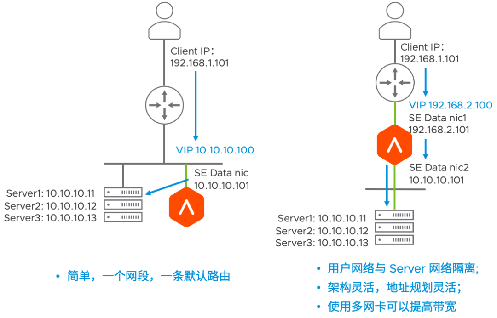

两种模式可以在同一套 Avi 中**同时支持**，两者分别有以下优点：

- 单臂模式：

- - 配置相对简单，小型环境下只需要规划一个网段就行，路由配置也简单；
  - 流量路径相对优化：在云化环境中通常有 70% 以上的流量属于东西向的通信，例如一个经典的三层架构中，Web->App->DB  的流量全部属于云内的转发，因此将负载均衡器以云化（VM）的形式部署在云内和 VM 二层通信，可以极大减少通信延迟，进而提升转发性能。Avi  默认会使用单臂+二层直连的形式为业务提供 LB 服务。

- 双臂模式：

- - 隔离性好，面向用户侧和 Server 侧的网卡可以接入不同的网段、网络中，Client 不能直接和 Server 网段通信；
  - 架构灵活，可以满足大部分访问需求；
  - 多网卡时双向带宽更高。

## Client 到 SE 的连接 

在负载均衡下，Client 发送的请求始终发给 VIP，那 VIP 是个什么东西？对于网络有什么需求？

简单来说 VIP 仅是一个现网中**未被使用的 IP 地址**，VIP 面向用户侧，用于接收和响应客户端的请求，所以对于网络的需求是 **IP 可达**，然后可以**响应请求**。

在 Avi 中有下列方式使得 VIP 对外可达：

- 将 VIP 浮动在 SE 的数据网卡上：将 VIP 和 SE 的数据网卡放在**同一个网段**，此模式很类似传统网络里的 VRRP/HSRP，在这种模式下只要保证底层 SE 的网络能通，VIP 自然可以通；

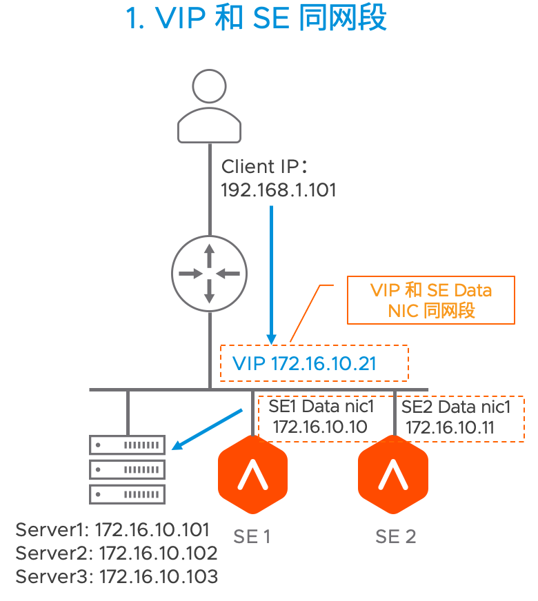

- 通过 BGP RHI 宣告到外部网络中：此时 VIP 可以是**任意地址**，Avi SE 和外部三层设备建立 BGP 邻居，然后将 VIP 的主机路由（例如 10.50.0.11/32）通过 BGP 宣告给外部三层设备，当外部设备收到发给 VIP 的请求后，会自动转发给相关的 SE 节点；

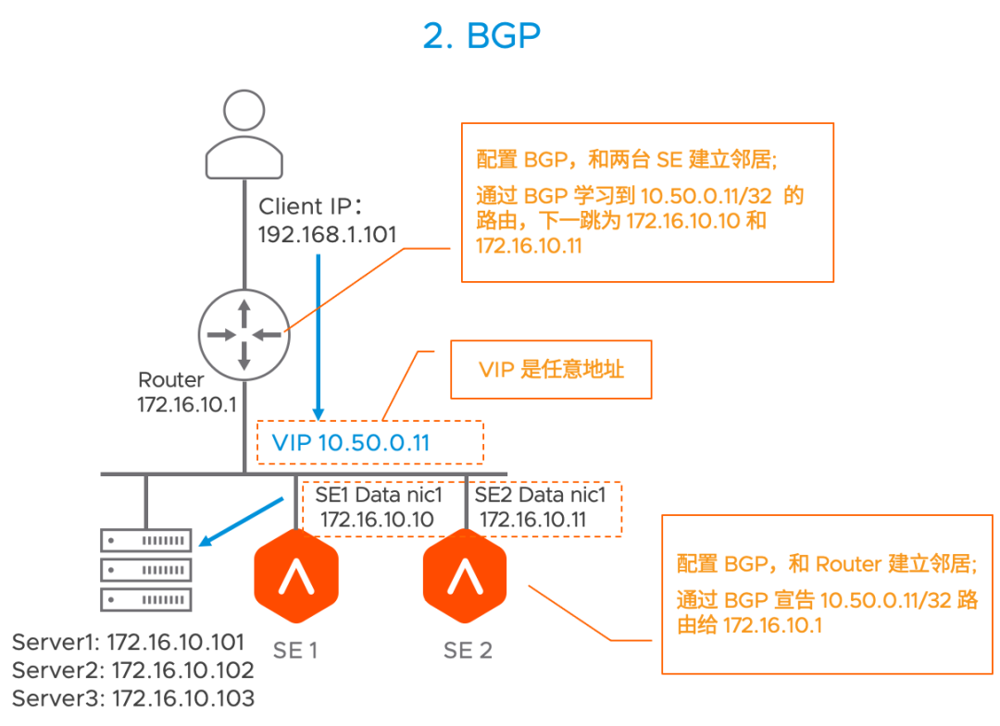

- 通过静态路由连接到外部网络中：和 BGP 工作原理类似，只是手动在外部三层设备上配置静态路由，为了能够应对 SE 节点故障，在外部需要为静态路由配置 BFD 检测。

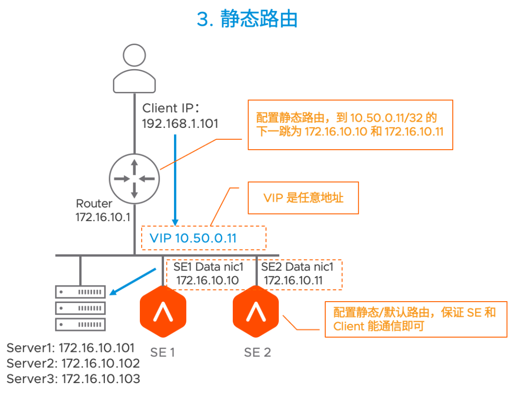

Avi 中只要为 VS 正确配置了 VIP，系统会自动进行响应的回复，这包括底层的 ARP reply 以及上层的 TCP 连接建立等，用户无需手动配置。

## SE 到 Server 的连接：二层直连 vs 三层路由连接 

在 Avi 下 SE 支持通过两种模式连接到后端 Server ：

- **二层直连**：

- - SE 的网卡接在和 Server 同网段的端口组上，和 Server 二层通信；
  - SE 可以贴近 VM 二层转发，流量路径短，性能好；
  - 每个 SE 在每个网段需要至少一个 IP 地址（例如下图中有三个网段，因此需要三个 IP，当 SE 数量为 2 时则需要 6 个 IP）。

- **三层路由**：

- - SE 接在任意网络内，其接口 IP 能够和 Server 通信即可，一般传统负载均衡器可能使用此模式；
  - 每个 SE 使用单个网段与所有 Server 通信。

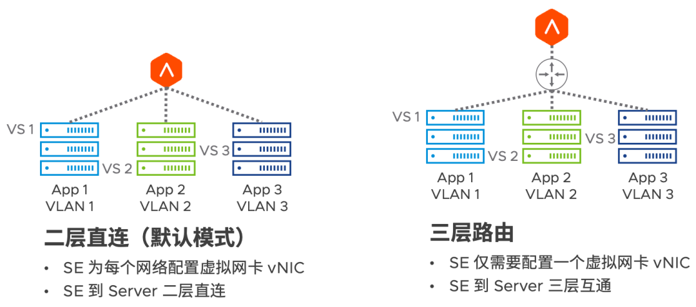

## VRF 多租户/多网络隔离 

在云化的环境下多租户是个很常见的需求，一般在云上底层基础架构资源都是共享的，仅在网络层面做逻辑隔离，对于 LB 来说也是如此。另外，某些环境中也希望不同网络可以共享负载均衡器，例如通常客户有内网区、DMZ 区等。

Avi 支持通过传统网络中的 **VRF** 来**进行网络的隔离**，每个 VRF 下可以有独立的网段和路由，多个 VRF 可以使用重叠的 IP 地址段。默认 Avi 内置一个默认的 Global VRF。

*“下图为 Avi 添加 VRF 及路由的配置截图”*

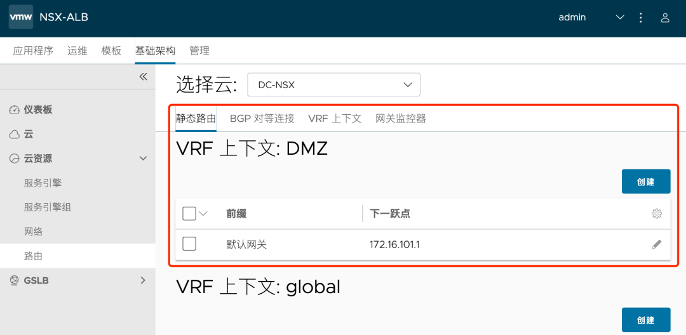

## 自动网关 

在复杂的客户场景中，很可能会遇到多 VIP 网段的需求，例如下图中同时存在两个 VIP 网段 192.168.2.0 和 192.168.3.0，在这种配置下，SE 到  Client 会有多条不同的链路，甚至有时候客户端来自于互联网，其 IP 地址和网段并不固定，很难设置回向路由：

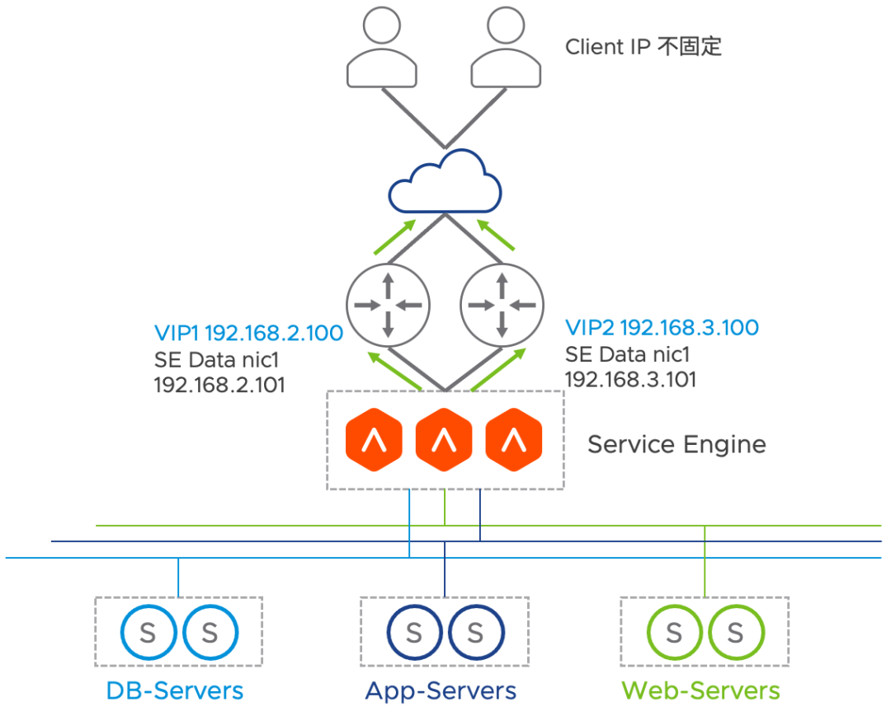

为了解决这类问题，Avi 有个特性叫**自动网关**，其工作原理是流量从哪里发来，回向的报文就从哪里发出，**启用此特性后用户无需再配置 SE 到 Client 方向的路由**，可以极大简化路由配置。Avi 企业版下默认会开启此特性。

## Avi 不同工作模式下的路由需求 

综合前面讲的工作模式以及物理连接方式，可以将 Avi 的路由需求汇总如下：

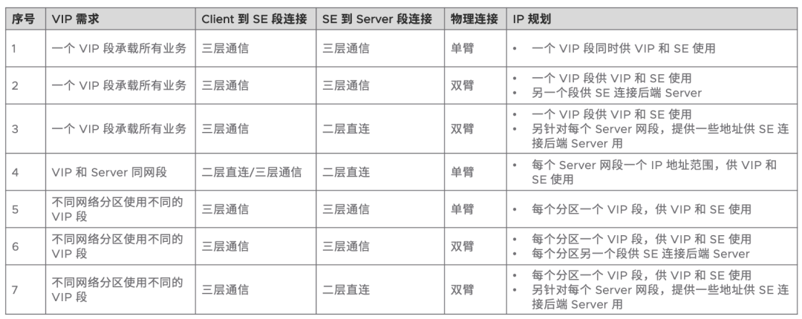

因为路由需求和连接方式的不同，会发现 Avi 可以支持很多种拓扑，再考虑到多网段的情况，单就最常用的全代理模式来说就会有很多种配置方式。

# Avi 支持的网络拓扑汇总

在这里通过表格汇总一下 Avi 支持的拓扑，这些拓扑的网络连接比较简单，只是在不同需求下 IP 地址规划会相对复杂：

具体拓扑对比如下：

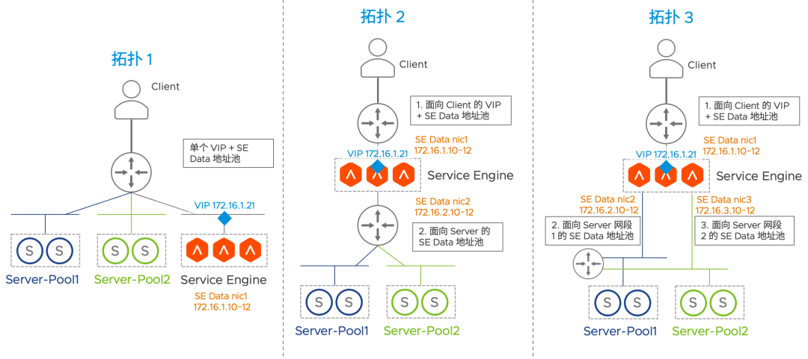

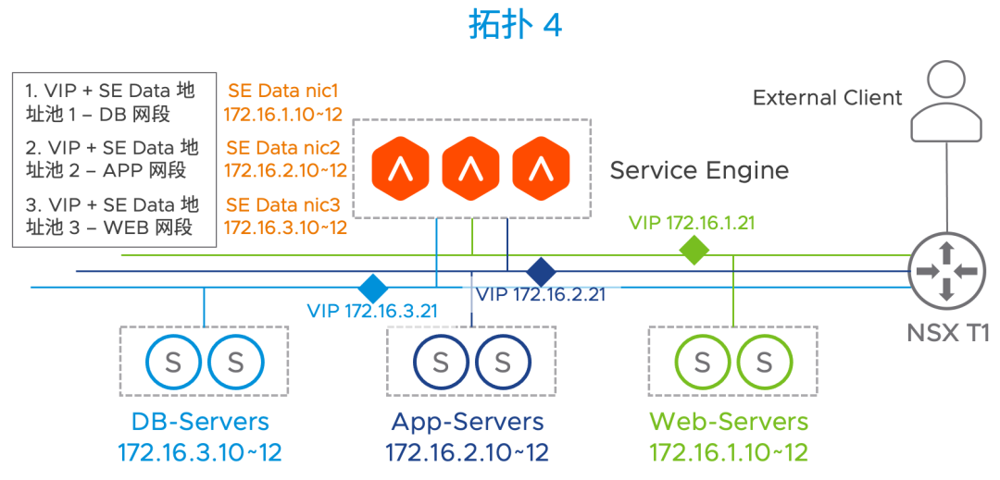

拓扑 5~7 和 1~3 类似，只是需要根据网络分区相应增加 IP 地址规划，底层共享 SE 资源，上层通过 VRF 进行隔离。下面只绘制了拓扑 5 进行示意：

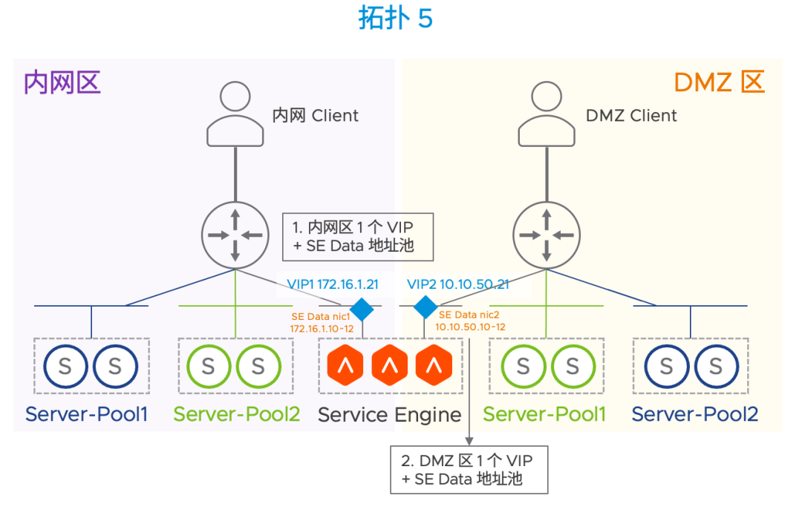

# Avi 三种最常用的网络拓扑及配置方式

## 1. 单臂 + VIP 与 Server 同网段 

此配置对应上个章节的拓扑 4，在逻辑上，每个业务的负载均衡服务均和 Server 在同一个网段，SE 到 Server 二层直接互联。

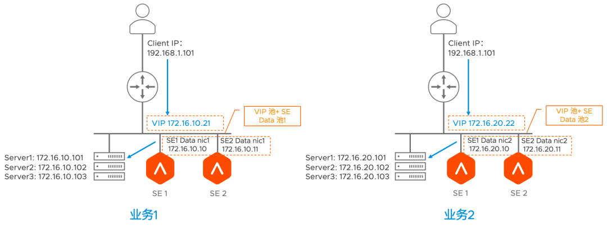

具体配置方式如下：

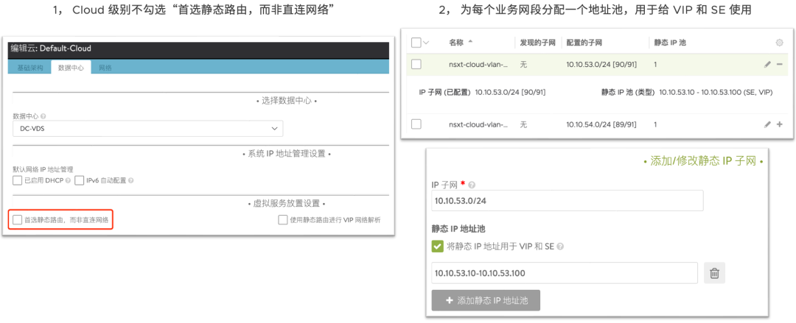

## 2. 单臂 + 一个 VIP 网段承载所有业务 

此配置对应上个章节的拓扑 1，在逻辑上，多个业务的 VIP 会从同一个地址段中获取地址，到任何 Server 网段的通信均通过三层路由互通。

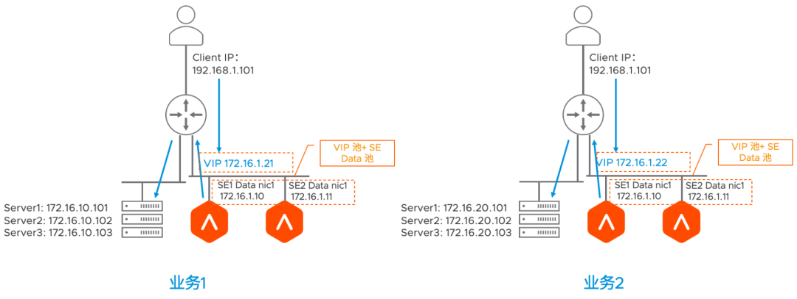

具体配置方式如下：

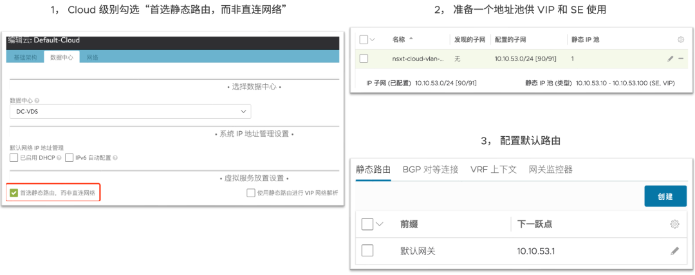

## 3. 双臂 + 一个 VIP 网段承载所有业务 

此配置对应上个章节的拓扑 3，在逻辑上，多个业务的 VIP 会从同一个地址段中获取地址，到 Server 网段则使用二层直连。通常这种结构适合于传统应用，Avi 工作在 In-line 路由模式下，SE 承当 Server 的网关。

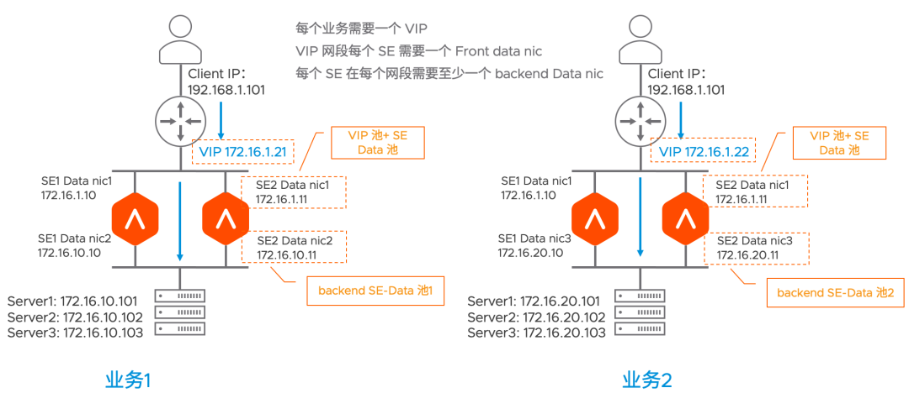

具体配置方式如下：

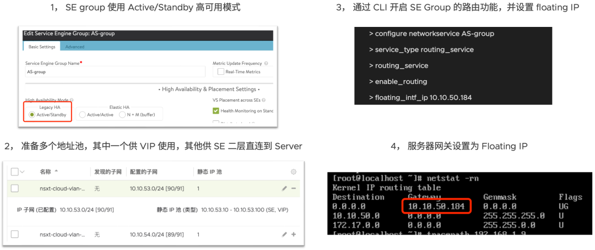

这篇文章到此结束，希望通过以上内容能让大家更加熟悉 Avi 的网络架构，将其更好地用于生产实践，如有问题欢迎直接留言，同时也欢迎扫码加入我们的微信社区群。

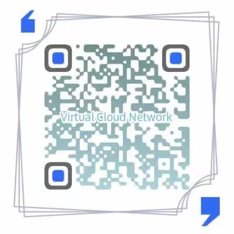