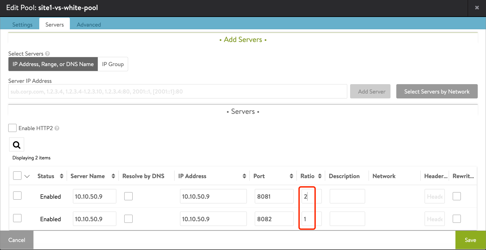
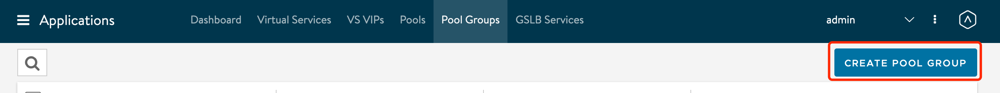
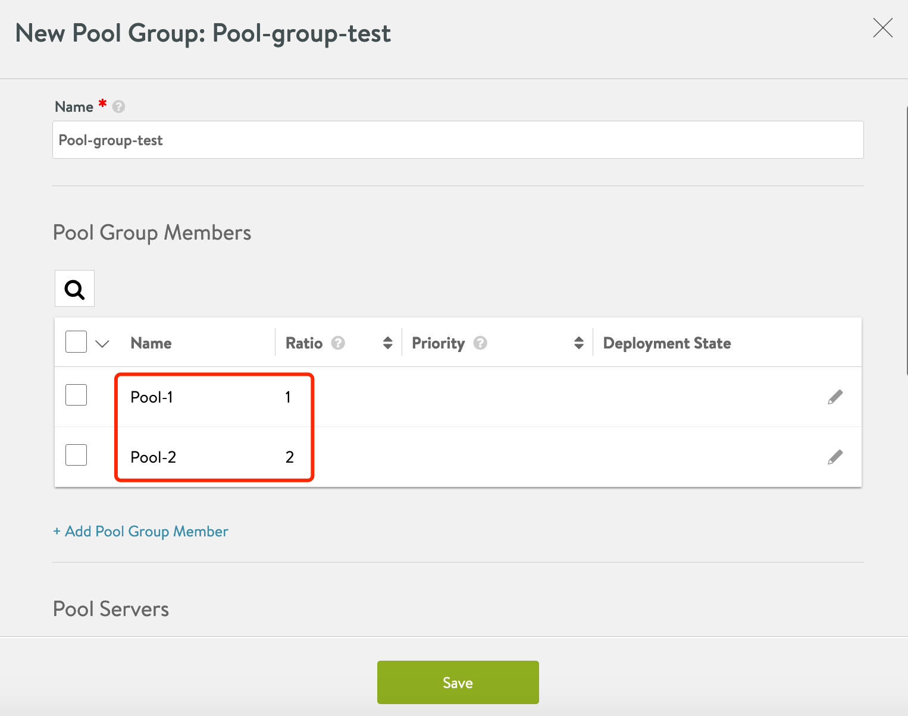
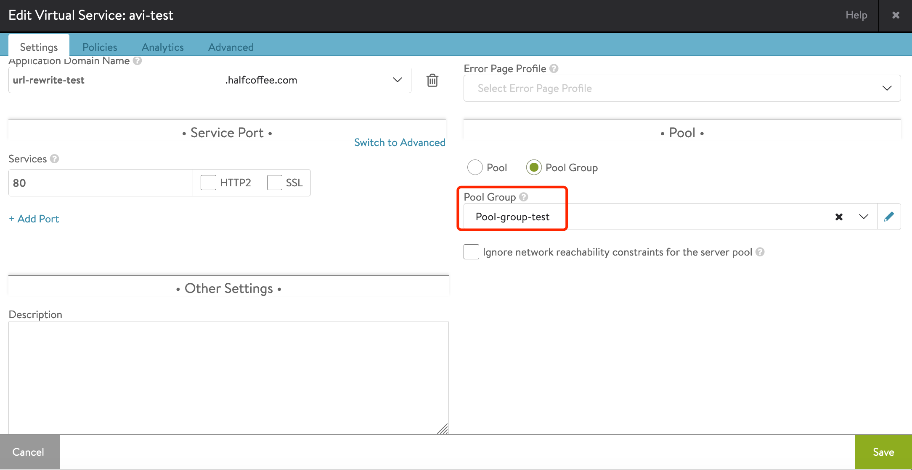
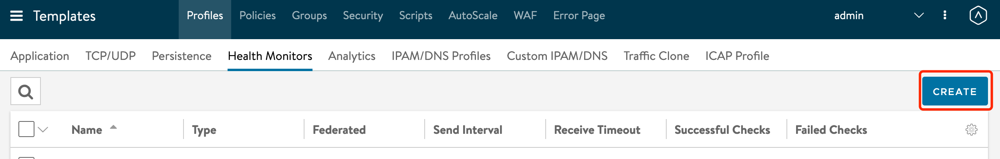
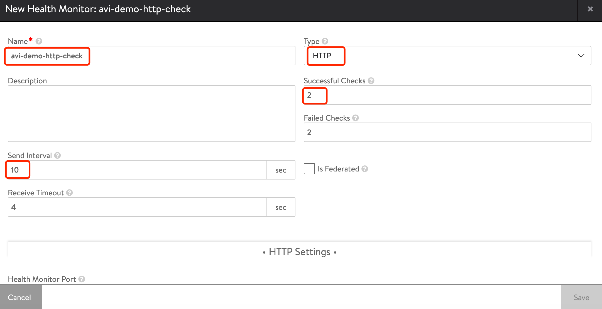
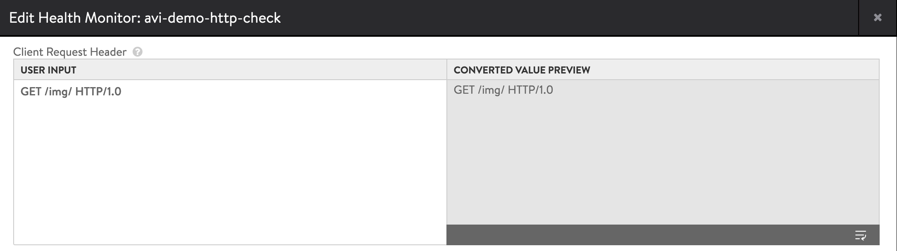
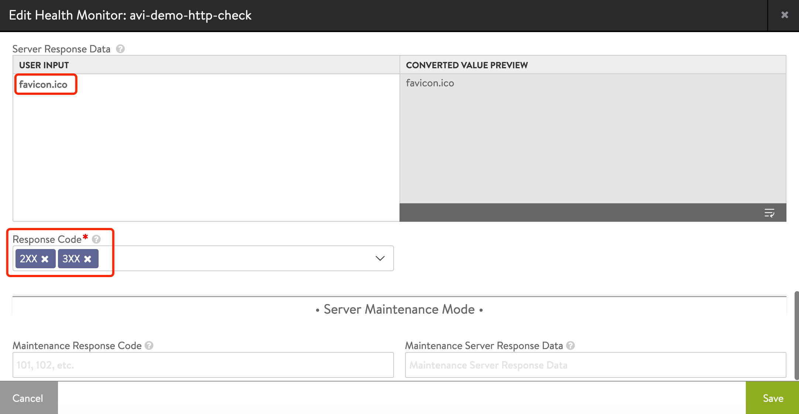
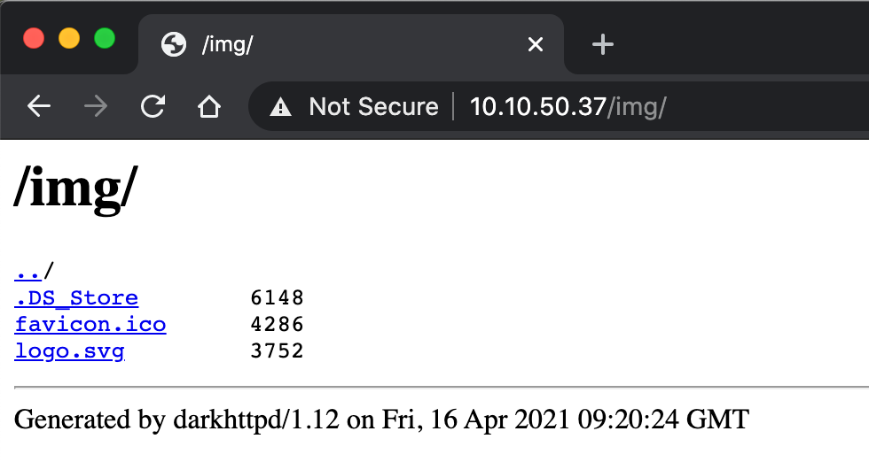

# Avi 部署使用指南(6)：Avi Pool 常见配置

## 目录
{: .no_toc .text-delta }

1. TOC
{:toc}

## 按比例流量负载

Avi 支持多种按比例进行流量负载的配置：

·    一个vs关联一个Pool，Pool 中有多个池成员，为不同的池成员设置不用的Ratio；

·    一个vs关联一个Pool Group，一个Pool Group中包含多个Pool成员，为Pool设置Ratio。

配置方式1：

 

配置方式2：

新建一个Pool Group

设置两个pool成员，指定Ratio

为virtual service关联Pool Group

## 

## 设置Acitve monitor

如果应用无特殊要求，且仅提供HTTP服务，则可以使用默认的passive monitor。

在Passive monitor 配置下，Avi SE 不会主动向SE发送健康检查信息，而是监控用户的会话情况，在下列情况下会判定后端server 故障：

·    TCP Connection reset

·    HTTP response 5XX 

Active monitor 则可以根据业务情况配置主动的 TCP/UDP，HTTP，DNS健康检查请求，单个应用可以设置多个 Active monitor。

配置步骤：

1、在“Templates>Profiles>Health Monitors”中新建监控检查。

2、按照需求设置健康检查名称、类型、时间等

3、 设置具体的检查参数，例如 get 某路径

设置预期的服务器response值（填写response header 及 body的前2kb内容中的关键词即可）以及响应代码。

正常通过浏览器访问健康检查地址的结果如下：

## 关联 Active monitor

在 Pool 的下列位置关联上面的 Active monitor