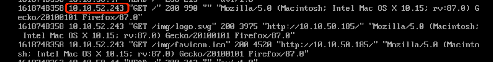

# Avi 下如何做到源 IP 保留


## 目录
{: .no_toc .text-delta }

1. TOC
{:toc}

## 保留客户端 IP 地址

对于一些传统四层应用，Server希望能直接看到Client的IP地址，负载均衡器不能对Client的IP进行SNAT转换。

在Avi中可以通过“Preserve Client IP address”来实现，要使用此模式，SE-Group 必须使用Active/Standby 模式。

 

配置步骤：

1、修改 SE-group 的设置，将其高可用模式改为 Active/Standby。(或者新建一个SE group)


 

2、 通过命令行为SE-Group启用路由功能，并设置floating IP：

```shell
ssh admin@avi-controller-ip
shell
```


按照提示输入Controller 用户名和密码

依次输入下列命令：

```shell
configure networkservice AS-group
# 新建network service，名为 as-group

service_type routing_service
# 设置service type 为routing service

se_group_ref AS-group
#关联 se-group

vrf_ref global
#关联VRF

routing_service
#设置routing service 子项目

enable_routing

floating_intf_ip 10.10.50.184
#设置浮动IP

exit
exit
```


 

3、为应用新建一个 application profile，启用“preserve Client IP Address”功能，为了启用此功能，需要先禁用“Connection Multiplex”功能。


 

4、修改 server的网关，将其网关设置为 SE 的floating IP：


 

5、创建virtual service，关联第三步的Application Profile，Pool 成员设置为server


 

访问测试：


 

 

Avi 中日志记录：


后端服务器看到的Client IP为真实IP：



