{: .no_toc}

# 目录

{: .no_toc .text-delta }

1. TOC

# VCF 概述

VCF 是 VMware 提供的私有云整体方案，VCF 以计算（vSphere）、存储（vSAN）和网络（NSX）虚拟化为基石，可以快速帮助企业构建能够承载各位业务的基础架构环境。

通过 VCF 用户可以承载几乎任意应用：

- 传统虚拟化应用
- Kubernetes 微服务应用
- VDI 虚拟桌面环境
- ITaaS：将 IT 资源服务化，提升 IT 服务质量

VCF 并不仅仅是多个组件的拼凑，VCF 以 VMware 最佳实践为基础来帮助用户构建稳健的数据中心，提供对底层所有组件的全生命周期管理，简化平台的搭建和运维。

VCF 的一些架构优势如下：

- 通过自动化节省平台部署时间
- 标准化基础架构，减少复杂性，尤其是之前各个组件间的兼容和对接
- 节省开支：快速扩展，类公有云的运维模型
- 满足安全合规要求：基于策略的安全管理、数据本地存储、内生安全

## VCF 愿景

在混合云架构中，提供一致的底层基础架构

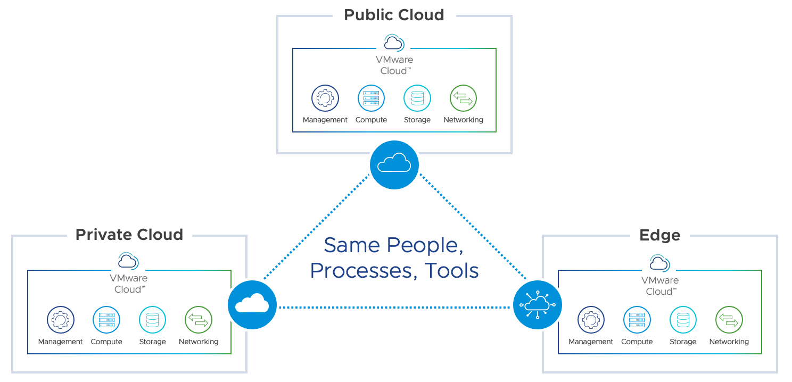

## VCF 相比传统公有云的优势

- 数据安全性：
  - 因为合规性要求，数据需要存储在企业内部
- 就近提供服务
	- 用户位于企业内部，需要就近访问服务，公有云会有较高的延迟
	- 大量本地生成的数据需要在本地进行处理，公有云处理开销高
	-  业务受限于遗留的应用架构，需要在本地部署

- 可控性更强：
  - 100% 控制重要的业务
  - 保护已有 IT 投资
  - 已有的流程，使用习惯不需要改变

# VCF 两种域

## 管理域 Management Domain

运行所有管理型的组件，例如 vCenter、NSX Manager 等

## 工作域 Workload Domain

运行最终的业务虚拟机，以及一些 NSX 数据平面组件，例如 NSX Edge

# VCF 部署架构

## consolidated 架构（紧凑架构）

管理组件和工作负载运行在同一个集群里，适合中小型规模

## Standard 标准架构

管理域运行在单独的集群中，和业务集群分开。

紧凑架构可以随着企业规模增大而变成标准架构。

# VCF 部署模型

## 1、单站点部署

在单个站点内部署 SDDC Manager 及多个 workload domain，每个 workload domain 有自己的 vCenter 和 Cluster。

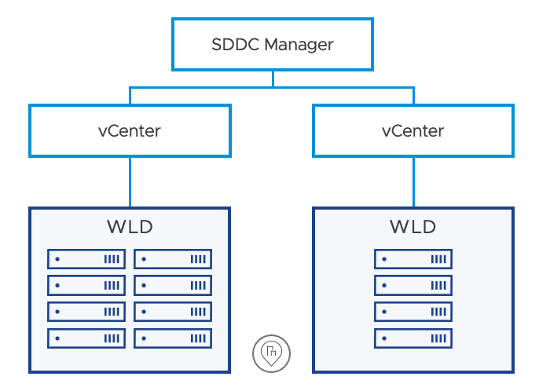

## 2、双（三）站点延伸集群

将一个集群的不同节点放在不同中心组成延伸集群，在第三方站点部署 vSAN Witness 见证节点。

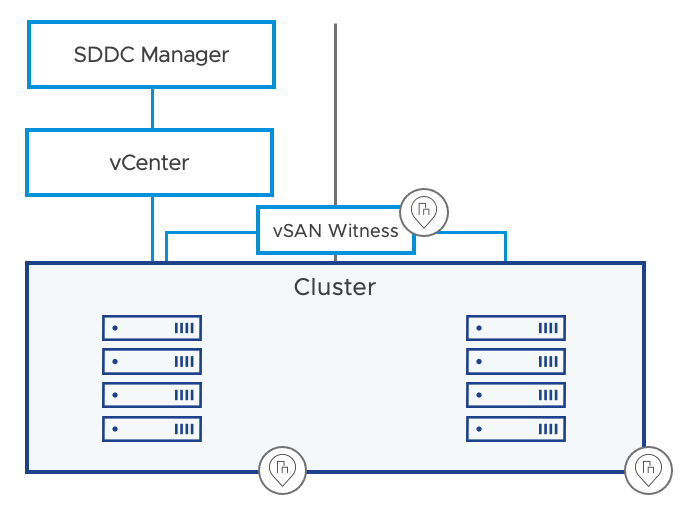

限制条件：

- 为了保证 vSAN 正常运作，RTT<5ms，带宽 10G
- 管理网络需要二层打通（依赖物理网络来实现）

优势：

- 最简单的容灾方案，恢复时间快

- 自动恢复

此部署模式下，需要先将管理域进行延伸，未来的 workload domain 可以按需做跨中心或者仅放在单个中心

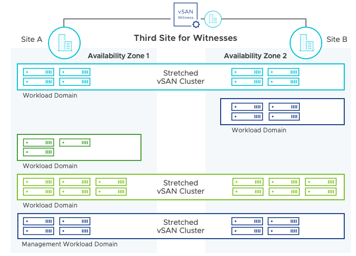

## 3、分支接管

通过总部的 vCenter 来接管分支结构的集群，或者在分支的 workload domain 中部署自己的 vCenter。多个站点由总部的 SDDC manager 管理。

- 当分支需要独立的 vCenter 时，需要新建一个 Workload Domain，然后在部署集群
- 当共享 vCenter 时，分支的集群需要纳入主中心已有的 Workload Domain

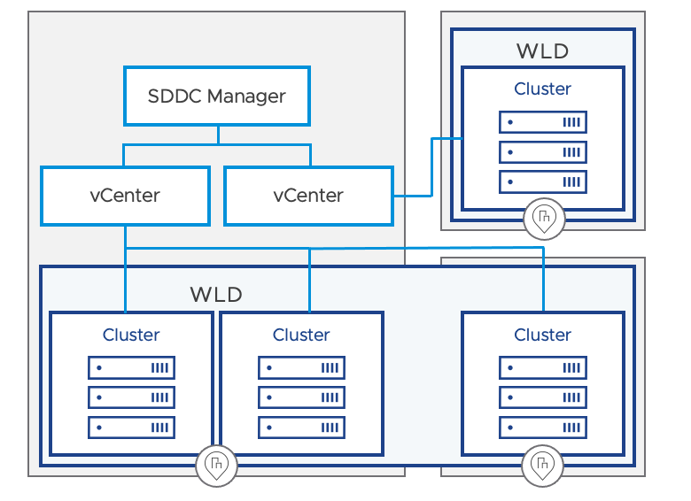

## 4、多中心独立部署架构

在多个中心分别部署 SDDC Manager 和 Workload Domain，全局部署 NSX Federation，实现网络及安全的统一管理。

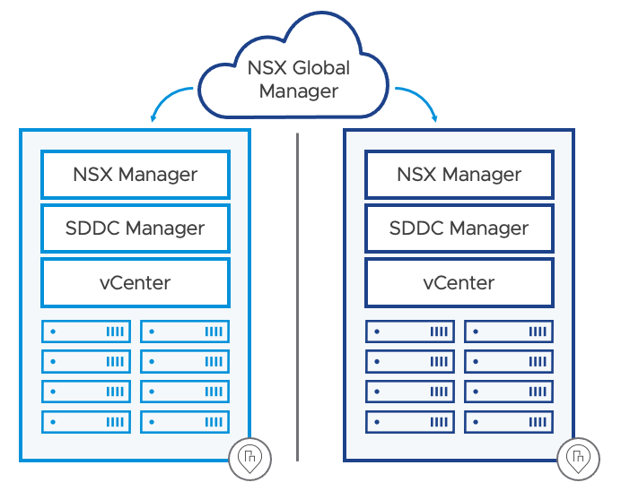

# 网络规划

VCF 网络架构如下图，在这种标准架构下，管理、vMotion、vSAN 等流量使用 VLAN，所有业务网络则由 NSX 来提供。

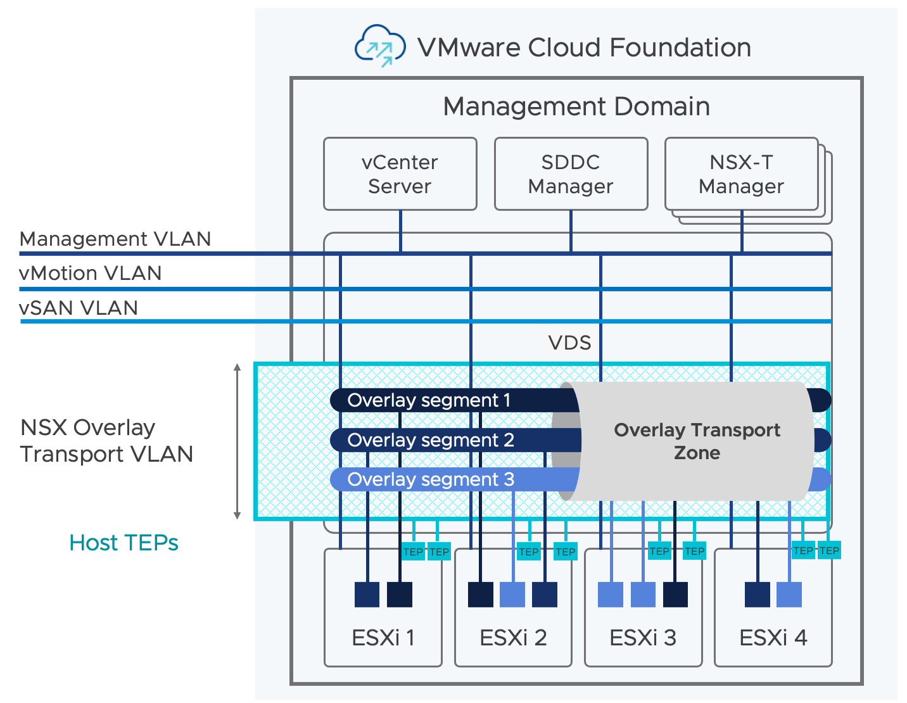

## 7 个网络

| 网络名称          |                                |
| ----------------- | ------------------------------ |
| 管理网络          | 承载 ESXi 管理、vCenter 等组件 |
| vMotion 网络      | vMotion 迁移网络               |
| vSAN 网络         | vSAN 存储网络                  |
| NSX TEP 网络      | NSX 主机 TEP 网络              |
| NSX Edge Uplink1  | 与物理网络互联的网段1          |
| NSX Edge Uplink2  | 与物理网络互联的网段2          |
| NSX Edge TEP 网络 | NSX Edge TEP 网络              |

## Network Pool

记录 vMotion、 vSAN、NFS、Iscsi 的可用 IP 范围。一般前两个是必须的。

这些地址相当于由 SDDC Mananger 管理，来进行自动分发。

## 外围服务-DHCP、DNS、NTP

DHCP：对于 NSX TEP 网络，需要客户准备 DHCP Server 进行地址分发

DNS：记录所有 ESXi、管理组件的 A 记录

NTP：所有组件的时间同步

所有主机需要开启 SSH 服务。

## 网卡及 vDS

### 双网卡模式

所有 ESXI 只有两个网卡，接在同一个 vDS 上，同时承载管理、vMotion、vSAN、NSX 等流量，通过 vDS 的 NIOC 进行流量控制

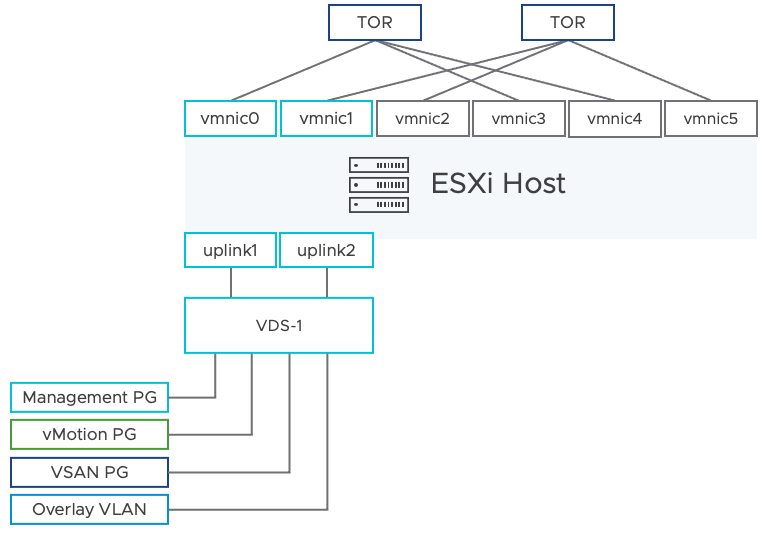

### 多网卡模式

每个 ESXi 有大于 2 张网卡，多张网卡可以使用同一个 vDS，也可以分成多个 vDS。

- 四张网卡使用同一个 vDS 的模型：

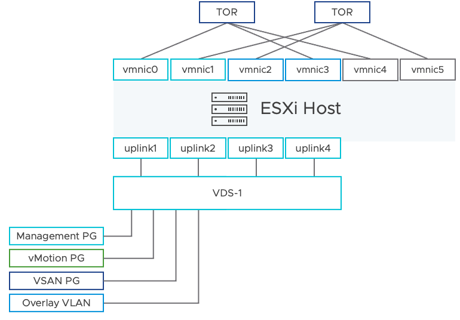

- 第一个 vDS 承载管理、vMotion、NSX Overlay 流量，第二个 vDS 承载存储流量：

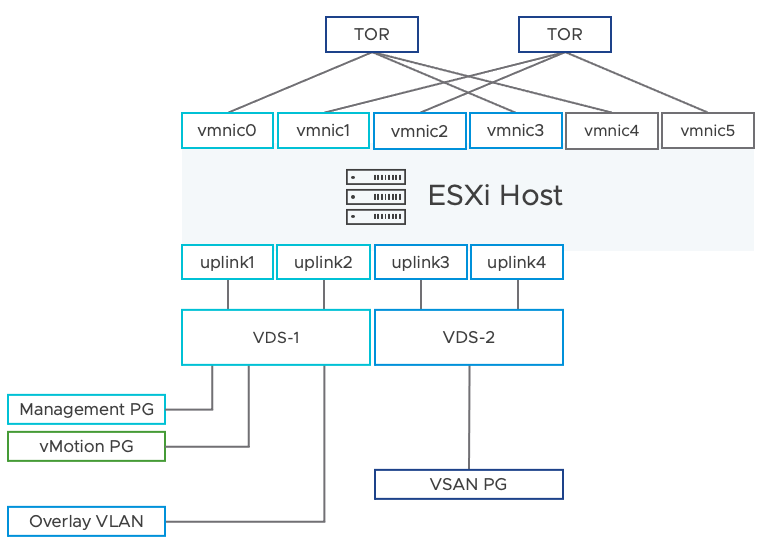

- 第一个 VDS 运行管理、vMotion、vSAN 等流量，第二个 vDS 运行业务流量，第三个 vDS 承载备份流量：

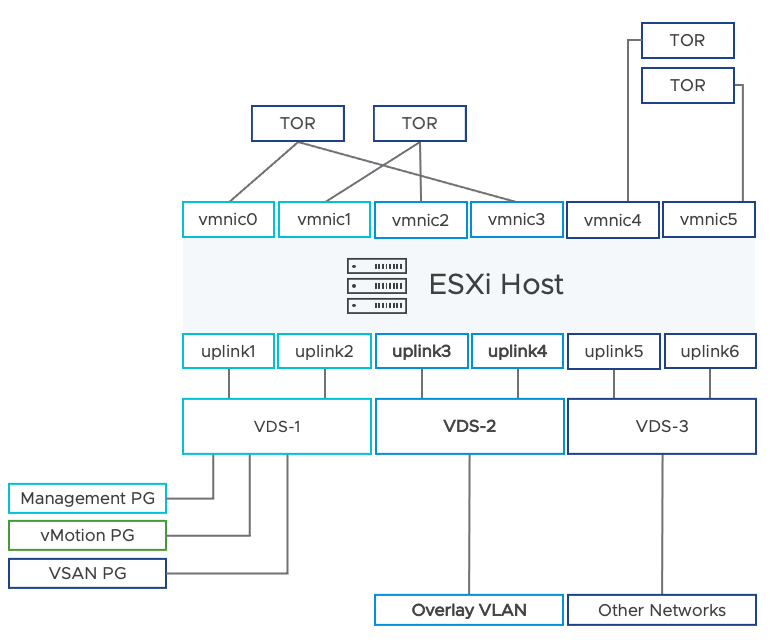

# Cloud Builder

包含所有组件的部署 ISO，支持从零开始部署 ESXi 到服务器，部署管理组件，例如 SDDC Manager、vCenter 等。

- VIA(VMware Imaging Appliance)：用于通过 PXE 部署 ESXi
- DPS：Deployment Parameter Sheets，部署参数的 Excel/JSON 

# VCF 相关视频

初始化视频（Cloud Builder）：

[https://core.vmware.com/deploying-cloud-foundation](https://core.vmware.com/deploying-cloud-foundation)
