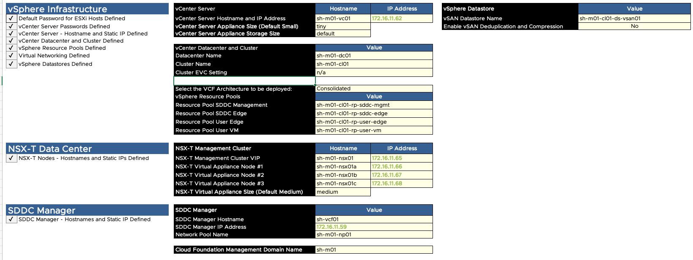
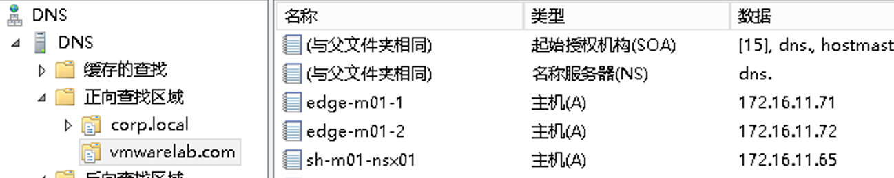
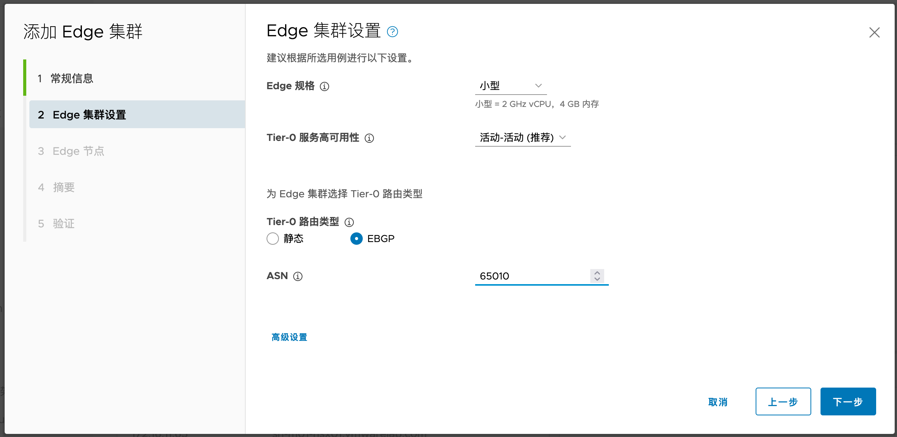
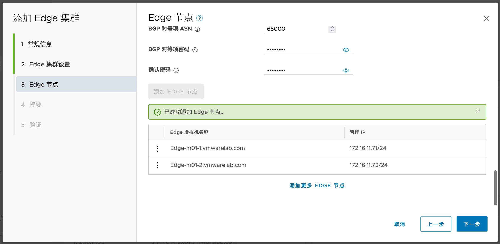
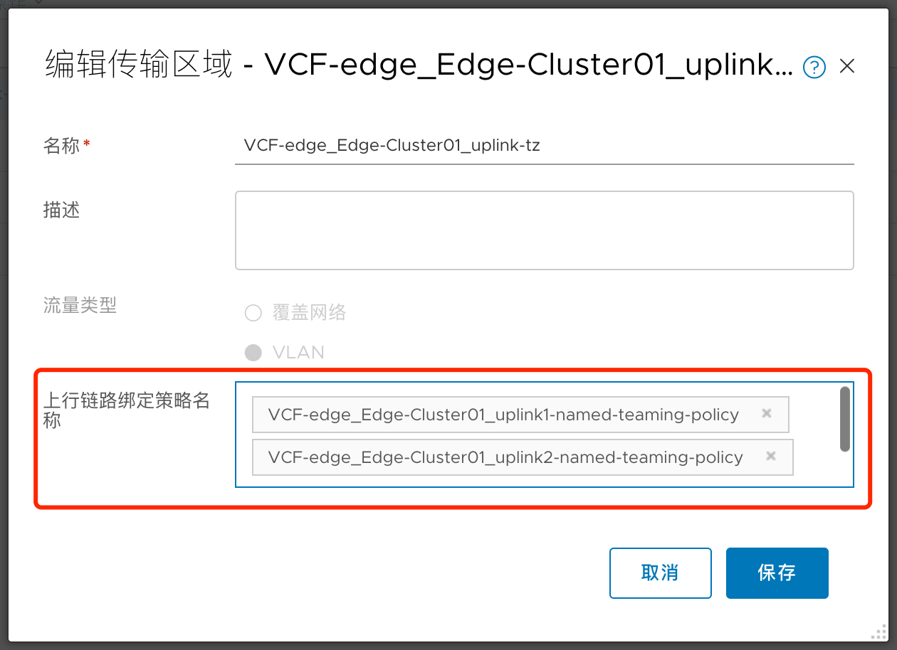

# VCF 安装截图


## 目录

{: .no_toc .text-delta }


1. TOC
{:toc}


# 1.  通过Cloud Builder初始化VCF

## 1.1.    VCF部署规划

注意：其中ESXi主机的SSH Fingerprint和SSL Thumbprint参考第三章节获取。




## 1.2.    批量创建A记录

在Windows AD中批量添加A记录和PTR记录：

```
DnsCmd . /RecordAdd vmwarelab.com sh-m01-nsx01 A 172.16.11.65
DnsCmd . /RecordAdd vmwarelab.com sh-m01-nsx01a A 172.16.11.66
DnsCmd . /RecordAdd vmwarelab.com sh-m01-nsx01b A 172.16.11.67
DnsCmd . /RecordAdd vmwarelab.com sh-m01-nsx01c A 172.16.11.68
DnsCmd . /RecordAdd vmwarelab.com sh-m01-vc01 A 172.16.11.62
DnsCmd . /RecordAdd vmwarelab.com sh-vcf01 A 172.16.11.59
DnsCmd . /RecordAdd vmwarelab.com sh01-m01-esx01 A 172.16.11.101
DnsCmd . /RecordAdd vmwarelab.com sh01-m01-esx02 A 172.16.11.102
DnsCmd . /RecordAdd vmwarelab.com sh01-m01-esx03 A 172.16.11.103
DnsCmd . /RecordAdd vmwarelab.com sh01-m01-esx04 A 172.16.11.104
```


## 1.3.    ESXi指纹准备

所有主机开启SSH。

运行下列命令获取SSH thumbprint：

```
ssh-keygen -lf <(ssh-keyscan sh01-m01-esx01.vmwarelab.com 2>/dev/null)

ssh-keygen -lf <(ssh-keyscan sh01-m01-esx02.vmwarelab.com 2>/dev/null)

ssh-keygen -lf <(ssh-keyscan sh01-m01-esx03.vmwarelab.com 2>/dev/null)

ssh-keygen -lf <(ssh-keyscan sh01-m01-esx04.vmwarelab.com 2>/dev/null)
```

记录 RSA 的输出结果：


 

运行下列命令获取SSL thumbprint，记录结果：
```

openssl s_client -connect sh01-m01-esx01.vmwarelab.com:443 < /dev/null 2> /dev/null | openssl x509 -sha256 -fingerprint -noout -in /dev/stdin

openssl s_client -connect sh01-m01-esx02.vmwarelab.com:443 < /dev/null 2> /dev/null | openssl x509 -sha256 -fingerprint -noout -in /dev/stdin

openssl s_client -connect sh01-m01-esx03.vmwarelab.com:443 < /dev/null 2> /dev/null | openssl x509 -sha256 -fingerprint -noout -in /dev/stdin

openssl s_client -connect sh01-m01-esx04.vmwarelab.com:443 < /dev/null 2> /dev/null | openssl x509 -sha256 -fingerprint -noout -in /dev/stdin
```


将上述记录填入VCF规划表格中：


## 1.4.    启动Cloud Builder向导


下载Excel，填写完成后再上传：


通过scp将vcf-ems-deployment-parameter.xlsx上传到Cloud Builder虚拟机，然后ssh登录到Cloud Builder，通过下列命令将Excel转换为JSON

**/opt/vmware/sddc-support/sos --jsongenerator --jsongenerator-design vcf-ems --jsongenerator-input vcf-ems-deployment-parameter.xlsx**

修改JSON文件，只保留一个NSX Manager的信息（这里是因为测试环境资源较少，将默认的3节点NSX Manager改为单节点，生产环境可以不改）：


将修改后的json SCP出来，再上传到Cloud Builder：


启动部署过程：


## 1.5.    部署过程

### 1.5.1.  配置网络及VSAN

自动修改VM Network端口组的 VLAN ID：


在第一台主机上会创建一个单节点vSAN Datastore


### 1.5.2.  部署vCenter

 

将vCenter部署到此主机：


 

vCenter部署配置完成


### 1.5.3.  设置并添加主机到vc

自动为主机设置新的证书：


自动创建集群，并将主机加入集群：


 

自动配置vDS：


创建资源池：


### 1.5.4.  部署NSX


 


### 1.5.5.  部署完成


## 1.6.    创建NSX Edge集群

### 1.6.1.  网络规划

| **名称**                                       | **IP**                     | **VLAN****信息** |
| ---------------------------------------------- | -------------------------- | ---------------- |
| **Edge-m01-1** **管理**                        | 172.16.11.71               | VLAN11           |
| **Edge-m01-2** **管理**                        | 172.16.11.72               | VLAN11           |
| **Edge-m01-1 TEP**                             | 172.16.15.71  172.16.15.72 | VLAN15           |
| **Edge-m01-2 TEP**                             | 172.16.15.73  172.16.15.74 | VLAN15           |
| **Edge-m01-1 Uplink1**  **Edge-m01-1 Uplink2** | 172.16.16.71  172.16.17.71 | VLAN16           |
| **Edge-m01-2 Uplink1**  **Edge-m01-2 Uplink2** | 172.16.16.72  172.16.17.72 | VLAN17           |

 

Edge 的逻辑拓扑如下：


和之前一样，需要在DNS服务器中为Edge管理FQDN设置正向解析。



在物理网络侧提前设置好BGP Peer：


### 1.6.2.  添加Edge集群





再次添加第二个节点：





### 1.6.3.  Edge相关细化截图

注意：VCF下Edge的两个Uplink分别使用了named teaming绑定策略，这种策略可以保证Edge的两个数据接口最终连接到两个不同的物理交换机上，进而实现分流。为了实现这种配置，从ESXi到Edge内部有6个步骤：

- 在ESXi上创建两个端口组，每个端口组的Active Uplink仅使用一个vmnic，另一个vmnic作为Standby

- 为Edge设置Uplink配置文件，定义Named Teaming Policy

- 为Edge创建一个 VLAN 传输区域，设置传输区域级别的Named Teaming Policy绑定

- 在部署Edge时创建一个NVDS，分别关联到第一步的两个端口组，添加两个接口，每个接口对应到上一步的两个Uplink

- 为Edge创建两个 Uplink Segment，关联到Edge的VLAN传输区域，通过绑定策略限制每个 Segment 只走一个Uplink

#### 1.6.3.1.  Edge vDS配置


#### 1.6.3.2.  vDS端口组Teaming配置


 

#### 1.6.3.3.  Edge 上行链路配置文件中的named teaming policy配置


#### 1.6.3.4.  在VLAN传输区域中调用Named Teaming Policy



#### 1.6.3.5.  Edge节点配置NVDS及接口配置


#### 1.6.3.6.  Uplink Segment的teaming配置


### 1.6.4.  Edge节点及集群创建完毕


### 1.6.5.  T1配置


### 1.6.6.  T0配置


交换机端看到BGP Peer状态为Established


### 1.6.7.  创建测试分段


之后在物理交换机上即可看到通过BGP学到了路由：


# 2.  环境升级

## 2.1.    升级SDDC Manager

在SDDC Manager中找到管理域的集群，在更新/修补程序中点击预检查：

 


确保没有报错后，下载更新：


点击立即更新，然后出现下列界面：


## 2.2.    升级其他组件


更新第二个包：


 

# 3.  排错

通过下列日志查看bring up的详细过程：

tail -f /var/log/vmware/vcf/bringup/vcf-bringup-debug.log


 
